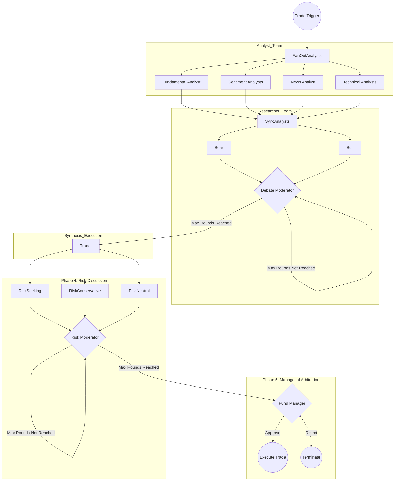

# Product Requirements Document: Rust-Native Multi-Agent Financial Trading System

---

## Executive Summary and Strategic Rationale

The integration of Large Language Models into the financial technology sector has catalyzed a transition from
traditional quantitative algorithmic trading to autonomous, agentic decision-making systems.
Traditional deep learning and quantitative models, while mathematically rigorous, frequently struggle to incorporate
qualitative variables such as macroeconomic sentiment, geopolitical news, and unstructured social media data into their
predictive algorithms.
Furthermore, deep learning architectures often function as impenetrable black boxes, lacking the necessary
explainability required by institutional compliance and risk management protocols.
Multi-agent frameworks powered by Large Language Models resolve these deficiencies by mimicking the collaborative,
dialectical, and structured workflows of real-world trading firms.

The original TradingAgents framework, developed by researchers at UCLA (Yijia Xiao, Edward Sun, Di Luo, Wei Wang) and
published under the TauricResearch GitHub organization, empirically demonstrated that a highly specialized society of
autonomous agents—including fundamental analysts, technical analysts, bearish and bullish researchers, and
dedicated risk managers—can significantly outperform traditional rule-based trading strategies such as Simple Moving
Average crossover models, Zero Mean Reversion, and MACD momentum strategies. The original reference implementation was
engineered using Python and LangGraph, utilizing both OpenAI and open-source models as the cognitive engines. While
Python serves as the lingua franca for rapid artificial intelligence prototyping, deploying a Python-based multi-agent
orchestration layer in a high-frequency, production-grade enterprise environment presents profound architectural
bottlenecks. The Global Interpreter Lock restricts true parallel execution, and the reliance on virtual environments,
heavy dependency trees, and untyped data structures introduces significant latency and memory overhead. When simulating
dozens of concurrent analysts aggregating disparate financial application programming interfaces, Python's concurrency
model becomes a critical limiting factor.

This document mandates the comprehensive engineering architecture for a Rust-native reimplementation of the
TradingAgents framework. Transitioning this complex multi-agent system to Rust addresses the fundamental limitations of
the Python ecosystem by introducing fearless concurrency, sub-millisecond technical indicator calculations,
deterministic memory management without garbage collection pauses, and absolute compile-time type safety. By leveraging
Rust's `tokio`asynchronous runtime, the system will execute data ingestion and agent inferences in true parallel
threads, vastly reducing the time required to evaluate market conditions (targeting a complete trade cycle in under 20
seconds end-to-end, compared to minutes for sequential Python implementations). This specification outlines the
migration strategy, the selection of the optimal Rust Large Language Model orchestration frameworks, the integration of
high-performance technical indicator libraries, and the stateful directed workflow topology required to replicate and
enhance the original TradingAgents paradigm.

## Conceptual Foundation: The TradingAgents Paradigm

To successfully architect the Rust reimplementation, the engineering team must fully assimilate the theoretical and
empirical foundations of the original TradingAgents framework. The framework was explicitly designed to resolve two
major limitations prevalent in early multi-agent artificial intelligence systems: the lack of realistic organizational
modeling and the degradation of data through inefficient communication interfaces.

### Organizational Modeling and Agent Taxonomy

Previous iterations of financial artificial intelligence typically relied on monolithic agents tasked with
simultaneously retrieving data, analyzing sentiment, and executing trades. This monolithic approach leads to severe
cognitive overload, prompt context degradation, and hallucination. TradingAgents resolves this by decomposing the
trading lifecycle into highly specialized roles constrained by specific systemic prompts and distinct toolsets.

The organizational structure is strictly partitioned into functional teams. The Analyst Team operates asynchronously at
the beginning of the cycle, retrieving raw data from the market. This team consists of the Fundamental Analyst,
Sentiment Analyst, News Analyst, and Technical Analyst. The output of this team forms the foundational state of the
market. Following data aggregation, the Researcher Team—comprising a Bullish Researcher and a Bearish Researcher—engages
in a multi-round dialectical debate to synthesize the raw data into actionable arguments. This debate provides a
balanced perspective, preventing the system from falling into positive feedback loops of irrational exuberance or
unwarranted panic. The Trader Agent subsequently processes these arguments to formulate a transactional proposal, which
is finally subjected to intense scrutiny by the Risk Management Team (Aggressive, Neutral, and Conservative agents) and
authorized by a Fund Manager. Replicating this exact taxonomy in Rust is a primary directive of this reimplementation.

### Resolution of the Telephone Effect

A critical vulnerability in framework designs like AutoGPT or early LangChain implementations is the reliance on
unstructured natural language as the primary state mechanism. As agents converse, critical numerical data points are
often summarized, altered, or entirely forgotten—a phenomenon the authors term the "telephone effect".
To combat this, the TradingAgents architecture enforces a structured communication protocol. Agents do not merely chat
in a shared buffer; they populate specific, structured document templates and reports. In the Rust reimplementation,
this concept will be drastically enhanced. Instead of relying on language models to format text reports reliably, the
system will utilize Rust's strictly typed struct definitions, serialized and deserialized via the serde_json crate.
Large Language Models will be forced to return data in rigid JSON schemas, entirely eliminating data drift as market
variables pass through the execution graph.

### Empirical Performance Benchmarks

The architectural complexity of the TradingAgents framework is justified by its empirical superiority over traditional
algorithmic approaches. Backtesting simulations conducted across major technology equities—including Apple (AAPL),
Google (GOOGL), Amazon (AMZN), Nvidia (NVDA), Microsoft (MSFT), and Meta (META)—between June and November 2024
demonstrated significant outperformance. The system evaluates performance using four quantitative metrics: Cumulative
Return, Annualized Return, Sharpe Ratio, and Maximum Drawdown.

The following table summarizes the comparative performance of the TradingAgents framework against standard baselines on
AAPL stock, underscoring the target performance benchmarks the Rust implementation must match or exceed:

| Strategy / Model      | Cumulative Return (%) | Annualized Return (%) | Sharpe Ratio | Maximum Drawdown (%) |
|:----------------------|:----------------------|:----------------------|:-------------|:---------------------|
| Market Buy & Hold     | -5.23                 | -5.09                 | -1.29        | 11.90                |
| MACD                  | -1.49                 | -1.48                 | -0.81        | 4.53                 |
| KDJ & RSI             | 2.05                  | 2.07                  | 1.64         | 1.09                 |
| Zero Mean Reversion   | 0.57                  | 0.57                  | 0.17         | 0.86                 |
| Simple Moving Average | -3.20                 | -2.97                 | -1.72        | 3.67                 |
| TradingAgents (Ours)  | 26.62                 | 30.50                 | 8.21         | 0.91                 |

The data indicates that while rule-based systems like KDJ & RSI excel at minimizing Maximum Drawdown (1.09%), they fail
to capture meaningful upside. Conversely, the TradingAgents framework achieved a 26.62% Cumulative Return while
simultaneously restricting Maximum Drawdown to an unprecedented 0.91%, resulting in a highly favorable Sharpe Ratio. The
Rust implementation must support a backtesting engine capable of ingesting historical OHLCV data to continuously
validate that the translated architecture maintains this risk-adjusted performance profile.

## Technology Stack Evaluation and Selection

Migrating a complex artificial intelligence orchestration framework from Python to Rust necessitates the careful
evaluation of the emerging Rust machine learning and agentic ecosystem. The following sections detail the selection of
the core crates required to build the LLM connector layer, the stateful workflow orchestrator, and the financial
mathematics engines.

### Large Language Model Orchestration Frameworks

The core requirement for the LLM connector is the ability to seamlessly abstract multiple provider application
programming interfaces (e.g., OpenAI, Anthropic, local instances via Ollama), manage conversation history, and
enforce strict tool-calling schemas.

#### Selected Provider: `rig-core` (v0.31.0)

As directed by project requirements, the framework will utilize `rig-core` (the primary crate name on crates.io) as the
foundational LLM provider connector. `rig` represents a modular, composable, and unopinionated approach to building
LLM-powered applications in Rust. It functions primarily as a robust abstraction layer, providing a unified application
programming interface across over twenty model providers.

`rig` excels in its developer ergonomics, specifically through its `#[tool]` macro, which effortlessly transforms
standard Rust functions into JSON schema-compliant tools accessible by the LLM. This is critical for connecting the
Analyst agents to the financial data APIs. Furthermore, `rig` integrates highly advanced capabilities for
Retrieval-Augmented Generation, including native interfaces for vector stores like `MongoDB`, `LanceDB`, and `Qdrant`,
alongside a sophisticated `EmbeddingsBuilder`. While the original TradingAgents framework relies mostly on live API
calls rather than historical vector retrieval, the ability to seamlessly inject long-term market history via `rig`'s
dynamic context windows provides a clear pathway for future architectural enhancements.

Most importantly, `rig` does not force the developer into a proprietary orchestration loop. Agents instantiated via
`rig::AgentBuilder` implement clear `prompt` and `chat` traits, allowing them to be embedded as discrete execution
nodes within a custom external state machine.

### Stateful Graph Orchestration

The original repository utilizes LangGraph to define the nodes and edges of the trading firm's workflow. LangGraph's
primary advantage is its ability to manage cyclic execution (such as the debate loop between researchers) and maintain a
shared, immutable state object across all nodes. To replicate this in Rust, the framework requires a stateful execution
engine.

#### Selected Orchestrator: `graph-flow` (v0.2.x)

`graph-flow` is a high-performance, type-safe framework explicitly designed to bring LangGraph-inspired stateful
execution to the Rust ecosystem. It treats the primary workflow as a directed graph, where each execution node
implements an asynchronous `Task` trait. The framework features a centralized `Context` object that provides thread-safe
state sharing across the workflow, allowing data aggregated by the Analyst Team to persist through the debate and
execution phases. Enable the optional `"rig"` feature flag (`graph-flow = { version = "0.2", features = ["rig"] }`) for
seamless integration with `rig-core` agents.

Crucially, `graph-flow` supports conditional routing and cyclical control flow through its `NextAction` enum, enabling
the framework to dictate whether a node should `Continue` to the next step, `GoBack` to a previous node, or trigger a
`GoTo` command based on runtime evaluations.

`graph-flow` was designed specifically to integrate seamlessly with the `rig` crate, making the combination of these
two libraries the optimal equivalent to the Python LangChain/LangGraph stack. Note that PostgreSQL JSONB persistence is
a planned Phase 2 feature; for the MVP, the complete `TradingState` will be snapshotted to disk via
`serde_json` after each phase, providing a recoverable audit trail pending the storage backend implementation.

#### Architectural Decision

`graph-flow` will orchestrate the execution topology. The `rig` agents will be encapsulated within `graph_flow::Task`
implementations, communicating exclusively through the `graph_flow::Context` state.

### Financial Data Ingestion Ecosystem

The Analyst Team relies entirely on the accuracy, speed, and breadth of the underlying financial data application
programming interfaces. The original implementation utilizes `yfinance` for technical data and Alpha Vantage for
fundamental and news data. The Rust implementation must leverage highly optimized HTTP clients to manage this ingestion.

1. **Fundamental and News Data**: The `finnhub` (v0.2.1) crate will serve as the primary conduit for corporate
   fundamentals, earnings reports, and global news. It provides 96% coverage of the `Finnhub` API, delivering strongly
   typed Rust models for income statements, insider transactions, and market news. Crucially, it features automatic rate
   limiting (managing 30 requests per second with burst capacity) and customizable retry logic, which is essential when
   executing four Analyst agents concurrently

2. **Market Pricing and Alternative Data**: The `yfinance-rs` (v0.7.2) crate will be utilized for historical OHLCV
   (Open, High, Low, Close, Volume) data and real-time quote streaming. This crate utilizes an asynchronous, fluent
   builder pattern and supports parallel fetching, allowing the Technical Analyst to retrieve massive datasets for
   technical indicator calculation with minimal network latency. `alphavantage` will be retained as a fallback
   integration for specific physical currency or digital asset queries, ensuring complete parity with the original
   repository.

### Technical Analysis and Quantitative Mathematics

Deep learning models and LLMs lack the inherent architectural capacity to perform precise mathematical calculations on
large time-series arrays. To emulate the Technical Analyst agent, the system must pre-calculate technical indicators
before injecting them into the LLM context.

The Python ecosystem relies on libraries like `pandas-ta`, which operate on dataframes. The Rust ecosystem offers
several alternatives, including `ta`, `rust_ti`, and `kand`. The `kand` crate (v0.0.9) is selected as the quantitative
engine.
Inspired by the C-based `TA-Lib`, `kand` is written entirely in pure Rust, providing a comprehensive suite of momentum,
volatility, and trend indicators. It is chosen specifically for its configurable precision modes; it can execute
calculations in `f64`extended precision, which prevents the subtle floating-point errors and `NaN` (Not a Number)
propagation issues frequently encountered when calculating iterative variables like the Relative Strength Index or
Exponential Moving Averages over long horizons. The speed of native Rust array processing allows the Technical Analyst
to calculate 60 distinct technical indicators across thousands of historical ticks in a fraction of a millisecond.

## Core System Architecture and Topographical Flow

The architecture of the Rust-native TradingAgents system enforces a strict separation between the cognitive reasoning
layer (the rig agents) and the data transport layer (the `graph-flow` state engine). This topographical rigidity ensures
deterministic execution pathways, preventing the system from deviating into endless autonomous reasoning loops.

### High-Level Execution Graph

The following Mermaid diagram outlines the stateful workflow graph topology detailing how information moves concurrently
and sequentially throughout the system. Note: while the primary data flow is acyclic, the debate loop introduces a
controlled cycle via the Moderator node's `NextAction::GoBack`; termination is guaranteed by the `max_debate_rounds`
parameter.



### Strongly Typed State Management

To circumvent the telephone effect, the `graph_flow::Context` will strictly regulate data exchange through a
meticulously defined, serializable Rust structure. When the system initiates an analysis cycle, a `TradingState` struct
is instantiated and injected into the context.

```rust
// Core State Definition
pub struct TradingState {
    pub execution_id: uuid::Uuid,
    pub asset_symbol: String,
    pub target_date: String,

    // Phase 1: Aggregated Analyst Data
    pub fundamental_metrics: Option<FundamentalData>,
    pub technical_indicators: Option<TechnicalData>,
    pub market_sentiment: Option<SentimentData>,
    pub macro_news: Option<NewsData>,

    // Phase 2: Dialectical Debate
    pub debate_history: Vec<rig::message::Message>,
    pub consensus_summary: Option<String>,

    // Phase 3 & 4: Synthesis and Risk
    pub trader_proposal: Option<TradeProposal>,
    pub risk_discussion_history: Vec<rig::message::Message>,
    pub aggressive_risk_report: Option<RiskReport>,
    pub neutral_risk_report: Option<RiskReport>,
    pub conservative_risk_report: Option<RiskReport>,

    // Phase 5: Final Execution
    pub final_execution_status: Option<ExecutionStatus>,
}
```

By enforcing this structural schema, the Trader Agent does not need to parse a massive chat log to find the Gross
Margin; it directly accesses `context.fundamental_metrics.gross_margin`, radically reducing token consumption and
hallucination probabilities.

### Execution Workflow Topology Detailed

The execution topology dictates the chronological flow of the artificial intelligence firm. The `GraphBuilder` initiates
execution at the entry point and routes the `TradingState` through the necessary nodes.

1. **Parallel Data Ingestion (The Fan-Out Pattern)**: The workflow begins by utilizing a `FanOutTask`, a composite task
   provided by `graph-flow `that executes multiple child tasks simultaneously. The Fundamental, Sentiment, News, and
   Technical tasks are executed concurrently using `tokio::spawn`. Each task invokes the respective external application
   programming interface, performs its isolated reasoning using a quick-thinking LLM, and writes its specific data
   structure back to the `TradingState`.
2. **Dialectical Evaluation (The Cyclic Pattern)**: Following the synchronization of the Fan-Out task, the graph
   transitions to the Researcher Team. Here, `graph-flow`'s conditional edges are utilized to construct a loop. The
   graph alternates execution between the `BullishResearcher` and `BearishResearcher` tasks. A discrete
   `DebateModerator` task evaluates the number of completed iterations against a `max_debate_rounds` parameter (
   typically set to 2 or 3). Once the threshold is met, the moderator updates the `NextAction` to exit the loop, moving
   the state to the Trader Agent.
3. **Synthesis and Proposal**: The Trader Agent task operates sequentially, utilizing the complete `TradingState` to
   generate a formalized TradeProposal.
4. **Risk Fan-Out**: Similar to the initial data ingestion, the risk assessment phase utilizes a parallel Fan-Out
   pattern. The Aggressive, Neutral, and Conservative risk agents simultaneously evaluate the `TradeProposal` against
   the technical and fundamental data, appending their distinct `RiskReport` objects to the state.
5. **Managerial Arbitration**: The graph terminates at the Fund Manager node, which executes a deterministic logic check
   across the three risk reports to approve or reject the trade.

## Agent Role Specifications and Implementation Directives

Each persona within the TradingAgents framework requires specific LLM backbone routing, precise system prompt
engineering, and distinct tool access. The implementation will utilize a multi-provider factory pattern via `rig` to
ensure seamless task routing across a diverse suite of models, including OpenAI, Anthropic, Google Gemini, and a custom
GitHub Copilot integration, and other more LLM providers.

### Dual-Tier Cognitive Routing

The framework implements a tiered approach to LLM inference to optimize both latency and operational expenditure. The
system will support a dynamic model picker allowing seamless execution across providers.

* **Quick-Thinking Models**: Tasks that involve simple data extraction, summarization, or formatting (e.g., converting
  JSON data into a readable technical summary) will utilize highly optimized, low-latency models such as `gpt-4o-mini`
  (the model used in the original paper), `claude-haiku`, or `gemini-flash`. The entire Analyst Team operates on this
  tier.
* **Deep-Thinking Models**: Tasks requiring multistep logical deduction, complex spatial reasoning, or strategic
  synthesis will utilize frontier reasoning models such as `o3` / `o4-mini`, `claude-opus`, Gemini advanced reasoning
  models, or GitHub Copilot. The original paper used `o1-preview` for this tier. The Researcher Team, Trader, and Risk
  Management Team operate exclusively on this tier to ensure maximum decision fidelity.

### Custom GitHub Copilot Integration via ACP and Rig

Because GitHub Copilot does not offer a public REST API for direct third-party orchestration, `rig` does not support it
natively out of the box. To fulfill the requirement of utilizing Copilot as a cognitive engine within the multi-agent
firm, the engineering team will implement a custom model provider within the `rig` ecosystem leveraging the official
Agent Client Protocol (ACP).

* **Rig Trait Implementation**: The team will create a custom struct representing the Copilot client that implements
  `rig`'s `ProviderClient`, `CompletionClient`, and `CompletionModel` traits. This strict trait boundary ensures the
  custom Copilot integration can seamlessly plug into the existing `rig::AgentBuilder` pipeline alongside native OpenAI
  or Gemini clients.

* **Transport Layer Execution via ACP**: To route requests to Copilot, the custom `CompletionModel` implementation will
  act as an ACP Client. It will spawn the GitHub Copilot CLI in ACP mode utilizing standard input/output streams via the
  command `copilot --acp --stdio`.
* `Protocol Lifecycle`: The Rust client will communicate using JSON-RPC 2.0 formatted over NDJSON streams. The execution
  flow within the custom `CompletionModel::completion` method will follow the ACP standard: establishing a
  `ClientSideConnection`, sending an `initialize` request to negotiate capabilities, creating a new session via
  `session/new`, dispatching the translated agent prompt via `session/prompt`, and handling the agent's response chunks
  before terminating the session gracefully. This mechanism provides an officially supported, secure, and local bridge
  to GitHub Copilot's reasoning engine directly within the Rust application.

### The Analyst Team Execution Specifications

The Analyst Team represents the sensory input layer of the framework. Each agent will be implemented as a `rig` Agent
equipped with specific tools generated via the `#[tool_macro]`.

#### 1. Fundamental Analyst Task

The Fundamental Analyst is responsible for evaluating the intrinsic value of the target asset.

* **Tool Bindings**: This agent is granted access to tools bridging the `finnhub` crate endpoints, specifically
  `financials`, `company_profile`, and `insider_transactions`.
* **Execution Logic**: The agent fetches quarterly revenue growth, Price-to-Earnings (P/E) ratios, current liquidity
  ratios, and recent executive stock sales. The `rig` agent is prompted to evaluate these metrics against sector
  averages, identifying severe vulnerabilities such as high leverage in a rising interest rate environment or massive
  insider dumping. The output is serialized directly into the `FundamentalData` structure.

#### 2. Sentiment Analyst Task

This agent quantifies the irrational, emotional drivers of market momentum.

* **Tool Bindings**: Equipped with HTTP scraper tools targeting Reddit (e.g., r/wallstreetbets, r/investing) and
  X/Twitter APIs.
* **Execution Logic**: Due to the massive volume of social media text, this agent utilizes `rig`'s vector store
  integration. Scraped posts are embedded and stored in an `InMemoryVectorStore`. The agent then performs a semantic
  search against the asset ticker, aggregating public sentiment into a normalized score, specifically noting peaks in
  positive or negative retail engagement that often precede severe volatility events.

#### 3. News Analyst Task

The News Analyst contextualizes the asset within the broader global macroeconomic environment.

* **Tool Bindings**: Accesses `finnhub` market news and economic indicator endpoints as the primary source. The
  original paper ingested news from Bloomberg, Yahoo Finance, EODHD, and FinnHub simultaneously; for this
  implementation FinnHub is the primary aggregator, with EODHD as an optional supplementary source where API access
  permits.
* **Execution Logic**: The agent processes breaking news articles to extract causal relationships. For example, if
  analyzing a semiconductor equity, the agent is prompted to identify specific geopolitical tensions, tariff
  implementations, or federal reserve interest rate commentary that directly impacts the supply chain or discount rates.

#### 4. Technical Analyst Task

The Technical Analyst identifies actionable entry and exit signals based entirely on historical price action and volume.

* **Tool Bindings**: Operates the `yfinance-rs` crate to fetch high-resolution OHLCV arrays, which are immediately
  passed to the `kand` crate for mathematical processing.
* **Execution Logic**: The agent analyzes the `f64` arrays of the Relative Strength Index (identifying overbought > 70
  or oversold < 30 conditions), the Moving Average Convergence Divergence (identifying trend reversals via signal line
  crossovers), and the Average True Range (measuring historical volatility). The LLM does not perform the math; it
  simply interprets the statistical output provided by `kand`, producing a definitive summary of momentum and
  support/resistance boundaries.

### The Researcher Team: Dialectical Synthesis

The Researcher Team operates within the `graph-flow` cyclic loop, embodying a rigorous adversarial debate. This
dialectical process forces the "deep-thinking" models to thoroughly cross-examine the initial data, drastically reducing
the probability of confirmation bias.

* **Bullish Researcher**: Configured via a `rig` preamble to adopt a structurally optimistic persona. Its objective is
  to synthesize the data provided by the Analysts to formulate a compelling thesis for capital appreciation. It
  highlights robust cash flows, technical breakouts, and favorable market sentiment.
* **Bearish Researcher**: Configured with a highly skeptical preamble. Its objective is to actively dismantle the
  Bullish Researcher's arguments. It searches the `TradingState` for counter-indicators, emphasizing insider selling,
  overextended P/E ratios, macroeconomic headwinds, and impending technical resistance levels.

During each cycle, the `rig` chat history is updated, allowing each agent to directly address the specific claims made
by its counterpart in the previous iteration. This produces a highly nuanced, multi-dimensional evaluation of the asset
that a single unified prompt could never achieve.

### The Trader Agent

The Trader Agent acts as the central executive intelligence.

* **Execution Logic**: The Trader Task retrieves the full `TradingState`, including the multi-round debate history.
  Utilizing a deep-thinking model, it weighs the validity of the bullish catalysts against the bearish risks. It must
  output a strict `TradeProposal` JSON schema indicating the proposed action (Buy/Sell/Hold), a specific target price, a
  justified stop-loss threshold, and a confidence metric. This structured output ensures that downstream components
  receive a mathematically actionable directive rather than a vague natural language suggestion.

### The Risk Management Team

Capital preservation is prioritized over alpha generation. Per the original paper, the Risk Management Team mirrors
the structure of the Researcher Team: the three risk agents engage in multi-round natural language discussion guided
by a `RiskModerator`, rather than simply producing independent reports. The implementation will replicate this cyclic
debate pattern within the risk phase.

* **Risk-Seeking Agent** (mapped to "Aggressive" in this implementation): Evaluates whether the proposed stop-loss is
  too tight to survive normal market volatility, specifically referencing the Average True Range calculated by the
  Technical Analyst. It advocates for wider stops to capture massive momentum breakouts.

* **Risk-Conservative Agent**: Evaluates the proposal entirely from the perspective of Maximum Drawdown. It actively
  vetoes trades if the asset exhibits overbought RSI conditions, severe macroeconomic uncertainty, or high beta relative
  to the broader market, demanding strict adherence to capital preservation.

* **Neutral Risk Agent**: Functions as the moderating force, attempting to optimize the Sharpe Ratio by balancing the
  aggressive upside targets against the conservative downside protections.

A `RiskModerator` node coordinates the discussion loop, identical in structure to the `DebateModerator` in the
Researcher Team, and exits once consensus is reached or `max_risk_rounds` is exhausted. The aggregated discussion is
written to `risk_discussion_history` in the `TradingState` for auditability.

### The Fund Manager

The Fund Manager is an LLM-powered agent (using the deep-thinking tier) that reviews the full risk discussion history
and the three `RiskReport` objects from the context, then determines the appropriate risk adjustments and renders a
final decision. This matches the paper's description where the Fund Manager "reviews the discussion" and "determines
appropriate risk adjustments." While a purely deterministic fallback rule (reject if Conservative + Neutral both flag
violation) will serve as a safety net, the primary decision path uses LLM reasoning to handle nuanced edge cases. If
the Fund Manager approves the trade, it serializes the final order for dispatch to a brokerage API such as Alpaca; if
it rejects, it appends a structured rationale to `ExecutionStatus` for the audit trail.

## Non-Functional Requirements and Enterprise Operations

Reimplementing TradingAgents in Rust introduces several critical operational mandates that ensure the framework meets
enterprise reliability standards.

### Concurrency and Thread Safety

The application relies heavily on the `tokio` asynchronous runtime. Because network input/output operations (such as
waiting for an LLM API response or fetching `Finnhub` data) account for the majority of execution time, blocking threads
is unacceptable. All `rig` API calls and `graph-flow` tasks must utilize asynchronous await syntax.

Rust's `Send + Sync` requirements enforced by `graph-flow`'s `Context` prevent data races, but additional care is
required to avoid logical concurrency issues:

* **Per-field locking**: The `TradingState` fields written by concurrent Fan-Out tasks (e.g., `fundamental_metrics`,
  `technical_indicators`) must use `Arc<RwLock<Option<T>>>` per field rather than a single lock on the entire struct,
  to prevent the Fan-Out from serializing into a bottleneck.
* **No Mutex across `.await` points**: `std::sync::Mutex` must never be held across an `.await` boundary. Use
  `tokio::sync::RwLock` exclusively for any lock that spans async operations.
* **`Send + Sync` is necessary but not sufficient**: It prevents memory-level data races but does not prevent logical
  races (e.g., two tasks reading the same value and making conflicting decisions). Sequential phase transitions
  enforced by the `graph-flow` topology naturally mitigate this for inter-phase data.

### Error Handling and Resilience

Financial data streams and third-party LLM providers are inherently volatile. Rate limits, timeouts, and malformed JSON
responses must be handled gracefully. The framework will utilize the `anyhow` crate for flexible context propagation and
`thiserror` for explicitly typed domain errors:

```rust
#[derive(thiserror::Error, Debug)]
pub enum TradingError {
    #[error("Analyst execution failed: {agent}")]
    AnalystError { agent: String, source: anyhow::Error },
    #[error("API rate limit exceeded on {provider}")]
    RateLimitExceeded { provider: String },
    #[error("Network timeout after {retries} retries")]
    NetworkTimeout { retries: usize },
    #[error("LLM returned invalid schema: {0}")]
    SchemaViolation(String),
    #[error(transparent)]
    Rig(#[from] rig::error::RigError),
}
```

If a specific LLM invocation fails or returns a schema violation, the `rig` agent will implement a localized retry
mechanism with exponential backoff (max 3 retries, base delay 500ms). Fan-Out failures follow a graceful degradation
policy:

* If one analyst fails, the cycle continues with the available data; the researcher prompt notes the missing input.
* If two or more analysts fail, the entire cycle aborts with a structured `TradingError` rather than a panic.
* A per-analyst timeout of 30 seconds (configurable) is enforced via `tokio::time::timeout`.

If the failure is unrecoverable, the `graph-flow` task returns an error variant, triggering a deterministic rollback of
the state machine.

### Configuration Management

The framework requires a layered configuration system to manage API keys, model selection, and operational parameters
without hardcoding sensitive values.

```rust
#[derive(serde::Deserialize)]
pub struct Config {
    pub llm: LLMConfig,
    pub trading: TradingConfig,
    pub apis: ApiConfig,
}

#[derive(serde::Deserialize)]
pub struct LLMConfig {
    pub analyst_model: String,       // e.g. "gpt-4o-mini"
    pub researcher_model: String,    // e.g. "o3"
    pub max_debate_rounds: u8,       // default: 3
    pub max_risk_rounds: u8,         // default: 2
    pub analyst_timeout_secs: u64,   // default: 30
}
```

Loading strategy (highest priority last):

1. `config.toml` — non-sensitive defaults checked into the repository
2. `.env` file via `dotenvy` — local secrets, git-ignored
3. Environment variables — CI/CD and production overrides

API keys must be wrapped in `secrecy::SecretString` to ensure they are zeroed from memory on drop and never appear in
`Debug` output or log traces.

### Rate Limiting

Multiple concurrent agents hitting the same APIs require coordinated rate limiting. A global rate limiter using the
`governor` crate will be instantiated at startup and passed via `Arc` into all agent tasks:

```rust
let finnhub_limiter: Arc<DefaultDirectRateLimiter> = Arc::new(
RateLimiter::direct(Quota::per_second(nonzero!(30u32)))
);
// In each task:
finnhub_limiter.until_ready().await;
let result = finnhub_client.fetch(...).await?;
```

This ensures that the four concurrent Analyst agents cannot collectively exceed the Finnhub free-tier limit of 30
requests per second, preventing 429 errors that would trigger costly retries.

### Observability and Explainable AI

The primary advantage of an agentic trading system is the preservation of the analytical rationale behind every capital
allocation. The Rust implementation will integrate the `tracing` and `tracing-subscriber` crates to emit structured logs
for every state transition, tool call, and LLM prompt hook. By persisting the complete `TradingState` across sessions
via`graph-flow`'s storage backend (e.g., PostgreSQL JSONB), quantitative researchers can historically audit the exact
sequence of debate arguments and risk assessments that led to a specific trade, ensuring total regulatory compliance and
facilitating continuous framework optimization.

### Testing Strategy

The framework requires three distinct test layers to validate correctness, integration, and financial performance.

1. **Unit Tests**: Each agent task is tested in isolation with mocked API responses using the `mockall` crate.
   Assertions verify that the correct `TradingState` fields are populated with properly deserialized structs.
   ```rust
   #[tokio::test]
   async fn test_fundamental_analyst_populates_state() { /* ... */ }
   ```

2. **Integration Tests**: The full `graph-flow` workflow is executed end-to-end with all external APIs replaced by
   deterministic stubs. This validates phase transitions, the debate cycle termination, and the risk moderation loop
   without incurring API costs.

3. **Backtesting Framework**: The system ingests historical OHLCV data from `yfinance-rs` for the June–November 2024
   window and replays analyst decisions day-by-day, ensuring no look-ahead bias (agents only access data up to the
   target date). The backtesting harness computes Cumulative Return, Annualized Return, Sharpe Ratio, and Maximum
   Drawdown to validate parity with the paper's benchmark results. LLM calls during backtests use a cached response
   layer to ensure determinism and cost control.

4. **Property-Based Tests**: The `proptest` crate validates that the `TradingState` serialization round-trips
   correctly under arbitrary inputs and that the `TradingError` hierarchy handles all edge cases.

## Conclusion

The Rust-native reimplementation of the TradingAgents framework represents a critical evolution from a highly effective
academic prototype to an enterprise-grade financial operating system. By faithfully preserving the specialized
organizational taxonomy of analysts, dialectical researchers, and rigorous risk managers, the system retains the complex
cognitive capabilities required to navigate unstructured financial markets. Concurrently, by migrating the orchestration
layer to the `graph-flow` state machine and the `rig` LLM abstraction library, the architecture permanently eliminates
the performance bottlenecks, concurrency limitations, and state degradation issues inherent to Python-based artificial
intelligence stacks. The resulting framework achieves deterministic execution, mathematical stability via pure Rust
technical indicator libraries, and absolute transparent explainability, positioning it at the forefront of autonomous
quantitative trading infrastructure.

## Reference

- TradingAgents: Multi-Agents LLM Financial Trading Framework (https://arxiv.org/pdf/2412.20138)
- TauricResearch/TradingAgents (https://github.com/TauricResearch/TradingAgents/)

