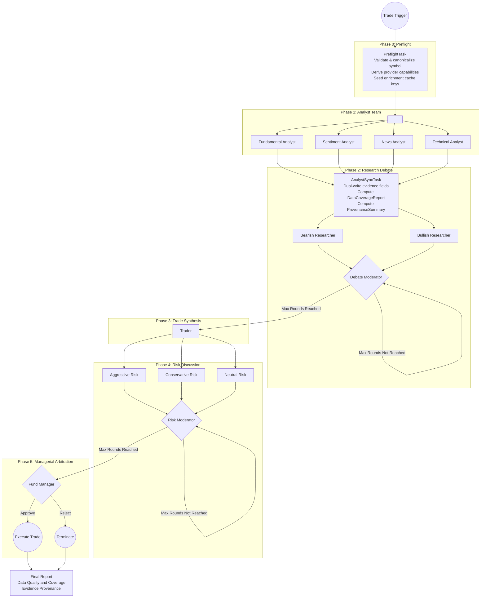
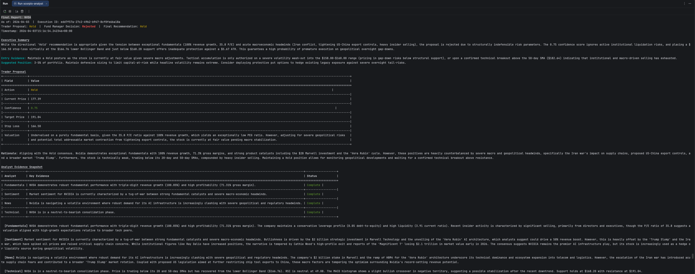
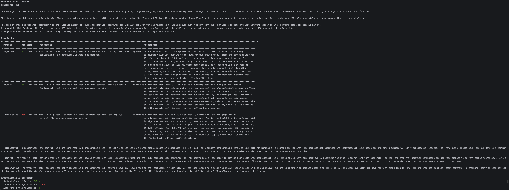
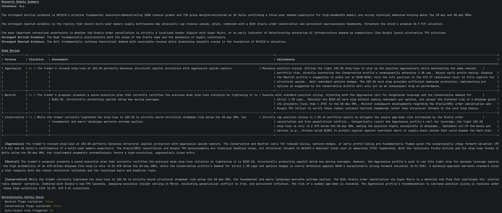

# Scorpio-Analyst
> Your personal Multi-Agent portfolio manager and financial analyst team

[](https://github.com/BigtoC/scorpio-analyst/actions/workflows/tests.yml)
[](https://deepwiki.com/BigtoC/scorpio-analyst)

Scorpio-Analyst is a Rust-native reimplementation of the [TradingAgents framework](https://github.com/TauricResearch/TradingAgents), inspired by the paper [_TradingAgents: Multi-Agents LLM Financial Trading Framework_](https://arxiv.org/pdf/2412.20138). It simulates a sophisticated trading firm by employing a society of specialized AI agents that collaborate to make autonomous, explainable financial trading decisions.

The project's primary goal is to overcome the limitations of traditional algorithmic trading and monolithic AI systems by leveraging a structured, multi-agent approach. This allows for the integration of qualitative data, enhances explainability, and achieves superior risk-adjusted returns.

The evidence discipline and provenance-reporting patterns in this project are additionally inspired by Anthropic's [financial-services-plugins](https://github.com/anthropics/anthropic-quickstarts/tree/main/financial-services-plugins) architecture, which demonstrates rigorous grounding of LLM outputs in authoritative runtime evidence.

The current implementation track uses a free-tier data stack: Finnhub, yfinance, and FRED. This stack is highly capable and supports strict DCF, EV/EBITDA, Options flow, Consensus Estimates, thesis memory, and macro/news/technical analysis. However, it still lacks ETF-native valuation metrics and Earnings Call Transcripts.

Within that active track, `yfinance-rs` is used extensively for OHLCV data, Options Chains, full Financial Statements, Analyst Estimates, Institutional/Insider ownership, and Corporate Calendar.

In practice, this means the current setup can analyze corporate equities deeply with deterministic valuation, while ETF runs will often surface valuation as `not assessed` rather than producing a corporate-equity-style deterministic valuation.


## Conceptual Foundation

The system is built on two core principles from the original TradingAgents paradigm:

1.  **Organizational Modeling**: Instead of a single AI trying to do everything, the system decomposes the trading lifecycle into highly specialized roles (Analysts, Researchers, a Trader, Risk Managers, and a Fund Manager). This mirrors the structure of a real-world trading firm, preventing cognitive overload and improving decision quality.

2.  **Structured Communication**: To combat the "telephone effect" where data degrades in unstructured conversations, agents communicate through strictly-typed, structured data reports. This ensures that critical information is passed with perfect fidelity throughout the execution pipeline.

## High-Level Execution Graph

The system operates as a stateful workflow, orchestrating the collaboration between different agent teams in a 5-phase execution pipeline.



## Getting Started

### Install

**macOS / Linux**
```sh
curl -fsSL https://raw.githubusercontent.com/BigtoC/scorpio-analyst/main/install.sh | sh
```

**Windows (PowerShell)**
```powershell
iex (iwr -useb 'https://raw.githubusercontent.com/BigtoC/scorpio-analyst/main/install.ps1')
```

The script auto-detects your OS and architecture, downloads the latest release binary from GitHub, and installs it to `~/.local/bin/scorpio` (or `%USERPROFILE%\.local\bin\scorpio.exe` on Windows). If that directory is not in your `PATH`, the script prints the line to add to your shell profile.

> **Build from source:** If you prefer to compile locally, see the [Prerequisites](#prerequisites) section below and run `cargo build --release`.

### Quick start

```sh
scorpio setup          # interactive wizard — configure API keys and LLM provider
scorpio analyze AAPL   # run the full 5-phase analysis pipeline
```

#### Output options

By default `scorpio analyze` prints the terminal report. You can add extra output legs with flags:

| Flag                 | Effect                                                                                               |
|----------------------|------------------------------------------------------------------------------------------------------|
| `--json`             | Also write a pretty-printed JSON artifact to `~/.scorpio-analyst/reports/<SYMBOL>-<timestamp>.json`  |
| `--output-dir <DIR>` | Override the directory used by file-based reporters (created if missing)                             |
| `--no-terminal`      | Suppress the figlet banner and terminal report; requires at least one other reporter (e.g. `--json`) |

```sh
# Terminal report + JSON artifact in the default reports directory
scorpio analyze AAPL --json

# JSON only, written to a custom directory (no terminal output)
scorpio analyze AAPL --no-terminal --json --output-dir ./reports

# Show all available flags
scorpio analyze --help
```

A sample JSON artifact is available at [`docs/sample-reports/NVDA-20260423T104349860Z.json`](docs/sample-reports/NVDA-20260423T104349860Z.json).

---

### Prerequisites (build from source)

- Rust 1.93+ (`rustup update stable`)
- API keys for at least one LLM provider
- Register a free account and get the financial data APIs key :
  - [Finnhub](https://finnhub.io/) for market data and news
  - [FRED](https://fred.stlouisfed.org/) for economic indicators
  - `yfinance` is used through the bundled Rust client and does not require an API key

### 1. Configure secrets

Copy `.env.example` to `.env` and fill in your keys:

```bash
cp .env.example .env
```

```env
# Pick the provider(s) you intend to use at runtime
SCORPIO_OPENAI_API_KEY=sk-your-key-here
SCORPIO_ANTHROPIC_API_KEY=sk-ant-your-key-here
SCORPIO_GEMINI_API_KEY=your-gemini-key-here
SCORPIO_OPENROUTER_API_KEY=your-openrouter-key-here

# Financial data APIs
SCORPIO_FINNHUB_API_KEY=your-finnhub-key-here
SCORPIO_FRED_API_KEY=your-fred-api-key-here
```

Only the keys for providers selected by `scorpio setup` or `SCORPIO__LLM__...` env vars are required at runtime.

### 2. Configure runtime routing

Run the setup wizard to write `~/.scorpio-analyst/config.toml`:

```bash
cargo run -p scorpio-cli -- setup
```

The repo-root `config.toml` is deprecated and is not read at runtime. If you prefer a non-interactive flow, set the `SCORPIO__LLM__QUICK_THINKING_PROVIDER`, `SCORPIO__LLM__DEEP_THINKING_PROVIDER`, `SCORPIO__LLM__QUICK_THINKING_MODEL`, and `SCORPIO__LLM__DEEP_THINKING_MODEL` environment variables directly instead.

> **Note:** GitHub Copilot does not yet support tool calling — use OpenAI, Anthropic, or Gemini for the `quick_thinking_provider`. See [Known Limitations](#known-limitations) for details.

### 3. Run

```bash
cargo run -p scorpio-cli -- analyze AAPL
```

The pipeline executes all five phases and prints a structured report to the terminal. Configuration can be overridden at runtime with `SCORPIO__...` environment variables (for example `SCORPIO__LLM__MAX_DEBATE_ROUNDS=1 cargo run -p scorpio-cli -- analyze AAPL`).

To also export a JSON artifact:

```bash
cargo run -p scorpio-cli -- analyze AAPL --json
# Output: terminal report + ~/.scorpio-analyst/reports/AAPL-<timestamp>.json

cargo run -p scorpio-cli -- analyze AAPL --no-terminal --json --output-dir /tmp/reports
# Output: JSON file only, no terminal report
```

### Example report





> Full CLI usage and a TUI interface are planned for subsequent phases.

## Project Status

This project is in the early stages of development. The architecture and core components are being actively built.

### Known Limitations

**Current financial-data roadmap is intentionally scoped to free-tier provider reality**

The active roadmap assumes only free-tier Finnhub, yfinance, and FRED. As a result:

- thesis memory is in-scope
- deterministic valuation is fully capable for corporate equities (DCF, EV/EBITDA)
- ETF-style runs are supported, but they may legitimately produce `valuation not assessed` rather than a corporate-equity valuation result
- event/news enrichment is in-scope
- consensus estimates are supported via yfinance
- options flow and implied volatility are supported via yfinance
- transcript enrichment is deferred from the current implementation track
- ETF-native valuation inputs are deferred

See the active roadmap summary at [`docs/superpowers/roadmaps/2026-04-07-financial-services-plugins-architecture-roadmap-summary.md`](docs/superpowers/roadmaps/2026-04-07-financial-services-plugins-architecture-roadmap-summary.md) and the optional deferred follow-on plan at [`docs/plans/2026-04-07-006-optional-premium-data-follow-ons-plan.md`](docs/plans/2026-04-07-006-optional-premium-data-follow-ons-plan.md).

**GitHub Copilot provider does not yet support tool calling (Phase 1 analysts non-functional with Copilot)**

The current Copilot provider communicates over ACP (Agent Client Protocol) via a single shared subprocess. The ACP `session/new` call hardcodes an empty `mcp_servers` list and the prompt-building path silently drops any tools passed to it — meaning all four Phase 1 analyst agents (Fundamental, Sentiment, News, Technical) fail to invoke their data-fetching tools when Copilot is configured as the provider.

The fix requires routing analyst tools through a per-session MCP helper server, splitting the Copilot monolith into focused modules, and adding a worker pool to eliminate the shared-subprocess bottleneck. The full implementation plan is at [`docs/superpowers/plans/2026-03-27-copilot-phase1-mcp-tool-calling.md`](docs/superpowers/plans/2026-03-27-copilot-phase1-mcp-tool-calling.md).

Until that work is complete, use OpenAI, Anthropic, or Gemini as the `quick_thinking_provider` for Phase 1 analysts.

## Spec Driven Development Workflow Shortcuts

This repository includes matching OpenCode commands and GitHub Copilot prompt files to simplify the OpenSpec workflow for planned changes.

### Requirements

These shortcuts only work when all the following are true:

- OpenSpec is already set up in the repository
- `openspec/AGENTS.md` exists
- `PRD.md` exists
- `docs/architect-plan.md` exists

### OpenCode Commands

The following custom commands are available through `.opencode/command/`:

- `/spec-writer <spec-name>`
- `/spec-reviewer <spec-name>`
- `/spec-code-developer <spec-name>`
- `/spec-code-reviewer <spec-name>`

### GitHub Copilot Prompts

Matching Copilot prompt files are available in `.github/prompts/`:

- `spec-writer.prompt.md`
- `spec-reviewer.prompt.md`
- `spec-code-developer.prompt.md`
- `spec-code-reviewer.prompt.md`

### Example Usage
In CLI or in chat:
```text
/spec-writer add-sentiment-data
```

### Workflow Mapping

- `spec-writer`: create a new OpenSpec proposal from the plan
- `spec-reviewer`: review and improve the proposal docs
- `spec-code-developer`: implement the approved OpenSpec change
- `spec-code-reviewer`: review the implementation across requirements, security, performance, code quality, and tests

For a deep dive into the system's architecture, agent roles, and technical specifications, please see the [**Product Requirements Document (PRD.md)**](PRD.md).

Contributions are welcome!
