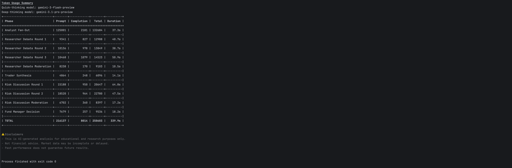
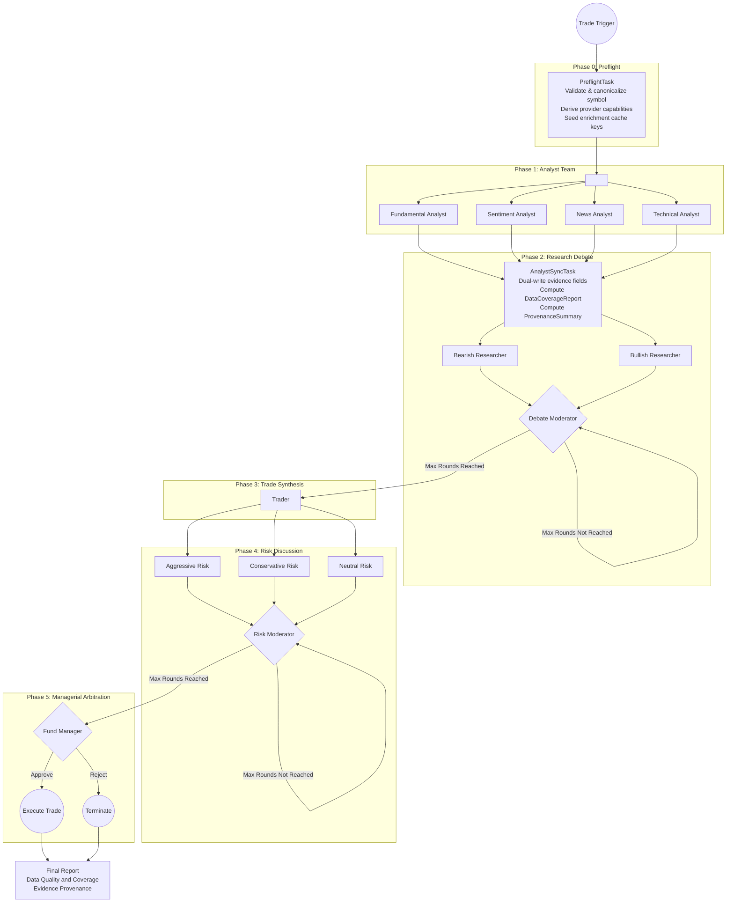

# Scorpio-Analyst
> Your personal Multi-Agent portfolio manager and financial analyst team

[](https://github.com/BigtoC/scorpio-analyst/actions/workflows/tests.yml)
[](https://deepwiki.com/BigtoC/scorpio-analyst)

Scorpio-Analyst is a Rust-native reimplementation of the [TradingAgents framework](https://github.com/TauricResearch/TradingAgents), inspired by the paper [_TradingAgents: Multi-Agents LLM Financial Trading Framework_](https://arxiv.org/pdf/2412.20138). It simulates a sophisticated trading firm by employing a society of specialized AI agents that collaborate to make autonomous, explainable financial trading decisions.

The project's primary goal is to overcome the limitations of traditional algorithmic trading and monolithic AI systems by leveraging a structured, multi-agent approach. This allows for the integration of qualitative data, enhances explainability, and achieves superior risk-adjusted returns.

The evidence discipline and provenance-reporting patterns in this project are additionally inspired by Anthropic's [financial-services-plugins](https://github.com/anthropics/anthropic-quickstarts/tree/main/financial-services-plugins) architecture, which demonstrates rigorous grounding of LLM outputs in authoritative runtime evidence. Selected analytical frameworks and orchestration patterns in the equity baseline pack are further adapted from [anthropics/financial-services](https://github.com/anthropics/financial-services) (Apache 2.0) — see [Attribution](#attribution) below.

The current implementation track uses a free-tier data stack: Finnhub, yfinance, and FRED. This stack is highly capable and supports strict DCF, EV/EBITDA, Options flow, Consensus Estimates, thesis memory, and macro/news/technical analysis. However, it still lacks ETF-native valuation metrics and Earnings Call Transcripts.

Within that active track, `yfinance-rs` is used extensively for OHLCV data, Options Chains, full Financial Statements, Analyst Estimates, Institutional/Insider ownership, and Corporate Calendar.

In practice, this means the current setup can analyze corporate equities deeply with deterministic valuation, while ETF runs will often surface valuation as `not assessed` rather than producing a corporate-equity-style deterministic valuation.


## Getting Started

### Install

**macOS / Linux**
```sh
curl -fsSL https://raw.githubusercontent.com/BigtoC/scorpio-analyst/main/install.sh | sh
```

**Windows (PowerShell)**
```powershell
iex (iwr -useb 'https://raw.githubusercontent.com/BigtoC/scorpio-analyst/main/install.ps1')
```

The script auto-detects your OS and architecture, downloads the latest release binary from GitHub, and installs it to `~/.local/bin/scorpio` (or `%USERPROFILE%\.local\bin\scorpio.exe` on Windows). If that directory is not in your `PATH`, the script prints the line to add to your shell profile.

> **Build from source:** If you prefer to compile locally, see the [Prerequisites](#prerequisites) section below and run `cargo build --release`.

### Quick start

```sh
scorpio setup          # interactive wizard — configure API keys and LLM provider
scorpio analyze AAPL   # run the full 5-phase analysis pipeline
```

#### Output options

By default `scorpio analyze` prints the terminal report. You can add extra output legs with flags:

| Flag                 | Effect                                                                                               |
|----------------------|------------------------------------------------------------------------------------------------------|
| `--json`             | Also write a pretty-printed JSON artifact to `~/.scorpio-analyst/reports/<SYMBOL>-<timestamp>.json`  |
| `--output-dir <DIR>` | Override the directory used by file-based reporters (created if missing)                             |
| `--no-terminal`      | Suppress the figlet banner and terminal report; requires at least one other reporter (e.g. `--json`) |

```sh
# Terminal report + JSON artifact in the default reports directory
scorpio analyze AAPL --json

# JSON only, written to a custom directory (no terminal output)
scorpio analyze AAPL --no-terminal --json --output-dir ./reports

# Show all available flags
scorpio analyze --help
```

A sample JSON artifact is available at [`docs/sample-reports/NVDA-20260423T104349860Z.json`](docs/sample-reports/NVDA-20260423T104349860Z.json).

#### Report commands

Query past analysis executions persisted in the local SQLite snapshot DB:

```bash
# List all past executions visible to the current binary
scorpio report list

# Emit the execution list as JSON
scorpio report list --json

# Show the full report for a specific execution
scorpio report show <EXECUTION_ID>

# Output structured JSON (round-trippable into ReportJson)
scorpio report show <EXECUTION_ID> --json
```

Notes:
- After a scorpio upgrade that bumps the snapshot schema, prior runs become
  invisible to these commands by design — re-run the analysis to produce a
  new execution under the current schema. `scorpio report list` will print a
  stderr banner indicating how many runs were retired so you know the DB is
  not actually empty.
- `scorpio report` does not require API keys — it reads only the local SQLite
  snapshot DB. Set `SCORPIO__STORAGE__SNAPSHOT_DB_PATH` to point at an
  alternative DB file.

---

### Prerequisites (build from source)

- Rust 1.93+ (`rustup update stable`)
- API keys for at least one LLM provider
- Register a free account and get the financial data APIs key :
  - [Finnhub](https://finnhub.io/) for market data and news
  - [FRED](https://fred.stlouisfed.org/) for economic indicators
  - [Alpha Vantage](https://www.alphavantage.co/) for earnings call transcripts (optional — without a key the pipeline runs in degraded mode with no transcripts)
  - `yfinance` is used through the bundled Rust client and does not require an API key

### 1. Configure secrets

Copy `.env.example` to `.env` and fill in your keys:

```bash
cp .env.example .env
```

```env
# Pick the provider(s) you intend to use at runtime
SCORPIO_OPENAI_API_KEY=sk-your-key-here
SCORPIO_ANTHROPIC_API_KEY=sk-ant-your-key-here
SCORPIO_GEMINI_API_KEY=your-gemini-key-here
SCORPIO_OPENROUTER_API_KEY=your-openrouter-key-here
SCORPIO_DEEPSEEK_API_KEY=your-deepseek-key-here
SCORPIO_XIAOMIMIMO_API_KEY=your-xiaomimimo-key-here
# GitHub Copilot uses OAuth/device flow — no API key needed here.
# Run `scorpio setup` and select Copilot to authorize via GitHub.

# Financial data APIs
SCORPIO_FINNHUB_API_KEY=your-finnhub-key-here
SCORPIO_FRED_API_KEY=your-fred-api-key-here
# Alpha Vantage — optional, enables earnings call transcript enrichment
SCORPIO_ALPHA_VANTAGE_API_KEY=your-alpha-vantage-key-here
```

Only the keys for providers selected by `scorpio setup` or `SCORPIO__LLM__...` env vars are required at runtime.

### 2. Configure runtime routing

Run the setup wizard to write `~/.scorpio-analyst/config.toml`:

```bash
cargo run -p scorpio-cli -- setup
```

The repo-root `config.toml` is deprecated and is not read at runtime. If you prefer a non-interactive flow, set the `SCORPIO__LLM__QUICK_THINKING_PROVIDER`, `SCORPIO__LLM__DEEP_THINKING_PROVIDER`, `SCORPIO__LLM__QUICK_THINKING_MODEL`, and `SCORPIO__LLM__DEEP_THINKING_MODEL` environment variables directly instead.

> **Note:** `scorpio setup` now fetches model lists for supported keyed providers during step 4. OpenRouter remains manual-only, and `Enter model manually` is always available.

### 3. Run

```bash
cargo run -p scorpio-cli -- analyze AAPL
```

The pipeline executes all five phases and prints a structured report to the terminal. Configuration can be overridden at runtime with `SCORPIO__...` environment variables (for example `SCORPIO__LLM__MAX_DEBATE_ROUNDS=1 cargo run -p scorpio-cli -- analyze AAPL`).

To also export a JSON artifact:

```bash
cargo run -p scorpio-cli -- analyze AAPL --json
# Output: terminal report + ~/.scorpio-analyst/reports/AAPL-<timestamp>.json

cargo run -p scorpio-cli -- analyze AAPL --no-terminal --json --output-dir /tmp/reports
# Output: JSON file only, no terminal report
```

### Futu positions (optional, read-only)

Run `scorpio setup` (it now prompts to enable Futu positions and optionally pin a
Real account — by its universal account number, card number, or `acc_id` — persisted
under `[futu]` in `~/.scorpio-analyst/config.toml`; set `SCORPIO__FUTU__ACCOUNT` to
override), or
set `SCORPIO__FUTU__ENABLED=true` (default off) to let the Fund Manager see your
current Real-account holdings for the analyzed symbol's market. Requires a local
Futu OpenD reachable on `127.0.0.1:11111` with **API encryption disabled**. The
integration is strictly read-only (positions only; never unlocks trading), but
enabled account context is included in the Fund Manager prompt sent to your
configured LLM provider and may be persisted in local run snapshots. When disabled
or unavailable, account-position text is omitted from the Fund Manager prompt and
analysis behaves exactly as before.

### Example report




> Full CLI usage and a TUI interface are planned for subsequent phases.

## Conceptual Foundation

The system is built on two core principles from the original TradingAgents paradigm:

1.  **Organizational Modeling**: Instead of a single AI trying to do everything, the system decomposes the trading lifecycle into highly specialized roles (Analysts, Researchers, a Trader, Risk Managers, and a Fund Manager). This mirrors the structure of a real-world trading firm, preventing cognitive overload and improving decision quality.

2.  **Structured Communication**: To combat the "telephone effect" where data degrades in unstructured conversations, agents communicate through strictly-typed, structured data reports. This ensures that critical information is passed with perfect fidelity throughout the execution pipeline.

## High-Level Execution Graph

The system operates as a stateful workflow, orchestrating the collaboration between different agent teams in a 5-phase execution pipeline.



## Project Status

This project is in the early stages of development. The architecture and core components are being actively built.

### Known Limitations

**Current financial-data roadmap is intentionally scoped to free-tier provider reality**

The active roadmap assumes only free-tier Finnhub, yfinance, and FRED. As a result:

- thesis memory is in-scope
- deterministic valuation is fully capable for corporate equities (DCF, EV/EBITDA)
- ETF-style runs are supported, but they may legitimately produce `valuation not assessed` rather than a corporate-equity valuation result
- event/news enrichment is in-scope
- consensus estimates are supported via yfinance
- options flow and implied volatility are supported via yfinance
- transcript enrichment is deferred from the current implementation track
- ETF-native valuation inputs are deferred

See the active roadmap summary at [`docs/superpowers/roadmaps/2026-04-07-financial-services-plugins-architecture-roadmap-summary.md`](docs/superpowers/roadmaps/2026-04-07-financial-services-plugins-architecture-roadmap-summary.md) and the optional deferred follow-on plan at [`docs/plans/2026-04-07-006-optional-premium-data-follow-ons-plan.md`](docs/plans/2026-04-07-006-optional-premium-data-follow-ons-plan.md).

**Supported LLM providers**

- **OpenAI** — set `SCORPIO_OPENAI_API_KEY` or configure via `scorpio setup`.
- **Anthropic** — set `SCORPIO_ANTHROPIC_API_KEY` or configure via `scorpio setup`.
- **Google Gemini** — set `SCORPIO_GEMINI_API_KEY` or configure via `scorpio setup`.
- **OpenRouter** — set `SCORPIO_OPENROUTER_API_KEY` or configure via `scorpio setup`. Supports 300+ models including free-tier routes.
- **DeepSeek** — set `SCORPIO_DEEPSEEK_API_KEY` or configure via `scorpio setup`.
- **GitHub Copilot** — OAuth/device-flow (no API key required). Run `scorpio setup` and select Copilot to authorize via GitHub. Token cache lives at `~/.scorpio-analyst/github_copilot/`.
- **Xiaomi MiMo** — OpenAI-compatible API. Set `SCORPIO_XIAOMIMIMO_API_KEY` or configure via `scorpio setup`.

Valid provider name strings (for `SCORPIO__LLM__QUICK_THINKING_PROVIDER` etc.): `"openai"`, `"anthropic"`, `"gemini"`, `"openrouter"`, `"deepseek"`, `"copilot"`, `"xiaomimimo"`.

## Attribution

Selected analytical frameworks, prompt structures, and orchestration patterns in this project are adapted from [anthropics/financial-services](https://github.com/anthropics/financial-services), licensed under Apache License 2.0.

Adapted material includes:

- **Analytical frameworks** ported into the equity baseline pack prompts: valuation sanity bands (WACC, terminal-growth, multiple ranges), industry-specific KPI matrices, management-commentary red-flag taxonomies, beat/miss decision trees, falsifiable thesis structure, contrarian-needs-catalyst rule, catalyst taxonomy with H/M/L impact tiers, and the data-sourcing hierarchy with untrusted-content guidance. Source skills cited inline.
- **Orchestration patterns** that informed the auditor task and per-agent output-schema envelope design: read-only auditor subagents (`model-builder/subagents/auditor.yaml`, `gl-reconciler/subagents/critic.yaml`) and strict subagent `output_schema` blocks (`managed-agent-cookbooks/*/subagents/*.yaml`).

Where prompt content is adapted, the prompt source files include a tag of the form `# Adapted from anthropics/financial-services` (with the specific upstream skill cited) so the lineage is grep-able.

A copy of the Apache License 2.0 governing the upstream material is available at <https://www.apache.org/licenses/LICENSE-2.0>.

## Spec Driven Development Workflow Shortcuts

This repository includes matching OpenCode commands and GitHub Copilot prompt files to simplify the OpenSpec workflow for planned changes.

### Requirements

These shortcuts only work when all the following are true:

- OpenSpec is already set up in the repository
- `openspec/AGENTS.md` exists
- `PRD.md` exists
- `docs/architect-plan.md` exists

### OpenCode Commands

The following custom commands are available through `.opencode/command/`:

- `/spec-writer <spec-name>`
- `/spec-reviewer <spec-name>`
- `/spec-code-developer <spec-name>`
- `/spec-code-reviewer <spec-name>`

### GitHub Copilot Prompts

Matching Copilot prompt files are available in `.github/prompts/`:

- `spec-writer.prompt.md`
- `spec-reviewer.prompt.md`
- `spec-code-developer.prompt.md`
- `spec-code-reviewer.prompt.md`

### Example Usage
In CLI or in chat:
```text
/spec-writer add-sentiment-data
```

### Workflow Mapping

- `spec-writer`: create a new OpenSpec proposal from the plan
- `spec-reviewer`: review and improve the proposal docs
- `spec-code-developer`: implement the approved OpenSpec change
- `spec-code-reviewer`: review the implementation across requirements, security, performance, code quality, and tests

For a deep dive into the system's architecture, agent roles, and technical specifications, please see the [**Product Requirements Document (PRD.md)**](PRD.md).

Contributions are welcome!
