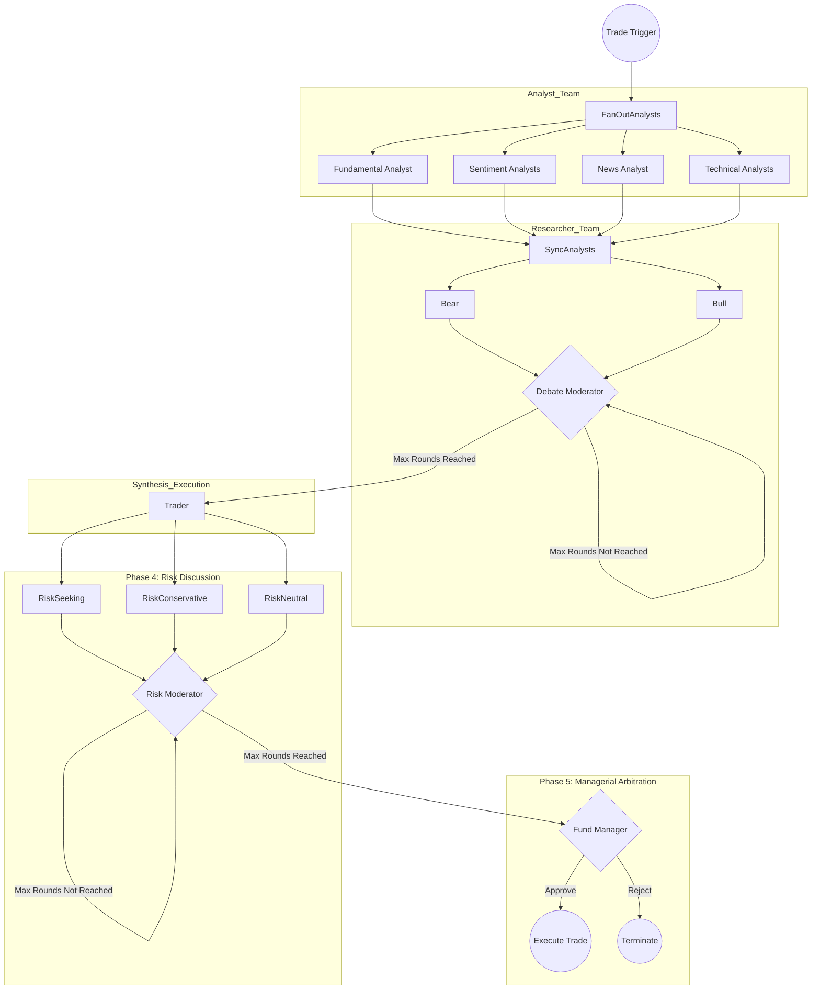

# Scorpio-Analyst
> Your personal Multi-Agent portfolio manager and financial analyst team

[](https://github.com/BigtoC/scorpio-analyst/actions/workflows/tests.yml)

Scorpio-Analyst is a Rust-native reimplementation of the [TradingAgents framework](https://github.com/TauricResearch/TradingAgents), inspired by the paper [_TradingAgents: Multi-Agents LLM Financial Trading Framework_](https://arxiv.org/pdf/2412.20138). It simulates a sophisticated trading firm by employing a society of specialized AI agents that collaborate to make autonomous, explainable financial trading decisions.

The project's primary goal is to overcome the limitations of traditional algorithmic trading and monolithic AI systems by leveraging a structured, multi-agent approach. This allows for the integration of qualitative data, enhances explainability, and achieves superior risk-adjusted returns.


## Conceptual Foundation

The system is built on two core principles from the original TradingAgents paradigm:

1.  **Organizational Modeling**: Instead of a single AI trying to do everything, the system decomposes the trading lifecycle into highly specialized roles (Analysts, Researchers, a Trader, Risk Managers, and a Fund Manager). This mirrors the structure of a real-world trading firm, preventing cognitive overload and improving decision quality.

2.  **Structured Communication**: To combat the "telephone effect" where data degrades in unstructured conversations, agents communicate through strictly-typed, structured data reports. This ensures that critical information is passed with perfect fidelity throughout the execution pipeline.

## High-Level Execution Graph

The system operates as a stateful workflow, orchestrating the collaboration between different agent teams in a 5-phase execution pipeline.



## User Interaction

Scorpio-Analyst is designed with a phased user interface approach to provide both power and ease of use:

*   **Phase 1 (MVP)**: A comprehensive Command-Line Interface (CLI) built with `clap`, supporting both structured subcommands and natural language queries.
*   **Phase 2**: An interactive Terminal User Interface (TUI) for a rich, conversational experience.
*   **Phase 3**: A high-performance, GPU-accelerated native desktop application.

## Project Status

This project is in the early stages of development. The architecture and core components are being actively built.

### Known Limitations

**GitHub Copilot provider does not yet support tool calling (Phase 1 analysts non-functional with Copilot)**

The current Copilot provider communicates over ACP (Agent Client Protocol) via a single shared subprocess. The ACP `session/new` call hardcodes an empty `mcp_servers` list and the prompt-building path silently drops any tools passed to it — meaning all four Phase 1 analyst agents (Fundamental, Sentiment, News, Technical) fail to invoke their data-fetching tools when Copilot is configured as the provider.

The fix requires routing analyst tools through a per-session MCP helper server, splitting the Copilot monolith into focused modules, and adding a worker pool to eliminate the shared-subprocess bottleneck. The full implementation plan is at [`docs/superpowers/plans/2026-03-27-copilot-phase1-mcp-tool-calling.md`](docs/superpowers/plans/2026-03-27-copilot-phase1-mcp-tool-calling.md).

Until that work is complete, use OpenAI, Anthropic, or Gemini as the `quick_thinking_provider` for Phase 1 analysts.

## Spec Driven Development Workflow Shortcuts

This repository includes matching OpenCode commands and GitHub Copilot prompt files to simplify the OpenSpec workflow for planned changes.

### Requirements

These shortcuts only work when all the following are true:

- OpenSpec is already set up in the repository
- `openspec/AGENTS.md` exists
- `PRD.md` exists
- `docs/architect-plan.md` exists

### OpenCode Commands

The following custom commands are available through `.opencode/command/`:

- `/spec-writer <spec-name>`
- `/spec-reviewer <spec-name>`
- `/spec-code-developer <spec-name>`
- `/spec-code-reviewer <spec-name>`

### GitHub Copilot Prompts

Matching Copilot prompt files are available in `.github/prompts/`:

- `spec-writer.prompt.md`
- `spec-reviewer.prompt.md`
- `spec-code-developer.prompt.md`
- `spec-code-reviewer.prompt.md`

### Example Usage
In CLI or in chat:
```text
/spec-writer add-sentiment-data
```

### Workflow Mapping

- `spec-writer`: create a new OpenSpec proposal from the plan
- `spec-reviewer`: review and improve the proposal docs
- `spec-code-developer`: implement the approved OpenSpec change
- `spec-code-reviewer`: review the implementation across requirements, security, performance, code quality, and tests

For a deep dive into the system's architecture, agent roles, and technical specifications, please see the [**Product Requirements Document (PRD.md)**](PRD.md).

Contributions are welcome!
