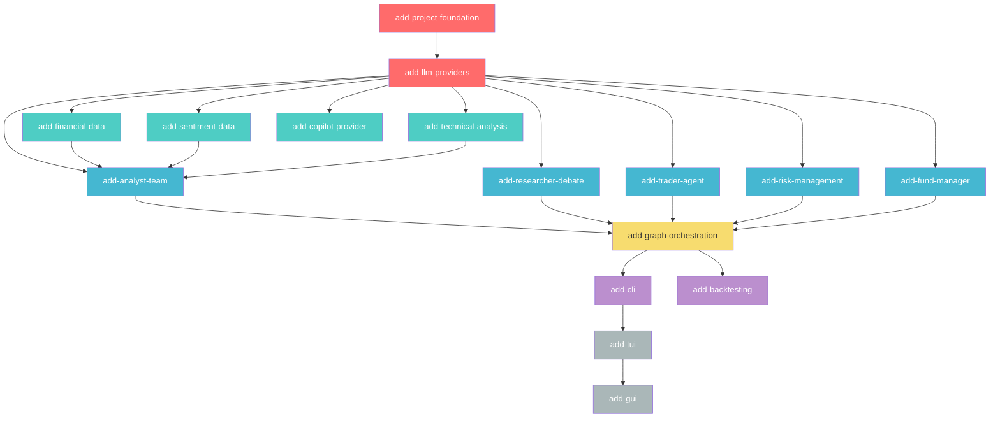

# Architect Plan: OpenSpec Spec Decomposition & Sequencing

This document plans how to decompose the PRD into OpenSpec capability specs and change proposals,
sequenced to minimize code conflicts and maximize parallel work.

---

## Table of Contents

- [Principles](#principles)
- [Capability Inventory](#capability-inventory)
- [Change Proposal Mapping](#change-proposal-mapping)
- [Dependency Graph](#dependency-graph)
- [Sequencing Strategy](#sequencing-strategy)
- [Phase Details](#phase-details)
- [Conflict Analysis](#conflict-analysis)
- [Module Ownership Map](#module-ownership-map)

---

## Principles

1. **One capability, one owner** — each capability spec is created by exactly one change proposal.
   No two concurrent changes ever create or modify the same capability spec.
2. **Foundation first** — shared types (`TradingState`, `TradingError`, `Config`) are defined in a
   single prerequisite spec. All downstream specs reference these types without modifying them.
3. **Pre-declared skeleton** — the foundation change creates the full module tree (even empty
   `mod.rs` files) so downstream implementations only fill in their own files.
4. **Parallelism by file ownership** — each change after the foundation owns a distinct set of
   source files/directories, preventing merge conflicts.
5. **Cross-owner modifications allowed with approval** — a change proposal MAY modify files owned
   by another change, but only when there is a clear technical justification. The justification must
   be stated explicitly in `proposal.md` under a `## Cross-Owner Changes` section. Implementation
   **must not begin** until the file owner (or a project maintainer) approves the modification in
   the proposal review. Approved cross-owner edits are reflected in the owner's `tasks.md` as a
   note for awareness.

---

## Capability Inventory

21 capabilities derived from the PRD, grouped by architectural layer:

### Foundation Layer

| # | Capability ID      | Description                                                               |
|---|--------------------|---------------------------------------------------------------------------|
| 1 | `core-types`       | `TradingState`, all sub-structs, `TokenUsageTracker`, serde serialization |
| 2 | `error-handling`   | `TradingError` enum, retry/backoff patterns, degradation                  |
| 3 | `config`           | 3-tier config loading (toml → .env → env), `secrecy` for keys             |
| 4 | `observability`    | `tracing`/`tracing-subscriber` structured logging                         |
| 5 | `rate-limiting`    | `governor`-based coordinated rate limiting via `Arc`                      |
| 6 | `testing-strategy` | General testing infrastructure, `mockall` and `proptest` setups           |

### Provider Layer

| # | Capability ID      | Description                                                 |
|---|--------------------|-------------------------------------------------------------|
| 7 | `llm-providers`    | `rig-core` abstraction, provider factory, dual-tier routing |
| 8 | `copilot-provider` | Custom GitHub Copilot provider via ACP/JSON-RPC 2.0         |

### Data Layer

| #  | Capability ID        | Description                                                                       |
|----|----------------------|-----------------------------------------------------------------------------------|
| 9  | `financial-data`     | Finnhub (fundamentals + company news) and yfinance-rs (OHLCV pricing)             |
| 10 | `sentiment-data`     | Deferred post-MVP social-platform sentiment ingestion (Reddit/X, Gemini fallback) |
| 11 | `technical-analysis` | `kand` indicator calculations (RSI, MACD, ATR, etc.)                              |

### Agent Layer

| #  | Capability ID       | Description                                                     |
|----|---------------------|-----------------------------------------------------------------|
| 12 | `analyst-team`      | 4 analyst agents (Fundamental, Sentiment, News, Technical)      |
| 13 | `researcher-debate` | Bullish/Bearish researchers + Debate Moderator cyclic loop      |
| 14 | `trader-agent`      | Trader Agent — TradeProposal synthesis from debate consensus    |
| 15 | `risk-management`   | Risk Team (Aggressive, Conservative, Neutral) + Risk Moderator  |
| 16 | `fund-manager`      | Fund Manager — final approve/reject with deterministic fallback |

### Orchestration Layer

| #  | Capability ID         | Description                                                    |
|----|-----------------------|----------------------------------------------------------------|
| 17 | `graph-orchestration` | `graph-flow` 5-phase pipeline, fan-out, cyclic debate patterns |

### Interface Layer

| #  | Capability ID | Description                                              |
|----|---------------|----------------------------------------------------------|
| 18 | `cli`         | `clap` subcommands, `ask` NL parser, output formatting   |
| 19 | `backtesting` | Historical OHLCV replay, performance metrics, cached LLM |

### Future Phases

| #  | Capability ID | Description                                                  |
|----|---------------|--------------------------------------------------------------|
| 20 | `tui`         | Phase 2 — `ratatui`/`crossterm` interactive terminal UI      |
| 21 | `gui`         | Phase 3 — GPUI desktop application (behind `--features gui`) |

---

## Change Proposal Mapping

Each row is a change proposal (verb-led kebab-case ID) → the capabilities it creates.

| Change ID                 | Creates Capabilities                                                                           | Type       |
|---------------------------|------------------------------------------------------------------------------------------------|------------|
| `add-project-foundation`  | `core-types`, `error-handling`, `config`, `observability`, `rate-limiting`, `testing-strategy` | Foundation |
| `add-llm-providers`       | `llm-providers`                                                                                | Foundation |
| `add-financial-data`      | `financial-data`                                                                               | Data       |
| `add-sentiment-data`      | `sentiment-data`                                                                               | Data       |
| `add-technical-analysis`  | `technical-analysis`                                                                           | Data       |
| `add-copilot-provider`    | `copilot-provider`                                                                             | Provider   |
| `add-analyst-team`        | `analyst-team`                                                                                 | Agent      |
| `add-researcher-debate`   | `researcher-debate`                                                                            | Agent      |
| `add-trader-agent`        | `trader-agent`                                                                                 | Agent      |
| `add-risk-management`     | `risk-management`                                                                              | Agent      |
| `add-fund-manager`        | `fund-manager`                                                                                 | Agent      |
| `add-graph-orchestration` | `graph-orchestration`                                                                          | Pipeline   |
| `add-cli`                 | `cli`                                                                                          | Interface  |
| `add-backtesting`         | `backtesting`                                                                                  | Interface  |
| `add-tui`                 | `tui`                                                                                          | Phase 2    |
| `add-gui`                 | `gui`                                                                                          | Phase 3    |

**16 change proposals → 21 capability specs** (the foundation bundles 6 related capabilities).

---

## Dependency Graph



Legend:

- 🔴 Red = **Sequential prerequisites** (must be first)
- 🟢 Teal = **Data layer** (parallel after prerequisites)
- 🔵 Blue = **Agent layer** (parallel after prerequisites; implementation needs data layer)
- 🟡 Yellow = **Orchestration** (aggregates all agents)
- 🟣 Purple = **Interface** (needs full pipeline)
- ⚪ Gray = **Future phases**

---

## Sequencing Strategy

### Two Timelines: Spec Writing vs. Implementation

**Spec writing** (creating the OpenSpec documents) has FEWER dependency constraints than
**implementation** (writing the Rust code). A spec can reference types defined in another spec
without that spec being implemented yet — it just needs to be written first so the referenced
types are formally defined.

### Spec Writing Order

| Phase | What to Write                    | Can Be Parallel? | Prerequisite |
|-------|----------------------------------|------------------|--------------|
| S0    | `add-project-foundation`         | No (solo)        | —            |
| S1    | `add-llm-providers`              | No (solo)        | S0           |
| S2    | ALL remaining specs (14 changes) | **Yes (all 14)** | S0, S1       |

**Why S0 must be first**: Every other spec references `TradingState` sub-types, `TradingError`
variants, `Config` fields, or tracing patterns defined in the foundation. Writing the foundation
spec first establishes the shared vocabulary.

**Why S1 must be second**: Every agent spec references the `rig` provider abstraction, tool macro
patterns, and dual-tier model routing defined here.

**Why S2 is fully parallel**: After S0+S1, each remaining change creates its own capability spec
in its own `openspec/specs/<capability>/` directory. No two changes touch the same capability.

### Implementation Order

Implementation has stricter ordering because code has compile-time dependencies:

| Phase | Changes to Implement                                                                                       | Parallel?   |
|-------|------------------------------------------------------------------------------------------------------------|-------------|
| I0    | `add-project-foundation`                                                                                   | Solo        |
| I1    | `add-llm-providers`                                                                                        | Solo        |
| I2    | `add-financial-data`, `add-sentiment-data`, `add-technical-analysis`, `add-copilot-provider`               | **Yes (4)** |
| I3    | `add-analyst-team`, `add-researcher-debate`, `add-trader-agent`, `add-risk-management`, `add-fund-manager` | **Yes (5)** |
| I4    | `add-graph-orchestration`                                                                                  | Solo        |
| I5    | `add-cli`, `add-backtesting`                                                                               | **Yes (2)** |
| I6    | `add-tui`                                                                                                  | Solo        |
| I7    | `add-gui`                                                                                                  | Solo        |

---

## Phase Details

### Phase S0 / I0: `add-project-foundation`

**The most critical spec.** Everything depends on it. It must be comprehensive enough that no
downstream spec needs to modify the types it defines.

**Capability specs created** (6):

1. **`core-types`** — `TradingState` and all nested data structures:
    - `FundamentalData` (revenue growth, P/E, liquidity, insider transactions)
    - `TechnicalData` (RSI, MACD, ATR, support/resistance levels)
    - `SentimentData` (normalized scores, source breakdown, engagement peaks)
    - `NewsData` (articles, macro events, causal relationships)
    - `TradeProposal` (action: Buy/Sell/Hold, target price, stop-loss, confidence)
    - `RiskReport` (assessment, risk level, recommended adjustments)
    - `ExecutionStatus` (approved/rejected, rationale, timestamps)
    - `DebateRound`, `ConsensusResult` for debate history
    - `TokenUsageTracker` (aggregate totals), `PhaseTokenUsage` (per-phase breakdown
      with phase name, duration, nested agent entries), `AgentTokenUsage` (per-agent:
      agent name, model ID, prompt/completion/total tokens, latency)

2. **`error-handling`** — `TradingError` enum with all variants:
    - `AnalystError`, `RateLimitExceeded`, `NetworkTimeout`, `SchemaViolation`, `Rig`
    - Retry patterns (exponential backoff, max 3 retries, base 500ms)
    - Graceful degradation rules (1 analyst fail = continue, 2+ = abort)

3. **`config`** — Configuration management:
    - `Config`, `LLMConfig`, `TradingConfig`, `ApiConfig` structs
    - 3-tier loading: `config.toml` → `.env` (dotenvy) → environment variables
    - `secrecy::SecretString` wrapping for all API keys
    - Validation at startup

4. **`observability`** — Tracing infrastructure:
    - `tracing-subscriber` setup with structured JSON output
    - Span conventions for phase transitions, tool calls, LLM invocations
    - Redaction of `SecretString` fields in log output

5. **`rate-limiting`** — Coordinated rate limiting:
    - `governor::DefaultDirectRateLimiter` shared via `Arc`
    - Finnhub: 30 req/s, configurable per-provider quotas
    - Integration point for agent tasks via dependency injection

6. **`testing-strategy`** — General testing infrastructure:
    - `mockall` for trait/provider mocking and `proptest` for data validation
    - Test runner utilities and testing directory structure (`tests/`)

**Implementation scope**:

- `Cargo.toml` with ALL project dependencies (including agent/provider deps with empty modules)
- `src/lib.rs` with full module tree declared (empty `mod.rs` stubs in all directories)
- `src/error.rs`, `src/config.rs`, `src/state/*.rs` (including `src/state/token_usage.rs`),
  `src/rate_limit.rs`
- `config.toml` defaults, `.env.example`
- Property-based tests for `TradingState` serde round-trips (including `TokenUsageTracker`)

**Why bundle 6 capabilities in one change**: These are tightly coupled — `TradingError` references
`Config` fields, `TradingState` uses types that need `serde`, rate-limiter setup needs `Config`.
Splitting them would cause immediate cross-spec modifications.

---

### Phase S1 / I1: `add-llm-providers`

**Capability spec created** (1): `llm-providers`

- `rig-core` client initialization for OpenAI, Anthropic, Gemini
- Provider factory pattern: `create_completion_model(tier: ModelTier, llm_config: &LLMConfig, api_config: &ApiConfig) -> impl CompletionModel`
- `ModelTier` enum: `QuickThinking` vs `DeepThinking`, where tier-to-model/provider routing is driven by
  `LLMConfig.quick_thinking_provider`, `LLMConfig.deep_thinking_provider`, `LLMConfig.quick_thinking_model`, and
  `LLMConfig.deep_thinking_model`
- `#[tool]` macro usage patterns for agent tool bindings
- Agent builder patterns: system prompt + tools + structured output extraction
- Retry wrapper around `rig` completion calls

**Files owned**: `src/providers/mod.rs`, `src/providers/factory.rs`

**Why sequential after S0**: References `Config.llm`, `TradingError::Rig`, and establishes patterns
all agent specs build on.

---

### Phase S2 / I2–I5: Parallel Specs

After the foundation (S0) and provider layer (S1) are written, **all 14 remaining specs can be
written as spec documents simultaneously**. For implementation, they follow the phased order below.

#### I2 — Data & Provider Layer (4 parallel)

| Change                   | Capability           | Files Owned                                                                               |
|--------------------------|----------------------|-------------------------------------------------------------------------------------------|
| `add-financial-data`     | `financial-data`     | `src/data/finnhub.rs`, `src/data/yfinance.rs`                                             |
| `add-sentiment-data`     | `sentiment-data`     | `src/data/sentiment.rs`                                                                   |
| `add-technical-analysis` | `technical-analysis` | `src/indicators/mod.rs`, `src/indicators/calculator.rs`                                   |
| `add-copilot-provider`   | `copilot-provider`   | `src/providers/copilot.rs`, `src/providers/acp.rs`                                        |

**No code conflicts**: each owns a unique directory or file set. `add-copilot-provider` adds to
`src/providers/` but only creates new files — the foundation already declared `pub mod copilot;`
and `pub mod acp;` stubs. `src/data/mod.rs` remains foundation-owned skeleton wiring, so splitting
sentiment out does not introduce shared-file conflicts inside the data layer.

**`add-financial-data`** details:

- Finnhub client wrapper: `get_fundamentals()`, `get_earnings()`, `get_news()`, `get_insider_transactions()`
- yfinance-rs wrapper: `get_ohlcv(symbol, start, end)` → `Vec<Candle>`
- All return types map to `TradingState` sub-structs defined in `core-types`
- Rate limiter injection via constructor parameter

**`add-sentiment-data`** details:

- Deferred post-MVP social-platform sentiment ingestion work rather than part of the MVP baseline
- Potential Reddit and X/Twitter source handling, with Gemini CLI and operator-managed helpers as fallback options
- Any future text normalization, deduplication, and optional vector-store lifecycle management for social inputs
- Should enrich `SentimentData` only after the MVP news-based sentiment workflow proves insufficient

**`add-technical-analysis`** details:

- `kand` wrapper functions: `calculate_rsi()`, `calculate_macd()`, `calculate_atr()`
- Input: `Vec<Candle>` from yfinance-rs; Output: `TechnicalData` struct
- f64 precision for all calculations
- Batch calculation of 60+ indicators from raw OHLCV

**`add-copilot-provider`** details:

- ACP client: spawn `copilot --acp --stdio`, NDJSON stream parsing
- `rig` trait implementations: `CompletionModel`, `CompletionClient`
- JSON-RPC 2.0 lifecycle: initialize → session/new → session/prompt → response → close
- Integration with the provider factory from `llm-providers`

#### I3 — Agent Layer (5 parallel)

| Change                  | Capability          | Files Owned                                                                                          |
|-------------------------|---------------------|------------------------------------------------------------------------------------------------------|
| `add-analyst-team`      | `analyst-team`      | `src/agents/analyst/mod.rs`, `src/agents/analyst/{fundamental,sentiment,news,technical}.rs`          |
| `add-researcher-debate` | `researcher-debate` | `src/agents/researcher/mod.rs`, `src/agents/researcher/{bullish,bearish,moderator}.rs`               |
| `add-trader-agent`      | `trader-agent`      | `src/agents/trader.rs`                                                                               |
| `add-risk-management`   | `risk-management`   | `src/agents/risk/mod.rs`, `src/agents/risk/{aggressive,conservative,neutral,moderator}.rs`           |
| `add-fund-manager`      | `fund-manager`      | `src/agents/fund_manager/mod.rs`, `src/agents/fund_manager/{agent,prompt,validation,usage,tests}.rs` |

**No code conflicts**: each agent spec owns its own subdirectory or file within `src/agents/`.
The foundation pre-declares all `pub mod` entries in `src/agents/mod.rs`.

**Implementation dependency**: `add-analyst-team` needs `add-financial-data` and `add-technical-analysis` to be
implemented first (agents use data tools). Social-platform sentiment ingestion is deferred and is not required for the
MVP analyst team.

**Common spec pattern for all agents**:

- System prompt (reference `docs/prompts.md` section)
- `rig` tool definitions via `#[tool]`
- Input: reads specific `TradingState` fields from `graph_flow::Context`
- Output: writes to specific `TradingState` fields
- Model tier: QuickThinking (analysts) or DeepThinking (researchers, trader, risk, fund manager)
- Timeout: 30s default

**`add-analyst-team`** specifics:

- 4 agents sharing fan-out execution pattern
- Each writes to one `Option<T>` field on `TradingState`
- Each has distinct tool bindings (Finnhub fundamentals/news, yfinance+kand, and company-news sentiment analysis)
- The **Sentiment Analyst** consumes company-specific news inputs from Finnhub and/or Yahoo Finance in the MVP; direct
  Reddit/X ingestion is deferred to future improvements

**`add-researcher-debate`** specifics:

- Cyclic debate loop (Bullish → Bearish → Moderator → repeat)
- `max_debate_rounds` parameter from `Config.llm`
- Moderator summarizes, selects prevailing perspective, writes `consensus_summary`
- Debate history appended to `TradingState.debate_history`

**`add-trader-agent`** specifics:

- Reads full `TradingState` (all analyst data + debate consensus)
- Outputs structured `TradeProposal` JSON schema
- Deep-thinking model for multi-step reasoning

**`add-risk-management`** specifics:

- 3 risk persona agents + Risk Moderator in cyclic discussion
- `max_risk_rounds` parameter from config
- Each writes a `RiskReport`; moderator synthesizes `risk_discussion_history`

**`add-fund-manager`** specifics:

- Reads `TradeProposal` + 3 `RiskReport` objects + `risk_discussion_history`
- Primary: LLM-powered decision (deep-thinking tier)
- Fallback: deterministic reject if Conservative + Neutral both flag violation
- Writes `ExecutionStatus` (approve/reject + structured rationale)

#### I4 — Orchestration (solo, aggregates all agents)

| Change                    | Capability            | Files Owned                                                                |
|---------------------------|-----------------------|----------------------------------------------------------------------------|
| `add-graph-orchestration` | `graph-orchestration` | `src/workflow/mod.rs`, `src/workflow/pipeline.rs`, `src/workflow/tasks.rs` |

**Why solo**: This is the "glue" that wires all agents into the `graph-flow` directed graph. It
imports from `src/agents/*` and `src/data/*`, so it must wait for all agent implementations.

**Spec details**:

- `GraphBuilder` setup with 5-phase topology
- `Task` trait implementations wrapping each agent
- Fan-out pattern for Analyst Team and Risk Team (via `tokio::spawn`)
- Cyclic pattern for Researcher debate and Risk debate (`NextAction::GoBack` / `GoTo`)
- `TradingState` injected into `graph_flow::Context`
- Phase transition logging via `tracing` spans
- Token accounting: each `Task` wrapper records `AgentTokenUsage` from `rig` completion
  responses into `TokenUsageTracker` immediately after each LLM call; phase-level
  `PhaseTokenUsage` entries are finalized at phase boundaries (including per-round entries
  for cyclic debate/risk phases)
- Snapshot `TradingState` to disk (serde_json) after each phase for audit/recovery
- Per-field `Arc<RwLock<Option<T>>>` locking for fan-out writes

#### I5 — Interface Layer (2 parallel)

| Change            | Capability    | Files Owned                                                                             |
|-------------------|---------------|-----------------------------------------------------------------------------------------|
| `add-cli`         | `cli`         | `src/cli/mod.rs`, `src/cli/{analyze,backtest,config_cmd,history,ask}.rs`, `src/main.rs` |
| `add-backtesting` | `backtesting` | `src/backtest/mod.rs`, `src/backtest/engine.rs`, `src/backtest/metrics.rs`              |

**No code conflicts**: CLI owns `src/cli/` and `src/main.rs`; backtesting owns `src/backtest/`.

**`add-cli`** details:

- `clap` derive API with subcommands: `analyze`, `backtest`, `config show`, `config check`,
  `history --last N --verbose`, `ask "<query>"`
- Output modes: human-readable (colored/comfy-table), JSON (`--output json`), quiet (`--quiet`)
- Post-run statistics display: mandatory after every completed cycle — per-phase/per-agent
  token breakdown (prompt/completion/total tokens, model ID, latency) and run totals;
  emitted in all output modes (human-readable table, JSON `token_usage` field, quiet mode
  appended after `TradeProposal`)
- Real-time streaming via tracing subscriber; `--no-stream` for batch
- `ask` subcommand: quick-thinking LLM intent parser → dispatch to pipeline code paths

**`add-backtesting`** details:

- Historical OHLCV replay engine (June–November 2024 window)
- Day-by-day replay with no look-ahead bias
- LLM cached response layer for determinism and cost control
- Metrics: Cumulative Return, Annualized Return, Sharpe Ratio, Maximum Drawdown
- Comparison against baselines (Buy & Hold, SMA, MACD, KDJ & RSI)

#### I6–I7 — Future Phases (sequential, after CLI)

| Change    | Capability | Files Owned    | Prerequisite |
|-----------|------------|----------------|--------------|
| `add-tui` | `tui`      | `src/tui/*.rs` | `add-cli`    |
| `add-gui` | `gui`      | `src/gui/*.rs` | `add-tui`    |

These are Phase 2 and Phase 3 deliverables, not part of the MVP.

---

## Conflict Analysis

### Spec Document Conflicts

Since all capabilities are NEW (the `openspec/specs/` directory is empty), every change proposal
uses `## ADDED Requirements` exclusively. **No two changes create or modify the same capability**,
so there are zero spec document conflicts after the foundation is written.

The only scenario where conflicts could arise:

- A downstream spec discovers it needs a new field on `TradingState` → must modify `core-types`
- Mitigation: the foundation spec must be **exhaustive** in defining all `TradingState` fields
  referenced anywhere in the PRD before any downstream spec is written

### Code File Conflicts

| Shared File            | Owner                    | Downstream Access Pattern                         |
|------------------------|--------------------------|---------------------------------------------------|
| `Cargo.toml`           | `add-project-foundation` | No changes needed (all deps pre-declared)         |
| `src/lib.rs`           | `add-project-foundation` | No changes needed (all `pub mod` pre-declared)    |
| `src/agents/mod.rs`    | `add-project-foundation` | No changes needed (all agent mods pre-declared)   |
| `src/providers/mod.rs` | `add-project-foundation` | No changes needed (copilot/acp mods pre-declared) |
| `src/data/mod.rs`      | `add-project-foundation` | No changes needed (all data mods pre-declared)    |
| `src/state/mod.rs`     | `add-project-foundation` | Read-only (import types)                          |
| `src/main.rs`          | `add-cli`                | Only CLI changes this file                        |

The pre-declared skeleton strategy minimises shared-file modifications after the foundation.
Each downstream spec primarily creates or fills in files within its owned directory.

### Cross-Owner File Modifications

Modifying a file owned by a different change is **permitted** when technically justified, but the
following gate must be passed before any implementation work begins:

1. **Document in `proposal.md`** — add a `## Cross-Owner Changes` section listing every
   foreign-owned file to be modified, the owning change ID, and a concise technical justification
   (e.g., "adds a missing `pub use` re-export that the foundation skeleton did not anticipate").
2. **Await approval** — do not touch the foreign file until a project maintainer or the owner of
   that change explicitly approves the edit in the proposal review thread.
3. **Notify the owner** — after approval, add a note to the owner's `tasks.md` under a
   `### Cross-Owner Touch-points` heading so they are aware of the external modification.
4. **Keep changes minimal** — edits to foreign-owned files must be as small as possible; prefer
   additive changes (new re-exports, new feature flags) over restructuring existing code.

Typical legitimate reasons for cross-owner modifications:
- The foundation skeleton omitted a required `pub use` or `pub mod` declaration.
- A shared `Cargo.toml` feature flag must be enabled for a new capability.
- A bug in a foundation type (wrong field name/type) blocks downstream compilation.

---

## Module Ownership Map

```
src/
├── main.rs                     ← add-cli
├── lib.rs                      ← add-project-foundation (pre-declares all mods)
├── error.rs                    ← add-project-foundation
├── config.rs                   ← add-project-foundation
├── rate_limit.rs               ← add-project-foundation
├── state/
│   ├── mod.rs                  ← add-project-foundation
│   ├── fundamental.rs          ← add-project-foundation
│   ├── technical.rs            ← add-project-foundation
│   ├── sentiment.rs            ← add-project-foundation
│   ├── news.rs                 ← add-project-foundation
│   ├── proposal.rs             ← add-project-foundation
│   ├── risk.rs                 ← add-project-foundation
│   ├── execution.rs            ← add-project-foundation
│   └── token_usage.rs          ← add-project-foundation
├── providers/
│   ├── mod.rs                  ← add-project-foundation (skeleton)
│   ├── factory.rs              ← add-llm-providers
│   ├── copilot.rs              ← add-copilot-provider
│   └── acp.rs                  ← add-copilot-provider
├── data/
│   ├── mod.rs                  ← add-project-foundation (skeleton)
│   ├── finnhub.rs              ← add-financial-data
│   ├── yfinance.rs             ← add-financial-data
│   └── sentiment.rs            ← add-sentiment-data
├── indicators/
│   ├── mod.rs                  ← add-project-foundation (skeleton)
│   └── calculator.rs           ← add-technical-analysis
├── agents/
│   ├── mod.rs                  ← add-project-foundation (skeleton)
│   ├── analyst/
│   │   ├── mod.rs              ← add-analyst-team
│   │   ├── fundamental.rs      ← add-analyst-team
│   │   ├── sentiment.rs        ← add-analyst-team
│   │   ├── news.rs             ← add-analyst-team
│   │   └── technical.rs        ← add-analyst-team
│   ├── researcher/
│   │   ├── mod.rs              ← add-researcher-debate
│   │   ├── bullish.rs          ← add-researcher-debate
│   │   ├── bearish.rs          ← add-researcher-debate
│   │   └── moderator.rs        ← add-researcher-debate
│   ├── trader.rs               ← add-trader-agent
│   ├── risk/
│   │   ├── mod.rs              ← add-risk-management
│   │   ├── aggressive.rs       ← add-risk-management
│   │   ├── conservative.rs     ← add-risk-management
│   │   ├── neutral.rs          ← add-risk-management
│   │   └── moderator.rs        ← add-risk-management
│   └── fund_manager/
│       ├── mod.rs              ← add-fund-manager
│       ├── agent.rs            ← add-fund-manager
│       ├── prompt.rs           ← add-fund-manager
│       ├── validation.rs       ← add-fund-manager
│       ├── usage.rs            ← add-fund-manager
│       └── tests.rs            ← add-fund-manager
├── workflow/
│   ├── mod.rs                  ← add-project-foundation (skeleton)
│   ├── pipeline.rs             ← add-graph-orchestration
│   └── tasks.rs                ← add-graph-orchestration
├── cli/
│   ├── mod.rs                  ← add-cli
│   ├── analyze.rs              ← add-cli
│   ├── backtest.rs             ← add-cli
│   ├── config_cmd.rs           ← add-cli
│   ├── history.rs              ← add-cli
│   └── ask.rs                  ← add-cli
├── backtest/
│   ├── mod.rs                  ← add-backtesting
│   ├── engine.rs               ← add-backtesting
│   └── metrics.rs              ← add-backtesting
├── tui/                        ← add-tui (Phase 2)
└── gui/                        ← add-gui (Phase 3)
```

---

## Summary: What to Build When

```
SEQUENTIAL ──────────────────────────────────────────────────────────────────
  S0: add-project-foundation     ← WRITE AND IMPLEMENT THIS FIRST
  S1: add-llm-providers          ← WRITE AND IMPLEMENT THIS SECOND

PARALLEL (spec writing) ─────────────────────────────────────────────────────
  S2: Write ALL 14 remaining specs simultaneously (no doc conflicts)

PARALLEL (implementation, phased) ───────────────────────────────────────────
  I2: add-financial-data  ║  add-sentiment-data  ║  add-technical-analysis  ║  add-copilot-provider
  I3: add-analyst-team ║ add-researcher-debate ║ add-trader-agent ║ add-risk-management ║ add-fund-manager
  I4: add-graph-orchestration    ← solo (wires everything together)
  I5: add-cli  ║  add-backtesting
  I6: add-tui                    ← Phase 2
  I7: add-gui                    ← Phase 3
```

**Maximum parallelism achieved**: After 2 sequential specs, all 14 remaining spec documents can be
written in parallel. Implementation achieves 4-way parallelism in the data/provider layer (I2) and
up to 5-way parallelism in the agent layer (I3).
