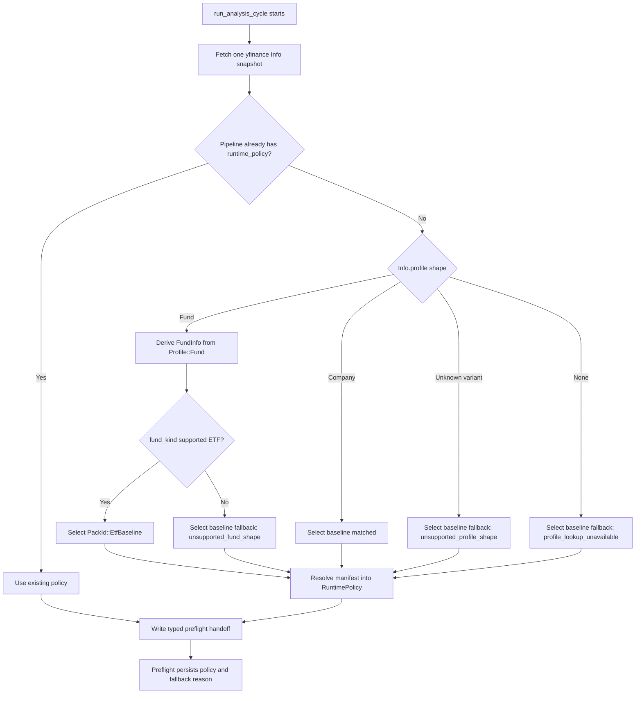
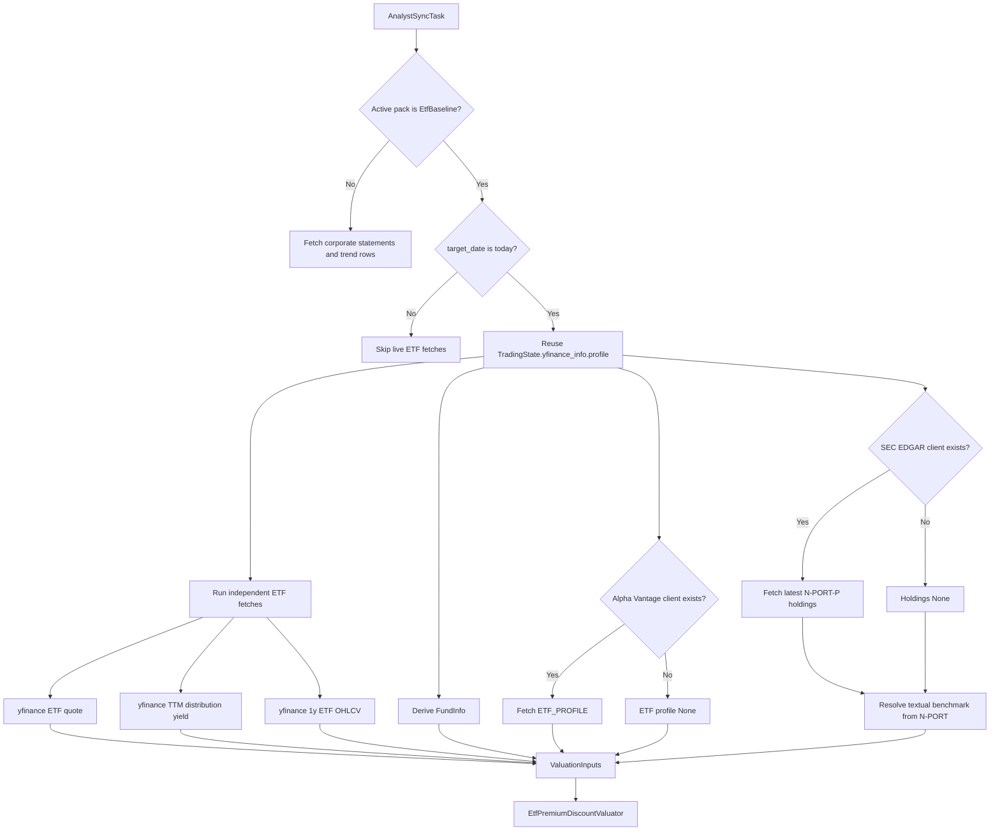
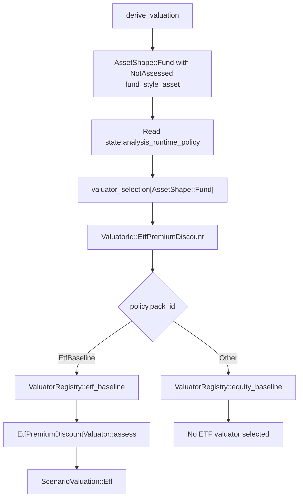
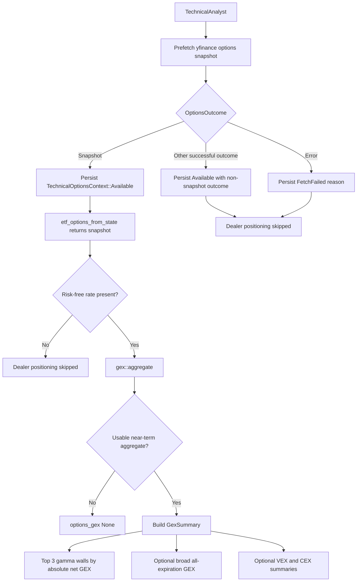
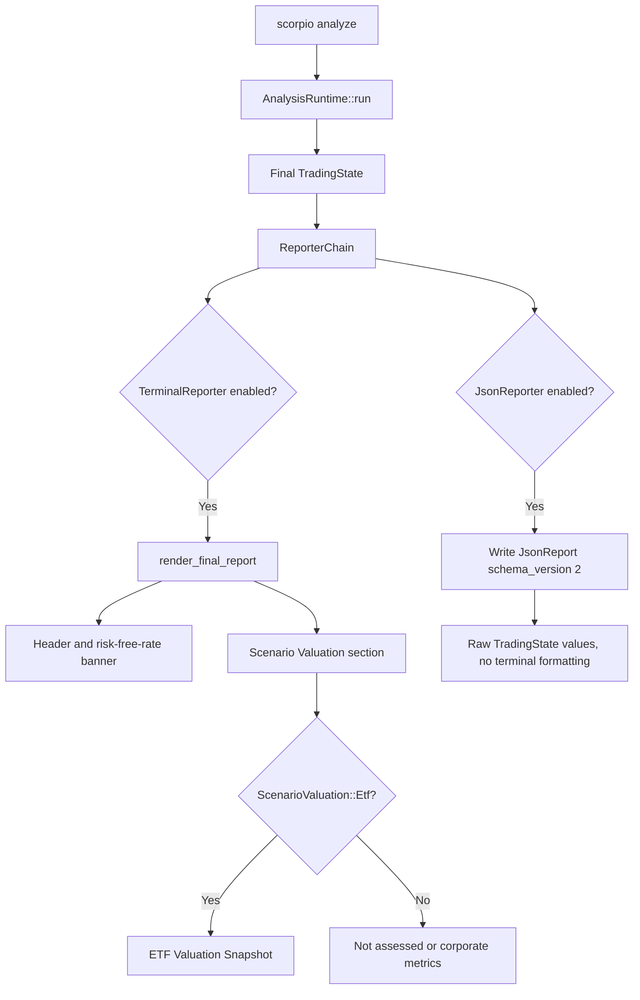

# ETF Analysis Pack

This document explains how the ETF baseline analysis pack works as implemented in Rust source code. It intentionally does not rely on older architecture notes. Every behavior below is derived from the current Rust modules under `crates/`.

## Source Of Truth

The ETF pack is implemented across these Rust source areas:

- `crates/scorpio-core/src/analysis_packs/etf/baseline.rs` defines the ETF pack manifest, prompt-bundle composition, valuation selection, enrichment intent, and auditor enablement.
- `crates/scorpio-core/src/workflow/pack_classifier.rs` decides when a symbol routes to the ETF pack.
- `crates/scorpio-core/src/workflow/pipeline/runtime.rs` fetches the shared yfinance info snapshot, classifies the active runtime pack, hydrates enrichment, and hands the selected policy to preflight.
- `crates/scorpio-core/src/workflow/tasks/preflight.rs` writes the resolved runtime policy into `TradingState`, builds routing flags, validates pack completeness, and fetches ETF risk-free rate.
- `crates/scorpio-core/src/workflow/builder.rs` builds the graph: preflight, analyst fan-out, analyst sync, debate, trader, risk, fund manager, auditor.
- `crates/scorpio-core/src/workflow/tasks/analyst.rs` merges analyst outputs, fetches ETF valuation inputs, runs ETF valuation, attaches distribution yield, and strips transient options data before persistence.
- `crates/scorpio-core/src/valuation/etf/premium_discount.rs` computes the ETF valuation object.
- `crates/scorpio-core/src/valuation/etf/category_norms.rs` defines premium-band thresholds.
- `crates/scorpio-core/src/indicators/gex.rs` computes option-derived GEX, VEX, and CEX.
- `crates/scorpio-core/src/state/derived.rs` defines the persisted ETF valuation data model.
- `crates/scorpio-core/src/data/yfinance/etf.rs`, `crates/scorpio-core/src/data/yfinance/options.rs`, `crates/scorpio-core/src/data/alpha_vantage.rs`, and `crates/scorpio-core/src/data/sec_edgar/` provide ETF-specific data fetch and parsing.
- `crates/scorpio-core/src/agents/shared/valuation_prompt.rs` turns deterministic ETF valuation into prompt context for later LLM agents.
- `crates/scorpio-reporters/src/terminal/etf.rs`, `crates/scorpio-reporters/src/terminal/valuation.rs`, `crates/scorpio-reporters/src/terminal/final_report.rs`, and `crates/scorpio-reporters/src/json.rs` render final report output.

## What The Pack Is

The ETF baseline pack is a runtime-selected analysis pack for supported ETF-like fund symbols. It changes the run in five major ways:

- It changes the prompt bundle used by the four analyst roles, trader, risk roles, fund manager, and auditor.
- It keeps the same four analyst lanes as the baseline equity pack: fundamentals, sentiment, news, and technical.
- It disables transcript and consensus enrichment, enables event-news enrichment, and opts out of Reddit sidecar sentiment.
- It replaces corporate-equity valuation with `EtfPremiumDiscountValuator` for `AssetShape::Fund`.
- It enables the advisory auditor stage.

The pack manifest in `analysis_packs/etf/baseline.rs` sets:

- `id = PackId::EtfBaseline`.
- `name = "ETF Baseline"`.
- `required_inputs = ["fundamentals", "sentiment", "news", "technical"]`.
- `enrichment_intent.transcripts = false`.
- `enrichment_intent.consensus_estimates = false`.
- `enrichment_intent.event_news = true`.
- `strategy_focus = Balanced`.
- `report_strategy_label = "ETF Baseline"`.
- `default_valuation = ValuationAssessment::Etf`.
- `valuator_selection[AssetShape::Fund] = ValuatorId::EtfPremiumDiscount`.
- `auditor_enabled = true`.
- `reddit_subreddits = []`.

The pack's `analysis_emphasis` tells downstream prompts to anchor assessment on premium/discount band classification, weight composition and tracking equally, and flag leverage decay and authorized-participant arbitrage breakdown. Current Rust valuation code does not compute tracking error; benchmark metadata is display and prompt context only.

## How ETF Pack Activation Works

ETF pack activation is automatic. Users cannot force `etf_baseline` through the config string.

`PackId::EtfBaseline` exists and its canonical string is `"etf_baseline"`, but `PackId::from_str` accepts only `"baseline"`. That means `TradingPipeline::try_new` validates `config.analysis_pack` against user-selectable packs and rejects any direct `etf_baseline` config value.

Runtime ETF routing happens later inside `run_analysis_cycle`:

1. The cycle resets prior outputs and canonicalizes the symbol.
2. The pipeline fetches one shared yfinance `Info` snapshot with `pipeline.yfinance.get_info(&symbol)`.
3. If the pipeline already has a runtime policy, it uses that policy.
4. Otherwise, it extracts `profile` from the shared yfinance info snapshot.
5. If the profile is a fund, it derives `FundInfo` from that profile with `fund_info_from_profile`.
6. It calls `classify_runtime_pack(profile.as_ref(), fund_info.as_ref())`.
7. It resolves the selected `PackId` to a full `RuntimePolicy` through `resolve_runtime_policy_for_manifest(resolve_pack(pack_id))`.
8. It carries an optional routing fallback reason into preflight.



`classify_runtime_pack` applies a small pure decision table:

- `Profile::Fund(_)` plus supported `fund_kind` routes to `RuntimePackSelection::EtfBaseline`.
- `Profile::Fund(_)` without a supported ETF kind falls back to baseline with reason `unsupported_fund_shape`.
- `Profile::Company(_)` routes to baseline with no warning.
- An unrecognized profile variant falls back to baseline with reason `unsupported_profile_shape`.
- Missing profile falls back to baseline with reason `profile_lookup_unavailable`.

Supported ETF kind strings are defined in `data/yfinance/etf.rs` by `is_supported_etf_kind`:

- `etf`
- `exchange-traded fund`
- `exchangetradedfund`

The final report header maps fallback reasons into user-facing warnings. A matched ETF run has no fallback reason. A fund that cannot be verified as supported ETF remains on the baseline pack and gets a warning banner explaining why ETF-specific analysis was unavailable.

## Runtime Policy Handoff

The graph is built before runtime classification runs. The graph constructor receives the config-selected pack, which is normally baseline. Runtime classification can later select the ETF policy per symbol. To avoid rebuilding the graph mid-run, `run_analysis_cycle` writes a typed override into graph context using `handoff::put_into_context`.

`PreflightTask` then reads the handoff with `handoff::try_load_from_context`:

- If the handoff exists, preflight uses that runtime policy and fallback reason.
- If no handoff exists, preflight uses the constructor-provided runtime policy.
- If handoff JSON is corrupt, preflight fails loud instead of silently falling back.

Preflight persists the resolved policy into state:

- `state.analysis_pack_name = Some(runtime_policy.pack_id.to_string())`.
- `state.analysis_runtime_policy = Some(runtime_policy.clone())`.
- `state.etf_routing_fallback_reason = routing_fallback_reason.clone()`.

Preflight also writes graph context keys for the runtime route, fallback reason, required inputs, serialized runtime policy, and routing flags.

This works today because ETF and baseline use the same four required analyst inputs. The graph's analyst fan-out is built from the config pack's required inputs, while sync and prompt behavior read the runtime policy from `TradingState`. If the ETF pack ever diverges from baseline required inputs, the graph construction path must be revisited.

## Graph Flow

The graph built by `build_graph_from_pack` has this shape:

1. `PreflightTask`
2. Analyst fan-out
3. `AnalystSyncTask`
4. Debate stage, conditional
5. Trader
6. Risk stage, conditional
7. Fund manager
8. Auditor

```mermaid
flowchart LR
    Preflight["PreflightTask"] --> FanOut["Analyst fan-out"]
    FanOut --> Sync["AnalystSyncTask"]
    Sync --> DebateGate{"skip_debate?"}
    DebateGate -->|No| Bull["Bullish researcher"]
    Bull --> Bear["Bearish researcher"]
    Bear --> DebateMod["Debate moderator"]
    DebateMod --> DebateLoop{"round < max_debate_rounds?"}
    DebateLoop -->|Yes| Bull
    DebateLoop -->|No| Trader["Trader"]
    DebateGate -->|Yes| Trader
    Trader --> RiskGate{"skip_risk?"}
    RiskGate -->|No| Agg["Aggressive risk"]
    Agg --> Cons["Conservative risk"]
    Cons --> Neutral["Neutral risk"]
    Neutral --> RiskMod["Risk moderator"]
    RiskMod --> RiskLoop{"round < max_risk_rounds?"}
    RiskLoop -->|Yes| Agg
    RiskLoop -->|No| Fund["Fund manager"]
    RiskGate -->|Yes| Fund
    Fund --> Auditor["AuditorTask"]
    Auditor --> Done["Run complete"]
```



The analyst fan-out contains task instances for inputs that map through `analyst_role_for_input`:

- `fundamentals` maps to `FundamentalAnalystTask`.
- `sentiment` maps to `SentimentAnalystTask`.
- `news` maps to `NewsAnalystTask`.
- `technical` maps to `TechnicalAnalystTask`.

The ETF pack declares exactly those four inputs, so all four analyst tasks run.

Preflight builds a per-run topology from required inputs, max debate rounds, max risk rounds, and auditor enablement. It writes `RoutingFlags`:

- `skip_debate = !topology.debate_enabled`.
- `skip_risk = !topology.risk_enabled`.
- `skip_auditor = !topology.auditor_enabled`.

The graph uses `RoutingFlags` to decide whether to enter debate and risk stages. Debate and risk loop-back edges still use round counters.

For the ETF pack:

- Debate runs if configured max debate rounds is greater than zero.
- Risk runs if configured max risk rounds is greater than zero.
- Auditor runs because the ETF manifest sets `auditor_enabled = true`.

## Preflight Responsibilities

Preflight does the following ETF-relevant work:

- Persists the resolved ETF runtime policy to state.
- Persists the ETF routing fallback reason, if any.
- Fetches ETF risk-free rate for live ETF runs.
- Writes required inputs for coverage reporting.
- Builds routing flags from topology.
- Validates that all prompt slots required by the active topology are non-empty.
- Validates `analysis_emphasis` before it is injected into prompts.

Risk-free-rate fetching runs only when both are true:

- Active pack is `PackId::EtfBaseline`.
- `state.target_date` is the current market-local date.

The fetch order is:

1. FRED series `DGS3MO`.
2. yfinance symbol `^IRX` latest close.

Both providers return percent values, so preflight stores decimal fractions:

```text
stored_rate = provider_percent / 100.0
```

Examples:

- FRED `4.27` becomes `0.0427`.
- yfinance `^IRX` `4.33` becomes `0.0433`.

State fields:

- `state.etf_risk_free_rate = Some(decimal_rate)`.
- `state.etf_risk_free_rate_source = Some(EtfRiskFreeRateSource::FredDgs3Mo)` for FRED.
- `state.etf_risk_free_rate_source = Some(EtfRiskFreeRateSource::YFinanceIrx)` for yfinance fallback.

If both fail, preflight logs a warning and sets both fields to `None`. The run continues. Dealer-positioning valuation later degrades to unavailable.

## Enrichment Behavior

Runtime enrichment is pack-policy driven.

For ETF runs:

- Event-news enrichment runs because `event_news = true`.
- Consensus enrichment is disabled because `consensus_estimates = false`.
- Transcript enrichment is disabled because `transcripts = false`.
- Reddit sentiment sidecar receives an empty subreddit list because the ETF manifest opts out.

The shared yfinance `Info` snapshot is stored on `TradingState.yfinance_info`. The same snapshot is read by classification, ETF valuation, catalyst hydration, and consensus code paths. ETF runs disable consensus, but the field still serves classification and valuation.

## Prompt And Agent Behavior

ETF does not add new Rust task types for analysts. It changes what the existing agents are asked to do through the pack prompt bundle.

The ETF pack prompt bundle is assembled in Rust from embedded prompt strings. The manifest creates:

- Fully ETF-specific fundamental analyst prompt content.
- Fully ETF-specific sentiment analyst prompt content.
- Shared news analyst content plus ETF-specific deltas.
- Shared technical analyst content plus ETF-specific deltas.
- Shared auditor content plus ETF-specific deltas.
- Shared bullish researcher, bearish researcher, debate moderator, and risk moderator prompt content.
- ETF-specific trader, aggressive risk, conservative risk, neutral risk, and fund manager prompt content.

Prompt renderers substitute runtime values such as ticker, current date, and `analysis_emphasis`. Later prompt contexts also include deterministic valuation context, data quality, evidence, enrichment status, transcript context where applicable, and pack context.

Leverage warning behavior is runtime-dependent. Risk and auditor prompt rendering call `append_leverage_warning_if_needed`. If the ETF valuation has a `leverage_factor` whose absolute difference from `1.0` is greater than `1e-6`, a warning section is appended to the rendered prompt. The leverage value is formatted as an integer if it is within tolerance of a whole number; otherwise it is formatted with one decimal.

## Analyst Fan-Out And Sync

The four analyst tasks run independently in the fan-out. `AnalystSyncTask` then merges their typed outputs into `TradingState` only for analyst IDs declared by the active runtime policy.

For ETF runs, all four are active:

- Fundamental output is stored through `state.set_fundamental_metrics` and evidence is attributed to Finnhub fundamentals.
- Sentiment output is stored through `state.set_market_sentiment` and evidence sources come from prefetch sentiment providers.
- News output is stored through `state.set_macro_news`; sources include Finnhub company news, FRED macro indicators, and SEC EDGAR if catalyst enrichment contributed SEC events.
- Technical output is stored through `state.set_technical_indicators`; evidence is attributed to yfinance OHLCV and, when available, options context.

The sync task counts failures only among active analyst IDs. It aborts the pipeline when two or more active analysts fail, or when all active analysts fail. With four ETF analysts, one failed analyst is degraded but not fatal; two failed analysts abort.

After merging analysts, sync derives:

- `DataCoverageReport.required_inputs` from runtime policy required inputs.
- `DataCoverageReport.missing_inputs` from absent typed evidence fields.
- `ProvenanceSummary.providers_used` from evidence source providers.

Then sync fetches valuation inputs and derives deterministic valuation.

## ETF Valuation Input Fetching

`AnalystSyncTask::fetch_valuation_inputs` is the main ETF valuation data fetch path.

The returned internal `ValuationInputs` carrier has both corporate-equity fields and ETF-only fields:

- `profile`
- corporate rows: cashflow, balance, income, shares, trend
- `etf_quote`
- `etf_fund_info`
- `etf_holdings`
- `etf_profile`
- `etf_official_benchmark`
- `etf_ohlcv`
- `etf_distribution_yield_ttm_pct`

For ETF pack runs, corporate statement fan-out is skipped entirely:

```text
cashflow = None
balance = None
income = None
shares = None
trend = None
```

That avoids trying to value ETFs with corporate DCF and multiples.

For non-ETF pack runs, those corporate statement fetches are performed and ETF-specific fields remain empty.

ETF live-data fetching is today-only. If the target date is not current market-local date, the function returns without live ETF fetches. It still carries the shared yfinance profile, but ETF quote, holdings, Alpha Vantage profile, OHLCV, benchmark, and distribution yield remain `None`.

For live ETF runs, fetch behavior is:

1. Reuse `profile` from the shared yfinance `Info` snapshot.
2. Derive `etf_fund_info` from the profile with `fund_info_from_profile`.
3. Fetch yfinance ETF quote, yfinance trailing distribution yield, and one year of ETF OHLCV concurrently.
4. Fetch SEC N-PORT holdings if an EDGAR client exists.
5. Fetch Alpha Vantage ETF profile if an Alpha Vantage client exists.
6. Resolve official textual benchmark metadata from N-PORT stated benchmark.



Every ETF valuation fetch is timeout-bounded through `fetch_with_timeout`. A timeout logs a warning and returns `None`. The run continues.

### yfinance ETF Quote

`YFinanceClient::get_quote` builds `EtfQuote`.

Fields:

- `symbol`
- `regular_market_price`
- `previous_close`
- `nav`
- `bid`
- `ask`
- `day_volume`
- `currency`
- `as_of`

The quote path calls `Ticker::quote()` through the yfinance session. If that fails, it logs a warning and returns `None`. It then tries a best-effort Yahoo `quoteSummary` call to fill NAV, bid, and ask. If the summary fetch fails, quote still succeeds with those fields left as `None`.

`regular_market_price` is required. If it is missing, `get_quote` returns `None`.

### yfinance Fund Info

`fund_info_from_profile` accepts only `Profile::Fund`. It returns `None` for `Profile::Company` and unknown profile variants.

`FundInfo` contains:

- `symbol`
- `category`
- `fund_family`
- `expense_ratio`
- `total_assets`
- `leverage_factor`
- `fund_kind`
- `stated_benchmark`

Current yfinance profile coverage is limited. From `Profile::Fund`, the code fills:

- `fund_family` from fund profile family.
- `fund_kind` from fund profile kind, lowercased.
- `leverage_factor` from fund-name heuristics.

It leaves these as `None`:

- `category`
- `expense_ratio`
- `total_assets`
- `stated_benchmark`

Leverage heuristic:

- Names/categories containing `3x` or `ultra pro` return `Some(3.0)`.
- Names/categories containing `2x` or `ultra` return `Some(2.0)`.
- Names/categories containing `inverse`, `-1x`, or `short` return `Some(-1.0)`.
- Otherwise returns `Some(1.0)`.

### yfinance Distribution Yield

`YFinanceClient::get_distribution_yield_ttm` computes trailing-twelve-month distribution yield:

```text
distribution_yield_ttm = sum(distributions in last 365 days) / current_regular_market_price
```

It returns `None` when:

- Dividend/distribution history fetch fails.
- No distributions are returned.
- The 365-day sum is non-positive.
- Quote fetch fails.
- Current price is non-positive.

The result is a decimal ratio, not a rendered percent. A 3.5% yield is stored as `0.035`.

### yfinance ETF OHLCV

`fetch_ohlcv_1y` requests daily OHLCV for the last 365 days. It wraps `get_ohlcv` errors into `None` so date-range and transport errors do not fail the run.

The current ETF valuator receives `etf_ohlcv` in its input carrier, but `EtfPremiumDiscountValuator` does not use it. There is no tracking-error computation in current code.

### SEC N-PORT Holdings

`SecEdgarClient::fetch_latest_nport_p_for_ticker(ticker, 180)` is the ETF holdings fetch.

Lookup order:

1. Try `company_tickers.json` through `lookup_cik`, then fetch latest N-PORT-P at the CIK level.
2. Try `company_tickers_mf.json` through `lookup_cik_mf`, then fetch latest N-PORT-P for the fund series.
3. Return `None` if both resolution paths miss or downstream fetch fails.

The series path exists because multi-series ETF trusts can share one owner CIK. The series ID isolates the ETF's filing from sibling funds in the same trust.

SEC fetch behavior is fail-soft:

- Circuit breaker open returns `None`.
- Transport errors return `None`.
- Non-200 responses return `None`.
- Non-SEC or non-HTTPS Archives document URLs are rejected and return `None`.
- XML parse failures return `None`.
- No N-PORT-P filing inside the window returns `None`.

The N-PORT parser extracts:

- Holdings from `invstOrSec` entries.
- `report_date` from `repPdDate`, falling back to `repPdEnd`.
- `filing_date` from the filing metadata passed into the parser.
- Stated benchmark from `benchmarkName` or `indxName`.
- Sector breakdown by aggregating `issuerType` or `industryGroup` weights.

If N-PORT holdings omit `pctVal` but include `value_usd`, the parser recomputes missing weights:

```text
weight_pct = value_usd / total_value_usd * 100.0
```

The parser rejects empty benchmark placeholders: empty string, `n/a`, `na`, `none`, and `null`.

### Alpha Vantage ETF Profile

If an Alpha Vantage client is configured, the ETF fetch path calls `fetch_etf_profile(symbol)`.

The raw endpoint is `function=ETF_PROFILE`. Parsed fields include:

- Holdings.
- Sectors.
- AUM.
- Net expense ratio.
- Portfolio turnover.
- Dividend yield.
- Inception date.
- Leveraged flag.

`EtfProfileData` stores:

- `holdings: Vec<HoldingWeight>`
- `sectors: Vec<SectorWeight>`
- `aum_usd: Option<f64>`
- `expense_ratio_pct: Option<f64>`
- `portfolio_turnover_pct: Option<f64>`
- `distribution_yield_pct: Option<f64>`
- `inception_date: Option<NaiveDate>`
- `leverage_factor: Option<f64>`

Provider weights arrive as decimal fractions. The parser stores them as percentages:

```text
stored_weight_pct = provider_weight_decimal * 100.0
```

Examples:

- Provider `0.084` becomes stored `8.4`.
- Provider `0.1525` becomes stored `15.25`.

Ratio fields such as expense ratio, turnover, and dividend yield remain decimal ratios. A 9 bps expense ratio is stored as `0.0009`, not `0.09`.

The Alpha Vantage profile fetch outcome taxonomy is:

- `Found(profile)`
- `Throttled`
- `Unavailable`
- `NotAvailable`

ETF valuation uses only `Found(profile)`. All other outcomes degrade to `None`.

Errors and degradation:

- JSON deserialization failure is a schema violation.
- Provider `Error Message` is a schema violation.
- Provider `Note` or `Information` is classified as throttled, unavailable, or not available.
- HTTP 429 returns throttled.
- HTTP 401/403 escalates auth failure once and returns unavailable.
- HTTP 5xx returns unavailable.
- Timeout/connect errors return unavailable.
- Other HTTP/request/body errors return config errors, but `AnalystSyncTask` catches and logs them, then degrades profile to `None`.

### Official Benchmark Metadata

The current live path resolves official benchmark name only from N-PORT stated benchmark. The helper `resolve_official_benchmark_name` can prefer SEC risk/return metadata if supplied, but live ETF valuation passes `None` for that source.

There is deliberately no static ETF-to-market-symbol fallback.

Current benchmark behavior:

- N-PORT stated benchmark becomes `official_benchmark_name`.
- Source is `BenchmarkSource::SecNport`.
- Metadata age is `None` for N-PORT fallback.
- Benchmark metadata is used for display and prompt context only.
- No benchmark OHLCV is fetched for tracking-error computation.
- No tracking-error number is currently generated.

`SecEdgarClient::fetch_risk_return_benchmark_for_ticker` exists but is not wired into live valuation.

## Technical Options Data

ETF dealer-positioning valuation consumes the options snapshot that the technical analyst prefetches.

`TechnicalAnalyst::run` does this before LLM inference:

1. Creates `YFinanceOptionsProvider`.
2. Calls `fetch_snapshot(&typed_symbol, &target_date)`.
3. Converts the result with `prepare_options_runtime`.
4. Stores the options outcome in `TechnicalData.options_context`.
5. Adds a prefetched options tool to the LLM only when prefetch succeeded.

`prepare_options_runtime` stores one of two state shapes:

- `TechnicalOptionsContext::Available { outcome }` for any successful provider outcome, including non-snapshot outcomes.
- `TechnicalOptionsContext::FetchFailed { reason }` when provider call returns `Err`.

ETF valuation later extracts an options snapshot through `etf_options_from_state`. It returns `Some(snapshot)` only for:

```text
TechnicalOptionsContext::Available { outcome: OptionsOutcome::Snapshot(snapshot) }
```

Every other outcome logs a warning and returns `None`, so dealer positioning is skipped.

Options outcomes are:

- `Snapshot(OptionsSnapshot)`.
- `NoListedInstrument`.
- `SparseChain`.
- `HistoricalRun`.
- `MissingSpot`.

The options provider is today-only:

- Historical target dates return `HistoricalRun` without network option-chain fetch.
- Missing spot price returns `MissingSpot`.
- Empty expirations return `NoListedInstrument`.
- Sparse near-the-money front-month chain returns `SparseChain`.

For live snapshot assembly:

1. Fetch spot from yfinance latest close.
2. Fetch expiration dates.
3. Sort expirations ascending.
4. Fetch front-month option chain.
5. Ensure front-month can form a near-the-money slice.
6. Fetch other expirations concurrently with bounded concurrency.
7. Swallow individual non-front-month chain failures.
8. Sort fetched chains by expiration.
9. Assemble `OptionsSnapshot`.

`OptionsSnapshot` contains:

- `spot_price`
- `atm_iv`
- `iv_term_structure`
- `put_call_volume_ratio`
- `put_call_oi_ratio`
- `max_pain_strike`
- `near_term_expiration`
- `near_term_strikes`
- transient `all_expirations`

The near-the-money slice starts at plus/minus 5% around spot and can expand up to plus/minus 20%. It requires at least two strikes below spot and two strikes above spot. If that cannot be achieved, the chain is sparse.

ATM IV is computed from the call and put whose strikes are closest to spot:

- If both IVs exist, average them.
- If one exists, use it.
- If neither exists, use `0.0`.

Max pain considers all unique strikes in the front-month chain. For each candidate settlement strike `S`:

```text
call_pain = max(option_strike - S, 0.0) * call_open_interest
put_pain = max(S - option_strike, 0.0) * put_open_interest
total_pain = sum(call_pain + put_pain)
```

The max-pain strike is the candidate with the smallest total pain. If no open interest exists, the fallback is the strike closest to spot.

Put/call ratios across all fetched chains:

```text
put_call_volume_ratio = total_put_volume / total_call_volume
put_call_oi_ratio = total_put_open_interest / total_call_open_interest
```

If the denominator is zero, the stored ratio is `0.0`.

`all_expirations` is derive-don't-persist. It exists during live valuation so broad GEX can be computed across expirations. `AnalystSyncTask::strip_transient_all_expirations` clears it before state serialization for ETF runs. Persisted state keeps only the summarized `EtfValuation.options_gex.broad` output, not the full option-chain rows.

## Valuation Selection

ETF deterministic valuation begins in `derive_runtime_valuation`.

The function first calls `derive_valuation` to get provisional asset shape. For `Profile::Fund`, baseline derivation returns:

```text
asset_shape = AssetShape::Fund
scenario = NotAssessed { reason: "fund_style_asset" }
```

Then runtime policy can override the valuation strategy. For ETF policy:

1. It looks up `policy.valuator_selection[provisional.asset_shape]`.
2. For `AssetShape::Fund`, it finds `ValuatorId::EtfPremiumDiscount`.
3. Because `policy.pack_id == PackId::EtfBaseline`, it uses `ValuatorRegistry::etf_baseline()`.
4. The ETF registry contains `EquityDefaultValuator` and `EtfPremiumDiscountValuator`.
5. It calls `EtfPremiumDiscountValuator::assess` with all ETF inputs.



If no valuator is selected:

- `AssetShape::Fund` and `AssetShape::Unknown` keep the provisional `NotAssessed` result.
- Other shapes become `NotAssessed { reason: "no_valuator_selected" }`.

If the selected valuator is missing from the registry, result is `NotAssessed { reason: "no_valuator_selected" }`.

## ETF Valuation Output Model

ETF valuation is stored as:

```text
TradingState.equity.derived_valuation = Some(DerivedValuation {
  asset_shape: AssetShape::Fund,
  scenario: ScenarioValuation::Etf(EtfValuation { ... })
})
```

`EtfValuation` contains:

- `premium: PremiumSnapshot`
- `composition: Option<EtfComposition>`
- `official_benchmark_name: Option<String>`
- `official_benchmark_source: Option<BenchmarkSource>`
- `official_benchmark_metadata_age_days: Option<u32>`
- `options_gex: Option<GexSummary>`
- `category: Option<String>`
- `leverage_factor: Option<f64>`
- `flags: EtfDataAvailability`

`PremiumSnapshot` contains:

- `nav: Option<f64>`
- `market_price: f64`
- `bid: Option<f64>`
- `ask: Option<f64>`
- `premium_pct: Option<f64>`
- `category_band: PremiumBand`
- `bid_ask_spread_pct: Option<f64>`
- `as_of: DateTime<Utc>`

`EtfComposition` contains:

- `source: EtfCompositionSource`
- `top_holdings: Vec<HoldingWeight>`
- `top10_concentration_pct: f64`
- `sector_weights: Vec<SectorWeight>`
- `expense_ratio_pct: Option<f64>`
- `aum_usd: Option<f64>`
- `fund_family: Option<String>`
- `distribution_yield_ttm_pct: Option<f64>`
- `holdings_filing_date: NaiveDate`
- `holdings_report_date: Option<NaiveDate>`
- `holdings_age_days: u32`
- `portfolio_turnover_pct: Option<f64>`
- `inception_date: Option<NaiveDate>`

`EtfDataAvailability` flags default to false, with `holdings_age_band = Unknown`:

- `nav_available`
- `bid_ask_available`
- `holdings_present`
- `holdings_age_band`
- `benchmark_resolved`
- `options_chain_present`
- `expense_ratio_available`

Current valuation code never sets `benchmark_resolved = true`; terminal trust signals use `official_benchmark_name.is_some()` instead.

## Premium And Discount Computation

`EtfPremiumDiscountValuator::assess` first validates shape and quote:

- If `shape` is not `AssetShape::Fund`, result is `NotAssessed { reason: "etf_valuator_wrong_shape" }`.
- If quote is missing or market price is non-positive, result is `NotAssessed { reason: "etf_quote_unavailable" }`.

Premium snapshot requires `quote.regular_market_price > 0.0`.

Availability flags set during premium snapshot:

```text
nav_available = quote.nav.is_some()
bid_ask_available = quote.bid.is_some() && quote.ask.is_some()
expense_ratio_available = fund_info.expense_ratio.is_some()
```

Premium percent formula:

```text
premium_pct = (market_price - nav) / nav * 100.0
```

It is computed only when NAV exists and is positive. Missing or non-positive NAV produces `premium_pct = None` and `category_band = Unknown`.

Bid/ask spread formula:

```text
bid_ask_spread_pct = (ask - bid) / ask * 100.0
```

It is computed only when bid and ask exist and ask is positive.

Premium-band classification uses category-specific thresholds. It uses absolute premium magnitude, so discounts and premiums classify symmetrically.

Default thresholds:

- Elevated at `0.10%`.
- Extreme at `0.50%`.

Large blend/growth/value thresholds:

- Elevated at `0.05%`.
- Extreme at `0.20%`.

Small blend/growth/value and mid-cap blend thresholds:

- Elevated at `0.15%`.
- Extreme at `0.50%`.

Diversified emerging markets and foreign large blend thresholds:

- Elevated at `0.25%`.
- Extreme at `1.00%`.

Long government, intermediate-term bond, and high yield bond thresholds:

- Elevated at `0.20%`.
- Extreme at `1.00%`.

Classification:

```text
if premium_pct is None:
    Unknown
else if abs(premium_pct) >= extreme_pct:
    Extreme
else if abs(premium_pct) >= elevated_pct:
    Elevated
else:
    Normal
```

Current yfinance-derived `FundInfo` leaves category as `None`, so the default threshold usually applies unless another source populates category in the future.

## Composition Computation

Composition source priority is:

1. Alpha Vantage ETF profile, if present and it has non-empty holdings.
2. SEC N-PORT holdings, if present and not too stale.

If Alpha Vantage returns a sectors-only profile with no holdings, it does not win; N-PORT can still provide composition.

If final composition has an expense ratio, the valuator sets `flags.expense_ratio_available = true`.

### Alpha Vantage Composition

Alpha Vantage composition requires non-empty holdings.

When accepted, it sets:

```text
flags.holdings_present = true
flags.holdings_age_band = Unknown
```

It sorts holdings descending by `weight_pct`, truncates to top 10, and computes:

```text
top10_concentration_pct = sum(top_10_holding.weight_pct)
```

Alpha Vantage composition fields:

- `source = AlphaVantageEtfProfile`
- `top_holdings = sorted top 10`
- `top10_concentration_pct = sum(top 10 weights)`
- `sector_weights = profile.sectors`
- `expense_ratio_pct = profile.expense_ratio_pct.or(fund_info.expense_ratio)`
- `aum_usd = profile.aum_usd.or(fund_info.total_assets)`
- `fund_family = fund_info.fund_family`
- `distribution_yield_ttm_pct = profile.distribution_yield_pct`
- `holdings_filing_date = today`
- `holdings_report_date = None`
- `holdings_age_days = 0`
- `portfolio_turnover_pct = profile.portfolio_turnover_pct`
- `inception_date = profile.inception_date`

The provider snapshot has no dated filing/report date, so the holdings age band remains `Unknown` even though `holdings_age_days` is set to `0` for display structure.

### SEC N-PORT Composition

N-PORT composition sets:

```text
flags.holdings_present = !nport.holdings.is_empty()
```

Age anchor is:

```text
age_anchor = nport.report_date.unwrap_or(nport.filing_date)
```

Age days:

```text
age_days = max(today - age_anchor, 0)
```

Age band:

- `0..=45` days: `Fresh`.
- `46..=90` days: `Aging`.
- `>90` days: `Stale`.

If `age_days > 180`, composition returns `None`. The flags may still indicate holdings were present and stale because flags are set before the stale cutoff return.

For usable N-PORT holdings:

- Holdings are sorted descending by `weight_pct`.
- Top 10 are stored.
- Top-10 concentration is the sum of top 10 weights.
- Sector weights are copied from N-PORT sector breakdown.

N-PORT composition fields:

- `source = SecNport`
- `top_holdings = sorted top 10`
- `top10_concentration_pct = sum(top 10 weights)`
- `sector_weights = nport.sector_breakdown`
- `expense_ratio_pct = fund_info.expense_ratio`
- `aum_usd = fund_info.total_assets`
- `fund_family = fund_info.fund_family`
- `distribution_yield_ttm_pct = None` initially
- `holdings_filing_date = nport.filing_date`
- `holdings_report_date = nport.report_date`
- `holdings_age_days = age_days`
- `portfolio_turnover_pct = None`
- `inception_date = None`

After valuation returns, `AnalystSyncTask` attaches yfinance TTM distribution yield to the composition when both exist:

```text
if yfinance_distribution_yield exists and ETF valuation has composition:
    comp.distribution_yield_ttm_pct = Some(yfinance_distribution_yield)
```

This means yfinance post-processing can overwrite or fill the composition yield after the valuator has produced the ETF scenario.

## Benchmark And Tracking

Current code surfaces official textual benchmark metadata only.

If `inputs.etf_official_benchmark` exists, the valuator copies:

- `official_benchmark_name`
- `official_benchmark_source`
- `official_benchmark_metadata_age_days`

No tracking-error computation is performed. `etf_ohlcv` is fetched and passed into `ValuationInputs`, but `EtfPremiumDiscountValuator` does not read it.

Practical report effect:

- The terminal can show `Official benchmark <name> (<source>)`.
- JSON includes benchmark name/source/metadata age fields.
- No tracking error, benchmark return, benchmark volatility, or ETF-vs-benchmark number is generated.

## Leverage Factor

The valuator stores leverage factor with this precedence:

```text
leverage_factor = etf_fund_info.leverage_factor.or(etf_profile.leverage_factor)
```

yfinance-derived `FundInfo` usually yields `Some(1.0)` for ordinary funds and heuristic values for obvious leveraged/inverse names. Alpha Vantage only maps `leveraged = "NO"` to `Some(1.0)`; it does not infer true leveraged multiplier from `"YES"`.

Terminal report renders leverage only when a factor exists and differs from `1.0`.

Risk and auditor prompts append leverage warnings when the factor differs from `1.0` by more than `1e-6`.

## Dealer Positioning, GEX, VEX, And CEX

Dealer positioning is optional. The valuator computes it only when both are available:

- A live `OptionsSnapshot` from technical analyst state.
- A risk-free rate from preflight.

Before computation:

```text
flags.options_chain_present = inputs.etf_options.is_some()
q = positive etf_distribution_yield_ttm, else 0.0
```

If options exist but risk-free rate is missing, the valuator logs a warning and stores `options_gex = None`. It does not use a hardcoded risk-free fallback.

`compute_gex_summary` calls `gex::aggregate` with:

- Spot price from options snapshot.
- Risk-free rate `r` from preflight.
- Distribution yield `q` from yfinance TTM yield, or `0.0`.
- `as_of` parsed from `state.target_date`, falling back to current UTC date on parse failure.
- Near-term expiration and strikes from the options snapshot.
- Additional expirations from transient `all_expirations`.
- ATM IV fallback from options snapshot.



If near-term aggregate is absent, `compute_gex_summary` returns `None`. Broad GEX is not surfaced without usable near-term GEX.

### BSM Inputs

The GEX implementation uses Black-Scholes-Merton inputs:

- `spot`
- `strike`
- `iv`
- `r`
- `q`
- `t_years`

Time to expiration:

```text
t_years = max(expiration_date - as_of_date, 0 days) / 365.0
```

Degenerate inputs return zero Greeks:

- `iv <= 0.0`
- `t_years <= 0.0`
- `spot <= 0.0`
- `strike <= 0.0`

### d1 And d2

```text
d1 = (ln(S / K) + (r - q + 0.5 * iv^2) * t) / (iv * sqrt(t))
d2 = d1 - iv * sqrt(t)
```

### Gamma

```text
gamma = exp(-q * t) * phi(d1) / (S * iv * sqrt(t))
```

### Vanna

```text
vanna = -exp(-q * t) * phi(d1) * d2 / iv
```

### Charm

The implementation has separate call and put charm functions. Both use `d1`, `d2`, standard normal PDF/CDF, `r`, `q`, `iv`, and `t`. The output is per year and is later scaled to a per-day CEX number.

### Per-Strike Exposure

For each near-term strike row:

- Missing or non-positive call IV falls back to ATM IV.
- Missing or non-positive put IV falls back to ATM IV.
- Each fallback increments `iv_fallback_count`.
- If both resulting IVs are non-positive, the strike is skipped.
- Missing call or put open interest is treated as zero.

Contract multiplier is `100.0`.

GEX scaling:

```text
spot_sq_pct = spot * spot * 0.01
net_gex = (gamma_call * call_oi - gamma_put * put_oi) * 100.0 * spot_sq_pct
gross_gex = (gamma_call * call_oi + gamma_put * put_oi) * 100.0 * spot_sq_pct
```

VEX scaling:

```text
net_vex = (vanna_call * call_oi - vanna_put * put_oi) * 100.0 * spot
gross_vex = (abs(vanna_call * call_oi) + abs(vanna_put * put_oi)) * 100.0 * spot
```

CEX scaling:

```text
net_cex = (charm_call * call_oi - charm_put * put_oi) * 100.0 * spot / 365.0
gross_cex = (abs(charm_call * call_oi) + abs(charm_put * put_oi)) * 100.0 * spot / 365.0
```

Near-term aggregate sums these values across usable near-term strikes.

Broad aggregate:

- Starts with near-term aggregate if present.
- Adds each valid extra expiration from transient `all_expirations`.
- Tracks `expirations_used`.
- Tracks `expirations_total_considered`.

Gamma walls:

- Map each near-term per-strike net GEX into `StrikeGex`.
- Sort descending by absolute net GEX.
- Truncate to top 3.

Call/put OI ratio in the ETF report is converted from the options snapshot's put/call OI ratio:

```text
call_put_oi_ratio = 1.0 / put_call_oi_ratio
```

If `put_call_oi_ratio <= 0.0`, the code logs a warning and stores `call_put_oi_ratio = 0.0`.

If more than half of used strikes required ATM-IV fallback, the code logs a warning that gamma skew may be understated. The warning is not persisted as a report field.

`GexSummary` stores:

- Near-term net GEX USD per 1% move.
- Near-term gross GEX USD per 1% move.
- Call/put OI ratio.
- Max-pain strike.
- Near-term expiration date.
- Top gamma-wall strikes.
- Optional broad GEX.
- Optional VEX summary.
- Optional CEX summary.

## Data Quality And Absence Semantics

The ETF path is intentionally fail-soft for data availability. Missing provider inputs usually remove a subsection or set an availability flag rather than aborting the run.

Fatal or not-assessed cases:

- Wrong asset shape for ETF valuator produces `NotAssessed("etf_valuator_wrong_shape")`.
- Missing ETF quote or non-positive market price produces `NotAssessed("etf_quote_unavailable")`.
- Two or more active analyst failures abort analyst sync.
- All active analyst failures abort analyst sync.

Degraded-but-continue cases:

- Missing NAV produces no premium percent and `PremiumBand::Unknown`.
- Missing bid/ask produces no spread.
- Missing Alpha Vantage profile falls back to N-PORT.
- Alpha Vantage profile with empty holdings falls back to N-PORT.
- Missing N-PORT leaves composition absent.
- N-PORT older than 180 days leaves composition absent.
- Missing distribution yield makes GEX use `q = 0.0`.
- Missing options snapshot omits dealer positioning.
- Missing risk-free rate omits dealer positioning.
- Missing official benchmark omits benchmark line.
- Missing benchmark does not otherwise affect valuation.
- Missing ETF OHLCV has no current valuation effect.

## Deterministic Valuation Prompt Context

After analyst sync computes `DerivedValuation`, downstream agents receive a prompt-safe valuation context from `build_valuation_context`.

For `ScenarioValuation::Etf`, the prompt context includes:

- Premium band and premium percent if available.
- Category if available.
- Composition source and top-10 concentration if composition exists.
- Up to five top holdings if available.
- Up to three sector weights in stored order if available.
- Expense ratio if available, rendered as `expense_ratio * 100.0` percent.
- A composition-unavailable warning if composition is absent.
- Official benchmark name and source if available.
- Options GEX summary if available.
- An explicit instruction not to fabricate dealer-positioning signals if options GEX is unavailable.

For ETF GEX prompt context:

- Near-term net GEX is formatted as signed USD.
- Gross GEX is formatted as magnitude USD.
- Expiration date is included.
- Call/put OI and max pain are included.
- Gamma wall strikes are included when present.
- Broad GEX is included when present.

This context is consumed by trader and fund manager prompts, and it can also flow into shared analyst/debate/risk context builders through the normal state summarization paths.

## Final Terminal Report Generation

The terminal reporter is a pure rendering function over `TradingState`. The CLI calls `AnalysisRuntime`, receives final state, builds a `ReporterChain`, and runs terminal and JSON reporters concurrently when requested.



The terminal final report section order is:

1. Header.
2. ETF risk-free-rate banner.
3. Executive Summary.
4. Trader Proposal.
5. Analyst Evidence Snapshot.
6. Enrichment Data, when present.
7. Scenario Valuation.
8. Data Quality and Coverage.
9. Evidence Provenance.
10. Research Debate Summary.
11. Risk Review.
12. Deterministic Safety Check.
13. Auditor Review, when applicable.
14. Token Usage Summary.
15. Disclaimer.

The Scenario Valuation section dispatches by `DerivedValuation.scenario`:

- No derived valuation: `Not computed for this run.`
- `NotAssessed`: shows asset shape, not-assessed message, and reason.
- `CorporateEquity`: shows corporate valuation metrics.
- `Etf`: calls ETF panel renderer.

### Header

The header prints:

```text
Final Report: <symbol>
As of: <target_date> | Execution ID: <uuid> | Strategy: <strategy_label>
```

Strategy label comes from:

1. `state.analysis_runtime_policy.report_strategy_label`.
2. Resolved policy from `state.analysis_pack_name`.
3. Raw `state.analysis_pack_name`.
4. `default`.

Control characters are stripped from strategy label.

If `state.etf_routing_fallback_reason` exists, the header prints a warning mapped from the reason.

### Risk-Free-Rate Banner

The risk-free-rate banner prints after the header and before Executive Summary.

If rate and source are FRED:

```text
Risk-free rate    FRED DGS3MO (<rate * 100.0 with 2 decimals>%)
```

If rate and source are yfinance:

```text
Risk-free rate    yfinance ^IRX (<rate * 100.0 with 2 decimals>%)
```

If both rate and source are `None` and the derived valuation scenario is ETF:

```text
Risk-free rate unavailable - dealer positioning unavailable
```

The degraded warning is gated on actual ETF scenario so non-ETF reports do not show it by default.

### ETF Valuation Snapshot

The ETF panel renders in this order:

1. Premium block.
2. Composition block or holdings-unavailable warning.
3. Cost block.
4. Sector summary block.
5. Official benchmark block.
6. Trust signals.
7. Dealer positioning block or skipped warning.

Premium block prints:

- `Analysis Pack    ETF Baseline`
- `Symbol           <symbol>`
- `Category         <category>` when available.
- `Market Price     $<market_price with 2 decimals>`
- `NAV              $<nav with 2 decimals>   (as of HH:MM UTC)` when NAV exists.
- `NAV              unavailable` when NAV is absent.
- `Premium          <signed premium_pct with 2 decimals>%   Band <marker> <band>` when premium exists.
- `Premium          unavailable   Band Unknown` and a warning when premium is absent.
- `Bid/Ask          $<bid>/<ask>   Spread <spread with 3 decimals>%` when bid, ask, and spread exist.
- `Bid/Ask          unavailable   Spread unavailable` and a warning when bid/ask are absent.
- `Leverage         <signed factor with 1 decimal>x` only when leverage exists and differs from `1.0`.

Composition block prints when `etf.composition` exists:

- A composition header.
- Composition source label: `Alpha Vantage ETF_PROFILE` or `SEC N-PORT`.
- For Alpha Vantage: `Provider snapshot  Alpha Vantage latest available profile`.
- For SEC N-PORT: optional report date and filing date with age in days.
- `Top-10 weight    <top10_concentration_pct with 1 decimal>%`.
- Up to five holdings, each as `#<rank> <ticker-or-name> <weight with 1 decimal>%`.
- A holdings staleness warning if `holdings_age_days > 90`.

If composition is absent, the panel prints:

```text
Holdings unavailable - N-PORT-P data missing or too stale
```

Cost block renders only when composition exists and at least one of expense ratio, distribution yield, or AUM exists:

- Expense ratio renders as `expense_ratio_pct * 100.0` with 2 decimals and `%`.
- Distribution TTM renders as `distribution_yield_ttm_pct * 100.0` with 2 decimals and `%`.
- AUM renders as `aum_usd / 1e9` with 2 decimals and `B`.

Sector summary block renders only when composition exists and sector weights are non-empty. It sorts sectors descending by weight, takes the top two, and prints:

```text
Sector tilt      <sector>: <weight with 1 decimal>%  |  <sector>: <weight with 1 decimal>%
```

Official benchmark block renders only when name exists:

```text
Official benchmark <name> (<source label>)
```

Source labels:

- `SEC DERA Risk/Return Summary`
- `SEC N-PORT`
- `unknown source`

Trust signals always render for ETF scenario:

```text
NAV: <check>  Bid/Ask: <check>  Holdings: <check>  Official benchmark: <check>
Holdings age band: Fresh|Aging|Stale|Unknown
```

Trust signal sources:

- NAV check uses `etf.flags.nav_available`.
- Bid/Ask check uses `etf.flags.bid_ask_available`.
- Holdings check uses `etf.flags.holdings_present`.
- Official benchmark check uses `etf.official_benchmark_name.is_some()`, not `flags.benchmark_resolved`.

Dealer positioning block renders when `etf.options_gex` exists. If absent, the panel prints:

```text
Dealer positioning skipped - no usable options-derived overlay available
```

When present, dealer positioning prints:

- Near-term expiration date.
- Summary line.
- Net GEX per 1% move.
- Gross GEX per 1% move.
- Call/put OI ratio.
- Max-pain strike.
- Gamma walls when present.
- Partial-data notes when gamma walls or broad GEX are missing.
- Secondary VEX/CEX sensitivities when present.
- Broad all-expiration or partial-expiration GEX when present.

Dealer summary line:

- Positive net GEX: dealer hedging likely dampens near-term moves.
- Negative net GEX: dealer hedging likely amplifies near-term moves.
- Zero net GEX: dealer hedging is roughly neutral.
- If gamma walls exist, the summary appends the strike cluster range.

USD formatting for GEX/VEX/CEX:

- Signed values render as `+$1.23B`, `-$4.56M`, `+$789.00`, etc.
- Magnitudes render as `$1.23B`, `$4.56M`, `$789.00`, etc.
- Absolute value greater than or equal to `1e9` uses `B`.
- Absolute value greater than or equal to `1e6` uses `M`.
- Absolute value greater than or equal to `1e3` uses `K`.
- Smaller values have no suffix.
- Scaled values always render with two decimals.

Display sanitization for ETF terminal fields removes control characters. It is applied to category, holding labels, sector names, and official benchmark names.

## JSON Report Generation

The JSON reporter writes a versioned envelope:

```text
JsonReport {
  schema_version: 2,
  generated_at,
  trading_state
}
```

The output filename is:

```text
<symbol>-<finished_at formatted as %Y%m%dT%H%M%S%3fZ>.json
```

The JSON reporter:

- Requires `ReportContext.output_dir`.
- Creates the output directory if needed.
- Uses `create_new(true)` so it does not overwrite an existing artifact.
- Pretty-serializes the entire `TradingState`.

ETF valuation JSON path for analyze JSON artifacts:

```text
trading_state.equity.derived_valuation.scenario.etf
```

JSON values are raw state values, not terminal-formatted strings:

- No dollar signs.
- No percent signs.
- No `B`, `M`, or `K` suffixes.
- No warning banners.
- No control-character sanitization at render time.
- Decimal ratios stay decimal ratios.
- `premium_pct` and holding weights are stored as percentage numbers because computation stores them that way.

Examples of JSON unit semantics:

- `premium.premium_pct = 0.04` means `+0.04%`.
- `composition.expense_ratio_pct = 0.0009` means `0.09%` when rendered.
- `composition.distribution_yield_ttm_pct = 0.0123` means `1.23%` when rendered.
- `composition.top_holdings[].weight_pct = 7.5` means `7.5%`.
- `etf_risk_free_rate = 0.0427` means `4.27%`.
- `options_gex.net_gex_usd_per_1pct_move = 1250000000.0` means `$1.25B` in terminal signed formatting if positive.

`scorpio report show --json` uses a different envelope named `ReportJson`. Its ETF path is:

```text
state.equity.derived_valuation.scenario.etf
```

It also includes execution ID, token usage, phase number, phases present, completion flag, schema version, and skipped phases.

## Snapshot And Replay Behavior

ETF state is persisted in `TradingState` snapshots. Reloaded reports render from persisted state; they do not refetch live ETF data.

Important persisted fields for replay:

- `analysis_pack_name`
- `analysis_runtime_policy`
- `etf_routing_fallback_reason`
- `etf_risk_free_rate`
- `etf_risk_free_rate_source`
- `equity.derived_valuation`
- `technical.options_context`, without transient `all_expirations`
- `token_usage`

Because `all_expirations` is stripped before persistence, broad GEX cannot be recomputed from a snapshot. The persisted durable broad result is only `EtfValuation.options_gex.broad`.

## Current Implementation Limits

These are not guesses; they are current source behavior:

- ETF pack is not user-selectable through config or CLI. It is automatic from yfinance profile classification.
- ETF required inputs are currently the same four as baseline. The graph build path depends on that for runtime ETF handoff to be safe.
- ETF OHLCV is fetched for live ETF runs, but no tracking-error number is computed.
- Official benchmark metadata is textual display and prompt context only.
- SEC DERA risk/return benchmark fetch exists but is not wired into live valuation.
- `EtfDataAvailability.benchmark_resolved` is defined but not set true by the current valuator.
- yfinance-derived `FundInfo` currently leaves category, expense ratio, AUM, and stated benchmark as `None`.
- Category-specific premium-band thresholds usually fall back to default unless a future data source fills category.
- Alpha Vantage `leveraged = "YES"` does not provide an actual multiplier; only `"NO"` maps to `1.0`.
- Dealer positioning requires both options snapshot and risk-free rate. It does not hardcode a fallback rate.
- Historical ETF runs skip live ETF quote, holdings, profile, OHLCV, distribution-yield, options snapshot, and risk-free-rate fetching.
- Terminal rendering multiplies decimal ratios by 100 for expense ratio, distribution yield, and risk-free rate, but premium percent and holding weights are already stored as percent numbers.

## End-To-End Summary

For a successful live ETF run:

1. CLI starts analysis and builds reporters.
2. Runtime fetches a shared yfinance info snapshot.
3. Runtime classifier sees a supported fund profile and selects `EtfBaseline`.
4. Runtime policy is handed to preflight through typed graph context.
5. Preflight writes ETF policy to state, fetches risk-free rate, builds topology, validates prompts, and seeds context.
6. Four analyst tasks run with ETF-specific prompt behavior.
7. Technical analyst prefetches options and persists normalized options context.
8. Analyst sync merges analyst outputs, derives coverage and provenance, and fetches ETF valuation inputs.
9. ETF valuation skips corporate statements and uses quote, profile, holdings, benchmark text, distribution yield, options snapshot, and risk-free rate where available.
10. `EtfPremiumDiscountValuator` computes premium/discount, composition, benchmark display fields, leverage, flags, and optional dealer positioning.
11. Analyst sync attaches yfinance distribution yield to composition and strips transient option expiration rows.
12. Debate, trader, risk, fund manager, and auditor run through the normal graph using ETF-aware prompts and valuation context.
13. Terminal reporter renders the ETF valuation snapshot and related banners from final state.
14. JSON reporter writes raw final `TradingState` in schema version 2 envelope when requested.
