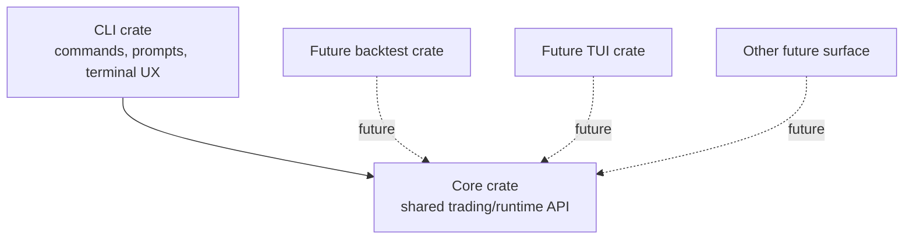

# Core and CLI Crate Split

## Problem Frame
`Cargo.toml` currently defines a single package, while shared runtime logic and delivery concerns live in the same crate and `src/cli/` is exported from `src/lib.rs`. The coupling is already visible in current code: `src/config.rs` depends on `crate::cli::setup::config_file`, so shared runtime/config behavior reaches through CLI-owned modules today. That structure works for today's CLI, but it blurs the boundary between reusable trading/runtime code and interface-specific code. The next stage of growth needs cleaner boundaries so future surfaces such as backtest and TUI can depend on shared logic without first unpicking CLI ownership.

## Boundary Model

## Requirements

**Crate Boundaries**
- R1. The repository moves from a single-package layout to a Cargo workspace in this slice.
- R2. The first slice introduces exactly two active product/runtime crates: a core crate and a CLI crate.
- R3. The core crate owns reusable trading/runtime capabilities that are not inherently tied to terminal interaction or command parsing.
- R4. The CLI crate owns command parsing, interactive setup, terminal-oriented UX, and other delivery concerns, and depends on the core crate rather than the reverse.
- R5. The core crate boundary is shaped as the stable shared API for future internal consumers such as backtest and TUI, so planning for those surfaces can build on it instead of re-cutting boundaries again.
- R6. Shared runtime/config behavior needed outside terminal UX is owned by the core side of the boundary, so shared runtime modules no longer depend on CLI-owned modules or types after the split.

**Behavior and Migration**
- R7. The first slice is intentionally behavior-preserving for end users: no intentional changes to existing CLI commands, config semantics, runtime behavior, or visible product scope.
- R8. The installed binary name and user-facing CLI invocation remain unchanged.
- R9. Repo-root developer and automation workflows remain supported after the split, including a single documented way to build, run, lint, and test from the repo root.
- R10. The refactor lands through incremental compile-green stages rather than a one-shot restructure.
- R11. Existing in-repo consumers that currently reach shared functionality through the monolithic crate are redirected to the core crate rather than through CLI wrappers or duplicated entrypoints.
- R12. The first slice moves only what is required to enforce crate ownership and dependency direction; opportunistic cleanup, API redesign, and non-essential renames stay out of scope.

**Future Readiness**
- R13. The first slice prepares for future crates such as backtest and TUI, but does not create those crates yet.
- R14. The refactor removes obvious ownership ambiguity about where new shared logic belongs versus where CLI-only logic belongs.
- R15. Project documentation and contributor guidance that currently describe the repo as a single crate or point contributors to CLI-in-lib structure are updated to match the new boundary model.

## Success Criteria
- Current CLI use cases continue to work without intentional user-facing behavior changes.
- Installed binary name/invocation and repo-root build/run/lint/test workflows remain intact and documented.
- The repository is a Cargo workspace whose active product/runtime crates for this slice are only the core crate and the CLI crate.
- The CLI can execute current analysis flows through core-owned entrypoints without shared runtime modules importing CLI-owned modules.
- Contributors can clearly identify whether new code belongs in the core crate or the CLI crate.
- A follow-on plan for backtest or TUI can depend on the core crate without first undoing this refactor.
- The repository's documented architecture no longer contradicts the actual crate layout.

## Scope Boundaries
- No new backtest, TUI, or other future-surface crates in this slice.
- No new command stubs or placeholder user-facing features.
- No attempt to make the core crate a publishable public package in this slice.
- No intentional changes to trading logic, pipeline semantics, prompts, or config shape except where boundary cleanup strictly requires wiring changes.
- No opportunistic namespace cleanup, public API reshaping, or broad module churn beyond the boundary split.

## Key Decisions
- Two-crate first slice: captures the main cleanliness win now without paying the carrying cost of empty future crates.
- Behavior-preserving refactor: architecture cleanup should be reviewable on its own, not bundled with CLI product changes.
- Stable shared API target: the core boundary should be future-friendly for internal surfaces, but not over-designed as a public crates.io API.
- Workspace-oriented split: use the standard Cargo workspace model to express independent crates while preserving root-level workflows.
- Boundary guide: core owns reusable runtime config assembly, analysis execution entrypoints, shared trading/runtime logic, and other non-CLI capabilities; CLI owns command parsing, interactive setup, terminal UX, and update/release UX.
- Incremental landing strategy: prioritize small compile-green moves to reduce migration risk and keep review tractable.

## Dependencies / Assumptions
- `AGENTS.md` currently says the repo is a single crate with no workspace; this refactor assumes those instructions will be updated as part of the change rather than treated as a permanent constraint.
- Existing roadmap signals in `README.md`, `PRD.md`, `CLAUDE.md`, and the current `src/backtest/` placeholder remain valid enough to justify designing for future non-CLI surfaces now.
- Cargo commands, CI wiring, and contributor docs may need workspace-aware updates, but the resulting repo must still preserve a clear root-level workflow for contributors and automation.

## Outstanding Questions

### Deferred to Planning
- [Affects R3, R4, R6, R11][Technical] What is the minimal first boundary cut that cleanly separates shared runtime/domain code from CLI-owned code without creating excessive churn?
- [Affects R7, R8, R9, R10][Technical] What step sequence keeps the repo compile-green while converting to a workspace, preserving binary behavior, and preserving root workflows?
- [Affects R15][Needs research] Which scripts, docs, and automation paths currently assume the root package name or single-package cargo commands and need coordinated updates?

## Next Steps
→ `/ce:plan` for structured implementation planning
