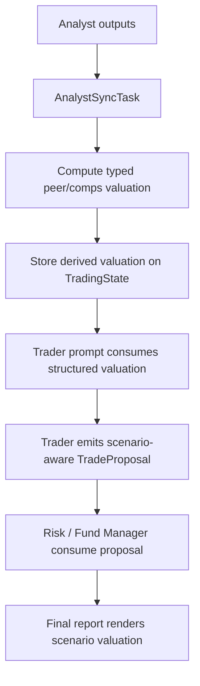

# Add Peer/Comps And Scenario Valuation

## Overview

Add typed peer/comps and scenario-valuation support so the trader, risk team, fund manager, and final report can reason from deterministic valuation structures instead of a single free-text `valuation_assessment` string.

This plan implements Milestone 6 from `docs/superpowers/specs/2026-04-05-financial-services-plugins-inspired-architecture-design.md` and is sequenced after the evidence/provenance foundation and thesis-memory follow-on work.

## Problem Frame

The current system already asks the Trader Agent to compare the target ticker against sector peers and historical norms, and the Fund Manager prompt already treats valuation as an anchor for entry guidance and position sizing. But the runtime has no typed peer/comps model, no deterministic scenario ranges, and no structured valuation payload beyond `TradeProposal.valuation_assessment: Option<String>`. That leaves a gap between what prompts ask the model to do and what the code can verify, persist, and report.

Milestone 6 should move valuation structure into typed state and deterministic Rust logic. The LLM should interpret valuation outputs, not invent them. The plan also needs to preserve the current fail-open analyst flow: incomplete valuation inputs should degrade to partial or absent derived valuation, not collapse the full run.

## Requirements Trace

- R1. Add typed derived valuation state under `src/state/derived.rs`.
- R2. Add scenario-aware valuation fields to `src/state/proposal.rs`.
- R3. Compute peer/comps and scenario valuation through deterministic runtime logic, not free-form LLM invention.
- R4. Allow partial-data degradation when valuation inputs are incomplete, without changing the existing analyst failure policy.
- R5. Expose the structured valuation to trader, risk/fund-manager consumers, and final reporting.
- R6. Keep snapshots, serde round-trips, and downstream proposal consumers backward-compatible.

## Scope Boundaries

- No new external provider integrations in this slice beyond what current data sources can already support or what the plan explicitly introduces.
- No scenario simulation engine, Monte Carlo framework, or portfolio optimizer.
- No pack-driven valuation profiles; analysis-pack extraction is a later milestone.
- No change to workflow topology.
- No requirement to produce valuation for every symbol; this slice may degrade to partial/absent valuation when peer inputs are insufficient.

## Context & Research

### Relevant Code and Patterns

- `src/state/proposal.rs` currently holds `TradeProposal` with only `valuation_assessment: Option<String>` as a valuation field.
- `src/state/trading_state.rs` already carries the upstream inputs most likely to support valuation: `current_price`, `fundamental_metrics`, `technical_indicators`, `market_sentiment`, `macro_news`, and `consensus_summary`.
- `src/agents/trader/mod.rs` already instructs the model to compare the ticker against sector peers and historical norms, but also forbids adding schema fields that do not exist yet.
- `src/agents/fund_manager/prompt.rs` already uses valuation as an anchor for `entry_guidance` and `suggested_position`.
- `src/workflow/tasks/analyst.rs` / `AnalystSyncTask` is the current deterministic cross-source merge point and the best existing host for computed valuation structures.
- `src/report/final_report.rs` currently renders a single `Valuation` row from `TradeProposal.valuation_assessment`.

### Institutional Learnings

- The evidence/provenance foundation plan establishes the repo pattern for adding new typed state, updating snapshots/context bridges together, and exposing new typed data through prompt helpers and reports.

### External References

- None. Local repo and milestone docs are sufficient for planning.

## Key Technical Decisions

- **Add typed derived valuation state in `TradingState`, not only in `TradeProposal`.**
  Rationale: deterministic runtime valuation should exist before the trader writes a proposal so the trader can consume structured inputs rather than generating them ad hoc. `TradeProposal` should carry the final scenario-aware decision outputs, while `TradingState` should carry the upstream derived valuation context.

- **Make deterministic Rust logic the source of truth for peer/scenario numbers.**
  Rationale: this milestone exists to move valuation structure out of prompts. The LLM should interpret typed valuation context, not originate the bear/base/bull numbers.

- **Treat peer/comps selection as an explicit, first-slice bounded heuristic.**
  Rationale: the repo has no current peer/comps provider seam. The plan should choose a minimal deterministic peer-selection strategy that can be implemented and tested now, then defer richer sector/industry/provider-driven selection to later work if needed.

- **Make scenario-aware proposal fields optional but validated when present.**
  Rationale: backward compatibility matters for snapshots, tests, and downstream consumers. Optional fields allow staged adoption while still giving the trader and fund manager structured valuation when available.

- **Preserve the current analyst degradation policy.**
  Rationale: if one upstream analyst is missing or peer inputs are incomplete, valuation should become partial or absent rather than changing the existing `0-1` analyst failure behavior.

- **Bound the first slice to operator-auditable output.**
  Rationale: once scenario/peer valuation is computed, the final report should show enough of it to be useful in review and debugging. Keeping it internal-only would under-deliver on the milestone.

## Open Questions

### Resolved During Planning

- **Should valuation live only inside `TradeProposal`?**
  No. The plan adds typed derived valuation state first, then has `TradeProposal` reference the final scenario-aware output.

- **Should scenario numbers be LLM-authored?**
  No. The runtime should compute them deterministically; the model interprets them.

- **Should this milestone update the final report?**
  Yes. A minimal `Scenario Valuation` report section should land in this slice so the new data is visible and auditable.

- **Should partial valuation block the pipeline?**
  No. It should degrade to partial or absent valuation context.

### Deferred to Implementation

- **Exact peer-selection heuristic and fallback ordering.**
  The plan should pin the boundary and test expectations, but the final implementation can choose the simplest repo-compatible heuristic after touching the real data surfaces.

- **Whether risk agents need direct access to full derived valuation state or only the expanded proposal.**
  This can be finalized after seeing how much of the valuation structure is needed in `TradeProposal` vs prompt context.

## High-Level Technical Design

> *This illustrates the intended approach and is directional guidance for review, not implementation specification. The implementing agent should treat it as context, not code to reproduce.*

## Implementation Units

- [ ] **Unit 1: Add typed derived valuation state**

**Goal:** Define the typed valuation structures needed before the trader proposal is built.

**Requirements:** R1, R3, R6

**Dependencies:** Evidence/provenance foundation must be landed first.

**Files:**
- Create: `src/state/derived.rs`
- Modify: `src/state/trading_state.rs`
- Modify: `src/state/mod.rs`
- Test: `src/state/derived.rs`
- Test: `tests/state_roundtrip.rs`

**Approach:**
- Add a bounded set of types for peer/comps inputs and scenario valuation outputs.
- Extend `TradingState` with an optional derived-valuation field.
- Keep all new fields additive and serde-compatible.

**Patterns to follow:**
- `src/state/proposal.rs`
- `src/state/trading_state.rs`
- `tests/state_roundtrip.rs`

**Test scenarios:**
- Happy path: derived valuation state serializes and deserializes with peer data and bear/base/bull values intact.
- Edge case: `TradingState::new` initializes the new valuation field to `None`.
- Edge case: old snapshot/state JSON without the new field still loads with `None`.
- Error path: invalid scenario ordering (`bear > base` or `base > bull`) is rejected by validation helpers.

**Verification:**
- State round-trip tests prove the new structures are additive and backward-compatible.

- [ ] **Unit 2: Compute deterministic peer/comps and scenario valuation**

**Goal:** Add a deterministic runtime step that derives structured valuation from upstream analyst state.

**Requirements:** R1, R3, R4

**Dependencies:** Unit 1

**Files:**
- Modify: `src/workflow/tasks/analyst.rs`
- Modify: `src/workflow/tasks/tests.rs`
- Test: `src/workflow/tasks/tests.rs`

**Approach:**
- Extend `AnalystSyncTask` with bounded deterministic valuation computation after analyst results are merged.
- Keep valuation derivation fail-open when inputs are incomplete.
- Define the minimum viable peer/comps selection rule and scenario formula inside Rust rather than prompts.

**Execution note:** Start with failing sync-task tests that pin down full-data, partial-data, and invalid-ordering behavior before modifying the runtime merge logic.

**Patterns to follow:**
- `src/workflow/tasks/analyst.rs`
- existing `AnalystSyncTask` merge and degradation behavior

**Test scenarios:**
- Happy path: complete analyst inputs produce populated peer/scenario valuation on `TradingState`.
- Edge case: one missing analyst input yields partial or absent derived valuation but still returns `Continue`.
- Edge case: no valid peer set yields `None` or a sparse valuation payload rather than aborting.
- Error path: non-finite or invalidly ordered scenario values are rejected before being stored.
- Integration: derived valuation remains stable when analyst order or optional fields vary.

**Verification:**
- Workflow-task tests prove valuation is computed deterministically and does not change the existing analyst-failure contract.

- [ ] **Unit 3: Expand `TradeProposal` for scenario-aware valuation**

**Goal:** Carry structured valuation through the trader handoff to downstream consumers.

**Requirements:** R2, R5, R6

**Dependencies:** Units 1-2

**Files:**
- Modify: `src/state/proposal.rs`
- Modify: `src/agents/trader/mod.rs`
- Modify: `src/agents/trader/tests.rs`
- Test: `src/agents/trader/tests.rs`
- Test: `tests/state_roundtrip.rs`

**Approach:**
- Add optional scenario-aware proposal fields to `TradeProposal`.
- Update the trader prompt and validation logic so the LLM consumes typed valuation context and returns the expanded proposal shape when available.
- Preserve backward-compatible defaults for older fixtures and snapshots.

**Patterns to follow:**
- `src/state/proposal.rs`
- `src/agents/trader/mod.rs`
- `src/agents/trader/tests.rs`

**Test scenarios:**
- Happy path: trader returns a valid proposal containing the expanded valuation fields.
- Edge case: valuation context is absent, and the proposal still validates with the legacy-required fields only.
- Edge case: extra optional valuation fields serialize and deserialize through snapshots unchanged.
- Error path: proposal validation rejects inconsistent scenario values or missing required core fields.
- Integration: prompt tests prove the trader receives structured valuation context rather than relying only on free-text `valuation_assessment`.

**Verification:**
- Trader tests prove the expanded schema is accepted, validated, and backward-compatible.

- [ ] **Unit 4: Wire downstream consumers and reporting**

**Goal:** Make the richer valuation visible and usable after trader synthesis.

**Requirements:** R5, R6

**Dependencies:** Unit 3

**Files:**
- Modify: `src/agents/fund_manager/prompt.rs`
- Modify: `src/agents/fund_manager/tests.rs`
- Modify: `src/report/final_report.rs`
- Test: `src/agents/fund_manager/tests.rs`
- Test: `src/report/final_report.rs`

**Approach:**
- Update the fund-manager prompt to consume scenario-aware valuation fields or structured valuation context.
- Add a `Scenario Valuation` section to the final report that shows the peer/comps summary and bear/base/bull ranges when present.
- Render explicit fallback text when valuation is absent or partial.

**Patterns to follow:**
- `src/agents/fund_manager/prompt.rs`
- `src/report/final_report.rs`

**Test scenarios:**
- Happy path: final report renders the scenario valuation section with peer/comps and bear/base/bull values.
- Edge case: missing valuation renders an explicit fallback instead of omitting the section silently.
- Edge case: partial valuation renders only the available fields with a clear indication of incompleteness.
- Error path: fund-manager prompt/output remains valid when scenario valuation is absent.

**Verification:**
- Fund-manager and report tests prove the new valuation structures are surfaced safely and auditably.

## System-Wide Impact

- **Interaction graph:** analyst outputs -> sync-time deterministic valuation -> `TradingState` derived valuation -> trader proposal -> fund manager prompt -> final report.
- **Error propagation:** invalid derived valuation should be rejected before persistence; incomplete valuation should degrade to partial/absent state rather than aborting the run.
- **State lifecycle risks:** expanding both `TradingState` and `TradeProposal` changes snapshots, prompt consumers, and report rendering together.
- **Integration coverage:** valuation computation, proposal schema expansion, downstream prompt consumption, and report rendering all need cross-layer coverage.
- **Unchanged invariants:** no new workflow phase, no additional LLM calls, no pack-driven configuration.

## Risks & Dependencies

| Risk | Mitigation |
|------|------------|
| No authoritative peer/comps source exists yet | Choose a minimal deterministic first-slice peer-selection rule and test it explicitly |
| Scenario values conflict with `target_price` / `stop_loss` semantics | Add proposal-level validation and prompt instructions that define the relationship clearly |
| Proposal-schema growth breaks downstream consumers | Update fund-manager/report/tests in the same slice and keep new fields optional |
| Partial data leads the model to invent valuation outputs | Make deterministic runtime valuation the source of truth and preserve explicit missing-data prompt rules |

## Documentation / Operational Notes

- Update `docs/prompts.md` if the trader or fund-manager valuation contract changes materially.
- If the first-slice peer heuristic proves too weak in practice, capture richer peer-provider work as a separate follow-on rather than expanding this milestone ad hoc.

## Sources & References

- Milestone source: `docs/superpowers/specs/2026-04-05-financial-services-plugins-inspired-architecture-design.md`
- Related code: `src/state/proposal.rs`
- Related code: `src/state/trading_state.rs`
- Related code: `src/workflow/tasks/analyst.rs`
- Related code: `src/agents/trader/mod.rs`
- Related code: `src/agents/fund_manager/prompt.rs`
- Related code: `src/report/final_report.rs`
