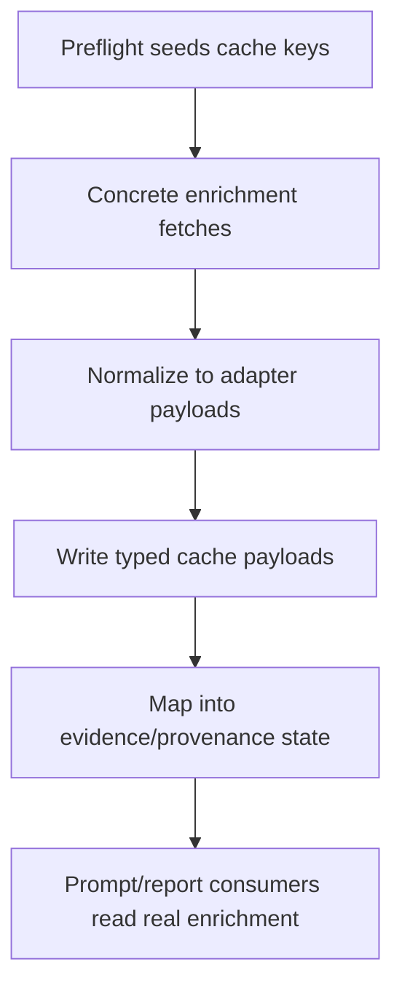

# Add Concrete Enrichment Providers

## Overview

Implement concrete transcript, consensus-estimates, and event-news providers behind the provider-agnostic enrichment contracts so Stage-1 `null` placeholders become real normalized enrichment payloads.

This plan implements Milestone 7 from `docs/superpowers/specs/2026-04-05-financial-services-plugins-inspired-architecture-design.md`.

## Problem Frame

The architecture already reserves enrichment categories for transcripts, consensus estimates, and event feeds, but today those categories are only conceptual. Without concrete providers, the runtime cannot actually attach earnings/event evidence, even though the prompt discipline and provenance model are designed to consume it.

This milestone must stay bounded. It should plug concrete providers into the existing adapter contracts and runtime cache seams; it should not redesign the entire pipeline. It also must preserve the architecture's fail-open enrichment policy: optional enrichment failures should not abort a run.

## Requirements Trace

- R1. Land concrete providers behind the transcript, estimates, and event-news adapter contracts.
- R2. Replace Stage-1 `null` cache placeholders with normalized payloads when providers succeed.
- R3. Keep optional-enrichment fetch failures fail-open.
- R4. Enforce time-authority rules so backtests do not ingest data published after `target_date`.
- R5. Preserve typed provenance and reporting compatibility.
- R6. Keep snapshot/context/state evolution backward-compatible.

## Scope Boundaries

- This milestone depends on the evidence/provenance foundation landing first.
- No provider-factory redesign.
- No new workflow phases.
- No requirement to make every enrichment category mandatory.
- No analysis-pack policy work in this slice.

## Context & Research

### Relevant Code and Patterns

- `src/data/finnhub.rs` already exposes `get_earnings` and `get_news`, which are the strongest existing seams for estimates/events-style enrichment.
- The architecture spec reserves `src/data/adapters/` contracts, `DataEnrichmentConfig`, preflight cache keys, evidence/provenance state, and prompt/report consumers.
- `src/workflow/context_bridge.rs` is the current pattern for typed JSON payloads in workflow context.
- `src/workflow/snapshot.rs` persists the full `TradingState`, so any new evidence fields must remain additive and serde-safe.

### Institutional Learnings

- The evidence/provenance foundation plan is the prerequisite pattern for adding typed evidence, cache keys, prompt helpers, and report surfaces.

### External References

- None for planning. Provider choice and contract details should stay grounded in repo seams first.

## Key Technical Decisions

- **This milestone is gated on Stage 1 landing first.**
  Rationale: current HEAD does not yet have `src/data/adapters/`, `PreflightTask`, enrichment config, evidence/provenance state, or prompt/report consumers. Implementing concrete providers without those seams would either duplicate scaffolding or create a one-off path.

- **Keep the provider boundary category-based, not vendor-centric.**
  Rationale: the adapter traits already define transcript, estimates, and event-news categories. Concrete providers should plug into those categories without leaking vendor-specific shapes into downstream state.

- **Use `target_date` as the time authority for enrichment lookup.**
  Rationale: provider integrations must not copy the current `Utc::now()`-style fetch window patterns into backtests. Enrichment should be fetched “as of target date,” not “latest now.”

- **Differentiate semantic absence from runtime failure.**
  Rationale: “no transcript found” or “empty event window” should degrade to `null`/empty payloads with caveats. Database/network/runtime failures should still map through the typed error boundary and preserve fail-open behavior where the architecture allows it.

- **Land user-visible consumption in the same slice when concrete payloads exist.**
  Rationale: shipping providers that only populate internal cache keys would create work with little visible value. Prompt/report/state consumers should be wired enough that concrete enrichment changes runtime behavior observably.

## Open Questions

### Resolved During Planning

- **Can this milestone start before the evidence/provenance foundation lands?**
  No. It is blocked on those seams.

- **Should enrichment failure abort a run?**
  No. Optional enrichment remains fail-open.

- **Should enrichment fetches use wall-clock time or target-date time?**
  Target date.

### Deferred to Implementation

- **Exact vendor choice per category.**
  The plan should define the category boundaries and test expectations, but the concrete provider selections can be finalized after checking available APIs, auth requirements, and data shape fit.

- **Whether one vendor or a fallback chain backs each category.**
  This can be decided once concrete provider surfaces are evaluated against the adapter contracts.

## High-Level Technical Design

> *This illustrates the intended approach and is directional guidance for review, not implementation specification. The implementing agent should treat it as context, not code to reproduce.*

## Implementation Units

- [ ] **Unit 1: Confirm and land prerequisite Stage-1 seams**

**Goal:** Ensure the concrete-provider work builds on the intended adapter/evidence/preflight architecture instead of bypassing it.

**Requirements:** R1, R5, R6

**Dependencies:** Evidence/provenance foundation must be landed first.

**Files:**
- Modify: `src/config.rs`
- Modify: `config.toml`
- Modify: `src/data/mod.rs`
- Modify: `src/state/mod.rs`
- Modify: `src/state/trading_state.rs`
- Modify: `src/workflow/tasks/common.rs`
- Modify: `src/workflow/tasks/mod.rs`
- Modify: `src/workflow/pipeline.rs`
- Test: `src/workflow/context_bridge.rs`
- Test: `src/workflow/tasks/tests.rs`

**Approach:**
- Treat Stage 1 as a hard prerequisite checkpoint.
- If the reserved seams are missing, land them first rather than blending bootstrap work into concrete-provider implementation.

**Patterns to follow:**
- `docs/superpowers/plans/2026-04-05-evidence-provenance-foundation.md`

**Test scenarios:**
- Test expectation: none -- this unit is a prerequisite gate and seam-validation checkpoint, not new behavior by itself.

**Verification:**
- The repo has the adapter contracts, preflight cache keys, evidence/provenance state, and prompt/report surfaces needed by later units.

- [ ] **Unit 2: Implement concrete transcript, estimates, and event providers**

**Goal:** Add concrete provider clients that normalize raw vendor responses into the adapter payload shapes.

**Requirements:** R1, R2, R4, R6

**Dependencies:** Unit 1

**Files:**
- Create: `src/data/adapters/transcripts.rs`
- Create: `src/data/adapters/estimates.rs`
- Create: `src/data/adapters/events.rs`
- Modify: `src/data/finnhub.rs`
- Modify: `src/data/mod.rs`
- Test: `src/data/adapters/transcripts.rs`
- Test: `src/data/adapters/estimates.rs`
- Test: `src/data/adapters/events.rs`

**Approach:**
- Implement concrete provider structs per category behind the existing adapter traits.
- Normalize vendor timestamps, period labels, symbols, and relevance/estimate fields into the shared payload types.
- Filter out records published after `target_date`.

**Execution note:** Start with normalization tests that pin down ordering, timestamp filtering, and empty/not-found behavior before wiring provider calls into workflow code.

**Patterns to follow:**
- `src/data/finnhub.rs`
- `src/data/symbol.rs`

**Test scenarios:**
- Happy path: provider returns a valid normalized transcript/consensus/event payload.
- Edge case: no result found returns semantic absence (`None` or empty vector) rather than a runtime error.
- Edge case: multiple provider records are reduced deterministically to the correct latest eligible payload.
- Edge case: records published after `target_date` are excluded.
- Error path: malformed vendor payloads are rejected cleanly during normalization.

**Verification:**
- Adapter tests prove concrete providers produce the shared normalized payloads deterministically.

- [ ] **Unit 3: Wire concrete payloads into runtime cache and evidence state**

**Goal:** Replace preflight-seeded placeholder values with actual enrichment payloads during a run.

**Requirements:** R2, R3, R5, R6

**Dependencies:** Unit 2

**Files:**
- Modify: `src/workflow/tasks/preflight.rs`
- Modify: `src/workflow/tasks/analyst.rs`
- Modify: `src/workflow/tasks/tests.rs`
- Modify: `src/workflow/context_bridge.rs`
- Test: `src/workflow/tasks/tests.rs`
- Test: `src/workflow/context_bridge.rs`

**Approach:**
- Assign concrete fetch ownership to a single runtime seam instead of scattering fetches across multiple tasks.
- Update the typed cache values from `null` placeholders to normalized payloads when providers succeed.
- Keep missing/unsupported enrichment as explicit `null` and preserve fail-open behavior.
- Thread provider/source metadata into evidence/provenance state.

**Patterns to follow:**
- `src/workflow/context_bridge.rs`
- `src/workflow/tasks/analyst.rs`

**Test scenarios:**
- Happy path: enabled enrichment categories populate the correct cache keys and typed evidence state.
- Edge case: one category succeeds while others remain `null`, and the run still continues.
- Edge case: cache keys remain present even when payloads are absent.
- Error path: invalid JSON or missing required post-preflight keys are treated as orchestration corruption.

**Verification:**
- Workflow/context tests prove concrete enrichment payloads replace placeholders without breaking the fail-open contract.

- [ ] **Unit 4: Expose enrichment to prompt and report consumers**

**Goal:** Make concrete enrichment visible to downstream reasoning and operator output.

**Requirements:** R3, R5

**Dependencies:** Unit 3

**Files:**
- Modify: `src/agents/shared/prompt.rs`
- Modify: `src/agents/researcher/common.rs`
- Modify: `src/agents/risk/common.rs`
- Modify: `src/agents/trader/mod.rs`
- Modify: `src/agents/fund_manager/prompt.rs`
- Modify: `src/report/final_report.rs`
- Test: `src/agents/shared/prompt.rs`
- Test: `src/agents/fund_manager/tests.rs`
- Test: `src/report/final_report.rs`

**Approach:**
- Extend prompt-context rendering so concrete transcript/estimates/event payloads appear through the shared evidence/data-quality surfaces.
- Update final reporting to reflect the now-populated enrichment-backed evidence/provenance state.
- Preserve explicit fallback text when a category remains absent.

**Patterns to follow:**
- `src/agents/shared/prompt.rs`
- `src/report/final_report.rs`

**Test scenarios:**
- Happy path: prompt/report consumers render real enrichment-derived context when available.
- Edge case: absent enrichment categories render clear fallback text instead of disappearing silently.
- Edge case: mixed success across categories is surfaced consistently in prompt and report output.
- Error path: report rendering never panics on missing optional enrichment data.

**Verification:**
- Prompt/report tests prove concrete enrichment changes runtime behavior observably and safely.

## System-Wide Impact

- **Interaction graph:** preflight capability seeding -> concrete provider fetch/normalize -> cache/evidence state -> downstream prompt/report consumers.
- **Error propagation:** provider runtime failures remain typed errors internally but degrade to absent optional enrichment at the workflow surface; orchestration corruption still fails closed.
- **State lifecycle risks:** enrichment payloads become part of `TradingState`, snapshots, and provenance summaries.
- **Integration coverage:** target-date filtering, mixed category success/failure, and prompt/report visibility all need cross-layer tests.
- **Unchanged invariants:** no new phase, no mandatory enrichment requirement, no provider-factory redesign.

## Risks & Dependencies

| Risk | Mitigation |
|------|------------|
| Current HEAD lacks the required Stage-1 seams | Treat Stage 1 as a hard prerequisite and stop if those seams are missing |
| Future-data leakage in backtests | Make `target_date` the time authority and test future-published records explicitly |
| Vendor-specific payloads leak into shared state | Normalize everything through the adapter contracts before writing cache/state |
| Optional enrichment failures silently disappear | Encode absence/failure through explicit null/caveat/provenance handling and verify it in prompts/reports |

## Documentation / Operational Notes

- Update any relevant prompt docs if enrichment-backed evidence changes the prompt contract materially.
- If provider-specific auth/config is introduced, document it alongside `config.toml` and `.env` expectations as part of implementation.

## Sources & References

- Milestone source: `docs/superpowers/specs/2026-04-05-financial-services-plugins-inspired-architecture-design.md`
- Related code: `src/data/finnhub.rs`
- Related code: `src/workflow/context_bridge.rs`
- Related code: `src/workflow/tasks/analyst.rs`
- Related code: `src/report/final_report.rs`
