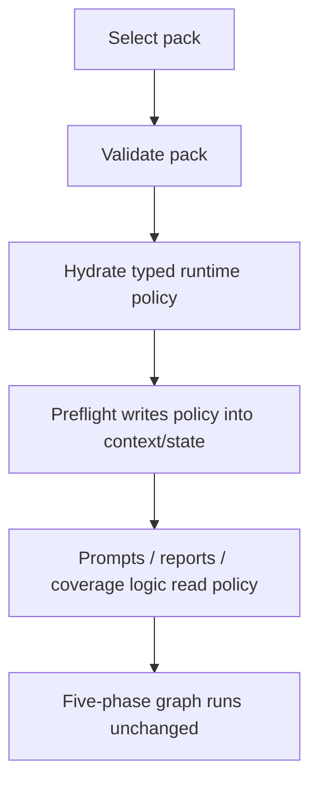

# Extract Analysis Packs

## Overview

Add a declarative analysis-pack layer that sits above config, evidence policy, prompt policy, and report policy, allowing the runtime to select a named analysis profile without changing the five-phase graph or provider factory.

This plan implements Milestone 8 from `docs/superpowers/specs/2026-04-05-financial-services-plugins-inspired-architecture-design.md`.

## Problem Frame

The architecture spec explicitly defers pack extraction until the evidence/provenance abstractions stabilize. Today the repo still hardcodes most runtime policy in config defaults, workflow startup, prompts, and report rendering. Without a declarative pack layer, changing analysis posture requires code edits rather than selecting a stable profile.

The first slice of analysis packs should extract policy, not execution. Packs should define what kind of analysis to run, not own the pipeline itself. The five-phase workflow, provider factory, and task orchestration remain the same.

## Requirements Trace

- R1. Add a declarative analysis-pack abstraction above config/evidence/prompt/report policy.
- R2. Keep packs out of provider-factory and graph-topology ownership.
- R3. Support a baseline/default pack that reproduces current behavior.
- R4. Resolve a selected pack into typed runtime policy during startup/preflight.
- R5. Persist enough pack identity/version information for replay/debugging compatibility.
- R6. Validate pack errors before analysis starts.

## Scope Boundaries

- This milestone is gated on Stage-1 evidence/preflight abstractions landing first.
- Packs do not add/remove workflow phases.
- Packs do not replace provider selection or model-factory logic.
- No layered/composed pack system in the first slice unless it is absolutely necessary.
- No UI work beyond whatever existing config/runtime entrypoints need to select a pack.

## Context & Research

### Relevant Code and Patterns

- `src/config.rs` is the current home for top-level runtime configuration.
- `src/workflow/pipeline.rs` and the planned preflight seam are the natural place to resolve pack selection into concrete runtime policy.
- `src/workflow/tasks/common.rs` and `src/workflow/context_bridge.rs` are the current seams for startup/runtime policy propagation.
- `src/agents/shared/prompt.rs` is the current shared prompt-policy seam.
- `src/report/final_report.rs` is the current report-policy seam.
- The architecture spec says packs are a Stage-2 extraction of stable concepts; current HEAD still lacks the Stage-1 abstractions that packs would sit on top of.

### Institutional Learnings

- The evidence/provenance foundation remains the pattern for adding new runtime policy surfaces through typed state, startup keys, and shared helper layers.

### External References

- None for planning. Repo-specific seams are the main concern.

## Key Technical Decisions

- **Treat packs as declarative policy objects, not execution owners.**
  Rationale: the spec explicitly says packs should configure stable concepts on top of the existing runtime. They must not become a parallel orchestrator.

- **Require a built-in baseline pack that reproduces current behavior.**
  Rationale: the safest way to introduce packs is to first express today's behavior through the new abstraction and prove parity.

- **Resolve packs during startup/preflight, then propagate only typed runtime policy.**
  Rationale: downstream tasks, prompts, and reports should consume normalized runtime policy, not raw pack definitions.

- **Persist pack identity/version with the run.**
  Rationale: replay, debugging, and future memory compatibility need to know which pack shaped a run.

- **Keep the first slice to single-pack selection.**
  Rationale: layered composition introduces precedence and merge complexity too early.

- **Fail invalid or unsupported packs before analysis begins.**
  Rationale: malformed pack state should not leak into partially executed runs.

## Open Questions

### Resolved During Planning

- **Can packs change graph topology or provider-factory routing?**
  No.

- **Should packs be introduced only after Stage 1?**
  Yes.

- **Should the first slice support multiple layered packs?**
  No. Start with one selected pack plus a baseline default.

### Deferred to Implementation

- **Whether pack definitions live purely in Rust, purely as data files, or as a hybrid.**
  The plan should lock the boundary and test expectations, but the final representation can be chosen based on the repo's ergonomics once implementation starts.

- **Exact operator-facing selection surface.**
  This can be finalized after checking whether config-only selection is sufficient for the first slice.

## High-Level Technical Design

> *This illustrates the intended approach and is directional guidance for review, not implementation specification. The implementing agent should treat it as context, not code to reproduce.*

## Implementation Units

- [ ] **Unit 1: Define the analysis-pack contract and baseline pack**

**Goal:** Introduce a stable declarative pack abstraction and a default pack that preserves current behavior.

**Requirements:** R1, R2, R3, R6

**Dependencies:** Stage-1 evidence/preflight abstractions must be present.

**Files:**
- Create: `src/analysis_packs/mod.rs`
- Create: `src/analysis_packs/definitions.rs`
- Modify: `src/config.rs`
- Modify: `config.toml`
- Test: `src/analysis_packs/mod.rs`
- Test: `src/config.rs`

**Approach:**
- Define the allowed pack vocabulary: coverage, enrichment intent, prompt/report policy, and runtime identity metadata.
- Add a built-in baseline pack that mirrors today's behavior.
- Add config-level pack selection with validation.

**Patterns to follow:**
- `src/config.rs`
- `src/providers/mod.rs`

**Test scenarios:**
- Happy path: baseline pack loads and validates successfully.
- Edge case: missing explicit selection resolves to the baseline/default pack.
- Edge case: unknown pack id fails validation before analysis starts.
- Error path: malformed pack definition or unsupported field fails with a clear config/runtime error.

**Verification:**
- Config/pack tests prove a baseline pack can reproduce current runtime policy without graph or provider changes.

- [ ] **Unit 2: Hydrate selected pack into typed runtime policy**

**Goal:** Convert the selected pack into the stable runtime policy surfaces used by the rest of the system.

**Requirements:** R1, R4, R6

**Dependencies:** Unit 1

**Files:**
- Create: `src/analysis_packs/runtime.rs`
- Modify: `src/workflow/tasks/common.rs`
- Modify: `src/workflow/context_bridge.rs`
- Modify: `src/workflow/pipeline.rs`
- Modify: `src/workflow/tasks/preflight.rs`
- Test: `src/workflow/context_bridge.rs`
- Test: `src/workflow/tasks/tests.rs`

**Approach:**
- Add a typed runtime-policy representation derived from the selected pack.
- Resolve the pack during startup/preflight and write normalized policy into state/context.
- Keep downstream consumers unaware of the raw pack representation.

**Execution note:** Start with failing startup/preflight tests that pin down default selection, invalid-pack rejection, and policy propagation before wiring pack hydration into runtime entry.

**Patterns to follow:**
- `src/workflow/context_bridge.rs`
- `src/workflow/tasks/common.rs`

**Test scenarios:**
- Happy path: selected pack hydrates into typed runtime policy before analyst fan-out.
- Edge case: baseline pack yields the same required coverage/enrichment intent as current default behavior.
- Edge case: invalid hydrated policy is rejected before graph execution.
- Integration: startup/preflight writes pack-derived policy into the expected context/state surfaces.

**Verification:**
- Workflow startup tests prove packs are resolved once and propagated as typed runtime policy.

- [ ] **Unit 3: Wire pack-derived policy into prompt and report behavior**

**Goal:** Make the selected pack meaningfully change runtime policy at the shared prompt/report layer without changing the graph.

**Requirements:** R2, R4, R5

**Dependencies:** Unit 2

**Files:**
- Modify: `src/agents/shared/prompt.rs`
- Modify: `src/report/final_report.rs`
- Modify: `src/state/trading_state.rs`
- Modify: `src/state/mod.rs`
- Test: `src/agents/shared/prompt.rs`
- Test: `src/report/final_report.rs`
- Test: `tests/state_roundtrip.rs`

**Approach:**
- Persist pack identity/version on the run so snapshots and reports can explain which pack shaped behavior.
- Update shared prompt/report helpers to branch on normalized runtime policy, not raw pack definitions.
- Keep the five-phase graph and provider factory unchanged.

**Patterns to follow:**
- `src/agents/shared/prompt.rs`
- `src/report/final_report.rs`
- `tests/state_roundtrip.rs`

**Test scenarios:**
- Happy path: report output includes pack identity/version for a completed run.
- Edge case: old snapshots without pack metadata still deserialize and render with fallback values.
- Edge case: pack-derived prompt/report policy changes behavior through the shared helper layer only.
- Error path: missing or malformed persisted pack metadata does not panic renderers.

**Verification:**
- Report/state tests prove pack identity persists cleanly and pack-derived behavior stays at the policy layer.

## System-Wide Impact

- **Interaction graph:** pack selection -> pack validation -> typed runtime-policy hydration -> preflight/context propagation -> prompt/report policy consumption.
- **Error propagation:** invalid pack selection fails before analysis starts; hydrated policy errors do not leak into partially executed runs.
- **State lifecycle risks:** persisted pack metadata must remain backward-compatible with older snapshots.
- **Integration coverage:** config selection, startup hydration, prompt/report policy consumption, and snapshot persistence all need cross-layer tests.
- **Unchanged invariants:** same five-phase graph, same provider factory, same task topology.

## Risks & Dependencies

| Risk | Mitigation |
|------|------------|
| Packs become a second orchestrator | Restrict the contract to policy only and explicitly forbid graph/provider ownership |
| Current behavior changes unintentionally during extraction | Start with a built-in baseline pack and prove parity before adding richer packs |
| Stage-1 abstractions are still missing | Gate implementation on the evidence/preflight foundation landing first |
| Pack precedence becomes ambiguous | Keep the first slice to single-pack selection with explicit config validation |

## Documentation / Operational Notes

- Document the baseline/default pack and whatever operator-facing selection mechanism the implementation chooses.
- If the first slice reveals a need for layered packs or pack inheritance, capture that as a separate follow-on instead of expanding this milestone.

## Sources & References

- Milestone source: `docs/superpowers/specs/2026-04-05-financial-services-plugins-inspired-architecture-design.md`
- Related code: `src/config.rs`
- Related code: `src/workflow/pipeline.rs`
- Related code: `src/workflow/tasks/common.rs`
- Related code: `src/workflow/context_bridge.rs`
- Related code: `src/agents/shared/prompt.rs`
- Related code: `src/report/final_report.rs`
