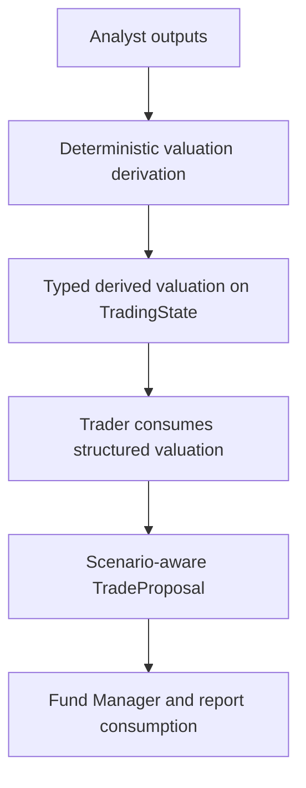

# Add Peer/Comps And Scenario Valuation

## Overview

Add typed peer/comps and scenario valuation so the trader, fund manager, and report layer reason from deterministic valuation structures rather than relying on prompt-only free-text valuation summaries.

This plan implements Milestone 6 from `docs/superpowers/specs/2026-04-05-financial-services-plugins-inspired-architecture-design.md` and builds on the completed Stage 1 foundation.

## Problem Frame

The current system already expects valuation-oriented reasoning: `TradeProposal` carries `valuation_assessment`, the Trader prompt references sector peers and historical norms, and the Fund Manager prompt anchors entry guidance and sizing to valuation. But none of that is typed or deterministic yet. There is no `src/state/derived.rs`, no structured peer/comps snapshot, and no scenario-aware fields in the proposal schema.

This milestone should move valuation shape and computations into Rust. The first slice needs to stay bounded: it should define where deterministic valuation lives, how it flows into the trader proposal, how downstream consumers read it, and how it degrades safely when valuation inputs are incomplete.

## Requirements Trace

- R1. Add typed derived valuation state under `src/state/derived.rs`.
- R2. Add scenario-aware valuation fields to `src/state/proposal.rs`.
- R3. Compute valuation deterministically in Rust rather than leaving it fully implicit inside prompts.
- R4. Preserve existing partial-data degradation behavior when valuation inputs are incomplete.
- R5. Make the richer valuation visible to trader/fund-manager/report consumers.
- R6. Keep state, snapshot, and prompt/report contracts backward-compatible.

## Scope Boundaries

- No new provider integration requirement in this slice beyond what is needed to define/store deterministic valuation inputs.
- No separate scenario simulation engine.
- No analysis-pack policy extraction.
- No workflow topology changes.

## Context & Research

### Relevant Code and Patterns

- `src/state/proposal.rs` currently has only `valuation_assessment: Option<String>`.
- `src/workflow/tasks/analyst.rs` / `AnalystSyncTask` is the current cross-source deterministic merge point.
- `src/agents/trader/mod.rs` already asks the model to reason from valuation, peers, and historical norms.
- `src/agents/fund_manager/prompt.rs` already consumes valuation conceptually.
- `src/report/final_report.rs` currently renders a single valuation row.
- `docs/solutions/logic-errors/stale-trading-state-evidence-and-unavailable-data-quality-fallbacks-2026-04-07.md` is relevant because any new per-cycle valuation fields must be reset explicitly.

### Institutional Learnings

- New cycle-scoped `TradingState` fields must be added to `src/workflow/pipeline/runtime.rs::reset_cycle_outputs()`.

### External References

- Upstream inspiration: `https://github.com/anthropics/financial-services-plugins`

## Key Technical Decisions

- **Add typed derived valuation state, not more free-form strings.**
  Rationale: the trader should consume structured valuation inputs, not invent them ad hoc.

- **Compute deterministic valuation before trader inference.**
  Rationale: this keeps scenario/peer logic in Rust and lets the LLM interpret rather than originate the valuation model.

- **Keep proposal schema growth additive and optional-first.**
  Rationale: downstream tests, snapshots, and consumers currently assume a small proposal shape.

- **Treat peer/comps inputs as optional in the first slice.**
  Rationale: current repo state has no fully-fledged peer provider yet. The plan should support partial valuation and fail-open behavior when peer inputs are missing.

- **Use a first-slice repo-local peer/comps contract instead of waiting for a provider.**
  Rationale: the repo has no live peer/comps producer today, so deterministic valuation needs an explicit typed seam even if the first slice populates it sparsely or heuristically.

- **Add explicit report support in the same milestone.**
  Rationale: structured valuation should be visible and auditable once it exists.

## Open Questions

### Resolved During Planning

- **Should valuation live only in `TradeProposal`?**
  No. Add derived valuation state first, then flow the final scenario-aware output into `TradeProposal`.

- **Should scenario values be LLM-authored?**
  No. The runtime should compute them deterministically.

- **Should the report layer expose the new valuation structure?**
  Yes.

### Deferred to Implementation

- **Exact first-slice peer/comps selection rule.**
  The first slice should use one explicit repo-local rule: define a typed peer/comps input on `TradingState`, allow it to be absent, and start with the simplest deterministic heuristic available from existing runtime data until a later provider-backed source exists.

- **Whether risk agents need full direct valuation context or only the expanded proposal.**
  This can be finalized after implementing the typed state and proposal changes.

## High-Level Technical Design

> *This illustrates the intended approach and is directional guidance for review, not implementation specification. The implementing agent should treat it as context, not code to reproduce.*

## Implementation Units

- [ ] **Chunk 1: Derived valuation state and proposal schema**

**Goal:** Define the typed structures before touching prompts or reports.

**Requirements:** R1, R2, R6

**Dependencies:** Stage 1 is complete.

**Files:**
- Create: `src/state/derived.rs`
- Modify: `src/state/mod.rs`
- Modify: `src/state/proposal.rs`
- Modify: `src/state/trading_state.rs`
- Modify: `src/agents/risk/aggressive.rs`
- Modify: `src/agents/risk/conservative.rs`
- Modify: `src/agents/risk/neutral.rs`
- Modify: `src/agents/risk/moderator.rs`
- Modify: `src/providers/factory/agent.rs`
- Modify: `src/providers/factory/retry.rs`
- Modify: `src/workflow/tasks/test_helpers.rs`
- Test: `src/state/derived.rs`
- Test: `tests/state_roundtrip.rs`

**Approach:**
- Add typed peer/comps and scenario valuation structures.
- Define the first-slice peer/comps input contract in the same change so deterministic valuation has an explicit typed upstream seam even when peer data is absent.
- Extend `TradeProposal` with optional scenario-aware fields.
- Keep serde compatibility additive.

**Patterns to follow:**
- `src/state/proposal.rs`
- `tests/state_roundtrip.rs`

**Test scenarios:**
- Happy path: derived valuation and expanded proposal fields round-trip through serde.
- Edge case: old snapshots/proposals without the new fields still deserialize.
- Edge case: invalid scenario ordering is rejected by validation helpers.
- Error path: proposal validation rejects inconsistent structured valuation.

**Verification:**
- State/property tests prove the new structures are additive and validatable.

- [ ] **Chunk 2: Deterministic valuation derivation in the runtime**

**Goal:** Compute structured valuation before trader inference.

**Requirements:** R1, R3, R4

**Dependencies:** Chunk 1

**Files:**
- Modify: `src/workflow/tasks/analyst.rs`
- Modify: `src/workflow/tasks/tests.rs`
- Test: `src/workflow/tasks/tests.rs`

**Approach:**
- Extend the cross-source deterministic merge path to compute a typed valuation payload.
- Keep peer/comps inputs optional and fail-open.
- Persist the derived valuation on `TradingState` for downstream use.
- Make the control-flow contract explicit in code and tests: missing inputs or empty peer sets continue without valuation; invalid computed values either drop valuation with an explicit fallback path or fail the task, but that choice must be pinned down in the implementation before wiring consumers.

**Execution note:** Start with failing sync-task tests for full-data, partial-data, and invalid-range cases before changing the runtime logic.

**Patterns to follow:**
- `src/workflow/tasks/analyst.rs`
- existing continue-on-partial-data behavior

**Test scenarios:**
- Happy path: complete upstream evidence yields derived valuation state.
- Edge case: missing inputs produce partial or absent valuation while the run still continues.
- Edge case: no usable peer set does not abort the cycle.
- Error path: invalid derived values follow one explicit contract that is tested end-to-end rather than being left implicit.

**Verification:**
- Workflow-task tests prove deterministic valuation exists and respects existing degradation rules.

- [ ] **Chunk 3: Trader and fund-manager prompt integration**

**Goal:** Make downstream reasoning consume structured valuation instead of prompt-only free-text valuation expectations.

**Requirements:** R2, R3, R5

**Dependencies:** Chunk 2

**Files:**
- Modify: `src/agents/shared/prompt.rs`
- Modify: `src/agents/trader/mod.rs`
- Modify: `src/agents/fund_manager/prompt.rs`
- Test: `src/agents/trader/tests.rs`
- Test: `src/agents/fund_manager/tests.rs`

**Approach:**
- Add a shared prompt-context builder for structured valuation state if needed.
- Update trader/fund-manager prompts to consume typed valuation context and proposal fields.
- Preserve explicit fallback behavior when valuation is partial or absent.

**Patterns to follow:**
- `src/agents/shared/prompt.rs`
- current prompt-boundary tests

**Test scenarios:**
- Happy path: trader/fund-manager prompts include structured valuation context.
- Edge case: absent valuation yields explicit fallback text.
- Edge case: partial valuation is surfaced honestly without fabricated values.
- Error path: prompt rendering remains bounded and safe.

**Verification:**
- Prompt tests prove structured valuation is consumed safely and explicitly.

- [ ] **Chunk 4: Final report and reused-run hardening**

**Goal:** Surface valuation in operator output and prevent stale valuation state reuse across cycles.

**Requirements:** R4, R5, R6

**Dependencies:** Chunks 1-3

**Files:**
- Create: `src/report/valuation.rs`
- Modify: `src/report/mod.rs`
- Modify: `src/report/final_report.rs`
- Modify: `src/workflow/pipeline/runtime.rs`
- Test: `src/report/final_report.rs`
- Test: `tests/workflow_pipeline_e2e.rs`

**Approach:**
- Add a dedicated valuation report section helper.
- Wire it into the final report.
- Update `reset_cycle_outputs()` for the new derived valuation state.

**Patterns to follow:**
- `src/report/coverage.rs`
- `src/report/provenance.rs`
- `docs/solutions/logic-errors/stale-trading-state-evidence-and-unavailable-data-quality-fallbacks-2026-04-07.md`

**Test scenarios:**
- Happy path: final report renders the valuation section.
- Edge case: missing valuation renders explicit fallback output.
- Edge case: reused pipeline runs do not retain stale valuation state.
- Error path: report rendering never panics on absent structured valuation.

**Verification:**
- Report and pipeline tests prove valuation is visible and cycle-safe.

## System-Wide Impact

- **Interaction graph:** analyst evidence -> deterministic valuation derivation -> trader proposal -> fund-manager/report consumption.
- **Error propagation:** incomplete valuation degrades rather than aborting the run; invalid structured valuation must follow one explicit, tested contract at the analyst-sync seam.
- **State lifecycle risks:** new derived fields must be reset between reused runs.
- **Integration coverage:** runtime derivation, proposal-schema changes, prompt consumption, and report rendering all need cross-layer tests.
- **Unchanged invariants:** no workflow-phase additions, no new LLM calls dedicated solely to valuation.

## Risks & Dependencies

| Risk                                               | Mitigation                                                                      |
|----------------------------------------------------|---------------------------------------------------------------------------------|
| No authoritative peer/comps source exists yet      | Keep first-slice peer inputs optional and use a bounded deterministic heuristic |
| Proposal-schema growth breaks downstream consumers | Change state, prompts, and report/tests together in the same milestone          |
| Stale derived valuation leaks across reused runs   | Update `reset_cycle_outputs()` and add reused-run regression coverage           |

## Documentation / Operational Notes

- Update `docs/prompts.md` if the valuation contract in trader/fund-manager prompts changes materially.
- If a richer peer-provider model becomes necessary, capture that in a later milestone rather than broadening this plan ad hoc.

## Sources & References

- Origin milestone: `docs/superpowers/specs/2026-04-05-financial-services-plugins-inspired-architecture-design.md`
- Related solution: `docs/solutions/logic-errors/stale-trading-state-evidence-and-unavailable-data-quality-fallbacks-2026-04-07.md`
