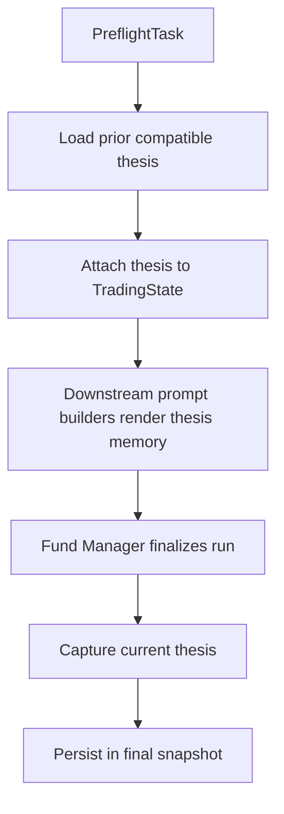

# Add Thesis Memory

## Overview

Add snapshot-backed thesis memory so a new analysis run can load the most recent compatible prior thesis for the same symbol, inject it into downstream prompt context, and persist the current run's thesis for future reuse.

This plan follows the completed Stage 1 evidence/provenance foundation in `docs/superpowers/plans/2026-04-05-evidence-provenance-foundation.md` and implements Milestone 5 from `docs/superpowers/specs/2026-04-05-financial-services-plugins-inspired-architecture-design.md`.

## Problem Frame

Stage 1 established typed evidence, provenance, preflight, and snapshot persistence, but the downstream prompt seam for historical memory is still empty. The repo already has the correct substrate for a first thesis-memory slice: a `PreflightTask`, canonical symbol resolution, typed `TradingState`, and phase snapshots. What is missing is a compact typed memory model, a lookup path for prior compatible runs, a shared prompt helper, and a clear write-back path for the current run's thesis.

The first slice should stay snapshot-store-first. It should not introduce a separate thesis database or a second workflow. It also needs to preserve the repo's fail-open semantics for missing prior memory while keeping runtime storage errors fail-closed.

This plan is asset-shape agnostic. It should work equally for single-stock and ETF runs because thesis memory keys off canonical symbol identity and persisted final-run state, not corporate-fundamental completeness. ETF runs may later pair with weaker or unsupported deterministic valuation, but that does not change the usefulness of cross-run thesis continuity.

## Requirements Trace

- R1. Add typed thesis-memory state under `src/state/thesis.rs` and thread it through `TradingState`.
- R2. Load the most recent compatible prior thesis for the same canonical symbol from the existing snapshot store.
- R3. Missing prior thesis degrades to `None` and the run continues.
- R4. Structurally incompatible or stale/ineligible prior thesis is dropped, logged, and treated as absent.
- R5. Snapshot/runtime storage failures remain hard failures.
- R6. Add `build_thesis_memory_context(state)` and wire it into downstream prompt paths that already expose `{past_memory_str}`.
- R7. Persist the current run's authoritative thesis into the final snapshot so future runs can reuse it.
- R8. Keep the five-phase graph intact.

## Scope Boundaries

- No new thesis database or external storage layer.
- No thesis-specific report section in this slice; report changes can remain deferred unless they become necessary for operator verification.
- No pack-driven thesis policies.
- No second LLM call solely to synthesize memory if the thesis can be derived from existing typed outputs.

## Context & Research

### Relevant Code and Patterns

- `src/workflow/tasks/preflight.rs` already canonicalizes the symbol and seeds shared context keys, but it does not currently have snapshot-store access.
- `src/workflow/snapshot.rs` is the existing persistence boundary and already saves/loads typed `TradingState` snapshots.
- `src/workflow/context_bridge.rs` is the current pattern for typed state/context round-trips.
- `src/agents/researcher/common.rs`, `src/agents/risk/common.rs`, `src/agents/trader/mod.rs`, and `src/agents/fund_manager/prompt.rs` already expose a `past_memory_str` seam.
- `docs/solutions/logic-errors/stale-trading-state-evidence-and-unavailable-data-quality-fallbacks-2026-04-07.md` is directly relevant: new per-cycle state must be reset explicitly and missing derived data must stay semantically distinct from empty values.
- `src/workflow/tasks/trading.rs` owns the phase-5 `FundManagerTask` snapshot save path and is the natural place to persist current-run thesis once the authoritative payload exists.

### Institutional Learnings

- When adding new per-cycle `TradingState` fields, update `src/workflow/pipeline/runtime.rs::reset_cycle_outputs()` in the same change.
- Missing derived prompt data should render as explicit unavailability, not synthetic empty collections.

### External References

- Upstream inspiration: `https://github.com/anthropics/financial-services-plugins`

## Key Technical Decisions

- **Use the existing snapshot store as the first thesis-memory persistence boundary.**
  Rationale: this is the path already reserved by the architecture spec and it fits the repo's current persistence model.

- **Load prior thesis in preflight, not inside individual agents.**
  Rationale: preflight is the existing cross-run normalization seam and already owns symbol canonicalization.

- **Use canonical symbol semantics for lookup.**
  Rationale: `PreflightTask` already rewrites `TradingState.asset_symbol` to the canonical symbol. Thesis reuse should align with that authority.

- **Keep thesis memory independent from valuation support.**
  Rationale: ETF runs and other unsupported valuation shapes should still be able to reuse prior thesis context. Memory should not be gated on whether deterministic valuation produced a structured result.

- **Keep the thesis payload compact and typed.**
  Rationale: downstream prompts need a bounded memory block, not raw prior snapshots.

- **Persist the current run's thesis in the phase-5 `FundManagerTask` path.**
  Rationale: that task already writes the authoritative final snapshot for the run.

- **Use `TradingState` as the canonical thesis-memory read path for prompt builders.**
  Rationale: downstream prompt helpers already read state, so introducing a separate context-only source of truth would add avoidable drift.

- **Define a bounded first-slice snapshot lookup rule up front.**
  Rationale: the current snapshot store has no symbol index or thesis-specific lookup API, so the implementation must either add metadata/schema support or accept a bounded scan of final snapshots.

- **Add a symbol column and index to the snapshot schema.**
  Rationale: the current schema (`migrations/0001_create_phase_snapshots.sql`) only indexes by `(execution_id, phase_number)`. Symbol-based thesis lookup requires at minimum a `symbol TEXT` column with an index. A narrow migration is preferable to a bounded scan that would degrade as snapshot count grows.

- **Add a schema version marker to the snapshot table.**
  Rationale: this plan and later plans (enrichment, valuation) will progressively add metadata to snapshots. A `schema_version INTEGER DEFAULT 1` column allows forward detection and explicit compatibility gating without requiring a separate migration framework.

- **Persist thesis as an additive optional field on the existing phase-5 snapshot row, not as a separate row.**
  Rationale: thesis is a property of the run's final state, not a standalone artifact. Keeping it on the same row avoids orphaned-row management and aligns with the existing snapshot-per-phase model.

- **Guard against thesis drift from positive feedback loops.**
  Rationale: thesis memory injects the LLM's own prior output as authoritative context. The first slice should include a staleness window (e.g., max age in days) and the prompt helper should frame prior thesis as "historical context for reference" rather than "established conclusion."

## Open Questions

### Resolved During Planning

- **Where should prior thesis be loaded?**
  In `PreflightTask`.

- **Should missing prior thesis abort the run?**
  No.

- **Which symbol authority should thesis lookup use?**
  The canonical preflight-resolved symbol.

### Deferred to Implementation

- **Exact thesis schema shape and field names.**
  The plan fixes the boundary and responsibilities; exact fields can be finalized when touching `src/state/thesis.rs` and the prompt builder.

- **Exact compatibility rule for “most recent compatible snapshot lineage.”**
  The first implementation should choose one explicit rule before coding begins: either a bounded scan over recent phase-5 snapshots, or a small schema/index extension that makes canonical-symbol lookup direct.

- **Exact authoritative source for the persisted thesis payload.**
  The implementation should derive it from existing final-run typed outputs in one explicit place instead of leaving the source ambiguous across `TradeProposal`, `ExecutionStatus`, and debate summaries.

## High-Level Technical Design

> *This illustrates the intended approach and is directional guidance for review, not implementation specification. The implementing agent should treat it as context, not code to reproduce.*

## Implementation Units

- [x] **Chunk 1: Thesis state model and snapshot lookup seam**

**Goal:** Define the typed thesis-memory payload and a lookup seam against the existing snapshot store.

**Requirements:** R1, R2, R3, R4, R5

**Dependencies:** Stage 1 is complete.

**Files:**
- Create: `src/state/thesis.rs`
- Create: `migrations/0002_add_symbol_and_schema_version.sql`
- Modify: `src/state/mod.rs`
- Modify: `src/state/trading_state.rs`
- Modify: `src/workflow/snapshot.rs`
- Test: `src/state/thesis.rs`
- Test: `src/workflow/snapshot.rs`
- Test: `tests/state_roundtrip.rs`

**Approach:**
- Add a compact typed thesis-memory payload.
- Add a `symbol TEXT` column and index to the snapshot schema via a new migration (`migrations/0002_add_symbol_and_schema_version.sql`). Also add a `schema_version INTEGER DEFAULT 1` column for forward compatibility with later plans.
- Extend snapshots with one explicit lookup strategy to retrieve the most recent compatible thesis for the current canonical symbol using the new symbol index.
- When multiple prior snapshots exist for the same symbol, select the most recent phase-5 snapshot by `created_at DESC` with a configurable staleness window (e.g., max 30 days). Log and skip snapshots that fail deserialization or compatibility checks.
- Preserve additive serde compatibility.

**Patterns to follow:**
- `src/workflow/snapshot.rs`
- `src/state/evidence.rs`
- `tests/state_roundtrip.rs`

**Test scenarios:**
- Happy path: thesis payload round-trips through state and snapshot serialization.
- Edge case: older snapshots without thesis fields still deserialize cleanly.
- Edge case: no prior thesis returns `None`.
- Error path: malformed snapshot payload remains a hard storage failure.

**Verification:**
- Snapshot/state tests prove thesis memory can be serialized, deserialized, and looked up safely.

- [x] **Chunk 2: Preflight load path and context contract**

**Goal:** Load prior thesis into the current run before any downstream prompt construction.

**Requirements:** R2, R3, R5, R6

**Dependencies:** Chunk 1

**Files:**
- Modify: `src/workflow/tasks/common.rs`
- Modify: `src/workflow/tasks/preflight.rs`
- Modify: `src/workflow/context_bridge.rs`
- Modify: `src/workflow/pipeline/runtime.rs`
- Test: `src/workflow/tasks/preflight.rs`
- Test: `src/workflow/context_bridge.rs`

**Approach:**
- Widen the `PreflightTask` constructor to accept snapshot-store access (e.g., `Arc<SnapshotStore>` or a trait-bounded lookup handle). This is a breaking interface change to `PreflightTask::new()` and the corresponding `build_graph()` call site in `runtime.rs`. The implementing agent must update both the constructor and the pipeline build path in the same change.
- Have preflight resolve current canonical symbol, load prior thesis, and attach it to `TradingState` before downstream prompt construction.
- Only add a dedicated context key if a concrete non-state consumer requires it; otherwise keep `TradingState` as the single source of truth.
- Keep missing memory as an explicit absence value, not a missing-key corruption case.

**Patterns to follow:**
- `src/workflow/tasks/preflight.rs`
- `src/workflow/context_bridge.rs`

**Test scenarios:**
- Happy path: preflight loads prior thesis and makes it available to downstream consumers.
- Edge case: no compatible prior thesis yields explicit absence and run continues.
- Edge case: ETF runs load prior thesis exactly the same way as single-stock runs.
- Edge case: reused pipeline runs do not leak stale thesis state across cycles.
- Error path: lookup/storage failure surfaces clearly at preflight.

**Verification:**
- Preflight/context tests prove prior thesis is seeded before downstream prompt builders run.

- [x] **Chunk 3: Shared prompt helper and downstream prompt consumption**

**Goal:** Replace empty `{past_memory_str}` behavior with a bounded, sanitized thesis-memory block.

**Requirements:** R6

**Dependencies:** Chunk 2

**Files:**
- Modify: `src/agents/shared/prompt.rs`
- Modify: `src/agents/researcher/common.rs`
- Modify: `src/agents/risk/common.rs`
- Modify: `src/agents/trader/mod.rs`
- Modify: `src/agents/fund_manager/prompt.rs`
- Modify: `docs/prompts.md`
- Test: `src/agents/shared/prompt.rs`
- Test: `src/agents/researcher/common.rs`
- Test: `src/agents/risk/common.rs`
- Test: `src/agents/trader/tests.rs`
- Test: `src/agents/fund_manager/tests.rs`

**Approach:**
- Add `build_thesis_memory_context(state)` in the shared prompt helper layer.
- Render explicit fallback text when memory is absent.
- Reuse existing sanitization and bounded-context patterns.

**Execution note:** Add prompt-rendering coverage before replacing the current empty-string seam.

**Patterns to follow:**
- `src/agents/shared/prompt.rs`
- current prompt-boundary tests in `src/agents/trader/tests.rs` and `src/agents/fund_manager/tests.rs`

**Test scenarios:**
- Happy path: prompt builders include thesis memory when present.
- Edge case: absent thesis renders explicit fallback text.
- Edge case: oversized thesis is truncated/sanitized safely.
- Error path: malformed thesis payload does not crash prompt rendering.

**Verification:**
- Prompt tests prove historical memory is consumed safely and boundedly.

- [x] **Chunk 4: Persist current-run thesis for future runs**

**Goal:** Ensure run N+1 can reuse thesis from run N.

**Requirements:** R7, R8

**Dependencies:** Chunks 1-3

**Files:**
- Modify: `src/workflow/tasks/trading.rs`
- Modify: `src/workflow/pipeline/runtime.rs`
- Test: `src/workflow/tasks/trading.rs`
- Test: `tests/workflow_pipeline_e2e.rs`

**Approach:**
- Define the final authoritative thesis capture point in the phase-5 `FundManagerTask` path.
- Build the thesis payload from existing final-run typed outputs in one explicit helper so the source of truth is deterministic and reviewable.
- Persist current-run thesis before the final snapshot save.
- Update reset-cycle logic so thesis memory does not leak across reused runs.

**Patterns to follow:**
- `src/workflow/tasks/trading.rs`
- `src/workflow/pipeline/runtime.rs`
- `docs/solutions/logic-errors/stale-trading-state-evidence-and-unavailable-data-quality-fallbacks-2026-04-07.md`

**Test scenarios:**
- Happy path: final snapshot contains the current run's thesis.
- Edge case: next run loads prior thesis from the most recent compatible run.
- Edge case: reset-cycle logic clears stale thesis on reused runs.
- Error path: final snapshot failure still surfaces as a hard failure.

**Verification:**
- Multi-run tests prove thesis memory closes the loop correctly.

## System-Wide Impact

- **Interaction graph:** preflight -> prior-thesis lookup -> `TradingState` thesis field -> downstream prompt context -> phase-5 thesis capture -> final snapshot.
- **Error propagation:** missing prior thesis is soft; storage/runtime failures remain hard.
- **State lifecycle risks:** thesis memory is per-cycle and must be reset explicitly on reused runs.
- **Integration coverage:** snapshot lookup, prompt injection, reused-run reset, and final persistence all need cross-layer tests.
- **Unchanged invariants:** five-phase graph remains intact; snapshot store stays the persistence boundary.

## Risks & Dependencies

| Risk                                                        | Mitigation                                                                                                                             |
|-------------------------------------------------------------|----------------------------------------------------------------------------------------------------------------------------------------|
| Snapshot schema lacks an indexed thesis lookup path         | Add `symbol` column and index via migration; avoid unbounded scans                                                                     |
| Snapshot schema has no versioning for forward compatibility | Add `schema_version` column in the same migration; later plans check version before deserializing                                      |
| Stale thesis leaks across reused runs                       | Update `reset_cycle_outputs()` and add reused-run regression coverage                                                                  |
| Prompt bloat from historical memory                         | Centralize rendering in a bounded shared prompt helper                                                                                 |
| Thesis feedback loop reinforces prior hallucinations        | Apply staleness window, frame prior thesis as reference context not authoritative conclusion, and log reuse events for operator review |
| Snapshot storage growth from persisting thesis text         | Keep thesis payload compact and typed; defer rich thesis payloads to a later slice if size becomes a concern                           |

## Documentation / Operational Notes

- Update `docs/prompts.md` to describe thesis-memory prompt behavior.
- If snapshot lookup becomes too awkward or expensive, capture a later follow-on for a dedicated thesis index rather than expanding this slice.

## Sources & References

- Origin milestone: `docs/superpowers/specs/2026-04-05-financial-services-plugins-inspired-architecture-design.md`
- Prerequisite plan: `docs/superpowers/plans/2026-04-05-evidence-provenance-foundation.md`
- Related solution: `docs/solutions/logic-errors/stale-trading-state-evidence-and-unavailable-data-quality-fallbacks-2026-04-07.md`
