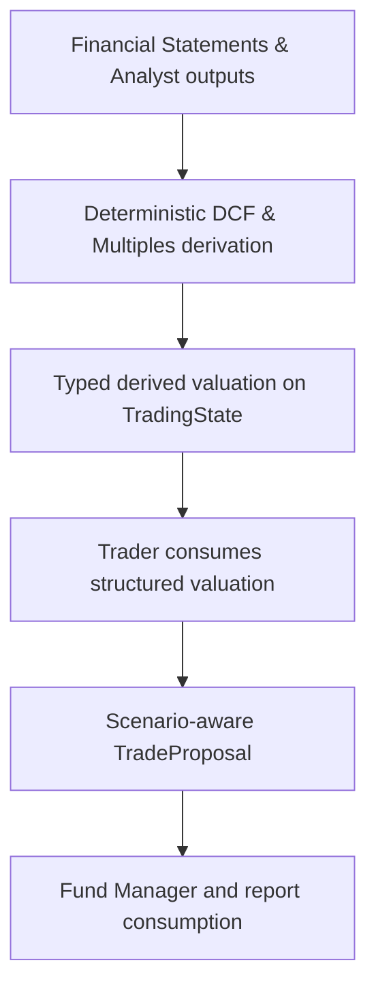

# Add Scenario Valuation

## Overview

Add typed scenario valuation so the trader, fund manager, and report layer reason from deterministic valuation structures rather than relying on prompt-only free-text valuation summaries.

This plan implements Milestone 6 from `docs/superpowers/specs/2026-04-05-financial-services-plugins-inspired-architecture-design.md` and builds on the completed Stage 1 foundation.

## Problem Frame

The current system already expects valuation-oriented reasoning: `TradeProposal` carries `valuation_assessment`, the Trader prompt references historical norms, and the Fund Manager prompt anchors entry guidance and sizing to valuation. But none of that is typed or deterministic yet. There is no `src/state/derived.rs`, no structured valuation snapshot, and no scenario-aware fields in the proposal schema.

This milestone should move valuation shape and computations into Rust. The first slice needs to stay bounded: it should define where deterministic valuation lives, how it flows into the trader proposal, how downstream consumers read it, and how it degrades safely when valuation inputs are incomplete.

ETF coverage needs to be treated as a first-class compatibility case in that degradation model. For ETFs, standard corporate fundamental inputs like free cash flow, EBITDA, or shares outstanding may be legitimately `None`. That is a domain-valid absence, not necessarily a data-quality failure. The plan must therefore avoid assuming that missing corporate fundamentals imply a broken analysis run; instead, deterministic valuation should either use asset-type-appropriate inputs when they exist or emit an explicit "not assessed for this asset shape" outcome.

## Requirements Trace

- R1. Add typed derived valuation state under `src/state/derived.rs`.
- R2. Add scenario-aware valuation fields to `src/state/proposal.rs`.
- R3. Compute valuation deterministically in Rust rather than leaving it fully implicit inside prompts.
- R4. Preserve existing partial-data degradation behavior when valuation inputs are incomplete.
- R5. Make the richer valuation visible to trader/fund-manager/report consumers.
- R6. Keep state, snapshot, and prompt/report contracts backward-compatible.

## Scope Boundaries

- No new provider integration requirement in this slice beyond what is needed to define/store deterministic valuation inputs (using the existing `yfinance-rs` dependency).
- No separate scenario simulation engine.
- No analysis-pack policy extraction.
- No workflow topology changes.

## Context & Research

### Relevant Code and Patterns

- `src/state/proposal.rs` currently has only `valuation_assessment: Option<String>`.
- `src/workflow/tasks/analyst.rs` / `AnalystSyncTask` is the current cross-source deterministic merge point.
- `src/agents/trader/mod.rs` already asks the model to reason from valuation and historical norms.
- `src/agents/fund_manager/prompt.rs` already consumes valuation conceptually.
- `src/report/final_report.rs` currently renders a single valuation row.
- `src/state/fundamental.rs` currently exposes typed fundamental inputs.
- `src/state/trading_state.rs` already carries `current_price`, and `src/state/technical.rs` already carries `support_level` / `resistance_level`.
- The repo already depends on `yfinance-rs = 0.7.2`. While its `Info` struct has missing inputs, `yfinance-rs 0.7.2` natively provides full financial statements (`quarterly_cashflow`, `quarterly_balance_sheet`, `quarterly_income_stmt`, `quarterly_shares`) and earnings trends (`earnings_trend`). This means we CAN compute deterministic Discounted Cash Flow (DCF), EV/EBITDA, Forward P/E, and PEG ratios for corporate equities natively.
- `yfinance_rs::profile::Profile` can distinguish company vs fund-style instruments when lookup succeeds. `Profile::Fund` is the cleanest current path for identifying ETF/fund-like runs instead of inferring asset shape only from missing corporate fundamentals, but profile lookup itself must remain optional and fall back cleanly when absent.
- Existing metric semantics also need normalization before they are safe for deterministic math. In particular, `net_income` is currently populated from either `netIncomeGrowth3Y` or `netIncomeAnnual`, which mixes a growth rate with an absolute value; `eps` and `revenue_growth_pct` also fall back across mixed horizons (`Annual`, `TTM`, `3Y`, `YoY`) and need explicit precedence rules.
- ETF analysis is a special case for this plan: current typed fundamentals are equity-centric, and ETF runs may legitimately have many of those fields as `None` (and `yfinance-rs` still lacks ETF-native metrics like NAV and expense ratio). The runtime has no asset-class discriminator today, so the first slice should treat unsupported valuation shapes as an explicit no-assessment path rather than as corrupted or low-quality data.
- `docs/solutions/logic-errors/stale-trading-state-evidence-and-unavailable-data-quality-fallbacks-2026-04-07.md` is relevant because any new per-cycle valuation fields must be reset explicitly.

### Institutional Learnings

- New cycle-scoped `TradingState` fields must be added to `src/workflow/pipeline/runtime.rs::reset_cycle_outputs()`.

### External References

- Upstream inspiration: `https://github.com/anthropics/financial-services-plugins`

## Key Technical Decisions

- **Add typed derived valuation state, not more free-form strings.**
  Rationale: the trader should consume structured valuation inputs, not invent them ad hoc.

- **Compute deterministic valuation before trader inference.**
  Rationale: this keeps scenario logic in Rust and lets the LLM interpret rather than originate the valuation model.

- **Keep proposal schema growth additive and optional-first.**
  Rationale: downstream tests, snapshots, and consumers currently assume a small proposal shape.

- **Treat ETF-style missing corporate fundamentals as domain-valid absence.**
  Rationale: for ETFs, fields like free cash flow or EBITDA may be structurally unavailable. The deterministic valuation layer must not interpret those nulls as a broken run or automatically downgrade data quality. Instead, it should emit an explicit unsupported/insufficient-input outcome (`NotAssessed`) for corporate-equity valuation and let downstream prompts/reports surface that honestly.

- **Use `yfinance_rs::profile::Profile` as the first asset-shape signal when available.**
  Rationale: the runtime currently has no dedicated asset-class field, but `Profile::Fund` provides a cleaner signal for ETF/fund-like instruments than relying only on absent corporate fundamentals. This supports a more honest `NotAssessed` path for fund instruments without introducing a new provider.

- **Treat `yfinance_rs::profile::Profile` as additive optional context, never a required input.**
  Rationale: Yahoo responses are often partially populated or fail outright. Missing profile data must degrade to data-shape-based detection or `NotAssessed`, not to schema/runtime failure.

- **Separate valuation-core inputs from supporting context.**
  Rationale: `current_price`, cash flows, income statements, balance sheets, and shares outstanding are the typed inputs most directly relevant to deterministic valuation. Other fields should remain qualitative/supporting signals or be reduced into a small derived sentiment summary.

- **Pull comprehensive financial statements via `yfinance_rs`.**
  Rationale: `yfinance_rs 0.7.2` natively provides `quarterly_cashflow`, `quarterly_balance_sheet`, `quarterly_income_stmt`, `quarterly_shares`, and `earnings_trend`. These provide the exact inputs needed for real deterministic DCF, EV/EBITDA, Forward P/E, and PEG ratio calculations without relying on the limited `Info` struct.

- **Compute deterministic DCF, EV/EBITDA, Forward P/E, and PEG ratios.**
  Rationale: With the full financial statements and earnings trends now available, the runtime can definitively calculate these intrinsic and relative valuation metrics to ground the trader prompt in hard numbers.

- **Split supported first-slice valuation shapes from unsupported ones.**
  Rationale: The current typed inputs and the new `yfinance_rs` statements support a bounded corporate-equity valuation path. They do not yet support ETF-native valuation (which requires NAV, expense ratios, etc.). The first slice should therefore model at least two outcomes: `CorporateEquityValuation` when enough normalized inputs exist, and `NotAssessed { reason }` when the asset/input shape does not support deterministic valuation yet.

- **Normalize metric semantics before using them in valuation math.**
  Rationale: deterministic Rust math requires stable units and horizons. Fields that silently mix annual, TTM, multi-year growth, or absolute-value variants must define one explicit precedence rule or be split into separate typed fields before they are consumed by valuation logic.

- **Add new proposal fields with explicit `#[serde(default)]` and document them in the JsonSchema description before prompt updates land.**
  Rationale: `TradeProposal` uses `#[derive(JsonSchema)]` for LLM structured output. Adding scenario-aware fields in Chunk 1 before the prompt updates in Chunk 5 creates a window where the schema includes unexplained fields. Mitigation: use `Option<T>` with `#[serde(default)]` so the LLM can omit them, and add `#[schemars(description = "...")]` annotations that explain each field's purpose in the schema itself. This reduces hallucination risk even before the full prompt update lands.

- **Add explicit report support in the same milestone.**
  Rationale: structured valuation should be visible and auditable once it exists.

## Open Questions

### Resolved During Planning

- **Should valuation live only in `TradeProposal`?**
  No. Add derived valuation state first, then flow the final scenario-aware output into `TradeProposal`.

- **Should scenario values be LLM-authored?**
  No. The runtime should compute them deterministically based on real financial statements.

- **Should the report layer expose the new valuation structure?**
  Yes.

### Deferred to Implementation

- **How ETF runs are identified in the absence of an asset-class field.**
  The first slice should not add a new asset-type system unless it becomes necessary. Start with `yfinance_rs::profile::Profile` when available (`Profile::Fund` => fund/ETF-like), then fall back to data-shape detection when profile lookup is absent or inconclusive. Missing Yahoo profile/info data must not itself be treated as proof of asset shape; it is only one optional signal. When the run lacks the normalized corporate inputs required by the valuation model, return an explicit `NotAssessed` result with a reason like `unsupported_asset_shape` or `insufficient_corporate_fundamentals`.

- **Whether risk agents need full direct valuation context or only the expanded proposal.**
  This can be finalized after implementing the typed state and proposal changes.

## High-Level Technical Design

> *This illustrates the intended approach and is directional guidance for review, not implementation specification. The implementing agent should treat it as context, not code to reproduce.*

## Implementation Units

- [x] **Chunk 0: Make Yahoo Finance rate limit configurable**

**Goal:** Wire Yahoo Finance's hardcoded `10 RPS` ceiling into the same config-driven pattern already used for Finnhub and FRED, so operators can tune or disable it without recompiling.

**Requirements:** R6 (backward-compatible config change)

**Dependencies:** Stage 1 is complete.

**Files:**
- Modify: `src/config.rs`
- Modify: `src/rate_limit.rs`
- Modify: `config.toml`
- Modify: `src/data/yfinance/ohlcv.rs`
- Modify: wherever `YFinanceClient::default()` is called in the pipeline (compile-fix cascade if needed)
- Test: `src/config.rs` (unit)
- Test: `src/rate_limit.rs` (unit)

**Approach:**
- Add `yahoo_finance_rps: u32` to `RateLimitConfig` in `src/config.rs`, with `#[serde(default = "default_yahoo_finance_rps")]` and a default value of `10` (matching the current hardcoded constant).
- Add `fn default_yahoo_finance_rps() -> u32 { 10 }` and update `RateLimitConfig::default()`.
- Add `SharedRateLimiter::yahoo_finance_from_config(cfg: &RateLimitConfig) -> Option<Self>` to `src/rate_limit.rs`, mirroring `finnhub_from_config` and `fred_from_config`: return `None` when `cfg.yahoo_finance_rps == 0` (disabled), otherwise `Some(Self::new("yahoo_finance", cfg.yahoo_finance_rps))`.
- Add `YFinanceClient::from_config(cfg: &RateLimitConfig) -> Self` to `src/data/yfinance/ohlcv.rs` that calls `SharedRateLimiter::yahoo_finance_from_config(cfg).unwrap_or_else(|| SharedRateLimiter::disabled("yahoo_finance"))`. Keep `YFinanceClient::default()` as a convenience wrapper that calls `from_config(&RateLimitConfig::default())`.
- Add `yahoo_finance_rps = 10` to the `[rate_limits]` section in `config.toml` with a comment matching the style of `finnhub_rps` and `fred_rps`.
- Update pipeline construction sites that build `YFinanceClient` to use `YFinanceClient::from_config(&cfg.rate_limits)` instead of `YFinanceClient::default()`.

**Patterns to follow:**
- `SharedRateLimiter::finnhub_from_config` / `fred_from_config` in `src/rate_limit.rs`
- `finnhub_rps` / `fred_rps` in `src/config.rs` and `config.toml`

**Test scenarios:**
- `yahoo_finance_rps = 0` in config produces `SharedRateLimiter::disabled` (no blocking).
- `yahoo_finance_rps = 5` produces a limiter with the correct label `"yahoo_finance"`.
- `RateLimitConfig::default()` gives `yahoo_finance_rps = 10`.
- `SCORPIO__RATE_LIMITS__YAHOO_FINANCE_RPS=5` env override is honoured.
- `YFinanceClient::default()` still compiles and behaves identically to the pre-change code (regression guard).

**Verification:**
- `cargo clippy --all-targets -- -D warnings` passes.
- Existing `YFinanceClient` unit tests still pass.

- [ ] **Chunk 1: Derived valuation state and proposal schema**

**Goal:** Define the typed structures and fetch real financial data before touching prompts or reports.

**Requirements:** R1, R2, R6

**Dependencies:** Chunk 0

**Files:**
- Create: `src/state/derived.rs`
- Modify: `src/state/mod.rs`
- Modify: `src/state/proposal.rs`
- Modify: `src/state/trading_state.rs`
- Modify: `src/data/yfinance/mod.rs`
- Modify: `src/data/yfinance/financials.rs` (exposes quarterly Cashflow, Balance Sheet, Income Statement, Shares, Earnings Trend, and Profile as `YFinanceClient` methods; already exists as of the `price.rs`/`ohlcv.rs` refactor)
- Modify (compile-fix cascade): `src/agents/risk/aggressive.rs`
- Modify (compile-fix cascade): `src/agents/risk/conservative.rs`
- Modify (compile-fix cascade): `src/agents/risk/neutral.rs`
- Modify (compile-fix cascade): `src/agents/risk/moderator.rs`
- Modify (compile-fix cascade): `src/providers/factory/agent.rs`
- Modify (compile-fix cascade): `src/providers/factory/retry.rs`
- Modify (compile-fix cascade): `src/workflow/tasks/test_helpers.rs`
- Test: `src/state/derived.rs`
- Test: `tests/state_roundtrip.rs`

**Approach:**
- Add typed scenario valuation structures for DCF, EV/EBITDA, Forward P/E, and PEG ratios.
- Update `src/data/yfinance/mod.rs` to re-export `financials` alongside `ohlcv` and `price` — the module now has three layers: `ohlcv` (raw OHLCV fetcher and `rig` tool plumbing), `price` (derived price queries: `get_latest_close`, `fetch_vix_data`), and `financials` (financial statement and profile methods on `YFinanceClient`).
- Add an explicit valuation-input inventory that relies on these real financial statements.
- Add a small typed asset-shape seam sourced from `yfinance_rs::profile::Profile` so the runtime can distinguish company-style and fund-style instruments.
- Define the typed seam so `Profile` is optional. The runtime must handle missing profiles cleanly.
- Add an explicit no-assessment branch (`NotAssessed`) to the derived valuation schema so ETF-style runs with domain-valid null corporate fundamentals do not violate assumptions. The schema should be able to represent "valuation not assessed" with a typed reason.
- Extend `TradeProposal` with optional scenario-aware fields.
- Keep serde compatibility additive.

**Patterns to follow:**
- `src/state/proposal.rs`
- `tests/state_roundtrip.rs`

**Test scenarios:**
- Happy path: derived valuation and expanded proposal fields round-trip through serde.
- Edge case: old snapshots/proposals without the new fields still deserialize.
- Edge case: `Profile::Fund` or equivalent fund-style asset shape serializes into an explicit `NotAssessed` valuation outcome rather than a broken corporate-equity path.
- Edge case: ETF-style inputs with `None` for corporate fundamentals serialize into an explicit `NotAssessed` valuation outcome rather than failing validation.
- Edge case: risk agents compile and pass existing tests with the expanded proposal schema (regression).
- Error path: proposal validation rejects inconsistent structured valuation.

**Verification:**
- State/property tests prove the new structures are additive and validatable.

- [x] **Chunk 2: Live yfinance-rs API smoke test**

**Goal:** Verify that every method in `src/data/yfinance/` makes a successful real network call and returns data in the expected shape before any derivation logic is built on top of it.

**Requirements:** R3 (prerequisite confidence gate)

**Dependencies:** Chunk 1 (the financial statement and profile methods added there must be covered here)

**Files:**
- Create: `examples/yfinance_live_test.rs`

**Approach:**
- Write a standalone `tokio::main` binary under `examples/` that can be run with `cargo run --example yfinance_live_test`.
- Use a well-known, liquid equity (`AAPL`) as the test symbol and a recent but fixed 30-day date window so results are deterministic for a given run.
- Cover every public method currently in `src/data/yfinance/`:
  - `YFinanceClient::get_ohlcv` — assert non-empty `Vec<Candle>`, each candle has a valid date and positive OHLCV values.
  - `get_latest_close(&client, symbol, as_of_date)` (free function from `price.rs`) — assert `Some(price)` with `price > 0.0`.
  - `fetch_vix_data(&client, as_of_date)` (free function from `price.rs`) — assert `Some(MarketVolatilityData)` with a non-zero `vix_level` in a plausible range.
  - All financial statement fetchers on `YFinanceClient` from `financials.rs` (`get_quarterly_cashflow`, `get_quarterly_balance_sheet`, `get_quarterly_income_stmt`, `get_quarterly_shares`, `get_earnings_trend`) — assert `Some` result and that the returned vec is non-empty.
  - `YFinanceClient::get_profile` (from `financials.rs`) — assert `Some(Profile)` for the test equity symbol.
- Also cover a known ETF symbol (`SPY`) to confirm that the profile call returns `Profile::Fund` (or equivalent) and that financial statement fetchers return `None` / empty gracefully rather than panicking.
- Print a human-readable pass/fail summary for each call so a developer can run this manually and immediately spot which API has become unavailable or changed shape.
- The example must compile with `--all-features` but must NOT be run automatically in CI (`cargo nextest` does not execute `examples/`). Add a comment at the top of the file making this explicit.
- Do not introduce any new `Cargo.toml` dependencies; use only crates already in the dependency graph (`tokio`, `tracing`, `tracing-subscriber`, `chrono`).

**Patterns to follow:**
- `src/data/yfinance/ohlcv.rs` — how `YFinanceClient` and `YfClient` are constructed
- `src/data/yfinance/price.rs` — how `fetch_vix_data` and `get_latest_close` are called as free functions taking `&YFinanceClient`
- `src/data/yfinance/financials.rs` — the financial statement and profile methods on `YFinanceClient`

**Test scenarios:**
- Happy path (equity): all six method groups return `Ok(Some(_))` / `Ok(_)` with non-trivially-populated data for `AAPL`.
- Degradation path (ETF): `get_profile("SPY")` returns `Profile::Fund`; financial statement calls for `SPY` return `None` or empty without panicking.
- Shape validation: candle dates are in `YYYY-MM-DD` format, financial statement rows have at least one non-`None` numeric column, VIX value is in a plausible range (1–100).

**Verification:**
- Developer runs `cargo run --example yfinance_live_test` and sees all checks pass. Failures are printed with the raw error so the root cause is immediately visible without needing `RUST_LOG=debug`.

- [x] **Chunk 3: Deterministic valuation derivation in the runtime**

**Goal:** Compute structured valuation using real financial statements before trader inference.

**Requirements:** R1, R3, R4

**Dependencies:** Chunks 1–2

**Files:**
- Modify: `src/workflow/tasks/analyst.rs`
- Modify: `src/workflow/pipeline/runtime.rs`
- Modify: `src/workflow/tasks/tests.rs`
- Test: `src/workflow/tasks/tests.rs`

**Approach:**
- Extend the cross-source deterministic merge path to compute a typed valuation payload.
- Compute deterministic intrinsic value ranges (DCF, EV/EBITDA, Forward P/E, PEG) from the `yfinance_rs` fetched financial statements (Cashflow, Balance Sheet, Income Statement, Shares).
- Use `yfinance_rs::profile::Profile` first, and missing-corporate-input shape second, to decide whether the run should follow the bounded corporate-equity path or emit `NotAssessed`.
- When the input shape looks ETF/fund-like or otherwise lacks the required corporate fundamentals, emit `NotAssessed` with an explicit reason instead of treating the run as invalid.
- Never coerce absent fields into fake numeric values. A valuation rule may only run if all of its required inputs are present; otherwise it must produce a partial result or `NotAssessed`.
- Persist the derived valuation on `TradingState` for downstream use.
- Make the control-flow contract explicit in code and tests: missing inputs continue without valuation; invalid computed values either drop valuation with an explicit fallback path or fail the task.

**Execution note:** Start with failing sync-task tests for full-data, partial-data, and invalid-range cases before changing the runtime logic.

**Patterns to follow:**
- `src/workflow/tasks/analyst.rs`
- existing continue-on-partial-data behavior

**Test scenarios:**
- Happy path: complete financial statements yield derived intrinsic valuation state.
- Edge case: missing inputs produce partial or absent valuation while the run still continues.
- Edge case: ETF-style runs with null corporate fundamentals produce `NotAssessed` and the cycle still continues.
- Edge case: Yahoo profile lookup fails or returns no profile, and the runtime still falls back to data-shape detection safely.

**Verification:**
- Workflow-task tests prove deterministic valuation exists and respects existing degradation rules.

- [ ] **Chunk 4: Trader and fund-manager prompt integration**

**Goal:** Make downstream reasoning consume structured valuation instead of prompt-only free-text valuation expectations.

**Requirements:** R2, R3, R5

**Dependencies:** Chunk 3

**Files:**
- Modify: `src/agents/shared/prompt.rs`
- Modify: `src/agents/trader/mod.rs`
- Modify: `src/agents/fund_manager/prompt.rs`
- Test: `src/agents/trader/tests.rs`
- Test: `src/agents/fund_manager/tests.rs`

**Approach:**
- Add a shared prompt-context builder for structured valuation state if needed.
- Update trader/fund-manager prompts to consume the typed deterministic DCF, EV/EBITDA, Forward P/E, and PEG computations from the proposal/state fields.
- Make prompt fallback explicit for ETF-style `NotAssessed` outcomes so downstream agents say valuation is not applicable / not supported for the current asset shape rather than pretending data is merely missing.
- Preserve explicit fallback behavior when valuation is partial or absent.

**Patterns to follow:**
- `src/agents/shared/prompt.rs`
- current prompt-boundary tests

**Test scenarios:**
- Happy path: trader/fund-manager prompts include structured valuation context.
- Edge case: absent valuation yields explicit fallback text.
- Edge case: ETF-style `NotAssessed` valuation yields explicit "not assessed for this asset shape" prompt text.
- Edge case: partial valuation is surfaced honestly without fabricated values.
- Error path: prompt rendering remains bounded and safe.

**Verification:**
- Prompt tests prove structured valuation is consumed safely and explicitly.

- [ ] **Chunk 5: Final report and reused-run hardening**

**Goal:** Surface valuation in operator output and prevent stale valuation state reuse across cycles.

**Requirements:** R4, R5, R6

**Dependencies:** Chunks 1-4

**Files:**
- Create: `src/report/valuation.rs`
- Modify: `src/report/mod.rs`
- Modify: `src/report/final_report.rs`
- Modify: `src/workflow/pipeline/runtime.rs`
- Test: `src/report/final_report.rs`
- Test: `tests/workflow_pipeline_e2e.rs`

**Note:** Creating `src/report/valuation.rs` follows the existing pattern of `src/report/coverage.rs` and `src/report/provenance.rs` — dedicated report section helpers that are composed by `final_report.rs`. If the valuation section proves too small to justify a separate file, the implementing agent may inline it into `final_report.rs` instead.

**Approach:**
- Add a dedicated valuation report section helper.
- Wire it into the final report.
- Update `reset_cycle_outputs()` for the new derived valuation state.

**Patterns to follow:**
- `src/report/coverage.rs`
- `src/report/provenance.rs`
- `docs/solutions/logic-errors/stale-trading-state-evidence-and-unavailable-data-quality-fallbacks-2026-04-07.md`

**Test scenarios:**
- Happy path: final report renders the valuation section.
- Edge case: missing valuation renders explicit fallback output.
- Edge case: reused pipeline runs do not retain stale valuation state.
- Error path: report rendering never panics on absent structured valuation.

**Verification:**
- Report and pipeline tests prove valuation is visible and cycle-safe.

## System-Wide Impact

- **Interaction graph:** analyst evidence & financial statements -> deterministic valuation derivation -> trader proposal -> fund-manager/report consumption.
- **Error propagation:** incomplete valuation degrades rather than aborting the run; invalid structured valuation must follow one explicit, tested contract at the analyst-sync seam.
- **State lifecycle risks:** new derived fields must be reset between reused runs.
- **Integration coverage:** runtime derivation, proposal-schema changes, prompt consumption, and report rendering all need cross-layer tests.
- **Unchanged invariants:** no workflow-phase additions, no new LLM calls dedicated solely to valuation.

## Risks & Dependencies

| Risk                                                         | Mitigation                                                                                                                             |
|--------------------------------------------------------------|----------------------------------------------------------------------------------------------------------------------------------------|
| Proposal-schema growth breaks downstream consumers           | Change state, prompts, and report/tests together in the same milestone                                                                 |
| Stale derived valuation leaks across reused runs             | Update `reset_cycle_outputs()` and add reused-run regression coverage                                                                  |
| ETF runs violate corporate-equity valuation assumptions      | Represent unsupported asset/input shapes as explicit `NotAssessed` outcomes rather than treating them as failures                      |
| `Profile` coverage is partial or inconsistent across symbols | Treat Yahoo-provided profile as additive optional context and retain explicit `NotAssessed` / fallback behavior when fields are absent |

## Documentation / Operational Notes

- Update `docs/prompts.md` if the valuation contract in trader/fund-manager prompts changes materially.
- Update the "Adding things" table in `AGENTS.md` to document `src/state/derived.rs` and the valuation derivation pattern.

## Sources & References

- Origin milestone: `docs/superpowers/specs/2026-04-05-financial-services-plugins-inspired-architecture-design.md`
- Related solution: `docs/solutions/logic-errors/stale-trading-state-evidence-and-unavailable-data-quality-fallbacks-2026-04-07.md`