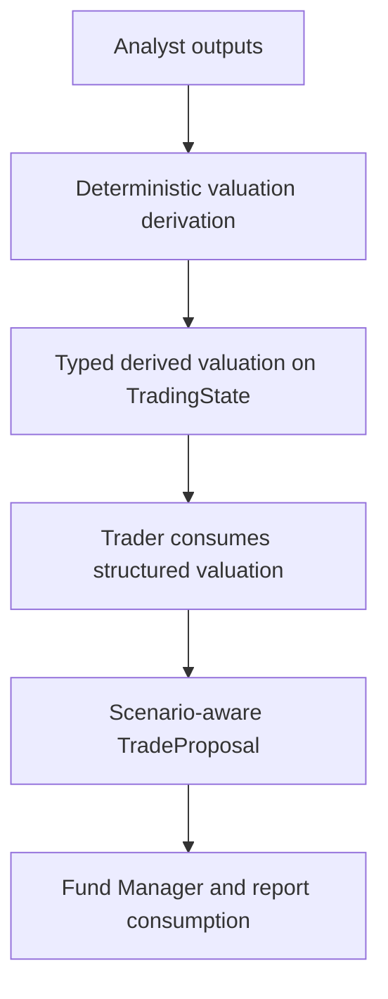

# Add Peer/Comps And Scenario Valuation

## Overview

Add typed peer/comps and scenario valuation so the trader, fund manager, and report layer reason from deterministic valuation structures rather than relying on prompt-only free-text valuation summaries.

This plan implements Milestone 6 from `docs/superpowers/specs/2026-04-05-financial-services-plugins-inspired-architecture-design.md` and builds on the completed Stage 1 foundation.

## Problem Frame

The current system already expects valuation-oriented reasoning: `TradeProposal` carries `valuation_assessment`, the Trader prompt references sector peers and historical norms, and the Fund Manager prompt anchors entry guidance and sizing to valuation. But none of that is typed or deterministic yet. There is no `src/state/derived.rs`, no structured peer/comps snapshot, and no scenario-aware fields in the proposal schema.

This milestone should move valuation shape and computations into Rust. The first slice needs to stay bounded: it should define where deterministic valuation lives, how it flows into the trader proposal, how downstream consumers read it, and how it degrades safely when valuation inputs are incomplete.

ETF coverage needs to be treated as a first-class compatibility case in that degradation model. For ETFs, standard corporate fundamental inputs like `pe_ratio`, `eps`, `revenue_growth_pct`, `gross_margin`, or `debt_to_equity` may be legitimately `None`. That is a domain-valid absence, not necessarily a data-quality failure. The plan must therefore avoid assuming that missing corporate fundamentals imply a broken analysis run; instead, deterministic valuation should either use asset-type-appropriate inputs when they exist or emit an explicit "not assessed for this asset shape" outcome.

## Requirements Trace

- R1. Add typed derived valuation state under `src/state/derived.rs`.
- R2. Add scenario-aware valuation fields to `src/state/proposal.rs`.
- R3. Compute valuation deterministically in Rust rather than leaving it fully implicit inside prompts.
- R4. Preserve existing partial-data degradation behavior when valuation inputs are incomplete.
- R5. Make the richer valuation visible to trader/fund-manager/report consumers.
- R6. Keep state, snapshot, and prompt/report contracts backward-compatible.

## Scope Boundaries

- No new provider integration requirement in this slice beyond what is needed to define/store deterministic valuation inputs.
- No separate scenario simulation engine.
- No analysis-pack policy extraction.
- No workflow topology changes.

## Context & Research

### Relevant Code and Patterns

- `src/state/proposal.rs` currently has only `valuation_assessment: Option<String>`.
- `src/workflow/tasks/analyst.rs` / `AnalystSyncTask` is the current cross-source deterministic merge point.
- `src/agents/trader/mod.rs` already asks the model to reason from valuation, peers, and historical norms.
- `src/agents/fund_manager/prompt.rs` already consumes valuation conceptually.
- `src/report/final_report.rs` currently renders a single valuation row.
- `src/state/fundamental.rs` currently exposes these typed fundamental inputs: `revenue_growth_pct`, `pe_ratio`, `eps`, `current_ratio`, `debt_to_equity`, `gross_margin`, `net_income`, and `insider_transactions`.
- `src/data/finnhub.rs::get_fundamentals()` already fetches and populates `insider_transactions`; insider activity is not a missing Finnhub fetch in the current codebase.
- `src/state/trading_state.rs` already carries `current_price`, and `src/state/technical.rs` already carries `support_level` / `resistance_level`. These are useful for comparing derived fair value to market price and for price-level outputs, but they do not replace missing peer/comps valuation inputs.
- The repo already depends on `yfinance-rs = 0.7.2`, but the current `YFinanceClient` only wraps OHLCV and latest-close usage. Wait: `yfinance_rs 0.7.2` explicitly hardcodes `market_cap`, `shares_outstanding`, `dividend_yield`, `pe_ttm`, and `eps_ttm` to `None` in its `Info` struct. Those fields CANNOT be fetched via the current crate version. The ONLY additive fields reliably available from `yfinance_rs` are `volume` and the `profile::Profile` lookup.
- `yfinance_rs::profile::Profile` can distinguish company vs fund-style instruments when lookup succeeds. `Profile::Fund` is the cleanest current path for identifying ETF/fund-like runs instead of inferring asset shape only from missing corporate fundamentals, but profile lookup itself must remain optional and fall back cleanly when absent.
- The trader prompt currently references valuation concepts the runtime does not yet carry as typed inputs: sector peer medians, historical valuation norms, `P/S`, `PEG`, `EV/EBITDA`, and `DCF` inputs.
- Missing typed inputs for deterministic valuation today include: peer/comps datasets, sector/industry median multiples, historical valuation bands, price-to-sales inputs, PEG inputs, enterprise value / EBITDA inputs, DCF inputs such as free cash flow, discount rate, terminal growth, forecast horizon, market_cap, and shares_outstanding. The current `yfinance_rs = 0.7.2` crate does NOT expose `market_cap` or `shares_outstanding`.
- Existing metric semantics also need normalization before they are safe for deterministic math. In particular, `net_income` is currently populated from either `netIncomeGrowth3Y` or `netIncomeAnnual`, which mixes a growth rate with an absolute value; `eps` and `revenue_growth_pct` also fall back across mixed horizons (`Annual`, `TTM`, `3Y`, `YoY`) and need explicit precedence rules.
- ETF analysis is a special case for this plan: current typed fundamentals are equity-centric, and ETF runs may legitimately have many of those fields as `None`. The runtime has no asset-class discriminator today, so the first slice should treat unsupported valuation shapes as an explicit no-assessment path rather than as corrupted or low-quality data.
- `docs/solutions/logic-errors/stale-trading-state-evidence-and-unavailable-data-quality-fallbacks-2026-04-07.md` is relevant because any new per-cycle valuation fields must be reset explicitly.

### Institutional Learnings

- New cycle-scoped `TradingState` fields must be added to `src/workflow/pipeline/runtime.rs::reset_cycle_outputs()`.

### External References

- Upstream inspiration: `https://github.com/anthropics/financial-services-plugins`

## Key Technical Decisions

- **Add typed derived valuation state, not more free-form strings.**
  Rationale: the trader should consume structured valuation inputs, not invent them ad hoc.

- **Compute deterministic valuation before trader inference.**
  Rationale: this keeps scenario/peer logic in Rust and lets the LLM interpret rather than originate the valuation model.

- **Keep proposal schema growth additive and optional-first.**
  Rationale: downstream tests, snapshots, and consumers currently assume a small proposal shape.

- **Treat peer/comps inputs as optional in the first slice.**
  Rationale: current repo state has no fully-fledged peer provider yet. The plan should support partial valuation and fail-open behavior when peer inputs are missing.

- **Treat ETF-style missing corporate fundamentals as domain-valid absence.**
  Rationale: for ETFs, fields like `pe_ratio`, `eps`, `gross_margin`, or `debt_to_equity` may be structurally unavailable. The deterministic valuation layer must not interpret those nulls as a broken run or automatically downgrade data quality. Instead, it should emit an explicit unsupported/insufficient-input outcome for corporate-equity valuation and let downstream prompts/reports surface that honestly.

- **Use `yfinance_rs::profile::Profile` as the first asset-shape signal when available.**
  Rationale: the runtime currently has no dedicated asset-class field, but `Profile::Fund` provides a cleaner signal for ETF/fund-like instruments than relying only on absent corporate fundamentals. This supports a more honest `NotAssessed` path for fund instruments without introducing a new provider.

- **Treat `yfinance_rs::profile::Profile` as additive optional context, never a required input.**
  Rationale: Yahoo responses are often partially populated or fail outright. Missing profile data must degrade to data-shape-based detection or `NotAssessed`, not to schema/runtime failure.

- **Use a first-slice repo-local peer/comps contract instead of waiting for a provider.**
  Rationale: the repo has no live peer/comps producer today, so deterministic valuation needs an explicit typed seam even if the first slice populates it sparsely or heuristically.

- **Acknowledge that first-slice valuation operates on sparse/absent peer data.**
  Rationale: no concrete peer provider exists until Plan 4. The first-slice deterministic valuation is intentionally a typed infrastructure slice that proves the computation and consumer seams work end-to-end with partial/absent inputs. The value is in establishing the typed contract, not in producing rich valuation outputs. This is acceptable because the plan explicitly requires fail-open behavior (R4) and the typed seam becomes immediately useful once Plan 4 delivers real enrichment.

- **Define the first-slice deterministic heuristic explicitly.**
  Rationale: without a concrete rule, Chunk 2 cannot be implemented or tested. First-slice heuristic: compute a simple relative-valuation ratio from the analyst's extracted financial metrics (e.g., P/E, EV/EBITDA) against sector median values hardcoded or config-driven for the first slice. When peer data is absent, output `None` for the derived valuation and let consumers render the explicit absence. The implementing agent may refine the exact formula but must pin one testable rule before coding.

- **Separate valuation-core inputs from supporting context.**
  Rationale: `current_price`, `revenue_growth_pct`, `pe_ratio`, `eps`, `current_ratio`, `debt_to_equity`, `gross_margin`, and a normalized net-income field are the current typed inputs most directly relevant to deterministic valuation. `insider_transactions` should remain a qualitative/supporting signal or be reduced into a small derived sentiment summary; raw insider records should not drive the core scenario math.

- **Do not rely on `yfinance_rs::Info` for valuation inputs in the active track.**
  Rationale: `yfinance_rs 0.7.2` hardcodes `market_cap`, `shares_outstanding`, `pe_ttm`, `eps_ttm`, and `dividend_yield` to `None`. It cannot supplement the valuation math without an upstream crate update or a custom scraper.

- **Split supported first-slice valuation shapes from unsupported ones.**
  Rationale: the current typed inputs support a bounded corporate-equity valuation path. They do not yet support ETF-native valuation. The first slice should therefore model at least two outcomes: `CorporateEquityValuation` when enough normalized inputs exist, and `NotAssessed { reason }` when the asset/input shape does not support deterministic valuation yet.

- **Do not promise deterministic `P/S`, `PEG`, `EV/EBITDA`, or `DCF` math until their typed inputs exist.**
  Rationale: the trader prompt references these concepts today, but the runtime does not yet carry the needed inputs (for example peer medians, revenue/share-count or market-cap inputs, enterprise value, EBITDA, free cash flow, discount rate, terminal growth, and shares outstanding). This milestone must either add those inputs explicitly or narrow the prompt to deterministic measures the runtime can actually compute.

- **Normalize metric semantics before using them in valuation math.**
  Rationale: deterministic Rust math requires stable units and horizons. Fields that silently mix annual, TTM, multi-year growth, or absolute-value variants must define one explicit precedence rule or be split into separate typed fields before they are consumed by valuation logic.

- **Add new proposal fields with explicit `#[serde(default)]` and document them in the JsonSchema description before prompt updates land.**
  Rationale: `TradeProposal` uses `#[derive(JsonSchema)]` for LLM structured output. Adding scenario-aware fields in Chunk 1 before the prompt updates in Chunk 3 creates a window where the schema includes unexplained fields. Mitigation: use `Option<T>` with `#[serde(default)]` so the LLM can omit them, and add `#[schemars(description = "...")]` annotations that explain each field's purpose in the schema itself. This reduces hallucination risk even before the full prompt update lands.

- **Add explicit report support in the same milestone.**
  Rationale: structured valuation should be visible and auditable once it exists.

## Open Questions

### Resolved During Planning

- **Should valuation live only in `TradeProposal`?**
  No. Add derived valuation state first, then flow the final scenario-aware output into `TradeProposal`.

- **Should scenario values be LLM-authored?**
  No. The runtime should compute them deterministically.

- **Should the report layer expose the new valuation structure?**
  Yes.

### Deferred to Implementation

- **Exact first-slice peer/comps selection rule.**
  The first slice should use one explicit repo-local rule: define a typed peer/comps input on `TradingState`, allow it to be absent, and start with the simplest deterministic heuristic available from existing runtime data until a later provider-backed source exists.

- **Exact first-slice valuation-input inventory and unsupported prompt terms.**
  Before coding begins, pin down which valuation measures are actually supported by typed inputs in this milestone. If the milestone does not add typed inputs for `P/S`, `PEG`, `EV/EBITDA`, or `DCF`, Chunk 3 must remove or narrow those terms in the trader / fund-manager prompt contract so prompts match runtime capabilities.

- **How ETF runs are identified in the absence of an asset-class field.**
  The first slice should not add a new asset-type system unless it becomes necessary. Start with `yfinance_rs::profile::Profile` when available (`Profile::Fund` => fund/ETF-like), then fall back to data-shape detection when profile lookup is absent or inconclusive. Missing Yahoo profile/info data must not itself be treated as proof of asset shape; it is only one optional signal. When the run lacks the normalized corporate inputs required by the valuation model, return an explicit `NotAssessed` result with a reason like `unsupported_asset_shape` or `insufficient_corporate_fundamentals`. If ETF-specific valuation later becomes important, capture that as a follow-on plan with explicit ETF inputs.

- **Whether risk agents need full direct valuation context or only the expanded proposal.**
  This can be finalized after implementing the typed state and proposal changes.

## High-Level Technical Design

> *This illustrates the intended approach and is directional guidance for review, not implementation specification. The implementing agent should treat it as context, not code to reproduce.*

## Implementation Units

- [ ] **Chunk 1: Derived valuation state and proposal schema**

**Goal:** Define the typed structures before touching prompts or reports.

**Requirements:** R1, R2, R6

**Dependencies:** Stage 1 is complete.

**Files:**
- Create: `src/state/derived.rs`
- Modify: `src/state/mod.rs`
- Modify: `src/state/proposal.rs`
- Modify: `src/state/trading_state.rs`
- Modify: `src/data/yfinance/mod.rs`
- Modify: `src/data/yfinance/ohlcv.rs`
- Modify (compile-fix cascade): `src/agents/risk/aggressive.rs`
- Modify (compile-fix cascade): `src/agents/risk/conservative.rs`
- Modify (compile-fix cascade): `src/agents/risk/neutral.rs`
- Modify (compile-fix cascade): `src/agents/risk/moderator.rs`
- Modify (compile-fix cascade): `src/providers/factory/agent.rs`
- Modify (compile-fix cascade): `src/providers/factory/retry.rs`
- Modify (compile-fix cascade): `src/workflow/tasks/test_helpers.rs`
- Test: `src/state/derived.rs`
- Test: `tests/state_roundtrip.rs`

**Approach:**
- Add typed peer/comps and scenario valuation structures.
- Add an explicit valuation-input inventory that separates currently available inputs from future optional inputs. At minimum, call out current inputs (`current_price`, `revenue_growth_pct`, `pe_ratio`, `eps`, `current_ratio`, `debt_to_equity`, `gross_margin`, normalized `net_income`) and future optional inputs (`market_cap`, `shares_outstanding`, `dividend_yield`, `peer_medians`, `historical_bands`, `price_to_sales`, `peg_ratio`, `ev_to_ebitda`, `enterprise_value`, `free_cash_flow`).
- Add a small typed asset-shape seam sourced from `yfinance_rs::profile::Profile` so the runtime can distinguish company-style and fund-style instruments.
- Define the typed seam so `Profile` is optional. The runtime must handle missing profiles cleanly.
- Add an explicit no-assessment branch to the derived valuation schema so ETF-style runs with domain-valid null corporate fundamentals do not violate assumptions. The schema should be able to represent "valuation not assessed" with a typed reason instead of forcing partial corporate-equity math.
- Normalize any mixed-unit or mixed-horizon fields before exposing them to deterministic valuation. Do not reuse a field like `net_income` if it can represent either growth or absolute value without first splitting or renaming it.
- Define the first-slice peer/comps input contract in the same change so deterministic valuation has an explicit typed upstream seam even when peer data is absent.
- Decide whether insider activity is represented as a raw list (supporting context only) or a small derived signal (for example net insider buy/sell bias over a bounded window). Do not treat raw insider transactions as core valuation math inputs.
- Extend `TradeProposal` with optional scenario-aware fields.
- Keep serde compatibility additive.

**Patterns to follow:**
- `src/state/proposal.rs`
- `tests/state_roundtrip.rs`

**Test scenarios:**
- Happy path: derived valuation and expanded proposal fields round-trip through serde.
- Edge case: old snapshots/proposals without the new fields still deserialize.
- Edge case: `Profile::Fund` or equivalent fund-style asset shape serializes into an explicit `NotAssessed` valuation outcome rather than a broken corporate-equity path.
- Edge case: ETF-style inputs with `None` for corporate fundamentals serialize into an explicit `NotAssessed` valuation outcome rather than failing validation.
- Edge case: invalid scenario ordering is rejected by validation helpers.
- Edge case: risk agents compile and pass existing tests with the expanded proposal schema (regression).
- Error path: proposal validation rejects inconsistent structured valuation.

**Verification:**
- State/property tests prove the new structures are additive and validatable.

- [ ] **Chunk 2: Deterministic valuation derivation in the runtime**

**Goal:** Compute structured valuation before trader inference.

**Requirements:** R1, R3, R4

**Dependencies:** Chunk 1

**Files:**
- Modify: `src/workflow/tasks/analyst.rs`
- Modify: `src/workflow/pipeline/runtime.rs`
- Modify: `src/workflow/tasks/tests.rs`
- Test: `src/workflow/tasks/tests.rs`

**Approach:**
- Extend the cross-source deterministic merge path to compute a typed valuation payload.
- Keep peer/comps inputs optional and fail-open.
- Only compute deterministic outputs from inputs that are actually present and semantically normalized. Do not fabricate `P/S`, `PEG`, `EV/EBITDA`, or `DCF` outputs from prose-only analyst summaries.
- Use `yfinance_rs::profile::Profile` first, and missing-corporate-input shape second, to decide whether the run should follow the bounded corporate-equity path or emit `NotAssessed`.
- When the input shape looks ETF/fund-like or otherwise lacks the required corporate fundamentals, emit `NotAssessed` with an explicit reason instead of treating the run as invalid.
- Never coerce absent fields into fake numeric values. A valuation rule may only run if all of its required inputs are present; otherwise it must produce a partial result or `NotAssessed`.
- Persist the derived valuation on `TradingState` for downstream use.
- Make the control-flow contract explicit in code and tests: missing inputs or empty peer sets continue without valuation; invalid computed values either drop valuation with an explicit fallback path or fail the task, but that choice must be pinned down in the implementation before wiring consumers.

**Execution note:** Start with failing sync-task tests for full-data, partial-data, and invalid-range cases before changing the runtime logic.

**Patterns to follow:**
- `src/workflow/tasks/analyst.rs`
- existing continue-on-partial-data behavior

**Test scenarios:**
- Happy path: complete upstream evidence yields derived valuation state.
- Edge case: missing inputs produce partial or absent valuation while the run still continues.
- Edge case: ETF-style runs with null corporate fundamentals produce `NotAssessed` and the cycle still continues.
- Edge case: Yahoo profile lookup fails or returns no profile, and the runtime still falls back to data-shape detection safely.
- Edge case: no usable peer set does not abort the cycle.
- Error path: invalid derived values follow one explicit contract that is tested end-to-end rather than being left implicit.

**Verification:**
- Workflow-task tests prove deterministic valuation exists and respects existing degradation rules.

- [ ] **Chunk 3: Trader and fund-manager prompt integration**

**Goal:** Make downstream reasoning consume structured valuation instead of prompt-only free-text valuation expectations.

**Requirements:** R2, R3, R5

**Dependencies:** Chunk 2

**Files:**
- Modify: `src/agents/shared/prompt.rs`
- Modify: `src/agents/trader/mod.rs`
- Modify: `src/agents/fund_manager/prompt.rs`
- Test: `src/agents/trader/tests.rs`
- Test: `src/agents/fund_manager/tests.rs`

**Approach:**
- Add a shared prompt-context builder for structured valuation state if needed.
- Update trader/fund-manager prompts to consume typed valuation context and proposal fields.
- If this milestone does not add typed inputs for `P/S`, `PEG`, `EV/EBITDA`, or `DCF`, narrow the prompt text to supported deterministic measures only (for example P/E-relative comparison, current-price-vs-derived-range, and explicitly absent peer/comps context).
- Make prompt fallback explicit for ETF-style `NotAssessed` outcomes so downstream agents say valuation is not applicable / not supported for the current asset shape rather than pretending data is merely missing.
- Preserve explicit fallback behavior when valuation is partial or absent.

**Patterns to follow:**
- `src/agents/shared/prompt.rs`
- current prompt-boundary tests

**Test scenarios:**
- Happy path: trader/fund-manager prompts include structured valuation context.
- Edge case: absent valuation yields explicit fallback text.
- Edge case: ETF-style `NotAssessed` valuation yields explicit "not assessed for this asset shape" prompt text.
- Edge case: partial valuation is surfaced honestly without fabricated values.
- Error path: prompt rendering remains bounded and safe.

**Verification:**
- Prompt tests prove structured valuation is consumed safely and explicitly.

- [ ] **Chunk 4: Final report and reused-run hardening**

**Goal:** Surface valuation in operator output and prevent stale valuation state reuse across cycles.

**Requirements:** R4, R5, R6

**Dependencies:** Chunks 1-3

**Files:**
- Create: `src/report/valuation.rs`
- Modify: `src/report/mod.rs`
- Modify: `src/report/final_report.rs`
- Modify: `src/workflow/pipeline/runtime.rs`
- Test: `src/report/final_report.rs`
- Test: `tests/workflow_pipeline_e2e.rs`

**Note:** Creating `src/report/valuation.rs` follows the existing pattern of `src/report/coverage.rs` and `src/report/provenance.rs` — dedicated report section helpers that are composed by `final_report.rs`. If the valuation section proves too small to justify a separate file, the implementing agent may inline it into `final_report.rs` instead.

**Approach:**
- Add a dedicated valuation report section helper.
- Wire it into the final report.
- Update `reset_cycle_outputs()` for the new derived valuation state.

**Patterns to follow:**
- `src/report/coverage.rs`
- `src/report/provenance.rs`
- `docs/solutions/logic-errors/stale-trading-state-evidence-and-unavailable-data-quality-fallbacks-2026-04-07.md`

**Test scenarios:**
- Happy path: final report renders the valuation section.
- Edge case: missing valuation renders explicit fallback output.
- Edge case: reused pipeline runs do not retain stale valuation state.
- Error path: report rendering never panics on absent structured valuation.

**Verification:**
- Report and pipeline tests prove valuation is visible and cycle-safe.

## System-Wide Impact

- **Interaction graph:** analyst evidence -> deterministic valuation derivation -> trader proposal -> fund-manager/report consumption.
- **Error propagation:** incomplete valuation degrades rather than aborting the run; invalid structured valuation must follow one explicit, tested contract at the analyst-sync seam.
- **State lifecycle risks:** new derived fields must be reset between reused runs.
- **Integration coverage:** runtime derivation, proposal-schema changes, prompt consumption, and report rendering all need cross-layer tests.
- **Unchanged invariants:** no workflow-phase additions, no new LLM calls dedicated solely to valuation.

## Risks & Dependencies

| Risk                                                         | Mitigation                                                                                                                             |
|--------------------------------------------------------------|----------------------------------------------------------------------------------------------------------------------------------------|
| No authoritative peer/comps source exists yet                | Keep first-slice peer inputs optional and use a bounded deterministic heuristic                                                        |
| Proposal-schema growth breaks downstream consumers           | Change state, prompts, and report/tests together in the same milestone                                                                 |
| Stale derived valuation leaks across reused runs             | Update `reset_cycle_outputs()` and add reused-run regression coverage                                                                  |
| ETF runs violate corporate-equity valuation assumptions      | Represent unsupported asset/input shapes as explicit `NotAssessed` outcomes rather than treating them as failures                      |
| `Profile` coverage is partial or inconsistent across symbols | Treat Yahoo-provided profile as additive optional context and retain explicit `NotAssessed` / fallback behavior when fields are absent |

## Documentation / Operational Notes

- Update `docs/prompts.md` if the valuation contract in trader/fund-manager prompts changes materially.
- Update the "Adding things" table in `AGENTS.md` to document `src/state/derived.rs` and the valuation derivation pattern.
- If a richer peer-provider model becomes necessary, capture that in a later milestone rather than broadening this plan ad hoc.

## Sources & References

- Origin milestone: `docs/superpowers/specs/2026-04-05-financial-services-plugins-inspired-architecture-design.md`
- Related solution: `docs/solutions/logic-errors/stale-trading-state-evidence-and-unavailable-data-quality-fallbacks-2026-04-07.md`
