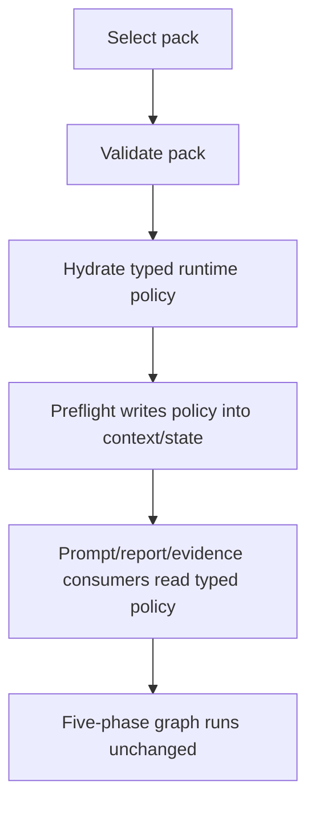

# Extract Analysis Packs

## Overview

Add a declarative analysis-pack layer that sits above config, evidence policy, prompt policy, and report policy, allowing the runtime to select a named analysis profile without changing the five-phase graph or provider factory.

This plan implements Milestone 8 from `docs/superpowers/specs/2026-04-05-financial-services-plugins-inspired-architecture-design.md` and assumes the prior follow-on milestones have stabilized the underlying seams.

## Problem Frame

After Stage 1 and the earlier follow-on milestones, the repo will have stable typed seams for evidence/provenance, thesis memory, valuation, and enrichment. Today those behaviors are still effectively a single implicit runtime profile wired through config defaults, workflow startup, prompt helpers, and report renderers. Milestone 8 should extract those stable concepts into declarative analysis packs so the system can select a coherent analysis profile without editing code or changing graph topology.

The first slice should remain a policy extraction. Packs should not become a second orchestrator or a plugin runtime. They should configure stable surfaces on top of the existing Rust runtime.

## Requirements Trace

- R1. Add a declarative analysis-pack abstraction above config/evidence/prompt/report policy.
- R2. Keep packs out of provider-factory and graph-topology ownership.
- R3. Provide a baseline/default pack that reproduces current behavior.
- R4. Resolve pack selection into typed runtime policy during startup/preflight.
- R5. Persist enough pack identity/version information for replay/debugging compatibility.
- R6. Fail invalid pack selection before analysis starts.

## Scope Boundaries

- No workflow graph changes.
- No provider-factory replacement.
- No multi-pack composition or inheritance in the first slice unless it becomes clearly necessary.
- No UI-focused pack management in this slice.

## Context & Research

### Relevant Code and Patterns

- `src/config.rs` is the current top-level runtime configuration surface.
- `src/workflow/tasks/preflight.rs` is the current startup normalization seam and the natural place to resolve pack-derived runtime policy.
- `src/workflow/tasks/common.rs` and `src/workflow/context_bridge.rs` are the established seams for startup/runtime policy propagation.
- `src/agents/shared/prompt.rs` and `src/report/final_report.rs` are the current shared policy-consumer seams.
- The roadmap order in the architecture spec explicitly defers pack extraction until the earlier abstractions stabilize.

### Institutional Learnings

- New runtime policy surfaces should remain semantically explicit rather than overloading empty/default values.
- New cycle-scoped state or policy needs to stay reset-safe and snapshot-compatible if persisted.

### External References

- Upstream inspiration: `https://github.com/anthropics/financial-services-plugins`

## Key Technical Decisions

- **Treat packs as declarative policy objects, not execution owners.**
  Rationale: they should shape analysis behavior while preserving the current graph and runtime architecture.

- **Ship a built-in baseline pack that reproduces current behavior.**
  Rationale: this is the safest migration path and provides a parity anchor for tests.

- **Resolve selected packs during startup/preflight, then propagate only typed runtime policy.**
  Rationale: downstream consumers should not parse raw pack definitions directly.

- **Make the first slice Rust built-ins only, selected by config/env.**
  Rationale: the repo already has a strong typed config-loading path, and this avoids introducing a second file-loading or manifest-discovery system too early.

- **Pack selection chooses policy; existing raw config remains the source for infrastructure wiring unless the plan explicitly replaces it.**
  Rationale: Stage 1 already derives runtime capabilities from checked-in config, so pack extraction needs a clear precedence contract instead of implicit overlap.

- **Persist lightweight pack identity/version metadata with runs.**
  Rationale: replay, debugging, and future compatibility need to know which pack shaped a run.

- **Keep first-slice pack selection single-pack-only.**
  Rationale: multiple layered packs introduce precedence/merge complexity too early.

## Open Questions

### Resolved During Planning

- **Can packs change graph topology or provider-factory routing?**
  No.

- **Should a baseline pack reproduce current behavior?**
  Yes.

- **Should the first slice support layered packs?**
  No.

### Deferred to Implementation

- **Whether pack definitions live as Rust built-ins, data files, or a hybrid.**
  First slice should use Rust built-ins only. External manifests or hybrid loading can be a later follow-on if the built-in contract proves too limiting.

- **Exact operator-facing selection surface.**
  First slice should use one explicit config/env surface so startup validation stays aligned with the current `Config::load_from(...)` path.

## High-Level Technical Design

> *This illustrates the intended approach and is directional guidance for review, not implementation specification. The implementing agent should treat it as context, not code to reproduce.*

## Implementation Units

- [ ] **Chunk 1: Pack schema and baseline built-ins**

**Goal:** Define the analysis-pack contract and a baseline pack that preserves current behavior.

**Requirements:** R1, R2, R3, R6

**Dependencies:** Earlier follow-on milestones are landed or stable enough to freeze the pack vocabulary.

**Files:**
- Create: `src/analysis_packs/mod.rs`
- Create: `src/analysis_packs/manifest.rs`
- Create: `src/analysis_packs/builtin.rs`
- Modify: `src/config.rs`
- Modify: `config.toml`
- Test: `src/analysis_packs/manifest.rs`
- Test: `src/analysis_packs/builtin.rs`
- Test: `src/config.rs`

**Approach:**
- Define the allowed pack vocabulary: coverage, optional enrichments, prompt/report policy, risk-policy selectors, and metadata.
- Add a built-in baseline/default pack that mirrors current runtime behavior.
- Add pack selection to config with validation.
- Define one exact first-slice selection surface, such as a new config key plus `SCORPIO__...` override, and fail blank/unknown ids during config/startup validation.

**Patterns to follow:**
- `src/config.rs`
- existing enum/config validation patterns

**Test scenarios:**
- Happy path: baseline pack validates and loads successfully.
- Edge case: no explicit selection resolves to the baseline/default pack.
- Edge case: unknown pack id fails before analysis starts.
- Error path: malformed or unsupported pack definitions fail clearly.

**Verification:**
- Config/pack tests prove a baseline pack can represent current behavior safely.

- [ ] **Chunk 2: Runtime hydration and startup propagation**

**Goal:** Resolve the selected pack into typed runtime policy before analysis begins.

**Requirements:** R1, R4, R6

**Dependencies:** Chunk 1

**Files:**
- Create: `src/analysis_packs/selection.rs`
- Modify: `src/config.rs`
- Modify: `src/workflow/tasks/common.rs`
- Modify: `src/workflow/context_bridge.rs`
- Modify: `src/workflow/tasks/preflight.rs`
- Modify: `src/workflow/tasks/mod.rs`
- Modify: `src/workflow/pipeline/runtime.rs`
- Test: `src/workflow/context_bridge.rs`
- Test: `src/workflow/tasks/preflight.rs`

**Approach:**
- Add a typed runtime-policy representation derived from the selected pack.
- Resolve the pack during startup/preflight.
- Write normalized policy into the existing runtime seams instead of leaking raw pack structure into consumers.
- Make precedence explicit: raw config selects the pack, the pack hydrates normalized runtime policy, and downstream consumers read only normalized policy.
- If pack policy takes over existing enrichment or coverage behavior, update the Stage 1 config-derived path deliberately rather than leaving both authorities active.

**Execution note:** Start with startup/preflight tests for default selection, invalid-pack rejection, and runtime-policy propagation before wiring the pack layer into execution.

**Patterns to follow:**
- `src/workflow/tasks/preflight.rs`
- `src/workflow/context_bridge.rs`

**Test scenarios:**
- Happy path: selected pack hydrates into startup policy before analyst fan-out.
- Edge case: default pack produces the same required coverage and optional-enrichment intent as the current runtime.
- Edge case: invalid pack selection fails before any analysis tasks run.
- Integration: startup/preflight writes pack-derived policy into the expected runtime surfaces.

**Verification:**
- Startup tests prove packs are resolved once and normalized into typed runtime policy.

- [ ] **Chunk 3: Pack-aware prompt, report, and persistence behavior**

**Goal:** Make pack selection meaningfully shape shared consumers while keeping execution topology unchanged.

**Requirements:** R2, R4, R5

**Dependencies:** Chunk 2

**Files:**
- Modify: `src/agents/shared/prompt.rs`
- Modify: `src/report/final_report.rs`
- Modify: `src/state/trading_state.rs`
- Modify: `src/state/reporting.rs`
- Modify: `src/workflow/tasks/analyst.rs`
- Modify: `src/workflow/pipeline/runtime.rs`
- Test: `src/agents/shared/prompt.rs`
- Test: `src/report/final_report.rs`
- Test: `tests/state_roundtrip.rs`
- Test: `tests/workflow_pipeline_e2e.rs`

**Approach:**
- Persist lightweight pack identity/version metadata with runs if needed for snapshots/reports.
- Update shared prompt/report helpers to branch on normalized runtime policy.
- Keep pack behavior at the policy layer only.
- Update any hard-coded coverage/reporting derivation points that would otherwise ignore pack policy, especially the fixed required-input derivation path.
- Keep persisted pack metadata backward-compatible by using additive optional fields and explicit fallback behavior for older snapshots.

**Patterns to follow:**
- `src/agents/shared/prompt.rs`
- `src/report/final_report.rs`
- state reset patterns in `src/workflow/pipeline/runtime.rs`

**Test scenarios:**
- Happy path: report output identifies the selected pack and pack-aware policy changes shared rendering behavior.
- Edge case: old snapshots without pack metadata still deserialize and render with fallback values.
- Edge case: baseline pack preserves current behavior.
- Error path: missing or malformed pack metadata does not panic renderers.

**Verification:**
- Prompt/report/persistence tests prove pack identity and policy are visible without changing the graph.

## System-Wide Impact

- **Interaction graph:** pack selection -> validation -> runtime-policy hydration -> preflight/context propagation -> prompt/report/evidence consumers.
- **Error propagation:** invalid packs fail before execution; hydrated-policy errors do not leak into partially executed runs.
- **State lifecycle risks:** persisted pack metadata, if added, must remain cycle-safe and snapshot-compatible.
- **Integration coverage:** config selection, startup hydration, shared-consumer branching, and replay metadata all need cross-layer tests.
- **Unchanged invariants:** same five-phase graph, same provider factory, same task topology.

## Risks & Dependencies

| Risk                                                       | Mitigation                                                                      |
|------------------------------------------------------------|---------------------------------------------------------------------------------|
| Packs become a second orchestrator                         | Restrict the contract to policy only and test against graph/provider invariants |
| Current behavior changes unintentionally during extraction | Start with a baseline pack and prove parity                                     |
| Pack precedence becomes ambiguous too early                | Keep first-slice selection to a single selected pack                            |

## Documentation / Operational Notes

- Document the baseline/default pack and the chosen operator-facing selection surface.
- If the first slice reveals a need for layered packs or inheritance, capture that in a later plan instead of expanding this one.

## Sources & References

- Origin milestone: `docs/superpowers/specs/2026-04-05-financial-services-plugins-inspired-architecture-design.md`
- Related code: `src/config.rs`
- Related code: `src/workflow/tasks/preflight.rs`
