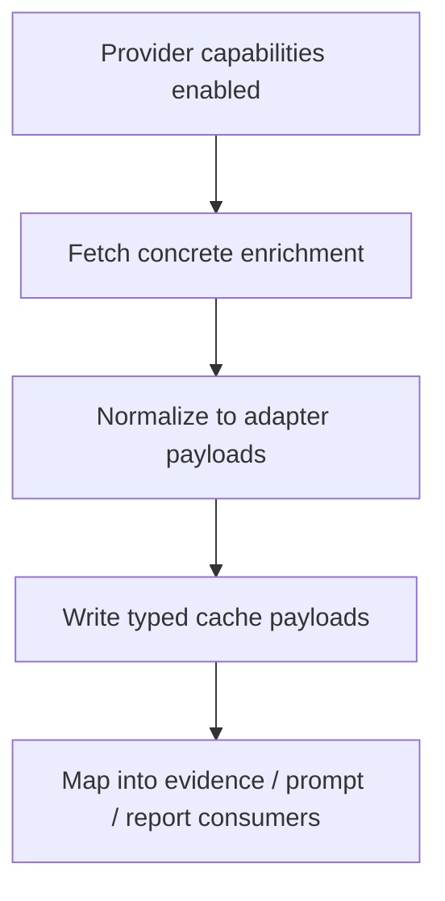

# Add Concrete Earnings And Event Enrichment Providers

## Overview

Replace the Stage 1 enrichment placeholder path with real normalized event-news and consensus-estimates payloads behind the provider-agnostic adapter contracts. Transcript enrichment is explicitly deferred from the current implementation track.

This plan implements Milestone 7 from `docs/superpowers/specs/2026-04-05-financial-services-plugins-inspired-architecture-design.md` and builds on the now-complete Stage 1 code seams.

## Problem Frame

Stage 1 created the runtime seam for enrichment but not the runtime behavior. `PreflightTask` currently seeds `KEY_CACHED_TRANSCRIPT`, `KEY_CACHED_CONSENSUS`, and `KEY_CACHED_EVENT_FEED` with `null` placeholders, and no concrete provider path replaces them with actual payloads. The repo now has adapter contracts and config-based provider capabilities, so the next step is to turn those contracts into working enrichment flows.

This slice should stay disciplined: concrete providers go behind the existing adapter traits; optional enrichment remains fail-open; target-date safety matters for backtests; and downstream consumers should see enough of the new payloads that the work is observable and auditable.

The current implementation track utilizes the available free-tier data providers: Finnhub, yfinance, and FRED. That means event/news enrichment (via Finnhub) and consensus-estimates enrichment (via yfinance-rs) are the reliable first slice, while transcript enrichment should be deferred to an optional later plan that assumes stronger provider access.

## Requirements Trace

- R1. Implement concrete providers behind the event-news adapter contract and the estimates adapter contract. Transcript adapter implementation is deferred.
- R2. Replace `null` placeholders with real normalized payloads when enrichment succeeds.
- R3. Keep optional enrichment fail-open.
- R4. Enforce time-authority rules so backtests do not ingest future-published enrichment.
- R5. Preserve provenance and coverage compatibility.
- R6. Keep state, context, and snapshots backward-compatible.

## Scope Boundaries

- No provider-factory redesign.
- No new graph phases.
- No requirement to make enrichment mandatory for a run.
- No analysis-pack extraction in this slice.
- No transcript-provider requirement in the current implementation track.

## Context & Research

### Relevant Code and Patterns

- `src/data/adapters/` now exists with category-based contracts.
- `src/workflow/tasks/preflight.rs` seeds typed cache keys and provider capabilities.
- `src/data/finnhub.rs` already provides the strongest existing base for news/event-oriented integration work.
- `src/data/yfinance/` provides OHLCV and current-price context, as well as rich consensus-estimates payloads (recommendations summary, analyst price targets, and earnings trends).
- `src/data/fred.rs` provides macro indicators and does not contribute transcript or issuer-level estimates data.
- `src/workflow/context_bridge.rs` is the existing JSON context pattern.
- `src/state/evidence.rs` and `src/state/reporting.rs` already define the baseline evidence/provenance surfaces.

### Institutional Learnings

- Missing derived runtime data should remain semantically distinct from empty data.
- New per-cycle state must be reset explicitly when reused across runs.

### External References

- Upstream inspiration: `https://github.com/anthropics/financial-services-plugins`

## Key Technical Decisions

- **Use the current Stage 1 seams directly; do not re-bootstrap them.**
  Rationale: Stage 1 is already complete in code, so Milestone 7 should build on those seams instead of treating them as missing prerequisites.

- **Fetch enrichment in `run_analysis_cycle` startup hydration, not inside LLM agents or preflight.**
  Rationale: the cache-key and provider-capability model is already centered around startup-time enrichment availability. `run_analysis_cycle` already owns pre-graph data hydration and has provider clients available. `PreflightTask` currently only receives `DataEnrichmentConfig` and does not have provider client access. This plan uses `run_analysis_cycle` as the single enrichment hydration owner.

- **Do not widen `PreflightTask` for enrichment in this slice.**
  Rationale: Plan 2 (thesis memory) already widens `PreflightTask` to accept snapshot-store access. Adding provider clients to `PreflightTask` in this plan would overload that seam. Enrichment hydration in `run_analysis_cycle` keeps the responsibilities separated.

- **Normalize event-news end-to-end as a list payload.**
  Rationale: the adapter contract already returns `Vec<EventNewsEvidence>`, so the cache key and consumer surfaces should align with that canonical shape.

- **Use `target_date` as the time authority.**
  Rationale: enrichment must be valid for the analysis date, not just the wall-clock “latest” response.

- **Differentiate semantic absence from runtime failure using an explicit three-state type.**
  Rationale: `Option<Vec<T>>` conflates "not fetched" with "fetched, nothing found." Use an explicit enum (e.g., `EnrichmentResult<T> { Available(T), NotAvailable, FetchFailed(String) }` or equivalent) at the adapter boundary so consumers can distinguish unavailability from failure. The cache-key serialization can flatten this, but the typed boundary must preserve the distinction. If the implementing agent judges an enum too heavy for the first slice, `Option<T>` with a separate `EnrichmentStatus` sidecar field per category is acceptable, but the choice must be explicit and tested.

- **Land user-visible consumer updates in the same slice.**
  Rationale: once real enrichment exists, the prompt/report path should surface it rather than keeping it invisible in internal cache keys.

- **Bound enrichment fetch time with explicit timeouts.**
  Rationale: enrichment fetches are network calls in the startup path. Each category fetch should have a configurable timeout (default ~10s) so a slow or unresponsive vendor does not block the entire run. On timeout, treat the category as `FetchFailed` and proceed with fail-open semantics. The timeout should be config-driven (e.g., `SCORPIO__ENRICHMENT__FETCH_TIMEOUT_SECS`).

- **Treat transcript enrichment as an optional deferred capability.**
  Rationale: the current provider set (free-tier Finnhub, yfinance, FRED) does not give a reliable transcript path. The active implementation plan should not block on transcript delivery; it should ship event/news enrichment first and layer transcript support later behind the same adapter seam.

- **Use `yfinance-rs` for Consensus Estimates.**
  Rationale: `yfinance-rs` natively exposes `recommendations_summary`, `analyst_price_target`, and `earnings_trend`. These endpoints map perfectly to the Consensus Estimates adapter contract without requiring a premium provider.

## Open Questions

### Resolved During Planning

- **Should this milestone rebuild Stage 1 seams?**
  No.

- **Should enrichment failures abort the run?**
  No, not for optional enrichment.

- **What should define “latest usable” enrichment?**
  The run's `target_date`.

### Deferred to Implementation

- **None for estimates; transcripts remain deferred.**
  The exact shape of the Transcript delivery is deferred. Event/News (Finnhub) and Consensus Estimates (yfinance-rs) are both guaranteed in the active slice.

## High-Level Technical Design

> *This illustrates the intended approach and is directional guidance for review, not implementation specification. The implementing agent should treat it as context, not code to reproduce.*

## Implementation Units

- [x] **Chunk 1: Provider alignment and concrete adapter implementations**

**Goal:** Turn contract-only adapters into concrete event providers and estimates providers.

**Requirements:** R1, R4, R6

**Dependencies:** Stage 1 is complete.

**Files:**
- Modify: `src/data/adapters/transcripts.rs`
- Modify: `src/data/adapters/estimates.rs`
- Modify: `src/data/adapters/events.rs`
- Modify: `src/data/adapters/mod.rs`
- Modify: `src/data/finnhub.rs`
- Modify: `src/data/mod.rs`
- Modify: `src/config.rs`
- Modify: `config.toml`
- Test: `src/data/adapters/transcripts.rs`
- Test: `src/data/adapters/estimates.rs`
- Test: `src/data/adapters/events.rs`

**Approach:**
- Implement concrete providers behind the existing category contracts. Concrete implementations should live in the adapter files themselves (e.g., `estimates.rs`, `events.rs`) when backed by a single vendor, or in vendor-specific sub-modules if implementation complexity warrants separation. The adapter `mod.rs` should re-export only the trait-level API.
- Start with `events.rs` as the mandatory deliverable.
- Implement `estimates.rs` using `yfinance-rs`'s `analysis` and `fundamentals` builders.
- Leave `transcripts.rs` as a contract-only seam in the active plan; transcript implementation moves to the deferred optional plan.
- Normalize vendor payloads into the shared adapter types.
- Filter or reject records that are not valid for the current `target_date`.
- Add any provider-specific auth/config plumbing needed by the chosen first-slice vendors in the same chunk.

**Patterns to follow:**
- `src/data/finnhub.rs`

**Test scenarios:**
- Happy path: provider returns a valid normalized event payload.
- Happy path: provider returns a valid normalized estimates payload (via `yfinance-rs`).
- Edge case: no usable data returns semantic absence, not a runtime failure.
- Edge case: multiple candidate records are reduced deterministically.
- Edge case: future-published records relative to `target_date` are excluded.
- Error path: malformed vendor payloads fail normalization cleanly.

**Verification:**
- Adapter tests prove the concrete providers produce deterministic shared payloads.

- [x] **Chunk 2: Runtime enrichment hydration and cache replacement**

**Goal:** Replace preflight-seeded placeholders with real typed payloads during a run.

**Requirements:** R2, R3, R5, R6

**Dependencies:** Chunk 1

**Files:**
- Modify: `src/workflow/pipeline/runtime.rs`
- Modify: `src/workflow/tasks/preflight.rs`
- Modify: `src/workflow/tasks/common.rs`
- Modify: `src/workflow/context_bridge.rs`
- Modify: `src/workflow/tasks/tests.rs`
- Test: `src/workflow/tasks/tests.rs`
- Test: `src/workflow/context_bridge.rs`

**Approach:**
- Add a concrete enrichment-loading step at one explicit runtime seam.
- Default the first slice to `run_analysis_cycle` startup hydration because that path already has provider clients available; only move hydration into `PreflightTask` if its constructor is widened deliberately.
- Replace `null` placeholders with normalized payloads when available.
- Preserve explicit `null`/empty semantics when data is absent.
- Standardize `KEY_CACHED_EVENT_FEED` as the JSON form of `Option<Vec<EventNewsEvidence>>` so context keys match the adapter contract.

**Execution note:** Start with failing workflow tests that pin down placeholder replacement, mixed category success, and fail-open behavior before wiring providers into runtime.

**Patterns to follow:**
- `src/workflow/tasks/preflight.rs`
- `src/workflow/context_bridge.rs`

**Test scenarios:**
- Happy path: cache keys are replaced with real normalized payloads.
- Edge case: one enrichment category succeeds while others remain absent and the run continues.
- Edge case: absent enrichment stays explicitly absent, not silently dropped.
- Error path: invalid context payloads still surface as orchestration corruption.

**Verification:**
- Workflow/context tests prove cache hydration is typed, explicit, and fail-open where intended.

- [x] **Chunk 3: Evidence/provenance and downstream consumer integration**

**Goal:** Make the new active-slice enrichment payloads visible to prompt, evidence, and report consumers.

**Requirements:** R2, R3, R5

**Dependencies:** Chunk 2

**Files:**
- Modify: `src/state/trading_state.rs`
- Modify: `src/state/reporting.rs`
- Modify: `src/agents/shared/prompt.rs`
- Modify: `src/agents/researcher/common.rs`
- Modify: `src/agents/risk/common.rs`
- Modify: `src/agents/trader/mod.rs`
- Modify: `src/agents/fund_manager/prompt.rs`
- Modify: `src/report/final_report.rs`
- Modify: `src/workflow/pipeline/runtime.rs`
- Test: `src/agents/shared/prompt.rs`
- Test: `src/agents/trader/tests.rs`
- Test: `src/agents/fund_manager/tests.rs`
- Test: `src/report/final_report.rs`

**Approach:**
- Decide the first-slice state model explicitly: either add new typed enrichment-backed state fields on `TradingState` or keep enrichment context-only, but do not leave that boundary implicit.
- Extend the shared evidence/data-quality context to reflect real enrichment-backed state.
- Thread concrete enrichment into the downstream consumer surfaces that benefit most directly from it.
- Keep transcript-related consumer behavior on explicit fallback text in the active plan because transcript delivery is deferred.
- Keep explicit fallback output when enrichment is absent.
- Keep coverage/provenance rules explicit: enrichment can contribute to provenance once consumed, but should not silently mutate the fixed Stage 1 required-input contract unless that reporting contract is intentionally widened in the same change.

**Patterns to follow:**
- `src/agents/shared/prompt.rs`
- `src/report/final_report.rs`

**Test scenarios:**
- Happy path: prompt/report consumers render concrete enrichment context.
- Edge case: absent enrichment renders explicit fallback text.
- Edge case: mixed enrichment availability is surfaced consistently.
- Error path: consumer rendering never panics on optional enrichment absence.

**Verification:**
- Prompt/report tests prove concrete enrichment changes runtime behavior observably.

## System-Wide Impact

- **Interaction graph:** provider-capability-enabled startup -> event/news and estimates fetch -> typed cache payloads -> prompt/report/evidence consumption.
- **Error propagation:** optional enrichment failures remain non-fatal at the run level; malformed/corrupt runtime state still fails loudly.
- **State lifecycle risks:** enrichment-backed state becomes part of the per-cycle runtime surface and must remain reset-safe.
- **Integration coverage:** time filtering, mixed-category success/failure, cache hydration, and consumer rendering all need cross-layer tests.
- **Unchanged invariants:** no new graph phase, no mandatory enrichment, no provider-factory redesign.

## Risks & Dependencies

| Risk                                                   | Mitigation                                                                                                 |
|--------------------------------------------------------|------------------------------------------------------------------------------------------------------------|
| Provider contract and vendor payload shapes drift      | Normalize everything through the shared adapter types and test category contracts directly                 |
| Backtests ingest future-published enrichment           | Use `target_date` as the time authority and test future-data exclusion explicitly                          |
| Optional enrichment failures silently disappear        | Keep explicit absence/caveat semantics and verify them in prompt/report output                             |
| Slow or unresponsive vendor blocks startup             | Configurable per-category fetch timeout with fail-open fallback on timeout                                 |
| Transcript support is unavailable on current providers | Defer transcript implementation to an optional follow-on plan; keep explicit fallback text                 |

## Documentation / Operational Notes

- Update prompt docs if enrichment-backed evidence changes downstream prompt contracts materially.
- Transcript delivery is intentionally deferred from the active implementation track; see the optional follow-on plan for premium-data enrichment/valuation expansion.
- Update the "Adding things" table in `AGENTS.md` to document the concrete enrichment provider pattern under `src/data/adapters/`.
- Add required API keys for concrete providers to `.env.example` with the `SCORPIO_` prefix convention. Document credential setup in the plan's implementation notes or a short operational guide so operators know which keys are needed per enrichment category.
- Add enrichment fetch timeout configuration to `config.toml` with sensible defaults.

## Sources & References

- Origin milestone: `docs/superpowers/specs/2026-04-05-financial-services-plugins-inspired-architecture-design.md`
- Related code: `src/data/adapters/`
- Related code: `src/workflow/tasks/preflight.rs`
