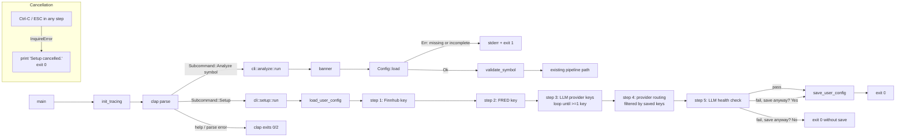
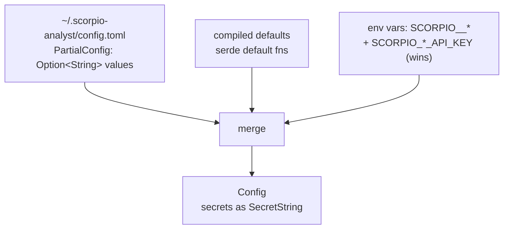

# feat: Add CLI with analyze and setup subcommands (clap + inquire)

## Overview

Replace the current "one-shot `main()`" flow with a proper CLI. Introduce `clap` (derive) for argument parsing and `inquire` for interactive prompts. Two user-facing subcommands:

- `scorpio analyze <SYMBOL>` — runs the existing 5-phase pipeline using a positional ticker argument (replaces today's `cfg.trading.asset_symbol`).
- `scorpio setup` — interactive wizard that writes `~/.scorpio-analyst/config.toml`, with an end-of-wizard LLM health check.

`Config::load()` changes to read the user-level config first, then `.env` / env vars, then compiled defaults. `TradingConfig.asset_symbol` is removed from the config schema (the symbol is now a CLI argument). Symbol validation moves from `Config::validate()` to the `analyze` handler. Project-level `config.toml` remains on disk but is no longer consulted. `~/.scorpio-analyst/config.toml` becomes the guided/default path, but `analyze` still runs when the effective runtime config is complete via env vars alone.

## Problem Frame

Today the binary always analyses a single symbol hard-coded in `config.toml` (`trading.asset_symbol`), loading all settings (API keys, provider routing, timeouts) from the same file. This has two friction points the spec is addressing:

1. **Friction for new users.** First-run setup requires hand-editing TOML and exporting env vars for secrets. There is no guided path.
2. **No way to analyse a different ticker without editing config.** The symbol should be a per-invocation argument, not a persistent config field.

The spec (`docs/superpowers/specs/2026-04-10-cli-design.md`) pins the solution: two subcommands, a user-level config file, an interactive wizard with health check, and removal of `asset_symbol` from config.

## Requirements Trace

- **R1.** `scorpio analyze <SYMBOL>` runs the existing pipeline exactly as today, with `SYMBOL` passed directly to `TradingState::new()` — not via config (see origin §"scorpio analyze").
- **R2.** On startup, `analyze` prints `✗ Config not found or incomplete. Run \`scorpio setup\` to configure your API keys and providers.` to stderr and exits 1 when the **effective runtime config** is incomplete for an analysis run. Missing `~/.scorpio-analyst/config.toml` alone is not an error if env vars and compiled defaults still produce a runnable config. Unit 6 is the canonical spec for the exact string (see origin §"scorpio analyze" and §"Error Handling").
- **R3.** `scorpio setup` writes `~/.scorpio-analyst/config.toml` atomically via `.tmp` + rename (see origin §"Atomic writes").
- **R4.** The setup wizard is re-runnable — existing values are preserved unless the user types a replacement. This applies to Finnhub, FRED, quick/deep routing, and any LLM provider key the user explicitly chooses to edit during reruns (see origin §"Step 1"–§"Step 4").
- **R5.** Step 3 re-runs until at least one LLM provider has a saved key (see origin §"Step 3").
- **R6.** Step 4 only allows selecting providers that have a saved key (see origin §"Step 4").
- **R7.** Step 5 sends a single `"Hello"` prompt through the deep-thinking provider using existing `create_completion_model` + `prompt_with_retry`, validating the same effective runtime config that `analyze` would use (wizard values overlaid by env vars where env precedence still applies). On failure, prompt `"Save config anyway? (y/N)"` with default No (see origin §"Step 5" and §"Error Handling").
- **R8.** On Ctrl-C / ESC in the wizard: print `"Setup cancelled."` and exit 0 (see origin §"Error Handling").
- **R9.** `TradingConfig.asset_symbol` is removed from `config.rs`; `TradingState.asset_symbol` (runtime state) is unchanged (see origin §"scorpio analyze").
- **R10.** Symbol validation moves from `Config::validate()` to the `analyze` subcommand handler, reusing `crate::data::symbol::validate_symbol` (see origin §"scorpio analyze").
- **R11.** `Config::load()` search order becomes: `~/.scorpio-analyst/config.toml` → env vars (`SCORPIO__*`) → compiled defaults. "Search order" here names which sources are consulted, not which wins. **Precedence** for fields set in multiple sources is the inverse: env vars override the user file, which overrides compiled defaults. This preserves today's `SCORPIO__*` override contract. The project-level `config.toml` is dropped from the search path (see origin §"Config Loading").

## Scope Boundaries

- **In scope:** `analyze` and `setup` subcommands, `PartialConfig`, atomic writes, health check, reorganising `main.rs` into a thin clap dispatcher, removing `asset_symbol` from config and test fixtures.
- **Out of scope (spec §"Out of Scope"):** `--date` flag on `analyze`, `scorpio backtest`, per-agent provider overrides, hidden stdio MCP entrypoint, TUI, GUI.
- **Explicit non-goal:** Do not delete the project-level `config.toml` on disk. The spec defers deletion to a future cleanup so existing workspaces keep working during transition.
- **Explicit non-goal:** Do not make `scorpio setup` the only supported configuration path. Env-only operation remains supported for automation, CI, and secret-managed environments.
- **Explicit non-goal:** Do not preserve comments when rewriting the user config. Fresh writes are acceptable; the wizard is the only writer.
- **Explicit non-goal:** Do not change the `.env` / dotenvy layer. Retain `dotenvy::dotenv().ok()` in `init_tracing` and `Config::load_from`; `.env` continues to provide env overrides.

## Context & Research

### Relevant Code and Patterns

- `src/main.rs` — current end-to-end init sequence (tracing → banner → `Config::load` → tokio runtime → Copilot preflight → `SnapshotStore` → rate limiters → `create_completion_model` quick+deep → data clients → `TradingPipeline` → `run_analysis_cycle` → `format_final_report`). All of this moves, unchanged, into `src/cli/analyze.rs`.
- `src/config.rs`
  - `Config::load_from(path)` is the existing seam for test injection. The new `Config::load()` will internally use the `~/.scorpio-analyst/config.toml` path (expanded via `expand_path`).
  - `secret_from_env(key: &str) -> Option<SecretString>` — the existing pattern for lifting env-var strings into `SecretString`. Reuse when merging `PartialConfig` into `Config`.
  - `expand_path(s: &str) -> PathBuf` — already handles `~/` and `$HOME/` expansion with graceful fallback.
  - `secret_display(opt)` + custom `Debug` impls for `ApiConfig` / `ProviderSettings` — already redact secrets. Keep this pattern; `PartialConfig` also needs a redacting `Debug`.
  - `Config::validate()` currently calls `validate_symbol(&self.trading.asset_symbol)`. This call is removed; the same validator is invoked from `cli::analyze`.
- `src/data/symbol.rs::validate_symbol` — `pub(crate)`, accepts `&str`, returns `Result<&str, TradingError>`. Rules: trim, non-empty, ≤24 chars, ASCII alnum + `.-_^`. Accessible from `cli::analyze` without visibility changes.
- `src/providers/factory/client.rs::create_completion_model(tier, llm, providers, rate_limiters) -> Result<CompletionModelHandle, TradingError>` — synchronous, no I/O. Used by main.rs today; reused by the health check.
- `src/providers/factory/agent.rs::build_agent(&handle, system_prompt) -> LlmAgent` — construct a fresh agent from a completion model handle.
- `src/providers/factory/retry.rs::prompt_with_retry(&agent, prompt, timeout, policy) -> Result<RetryOutcome<String>, TradingError>` — async, respects `RetryPolicy`. The health check calls this with a short timeout and low-retry `RetryPolicy` (spec does not specify; default `RetryPolicy::default()` is fine).
- `src/providers/factory/client.rs::preflight_copilot_if_configured` — existing preflight pattern used for Copilot ACP; analogous to what we'll do for a lighter "send Hello" health check.
- `src/observability.rs::init_tracing` — currently calls `dotenvy::dotenv().ok()`. Keep as-is; both `analyze` and `setup` invoke it (setup may want a quieter log level, but that's a `RUST_LOG` env concern, not a code change).
- `config.toml` (project root) — already has a `[trading]` section we can leave alone. Since `Config::load()` no longer reads it, changes there are inert.
- `docs/solutions/best-practices/config-test-isolation-inline-toml-2026-04-11.md` — dictates the test pattern for any new config-loading tests: inline TOML + `tempfile::TempDir`.

### Institutional Learnings

- **Config test isolation (`docs/solutions/best-practices/config-test-isolation-inline-toml-2026-04-11.md`)** — all new tests for `Config::load_from(user_path)` and `PartialConfig` round-trip must use `tempfile::TempDir` with inline TOML; keep `MINIMAL_CONFIG_TOML` updated when fields change. The existing `ENV_LOCK` static mutex in `src/config.rs` tests must be reused for tests that mutate env vars.
- No prior solutions cover clap, inquire, `SecretString` serialization, or atomic file writes. After implementation, run `/ce:compound` to document the chosen patterns (noted below under "Documentation Plan").

### External References

- [clap 4 derive tutorial](https://docs.rs/clap/latest/clap/_derive/_tutorial/index.html) — canonical `#[derive(Parser)]` + `#[derive(Subcommand)]` pattern. Clap exits with code 2 on parse failure (stderr) and 0 on `--help` / `--version` (stdout); no custom handling needed.
- [inquire 0.9 docs](https://docs.rs/inquire/0.9) — `Password`, `Text`, `Select`, and `Confirm` expose the prompt/cancellation behavior we need. `OperationCanceled` = ESC; `OperationInterrupted` = Ctrl-C. The `macros` feature (optional) provides `required!()`; we will use closure-style validators to avoid an extra feature flag.
- [secrecy 0.10 — `SecretString` serialization](https://docs.rs/secrecy/0.10/secrecy/) — with the `serde` feature, `SecretString` implements `Deserialize` but **not** `Serialize` (because `String` does not implement `SerializableSecret`). **This is a deviation from the spec**, which implies the `serde` feature enables both. See "Key Technical Decisions" below.
- [tempfile `NamedTempFile::persist`](https://docs.rs/tempfile/latest/tempfile/struct.NamedTempFile.html) — standard atomic-rename pattern. Must be created in the same directory as the target (same filesystem requirement).
- [std::os::unix::fs::PermissionsExt](https://doc.rust-lang.org/std/os/unix/fs/trait.PermissionsExt.html) — chmod 600 after persist, gated by `#[cfg(unix)]`.
- [toml 1.x](https://docs.rs/toml/latest/toml/) — `to_string_pretty` serializes fields in declaration order. Omits `Option::None` when `#[serde(skip_serializing_if = "Option::is_none")]` is used.

## Key Technical Decisions

- **`PartialConfig` uses plain `Option<String>` for secrets, not `Option<SecretString>`.**
  - **Rationale:** `SecretString` does not implement `Serialize` even with the `serde` feature. Two viable alternatives — `#[serde(serialize_with = ...)]` with `expose_secret()`, or introducing a `SerializableSecret` newtype — add boilerplate without eliminating the plaintext exposure. `Option<String>` is the simplest solution.
  - **Accurate exposure profile (corrected from initial draft):** plaintext lives in `PartialConfig` for the full duration of `run_setup` (potentially minutes if the user pauses mid-wizard, or a few ms in `Config::load_from_user_path`). This is broader than today's 1-line `secret_from_env` path, where plaintext exists only as a local temporary before being wrapped. We accept this because (a) `PartialConfig` is never passed to logging/tracing sinks, (b) it has a redacting `Debug` impl (Unit 2), (c) the alternative — custom `Serialize` with `expose_secret` — lands the plaintext in a TOML string anyway on every disk write. On systems with swap enabled the heap memory can page to disk; this is an accepted residual risk. Document the profile honestly in `PartialConfig` rustdoc — do **not** claim equivalence with the env-var path.
  - Flag that the spec text ("`secrecy` is already present but must have the `serde` feature enabled for `SecretString` to derive `Serialize`/`Deserialize`") is factually incorrect; the `serde` feature is already enabled but does not provide `Serialize`.
  - **Also flag that the spec text ("`toml` is already present with no changes required") is factually incorrect.** `toml` is not in `Cargo.toml` today; the `config` crate parses TOML internally but does not expose `toml::to_string_pretty`. Unit 1 adds `toml = "1"` as a first-class dependency.

- **`TradingConfig` retained with only `backtest_start` / `backtest_end`; becomes fully default.**
  - **Rationale:** Removing the struct outright would churn six test fixtures that still construct it. Keeping it with a `Default` impl + `#[serde(default)]` on `Config::trading` lets tests drop `asset_symbol` without inventing replacement fixtures for backtest fields that are already `Option<String>`.
  - Project-level `config.toml` retains its `[trading]` section for now (it is inert) and will be cleaned up separately.

- **`main.rs` init sequence moves verbatim into `cli::analyze::run`.**
  - **Rationale:** The existing sequence is correct; relocating it preserves behaviour. The only change is reading the symbol from the CLI argument instead of `cfg.trading.asset_symbol`.

- **`setup` wizard owns its own tokio runtime.**
  - **Rationale:** The health check calls `prompt_with_retry`, which is async. Building a `new_current_thread` runtime inside `cli::setup::run` mirrors what `main.rs` does today; avoids making the entire top-level `main` async and avoids pulling `#[tokio::main]` into the dispatcher.

- **Banner (`figlet_rs::Toilet::mono12`) only prints in `analyze`.**
  - **Rationale:** A clean TTY matters for the wizard. The banner stays in `cli::analyze::run`, not in the top-level dispatcher.

- **User config path is resolved via the existing `expand_path` helper.**
  - **Rationale:** `expand_path("~/.scorpio-analyst/config.toml")` already handles the `HOME`-unset fallback and is used for the SQLite snapshot DB. No need to introduce `dirs::home_dir()` and grow the dependency tree.

- **Atomic writes via `tempfile::NamedTempFile::persist`, not hand-rolled rename.**
  - **Rationale:** `NamedTempFile` handles the `same-filesystem` requirement by accepting an explicit parent directory and gives us a well-tested cross-platform rename. `tempfile` is already a dev-dep; promoting it to a normal dep is the cost of entry.
  - On Unix, set `0o600` via `std::os::unix::fs::PermissionsExt` after `persist`. No-op on other platforms via `#[cfg(unix)]`.

- **Validators are closure-based, not `required!()` macro.**
  - **Rationale:** Avoids enabling the optional `macros` feature on `inquire` for a single use case. A two-line closure is clearer and keeps the dependency surface smaller.

- **Step functions expose a testable "apply" helper separate from the interactive prompt.**
  - **Rationale:** `inquire::Password::prompt()` cannot be driven in unit tests without I/O abstraction. Split each step into (a) the interactive `prompt_*` function that calls `inquire` and returns raw user input, and (b) a pure `apply_*` helper that takes `PartialConfig` + captured user input and returns the new `PartialConfig`. Unit tests cover (b); (a) is covered by inspection and manual QA. Match the spec's assertion that steps are "pure functions over `PartialConfig`".

- **Reuse `providers::ProviderId` in the wizard; do not introduce a second enum.**
  - **Rationale:** A parallel local enum (4 of 5 variants) would create a `Provider ↔ ProviderId` mapping burden and risks drift when new providers are added. Filtering `ProviderId::Copilot` out at the point of use via a `const WIZARD_PROVIDERS: &[ProviderId]` is simpler and keeps the type graph thin. Copilot has no API-key concept so it legitimately belongs outside the wizard.

- **Define completeness in terms of the effective runtime config, not file presence.**
  - **Rationale:** `analyze` already supports env overrides and the codebase still has env-only seams (`Config::load_from`, provider factory, data-client constructors). Requiring a home-directory file as a hard prerequisite would break CI, containers, and existing env-driven usage for little technical gain. The completeness check should instead assert that the merged runtime config can construct both quick/deep completion handles plus the Finnhub and FRED clients.

- **Treat `HOME` resolution failure as an error for secret-bearing user config paths.**
  - **Rationale:** Falling back to `./.scorpio-analyst/config.toml` is acceptable for non-secret paths like local dev artifacts, but not for API-key storage. If `HOME` is unset and no explicit config path override exists, `setup` should fail with a clear error rather than silently writing secrets into the current working directory.

- **Setup owns a malformed-config recovery path.**
  - **Rationale:** `scorpio setup` is the advertised remediation flow. If a hand-edited or corrupted `~/.scorpio-analyst/config.toml` prevents the wizard from starting, the recovery path is dead. The wizard should detect TOML parse failures separately, print the parse error plus file path, move the bad file aside to `config.toml.bak.<timestamp>` after confirmation, and continue from `PartialConfig::default()`.

## Open Questions

### Resolved During Planning

- **Does `SecretString` with `serde` feature serialize to TOML?** No — only `Deserialize`. Resolution: `PartialConfig` uses `Option<String>`; secrets are promoted to `SecretString` in the merge step.
- **What timeout for the health-check `prompt_with_retry`?** Use a dedicated wizard-specific constant: `const HEALTH_CHECK_TIMEOUT_SECS: u64 = 30;` plus `RetryPolicy::default()` (3 retries, 500 ms exponential base). The production `cfg.llm.analyst_timeout_secs` default is 3000 s (50 min) and retrying 3× would block the wizard for up to ~150 min — unacceptable for an interactive prompt. 30 s is short enough that a user with bad network sees the failure and can recover via the "Save anyway? (y/N)" branch.
- **Does the wizard require `.env` to be loaded before the health check?** Yes — the user's env-var-based secrets (e.g., `SCORPIO_OPENAI_API_KEY`) should still take precedence if they override a config-file value. Resolution: the health check builds the same **effective runtime config** that `analyze` will use by merging the in-memory `PartialConfig` with `.env` / env overrides in memory, without depending on the on-disk file having already been saved.
- **Should we delete `config.toml` at the repo root?** No — the spec explicitly defers this. Keep it; `Config::load()` stops reading it, so it is inert.
- **Is `tempfile` promotion to a regular dependency acceptable?** Yes — atomic writes are a production concern, not a test concern.

### Deferred to Implementation

- **Exact path of `TempDir` usage in new tests.** Will follow the `write_config()` helper pattern already in `src/config.rs::tests`, generalised to write inside a fake `~/.scorpio-analyst/` sub-tree under `tempdir()`. Refine during Unit 2 implementation when the test surface is concrete.
- **Whether to extract a reusable `run_health_check` that lives in `src/providers/` vs. inline in `src/cli/setup/steps.rs`.** Deferred until the first draft of the step fn — if callers other than the wizard need it (unlikely in-scope), promote; otherwise keep it local.
- **Rustdoc strings for `PartialConfig` fields.** Deferred to implementation — copy wording from `config.toml` comments once the final field set is locked.
- **Whether Units 3 and 6 ship as one commit or two.** Plan guidance is "ship together"; the `#[ignore]` stub fallback is documented in Unit 3's approach for implementers who split them regardless.
- **Whether the Step 3 loop-back error message should appear above the Select prompt or below the last Password prompt.** Resolved: print `"✗ At least one LLM provider is required."` immediately before re-showing the provider `Select`, so the recovery cue is adjacent to the next action.

### Added During Document Review (resolved in the refined plan)

- **Precedence contradiction between R11 and the merge diagram** — resolved: R11 describes consultation order; precedence is the inverse (env > file > defaults). Both R11 and the diagram now state this explicitly.
- **Health check timeout** — resolved: dedicated `HEALTH_CHECK_TIMEOUT_SECS = 30` constant (not `cfg.llm.analyst_timeout_secs`).
- **ESC vs Ctrl-C Password semantics** — resolved: `prompt()` (non-skippable) everywhere; both cancellation signals map to "Setup cancelled.".
- **`ProviderId` `Display` impl** — resolved: `ProviderId` already implements `Display` in `src/providers/mod.rs`; Unit 4 reuses it rather than adding a duplicate impl.
- **TOML merge strategy** — resolved: synthesise nested TOML from non-secret fields only; inject secrets manually in two passes.
- **File permissions race** — resolved: chmod the temp file before `persist`, not after.
- **Wizard prompt copy** — resolved: Step 1/2/5 literal strings pinned in Unit 4.
- **Step 5 return type contract** — resolved: `Ok(true)` = save, `Ok(false)` = bail-without-save; Unit 5 orchestrator follows that contract exactly.
- **Env-only operation** — resolved: `analyze` checks the completeness of the merged runtime config, not the presence of `~/.scorpio-analyst/config.toml`.
- **Malformed user config recovery** — resolved: `setup` offers backup-and-start-fresh instead of failing before the first prompt.

## High-Level Technical Design

> *This illustrates the intended approach and is directional guidance for review, not implementation specification. The implementing agent should treat it as context, not code to reproduce.*

### Dispatch and control flow



### Config merge shape



Precedence (highest wins): **env > user file > compiled defaults**. "Search order" in R11 names what is consulted; env always overrides where fields overlap.

The merge is done inside `Config::load_from_user_path` in six ordered steps (see Unit 3 Approach for full detail):
1. `dotenvy::dotenv().ok()` populates process env.
2. Load flat `PartialConfig` (or `PartialConfig::default()` if file missing).
3. Synthesize nested TOML from `PartialConfig`'s **non-secret** fields only (secrets are `#[serde(skip)]` in `Config` and must be injected manually).
4. `config::Config::builder().add_source(File::from_str(nested_toml)).add_source(Environment::with_prefix("SCORPIO"))` + `try_deserialize::<Config>`.
5. Manual secret injection: (a) from `PartialConfig` fields, then (b) env vars overlay on top, with `tracing::warn!` on override.
6. `cfg.validate()`.

### Source layout after change

```
src/
├── main.rs                      # thin clap dispatcher (~30 lines)
├── cli/
│   ├── mod.rs                   # `pub mod analyze; pub mod setup;` + `Cli` / `Commands`
│   ├── analyze.rs               # everything that used to live in main.rs
│   └── setup/
│       ├── mod.rs               # run_setup orchestrator + cancellation handling
│       ├── steps.rs             # interactive prompt fns + pure apply_* helpers
│       └── config_file.rs       # PartialConfig, load_user_config, save_user_config
├── config.rs                    # Config::load() reads user path; asset_symbol removed
└── (everything else unchanged)
```

### Config File Schema

There are two distinct TOML shapes in this plan: the **user config file** written by `scorpio setup`, and the **runtime Config** assembled at startup.

#### `~/.scorpio-analyst/config.toml` (written by `scorpio setup`, type: `PartialConfig`)

Flat TOML — no section headers. Fields not yet configured are absent (serialised via `#[serde(skip_serializing_if = "Option::is_none")]`). The wizard is the only writer; hand-editing is supported but not documented.

```toml
# Data API keys (Step 1 & 2)
finnhub_api_key    = "ct_abc123..."
fred_api_key       = "abc456..."

# LLM provider keys (Step 3 — at least one required)
openai_api_key     = "sk-..."
anthropic_api_key  = "sk-ant-..."
gemini_api_key     = "AIza..."
openrouter_api_key = "or-..."

# Provider/model routing (Step 4 — constrained to providers with saved keys)
quick_thinking_provider = "openai"       # one of: openai | anthropic | gemini | openrouter
quick_thinking_model    = "gpt-4o-mini"
deep_thinking_provider  = "openai"       # one of: openai | anthropic | gemini | openrouter
deep_thinking_model     = "o3"
```

> **Minimum viable file** (only `finnhub_api_key` + one LLM key + routing is set; everything else is absent):
> ```toml
> finnhub_api_key         = "ct_..."
> openai_api_key          = "sk-..."
> quick_thinking_provider = "openai"
> quick_thinking_model    = "gpt-4o-mini"
> deep_thinking_provider  = "openai"
> deep_thinking_model     = "o3"
> ```

File is created with `0o600` permissions on Unix (world-unreadable). On Windows, file-based secret persistence is not supported in this change: `setup` must instruct the user to use env vars instead of writing secrets to disk.

#### Runtime `Config` (assembled in `Config::load()`, type: `Config`)

Produced by the six-step merge: user file → synthesised nested TOML → `config` builder + env vars → manual secret injection. All the existing sections survive unchanged, **except `trading.asset_symbol` is removed** (now a CLI argument).

```toml
# No [trading].asset_symbol — symbol is passed as `scorpio analyze <SYMBOL>`
# Backtest-only fields remain optional
[trading]
# backtest_start = "2024-01-01"   # optional
# backtest_end   = "2024-12-31"   # optional

[llm]
quick_thinking_provider      = "openai"       # from PartialConfig (or SCORPIO__LLM__QUICK_THINKING_PROVIDER)
deep_thinking_provider       = "openai"       # from PartialConfig (or env)
quick_thinking_model         = "gpt-4o-mini"  # from PartialConfig (or env)
deep_thinking_model          = "o3"           # from PartialConfig (or env)
max_debate_rounds            = 3              # compiled default
max_risk_rounds              = 2              # compiled default
analyst_timeout_secs         = 300            # compiled default
valuation_fetch_timeout_secs = 30             # compiled default
retry_max_retries            = 3              # compiled default
retry_base_delay_ms          = 500            # compiled default

[api]
# All secrets injected from PartialConfig or env vars; never written to this section.
# Env vars (highest precedence, override PartialConfig): SCORPIO_OPENAI_API_KEY,
# SCORPIO_ANTHROPIC_API_KEY, SCORPIO_GEMINI_API_KEY, SCORPIO_OPENROUTER_API_KEY,
# SCORPIO_FINNHUB_API_KEY, SCORPIO_FRED_API_KEY

[providers.openai]
rpm = 500
# base_url = "..."   # optional override

[providers.anthropic]
rpm = 500

[providers.gemini]
rpm = 500

[providers.copilot]
rpm = 0   # Copilot uses ACP; not available in the wizard (no API-key concept)

[providers.openrouter]
rpm = 20

[rate_limits]
finnhub_rps       = 30
fred_rps          = 2
yahoo_finance_rps = 30

[storage]
snapshot_db_path = "~/.scorpio-analyst/phase_snapshots.db"

[enrichment]
enable_transcripts         = false
enable_consensus_estimates = false
enable_event_news          = false
max_evidence_age_hours     = 48
fetch_timeout_secs         = 120
```

#### Change summary vs. today

| Field                      | Before                        | After                                                       |
|----------------------------|-------------------------------|-------------------------------------------------------------|
| `trading.asset_symbol`     | Config file required field    | **Removed** — CLI argument `scorpio analyze <SYMBOL>`       |
| API keys                   | Env vars only                 | `~/.scorpio-analyst/config.toml` **or** env vars (env wins) |
| LLM routing                | Project `config.toml`         | `~/.scorpio-analyst/config.toml` **or** env vars            |
| Project `config.toml`      | Consulted by `Config::load()` | **Ignored** (stays on disk; inert)                          |
| `SCORPIO__*` env overrides | Work for all fields           | Unchanged — still override any non-secret field             |

---

## Implementation Units

- [x] **Unit 1: Add dependencies and promote `tempfile`**

**Goal:** Introduce the new crates required by the CLI without any behavioural changes. Keep the workspace building green.

**Requirements:** (prerequisite for R1–R11)

**Dependencies:** None

**Files:**
- Modify: `Cargo.toml`

**Approach:**
- Add `clap = { version = "4", features = ["derive"] }` to `[dependencies]`.
- Add `inquire = "0.9"` (no extra features — validators will be closures).
- Add `toml = "1"` (needed for `to_string_pretty` in `save_user_config`).
- Promote `tempfile = "3"` from `[dev-dependencies]` to `[dependencies]`. Keep the entry in `[dev-dependencies]` if cargo requires (it does not — a main-dep is visible to tests).
- Leave `secrecy = { version = "0.10", features = ["serde"] }` unchanged.
- Do not modify any `.rs` file in this unit.

**Patterns to follow:**
- Dependency ordering / grouping follows the existing comment-blocked sections in `Cargo.toml`.

**Test scenarios:**
- Test expectation: none — dependency update only. Verification is `cargo build --locked` succeeding.

**Verification:**
- `cargo build --locked` completes without error.
- `cargo clippy --all-targets -- -D warnings` is clean (no new lints).

---

- [x] **Unit 2: `PartialConfig` + atomic config file IO**

**Goal:** Create the data type that the wizard round-trips through `~/.scorpio-analyst/config.toml`, with atomic writes and (on Unix) 0o600 permissions.

**Requirements:** R3, R4

**Dependencies:** Unit 1

**Files:**
- Create: `src/cli/setup/mod.rs` — initially declares `pub mod config_file; pub mod steps;` (will gain `run()` in Unit 5); stub `run()` returning `Ok(())` acceptable as a placeholder.
- Create: `src/cli/setup/config_file.rs`
- Modify: `src/cli/mod.rs` — add `pub mod setup;` (keep it unused for now; dead-code warnings resolve in Unit 5).
- Test: inline `#[cfg(test)] mod tests` in `src/cli/setup/config_file.rs`

**Approach:**
- Define `PartialConfig` as `#[derive(Default, Serialize, Deserialize)]` plus a hand-rolled `impl Debug` that redacts any field whose name ends in `_api_key`. All fields `Option<String>` to sidestep `SecretString`'s non-`Serialize` constraint. The custom `Debug` is defensive — no current caller emits `{:?}` on `PartialConfig`, but the pattern mirrors the existing `ApiConfig` / `ProviderSettings` redacting `Debug` impls in `src/config.rs` and closes the door on future logging leaks. The cost is ~15 lines of code.
  - Fields: `finnhub_api_key`, `fred_api_key`, `openai_api_key`, `anthropic_api_key`, `gemini_api_key`, `openrouter_api_key`, `quick_thinking_provider`, `quick_thinking_model`, `deep_thinking_provider`, `deep_thinking_model` — matching the spec's struct shape but with `Option<String>` in place of `Option<SecretString>`.
  - Every field tagged `#[serde(skip_serializing_if = "Option::is_none", default)]` so the written TOML omits unset keys rather than writing empty strings.
- `pub fn user_config_path() -> anyhow::Result<PathBuf>` — resolves `~/.scorpio-analyst/config.toml` only when `HOME` is available. If `HOME` is unset, return a clear error for `setup`; `analyze` can still proceed through env-only config because it does not require a file path to exist.
- `pub fn load_user_config_at(path: impl AsRef<Path>) -> anyhow::Result<PartialConfig>` — the primary loader. If file missing, `Ok(PartialConfig::default())`; otherwise read + `toml::from_str`. Add context on parse failure.
- `pub fn try_load_user_config_at(path: impl AsRef<Path>) -> anyhow::Result<Option<PartialConfig>>` (or equivalent result enum) — loader variant for callers that need to distinguish `missing`, `loaded`, and `malformed` without string-matching error text.
- `pub fn load_user_config() -> anyhow::Result<PartialConfig>` — thin wrapper over `user_config_path()?` + `load_user_config_at(...)`.
- `pub fn try_load_user_config() -> anyhow::Result<Option<PartialConfig>>` — thin wrapper over `user_config_path()?` + `try_load_user_config_at(...)`.
- `pub fn save_user_config(cfg: &PartialConfig) -> anyhow::Result<()>`:
  1. `std::fs::create_dir_all(path.parent())`.
  2. Serialize via `toml::to_string_pretty`.
  3. Create `NamedTempFile::new_in(parent_dir)`, write bytes, call `sync_all()`.
  4. **Set `0o600` on the temp file's path BEFORE `persist`** (fixes the race window flagged in review — if we chmod after `persist`, the file is briefly world-readable between rename and chmod). Use `std::fs::set_permissions(tmp.path(), Permissions::from_mode(0o600))` gated by `#[cfg(unix)]`. After this, `persist` atomically installs a file that already has the correct mode.
  5. `persist(&path)` (atomic rename). The target inherits the 0o600 permissions set in step 4.
  6. **On Windows (`#[cfg(windows)]`):** reject secret-file writes with a clear error that tells the user to configure `SCORPIO_*` env vars instead. This change does not ship plaintext secret persistence on Windows.
  7. Surface any step's error with `anyhow::Context`; leave original file untouched on any failure. **Context strings must never include raw secret values or TOML content** — include only the target file path and the underlying `io::Error`. This applies to every `anyhow::Context` call in `config_file.rs`.
- `setup::run` handles malformed user config explicitly before Step 1: print the parse error plus path, ask whether to move the file to `config.toml.bak.<timestamp>` and start fresh, then continue with `PartialConfig::default()` on confirmation. Declining leaves the file untouched and exits 0.

**Execution note:** Start with failing unit tests for the `load → modify → save → load` round-trip before writing the implementation. Test-first gives us coverage of the `None` / `Some` serialization edges at the same time.

**Patterns to follow:**
- `write_config()` helper + `TempDir` in `src/config.rs::tests` (see `docs/solutions/best-practices/config-test-isolation-inline-toml-2026-04-11.md`).
- Redacting `Debug` impl pattern from `ApiConfig` in `src/config.rs` (use `secret_display` or equivalent).

**Test scenarios:**
- *Happy path:* `save_user_config(partial) → load_user_config() == partial` for a fully-populated `PartialConfig`.
- *Happy path:* round-trip a partially populated struct (only `finnhub_api_key` set) — unset fields remain `None` and are absent from the written TOML (grep the serialised bytes).
- *Edge case:* `load_user_config()` returns `PartialConfig::default()` when the file is missing.
- *Edge case:* `load_user_config()` on a zero-byte file returns `PartialConfig::default()` (toml parses empty input as an empty table).
- *Error path:* `load_user_config()` on a syntactically invalid TOML file returns a descriptive `anyhow::Error` (assert the error message mentions the file path).
- *Recovery path:* malformed config + user accepts backup/replace → original file moved aside and wizard starts from `PartialConfig::default()`.
- *Recovery path:* malformed config + user declines backup/replace → wizard exits 0 without modifying files.
- *Error path:* `save_user_config` against an unwritable parent directory (simulated via `tempfile::tempdir()` + chmod 0) returns an error; any pre-existing file at the target path is unchanged.
- *Integration:* first `save_user_config` call creates `~/.scorpio-analyst/` when absent (use a `TempDir` rooted elsewhere and override `HOME` via `ENV_LOCK`, mirroring `expand_path_tilde_prefix` test).
- *Integration (`#[cfg(unix)]`):* after `save_user_config`, `fs::metadata(path).permissions().mode() & 0o777 == 0o600`.
- *Error path:* `user_config_path()` returns a clear error when `HOME` is unset.
- *Platform path:* `save_user_config` on Windows returns a clear "use env vars" error instead of writing secrets to disk.
- *Redaction:* `format!("{:?}", PartialConfig { finnhub_api_key: Some("secret".into()), .. })` contains neither `"secret"` nor the field's plain value; it shows `"[REDACTED]"` or `"<not set>"`.

**Verification:**
- Round-trip tests pass.
- Permissions test passes on macOS/Linux CI.
- `cargo clippy --all-targets -- -D warnings` stays clean.

---

- [x] **Unit 3: `Config::load()` reads user path; remove `asset_symbol`**

**Goal:** Repoint the production config loader at `~/.scorpio-analyst/config.toml` as the default user-file source, merge `PartialConfig` with env vars + compiled defaults, and drop `asset_symbol` from the config schema.

**Requirements:** R2, R9, R10, R11

**Dependencies:** Unit 2 (imports `PartialConfig` + `load_user_config`)

**Files:**
- Modify: `src/config.rs`
- Modify: `src/agents/trader/tests.rs`
- Modify: `src/agents/fund_manager/tests.rs`
- Modify: `src/workflow/pipeline/tests.rs`
- Modify: `tests/support/workflow_observability_pipeline_support.rs`
- Modify: `tests/support/workflow_pipeline_make_pipeline.rs`
- Modify: `tests/foundation_edge_cases.rs` (line 71 inline TOML contains `asset_symbol = "AAPL"` under `[trading]`; strip the `[trading]` block)
- Modify: `src/workflow/snapshot/tests/core_roundtrip.rs` (line 248 inline TOML contains `asset_symbol = "AAPL"` under `[trading]`; strip the `[trading]` block)
- Test: inline tests in `src/config.rs` (existing `mod tests`)

**Approach:**
- Remove `asset_symbol: String` from `TradingConfig`.
- Add `#[derive(Default)]` to `TradingConfig` and `#[serde(default)]` on `Config::trading`.
- In `Config::validate()`, remove the `validate_symbol` call (the only remaining validations stay: `fetch_timeout_secs > 0`, `analysis_pack` parse). The `crate::data::symbol` import becomes unused — drop it.
- Rework `Config::load()` into three layers:
  - `Config::load()` → attempt `user_config_path()`. If `HOME` is available, call `Config::load_from_user_path(path)`. If `HOME` is unavailable, fall back to `Config::load_effective_runtime(PartialConfig::default())` so env-only operation still works.
  - `Config::load_from_user_path(path: impl AsRef<Path>)` — the pipeline below is ordered, each step has one purpose, and the structural fix from review is baked in:
    1. `dotenvy::dotenv().ok()` — populate process env from `.env` if present.
    2. `let partial = load_user_config_at(path)?` — deserialize flat `PartialConfig` (with `Option<String>` fields) from disk.
    3. Delegate to `Config::load_effective_runtime(partial)`.
  - `Config::load_effective_runtime(partial: PartialConfig)` — single source of truth for the merged runtime config used by `analyze` and Step 5 health checks:
    1. **Synthesize nested TOML for `PartialConfig`'s non-secret fields only** via a new private helper `partial_to_nested_toml_non_secrets(&PartialConfig) -> String`. Emits `[llm] quick_thinking_provider = "…"`, `[llm] quick_thinking_model = "…"`, `[llm] deep_thinking_provider = "…"`, `[llm] deep_thinking_model = "…"`, skipping any `None` field. Output matches `Config`'s serde shape so `config::File::from_str` can ingest it. Secrets are **deliberately excluded** — `Config`'s secret fields are `#[serde(skip)]` and would be dropped by deserialization even if we wrote them into the synthesised TOML.
    2. Build the config crate pipeline:
       `config::Config::builder().add_source(config::File::from_str(&nested_toml, config::FileFormat::Toml)).add_source(config::Environment::with_prefix("SCORPIO").separator("__").try_parsing(true)).build()?.try_deserialize::<Config>()?`
       This produces a `Config` with non-secret fields set from `PartialConfig` and then overlaid by env vars (env wins for any overlapping key, preserving the existing `SCORPIO__*` override contract).
    3. **Manual secret injection, two ordered passes:**
       - Pass 3a: for each secret field in `PartialConfig` that is `Some(v)`, write `SecretString::from(v)` to the matching nested path on `Config` (e.g., `cfg.providers.openai.api_key = partial.openai_api_key.map(SecretString::from);`).
       - Pass 3b: for each secret env var (`SCORPIO_OPENAI_API_KEY`, `SCORPIO_ANTHROPIC_API_KEY`, `SCORPIO_GEMINI_API_KEY`, `SCORPIO_OPENROUTER_API_KEY`, `SCORPIO_FINNHUB_API_KEY`, `SCORPIO_FRED_API_KEY`), if set, overwrite the corresponding `Config` field via `secret_from_env`. **Env wins.** When an env-supplied secret overwrites a file-supplied one, emit `tracing::warn!` with the provider name (no key value) so users debugging stale shell profiles see a signal.
    4. `cfg.validate()?` — run remaining validators (`fetch_timeout_secs > 0`, `analysis_pack` parse).
    5. Add `cfg.is_analysis_ready()` (or equivalent helper) that asserts the merged runtime config can construct both quick/deep completion handles plus the Finnhub and FRED clients. This is the definition of "complete" for R2.
  - `Config::load_from(path)` remains a test seam. After refactor, it takes a nested TOML file path (the existing test-suite shape) and feeds through the same `config::Config::builder().add_source(File::from(path)) + Environment` chain, plus pass 5b only (file secrets are irrelevant because legacy test TOML never contained secrets — they were `#[serde(skip)]` fields). Existing env-override tests remain unchanged.
- Remove `asset_symbol` from every test fixture constructing `TradingConfig { ... }` (six locations — see §Files). No replacement field is needed.
- Remove the `[trading]\nasset_symbol = "AAPL"` block from the two inline TOML fixtures added to the file list above (`tests/foundation_edge_cases.rs` line 71, `src/workflow/snapshot/tests/core_roundtrip.rs` line 248). Both files drive `Config::load_from` with a literal TOML string and will otherwise carry an unknown field once `TradingConfig::asset_symbol` is gone.
- Update `MINIMAL_CONFIG_TOML` in `src/config.rs::tests`: drop the `[trading] / asset_symbol = "AAPL"` lines. The test config becomes just `[llm]`.
- Update / delete tests that asserted symbol validation inside `Config::validate()` (`validate_rejects_empty_symbol`, `validate_rejects_symbol_with_semicolons`, `validate_accepts_lowercase_symbol`). These assertions are re-homed into Unit 6's test suite for `cli::analyze`.
- **Sequencing note:** Units 3 and 6 must ship in the same commit / PR to avoid a transient coverage gap where symbol-validation tests exist in neither location. If implementers split them anyway, stub the three tests as `#[ignore]` placeholders referencing their Unit 6 destination to make the gap explicit in CI output.
- Keep the `.env` + env-var tests unchanged (they continue to exercise env-var precedence).

**Execution note:** Test-first — start by updating `MINIMAL_CONFIG_TOML` and the asset-symbol tests so they fail, then rework `Config::load()` to make them pass and fix the six fixture construction sites last.

**Patterns to follow:**
- `config::ConfigBuilder::add_source(config::File::from_str(toml, FileFormat::Toml))` — standard way to inject an in-memory TOML string into `config` 0.15.
- Existing `secret_from_env` pattern for env-var secret injection.

**Test scenarios:**
- *Happy path:* load a `PartialConfig` written to a temp path + `Config::load_from_user_path(path)` returns a valid `Config` with those keys populated.
- *Happy path:* missing user config file → `Config::load_from_user_path` still returns `Ok` when env vars provide minimum required fields (`quick_thinking_provider`, `deep_thinking_model`, etc.).
- *Happy path:* `Config::load()` with `HOME` unset still returns `Ok` when env vars provide a complete runtime config.
- *Edge case:* `SCORPIO__LLM__MAX_DEBATE_ROUNDS=7` env override wins over user file value.
- *Edge case:* `SCORPIO_OPENAI_API_KEY` env var wins over `openai_api_key` in user file (precedence test).
- *Edge case:* `Config` loaded with no `[trading]` section has `TradingConfig::default()` (backtest fields `None`).
- *Edge case:* `Config::is_analysis_ready()` fails when Finnhub or FRED key is missing, or when quick/deep provider routing cannot construct completion handles.
- *Error path:* `Config::load_from_user_path` returns a descriptive error when `analysis_pack` is set to an unknown value (existing behaviour preserved).
- *Error path:* `Config::load_from_user_path` returns a descriptive error when `enrichment.fetch_timeout_secs = 0` (existing behaviour preserved).
- *Removed:* `validate_rejects_empty_symbol`, `validate_rejects_symbol_with_semicolons`, `validate_accepts_lowercase_symbol` — deleted here, re-added as Unit 6 tests on the `analyze` handler.
- *Regression:* all remaining `Config`-related tests pass unchanged (`env_override_uses_double_underscore_separator`, `storage_config_*`, `load_from_supports_legacy_agent_timeout_secs_alias`, etc.).

**Verification:**
- `cargo nextest run config::tests` passes.
- `cargo build` succeeds (no dangling references to `cfg.trading.asset_symbol`).
- `cargo clippy --all-targets -- -D warnings` clean.

---

- [x] **Unit 4: Setup wizard step functions**

**Goal:** Implement the five interactive steps as split interactive / pure-helper pairs so the logic portions are unit-tested.

**Requirements:** R4, R5, R6, R7

**Dependencies:** Units 1–3

**Files:**
- Create: `src/cli/setup/steps.rs`
- Test: inline `#[cfg(test)] mod tests` in `src/cli/setup/steps.rs`

**Approach:**
- Public functions (one per step) each take `&mut PartialConfig` and return `Result<(), InquireError>` (or an `anyhow::Result<()>` that wraps `InquireError`). Each calls `inquire` prompts and delegates to a pure `apply_*` helper for the state mutation.
  - **Step copy strings (verbatim from spec).** Implementers must use these literal strings; do not paraphrase. All preamble text is printed via `println!` to stdout before the corresponding `inquire` prompt fires. No progress indicator ("Step N of 5") is printed — each step's self-describing header is sufficient.
  - `step1_finnhub_api_key(partial)`:
    - Preamble (stdout):
      ```
      Finnhub provides fundamental data, earnings, and company news.
      Get your free key at: https://finnhub.io/dashboard
      ```
    - Prompt: `inquire::Password::new("Finnhub API key:")` with `PasswordDisplayMode::Masked`. When `partial.finnhub_api_key` is `Some(_)`, append `.with_help_message("[already set — press Enter to keep]")`. When `None`, attach a closure validator that returns `Validation::Invalid("Value is required".into())` on empty input (spec: "rejects empty string on first-time setup").
    - Delegates to `apply_optional_secret(partial, "finnhub_api_key", user_input)`.
- `step2_fred_api_key(partial)` mirrors Step 1 with `"FRED API key:"` prompt and preamble:
- `step2_fred_api_key(partial)` mirrors Step 1 with `"FRED API key:"` prompt and preamble, but **does not** reject empty input on first-time setup. `FRED` remains optional at wizard time; missing-key readiness is enforced by `analyze`'s completeness check.
    ```
    FRED provides macro indicators (CPI, inflation, interest rates).
    Get your free key at: https://fredaccount.stlouisfed.org/apikeys
    ```
  - `step3_llm_provider_keys(partial)`:
    - Sequential loop — presents one provider at a time. This lets the user stop after their first key instead of choosing every provider up front.
    - Loop body:
      1. Build `available`: all `WIZARD_PROVIDERS` entries. Providers with existing keys are labeled `"<provider> [already set]"` so reruns can replace them explicitly.
      2. `Select::new("Select an LLM provider to configure:", available)` with the cursor defaulting to index 0. Returns the chosen `ProviderId`.
      3. `Password::new(&format!("{} API key:", provider))` with `PasswordDisplayMode::Masked`. If the chosen provider already has a key, show `"[already set — press Enter to keep]"`; otherwise attach the non-empty closure validator (`"Value is required"`).
      4. Apply via `apply_optional_secret`.
      5. If `validate_step3_result(partial).is_ok()` (≥1 key is now saved) AND there are still unconfigured providers remaining, prompt `Confirm::new("Do you want to add another provider key?").with_default(false).prompt()`. If the user answers No (or presses Enter accepting the default), break out of the loop.
      6. If `validate_step3_result(partial).is_err()` (still no keys), print `"✗ At least one LLM provider is required."` to stdout immediately before re-showing the provider `Select` (do not offer the "more keys?" prompt yet — the minimum is not met).
    - ESC or Ctrl-C on the `Select`, `Password`, or `Confirm` prompt surfaces `OperationCanceled` / `OperationInterrupted` → wizard cancels (same as all other steps).
  - `step4_provider_routing(partial)`:
    - Quick-thinking provider: `Select::new("Quick-thinking provider (used by analyst agents):", eligible_providers)` where `eligible_providers = providers_with_keys(partial)`. Starting cursor set to the index of `partial.quick_thinking_provider` if present.
    - Quick-thinking model: `Text::new("Quick-thinking model:")` with `.with_initial_value(&partial.quick_thinking_model.clone().unwrap_or_default())` (empty string when `None` — the user must type a value; non-empty validator enforces this). Attach a closure validator: `if input.trim().is_empty() { Invalid("Model name must not be empty".into()) } else { Valid }`.
    - Deep-thinking provider/model: mirror the quick-thinking pair with labels `"Deep-thinking provider (used by researcher, trader, and risk agents):"` and `"Deep-thinking model:"`.
    - Delegates to `apply_provider_routing(partial, quick, deep)`.
  - `step5_health_check(partial)`:
    - Before the call, print `println!("Sending \"Hello\" to deep-thinking provider ({provider} / {model})...", provider = partial.deep_thinking_provider, model = partial.deep_thinking_model)` to stdout.
    - Builds the **effective runtime config** via `Config::load_effective_runtime(partial.clone())`, then uses that merged config to call `create_completion_model(DeepThinking, ...)`, `build_agent(&handle, "")` (empty system prompt — the health check must not leak trading-domain context), `prompt_with_retry("Hello", Duration::from_secs(HEALTH_CHECK_TIMEOUT_SECS), &RetryPolicy::default())` inside a `tokio::runtime::Builder::new_current_thread()` block_on.
    - On success, print `"✓ Health check passed."` to stdout, return `Ok(true)`.
    - On failure, print a **sanitized** `"✗ Health check failed: {message}"` to stderr, then offer `Confirm::new("Retry health check?").with_default(true)` first. If the user declines retry, prompt `Confirm::new("Save config anyway?").with_default(false).prompt()`. Return `Ok(true)` if user confirms (save despite failure), `Ok(false)` if user declines (bail without saving).
- Pure helpers (all `pub(super)`):
  - `apply_optional_secret(partial, field, user_input)` — maps `(partial, "finnhub_api_key", "")` → leave unchanged; `(partial, "finnhub_api_key", "abc")` → set `Some("abc")`. Semantics are intentionally permissive; empty-input rejection is enforced at the interactive validator layer, not here.
  - `apply_llm_provider_keys` is **removed** — the sequential loop in `step3_llm_provider_keys` calls `apply_optional_secret` directly for each (provider, key) pair. Providers never selected are simply never touched, so no "deselected = keep" bookkeeping helper is needed.
  - `apply_provider_routing(partial, quick: (ProviderId, String), deep: (ProviderId, String))` — writes all four routing fields.
  - `validate_step3_result(partial) -> Result<(), &'static str>` — returns `Err("At least one LLM provider is required.")` when all four LLM key fields are `None`.
  - `providers_with_keys(partial) -> Vec<ProviderId>` — helper for step 4's filter; preserves declaration order of `WIZARD_PROVIDERS`.
- **Reuse `ProviderId` from `src/providers/mod.rs`** — do not introduce a second enum. Define a local `const WIZARD_PROVIDERS: &[ProviderId] = &[ProviderId::OpenAI, ProviderId::Anthropic, ProviderId::Gemini, ProviderId::OpenRouter];` (Copilot is intentionally excluded — it has no API-key concept). `ProviderId` already implements `Display` in `src/providers/mod.rs`, so this unit can reuse it directly without any enum or trait changes.
- **Use `inquire::Password::prompt()` (not `prompt_skippable`) for all Password prompts.** Spec treats ESC and Ctrl-C identically as "Setup cancelled." `prompt()` surfaces ESC as `OperationCanceled` and Ctrl-C as `OperationInterrupted`, both of which the Unit 5 cancellation wrapper maps to `"Setup cancelled."` + `Ok(())`. The "press Enter to keep existing value" UX is preserved at the apply-helper layer: pressing Enter alone produces an empty string (`Ok("")`), which `apply_optional_secret` maps to "keep existing" when the current value is `Some`. Consequences: (a) ESC cancels the entire wizard, matching the spec; (b) users cannot ESC past the Step 3 provider selector, eliminating the old loop-hole review concern; (c) the closure validator for first-time Steps 1/2 enforces non-empty input so new users cannot skip mandatory keys.
- Apply the same `prompt()` (non-skippable) policy to `Select`, `Text`, and `Confirm` calls for consistency.

**Execution note:** Test-first on the `apply_*` helpers and `validate_step3_result`. The interactive `stepN_*` wrappers are covered by manual QA and a single integration smoke check in Unit 5.

**Patterns to follow:**
- `preflight_copilot_if_configured` in `src/providers/factory/client.rs` for how to stand up a minimal `LlmConfig` + `ProvidersConfig` + `ProviderRateLimiters` for a one-off LLM call.
- `RetryPolicy::default()` usage in `src/providers/factory/retry.rs`.
- Existing `ProviderId` enum in `src/providers/mod.rs` — consider reusing instead of a new local enum; decide during implementation.

**Test scenarios:**
- *Happy path — `apply_optional_secret`:* `("", None)` → `None`; `("abc", None)` → `Some("abc")`; `("", Some("old"))` → `Some("old")`; `("new", Some("old"))` → `Some("new")`.
- *Edge case — `apply_provider_routing`:* writes all four fields in a single call; partial updates are not supported.
- *Error path — `validate_step3_result`:* all four key fields `None` → `Err`.
- *Error path — `validate_step3_result`:* any single key field `Some(...)` → `Ok(())`.
- *Integration — `providers_with_keys`:* returns the exact list of providers that have non-`None` keys, preserving `WIZARD_PROVIDERS` declaration order.
- *Validator — Step 1/2 first-time empty:* extract the validator closure itself (or parametrise over `Option<&str>` existing value); assert it returns `Validation::Invalid` on empty input when existing is `None`, and `Validation::Valid` on empty input when existing is `Some(...)`.
- *Validator — Step 4 model name:* extract the non-empty model validator; assert empty string returns `Validation::Invalid` regardless of existing value.
- *Integration — `step5_health_check` (mocked):* not directly testable without a mock LLM; covered by manual QA and the Unit 5 smoke test. Note in module docs.

**Verification:**
- All pure-helper tests pass.
- Manual QA: run `cargo run -- setup` locally; confirm pre-fill, cancellation, and health check behave per spec.

---

- [x] **Unit 5: Setup orchestrator + cancellation handling**

**Goal:** Wire the five steps together, handle ESC/Ctrl-C, recover from malformed user config, and persist the final `PartialConfig`.

**Requirements:** R3, R4, R5, R6, R7, R8

**Dependencies:** Units 2, 4

**Files:**
- Modify: `src/cli/setup/mod.rs`
- Test: inline `#[cfg(test)] mod tests` in `src/cli/setup/mod.rs`

**Approach:**
- Replace the Unit 2 stub with `pub fn run() -> anyhow::Result<()>`:
  1. Resolve `user_config_path()?` and attempt `try_load_user_config()`. If the file is malformed, print the parse error plus path and offer to back it up to `config.toml.bak.<timestamp>` and continue from defaults. Declining exits 0 without modifying files.
  2. Sequentially invoke `step1_*` → `step4_*`. Each call is wrapped in the cancellation helper described below.
  3. Call `step5_health_check(&mut partial) -> Ok(should_save: bool)` (contract: returns `Ok(true)` when the user wants the config saved — either because the health check passed or because they confirmed "Save anyway?"; returns `Ok(false)` only when the health check failed and the user declined to save).
  4. If `should_save == false`, `println!("Config not saved.");` and return `Ok(())` (exit 0).
  5. Otherwise `save_user_config(&partial)?;` then `println!("✓ Config saved to {}", user_config_path().display());` and return `Ok(())`.
- **Cancellation helper.** Each step invocation is wrapped in a helper that catches `InquireError::OperationCanceled` (ESC) and `InquireError::OperationInterrupted` (Ctrl-C), prints `"Setup cancelled."` to **stdout** (println!, not eprintln! — this is a user-initiated exit 0, not an error), and returns the orchestrator via `?`-style early return with `Ok(())`. The helper is extractable as a small pure fn — see Unit 5 test scenarios.
- **Cancellation scope.** R8 applies to prompt boundaries. During the in-flight Step 5 network call, Ctrl-C follows normal process interruption semantics; once control returns to an `inquire` prompt, ESC / Ctrl-C again map to `"Setup cancelled."` + exit 0.
- **Output channel policy:** all user-facing status messages (`"Setup cancelled."`, `"Config not saved."`, `"✓ Config saved to …"`, Step 3's `"✗ At least one LLM provider is required."`, Step 5's `"Sending …"` and `"✓ Health check passed."`) are stdout (`println!`). Only true error diagnostics (`analyze` failures, unhandled `anyhow::Error` propagation to the top-level `main`) go to stderr via `eprintln!`. Step 5's `"✗ Health check failed: …"` goes to stderr because it describes an external failure that the user may want to copy/paste or grep.
- Re-export at `cli::setup::run` so the top-level dispatcher can call `cli::setup::run()`.

**Execution note:** Smoke-test manually after unit tests — the orchestrator is hard to drive in CI.

**Patterns to follow:**
- Error-to-stderr pattern from current `main.rs` (`eprintln!("...: {e:#}")`).

**Test scenarios:**
- *Precedent:* `preflight_copilot_if_configured` (see `src/providers/factory/client.rs`) is tested only with a negative-path stub (no live Copilot). The same posture applies here — do not invest in elaborate trait-based step-doubles when that pattern is absent elsewhere in the codebase.
- *Happy path:* manual QA only — run the wizard end-to-end on a clean system with no existing config, confirm `~/.scorpio-analyst/config.toml` is written; re-run, confirm existing values are preserved.
- *Error path — cancellation wrapper (unit-testable):* the small helper that maps `InquireError::OperationCanceled`/`OperationInterrupted` to `"Setup cancelled."` + `Ok(())` can be extracted as a pure function taking `Result<T, InquireError>` and unit-tested directly (both ESC and Ctrl-C variants produce the same stdout string and `Ok(())` return).
- *Error path:* `save_user_config` returns `Err` → orchestrator propagates the error (caller prints to stderr, exits 1). Covered by injecting a read-only temp dir as the persist target (reuses Unit 2's unwritable-dir fixture).

**Verification:**
- Unit tests + manual QA pass the happy path, cancellation, and save-failure cases.
- `cargo clippy --all-targets -- -D warnings` clean.

---

- [x] **Unit 6: `analyze` subcommand handler**

**Goal:** Extract today's `main.rs` body into `cli::analyze::run(symbol: &str)` and gate it on a complete effective runtime config.

**Requirements:** R1, R2, R10

**Dependencies:** Unit 3

**Files:**
- Create: `src/cli/analyze.rs`
- Modify: `src/cli/mod.rs` — add `pub mod analyze;`
- Test: inline `#[cfg(test)] mod tests` in `src/cli/analyze.rs`

**Approach:**
- `pub fn run(symbol: &str) -> anyhow::Result<()>`:
  1. ASCII banner (moved from `main.rs`).
  2. `Config::load()` — if load or readiness fails, return an error whose `Display` is exactly `"✗ Config not found or incomplete. Run \`scorpio setup\` to configure your API keys and providers."`. `analyze::run` does **not** print this message itself; `main.rs` remains the single error-printing site.
  3. Validate the symbol with `crate::data::symbol::validate_symbol`. On error, print the underlying message to stderr and return `Err(...)`.
  4. Build the tokio runtime + run the identical sequence that lives in `main.rs` today (Copilot preflight, snapshot store, rate limiters, completion-model handles, data clients, `TradingState::new(&symbol, &target_date)`, `TradingPipeline::new(...)`, `pipeline.run_analysis_cycle`, `format_final_report`).
  5. Replace the `cfg.trading.asset_symbol.clone()` line with the passed-in `symbol` argument.
- Add a small helper that maps any load/readiness failure into the exact R2 user-facing error while preserving the underlying cause via `context(...)` for debugging.

**Execution note:** Lift-and-shift; behaviour must be byte-identical to today's pipeline. A visual diff before/after `pipeline.run_analysis_cycle` is the primary check.

**Patterns to follow:**
- Existing `main.rs` error handling (`eprintln!("failed to ...: {e:#}")`) — preserve phrasing.
- `preflight_copilot_if_configured` call site ordering (before snapshot store).

**Test scenarios:**
- *Happy path:* not directly testable end-to-end without live LLM / data-API calls; covered by the existing integration tests under `tests/` that continue to construct `TradingState` directly. Add a smoke-test that calls `cli::analyze::run("AAPL")` with `HOME` pointed at an empty `TempDir` and asserts the returned `Err` message contains `"Config not found or incomplete"`.
- *Error path:* missing user config file → `Err` whose `Display` contains `"Config not found or incomplete"`.
- *Error path:* invalid symbol (e.g., `"DROP;TABLE"`) with a valid config → `Err` from `validate_symbol`; message contains `"invalid symbol"`. This re-homes the three symbol-validation tests deleted from `Config::validate()` in Unit 3.
- *Error path:* empty symbol (`""`) → same rejection path.
- *Regression:* `tests/` integration suites that construct pipelines directly (without going through `cli::analyze`) still pass.

**Verification:**
- The three relocated symbol-validation tests pass in the new location.
- Manual QA: `cargo run -- analyze AAPL` runs the pipeline end-to-end once a valid `~/.scorpio-analyst/config.toml` is present.
- Manual QA: `cargo run -- analyze AAPL` with no config prints the exact stderr message from the spec.

---

- [x] **Unit 7: Thin `main.rs` clap dispatcher + `Cli` struct**

**Goal:** Replace `src/main.rs` with a minimal clap entry point that dispatches to `cli::analyze::run` or `cli::setup::run`.

**Requirements:** (glue unit for R1–R11)

**Dependencies:** Units 3, 5, 6 (Unit 3 is transitive via Unit 6's test relocation; listed explicitly to prevent Unit 7 from landing before Unit 3's symbol-validation deletions)

**Files:**
- Modify: `src/main.rs`
- Modify: `src/cli/mod.rs` — declare `Cli` struct + `Commands` enum + a `run()` top-level function that clap-parses and dispatches (or keep dispatch in `main.rs` directly; pick one during implementation).

**Approach:**
- New `src/main.rs` (~20 lines):
  1. `init_tracing()`.
  2. `let cli = scorpio_analyst::cli::Cli::parse();`
  3. `match cli.command { Commands::Analyze { symbol } => cli::analyze::run(&symbol), Commands::Setup => cli::setup::run() }`.
  4. On `Err(e)`: `eprintln!("{e:#}"); std::process::exit(1);`.
- In `src/cli/mod.rs`, define:
  - `#[derive(Parser)] pub struct Cli { #[command(subcommand)] pub command: Commands }`.
  - `#[derive(Subcommand)] pub enum Commands { Analyze { #[arg(value_name = "SYMBOL")] symbol: String }, Setup }`.
  - Doc comments on each variant (`/// Run the full 5-phase analysis pipeline for a ticker symbol.`) — clap exposes them as subcommand descriptions.
  - `#[command(version, about)]` on `Cli` picks up `Cargo.toml` metadata.
- Clap handles `--help`, `-h`, `help` subcommand, and `--version` automatically. The spec's `scorpio help` maps to clap's built-in `help` subcommand.

**Patterns to follow:**
- `#[derive(Parser)]` shape in any community-standard clap derive example (minimal, idiomatic).

**Test scenarios:**
- *Happy path:* `Cli::try_parse_from(["scorpio", "analyze", "AAPL"])` yields `Commands::Analyze { symbol: "AAPL" }`.
- *Happy path:* `Cli::try_parse_from(["scorpio", "setup"])` yields `Commands::Setup`.
- *Edge case:* `Cli::try_parse_from(["scorpio", "help"])` yields a clap `Error` whose `kind() == ErrorKind::DisplayHelp` (clap exits 0 itself at runtime).
- *Error path:* `Cli::try_parse_from(["scorpio"])` yields an error with `kind() == ErrorKind::MissingSubcommand` (clap exits 2 at runtime).
- *Error path:* `Cli::try_parse_from(["scorpio", "analyze"])` (missing SYMBOL) yields an error with `kind() == ErrorKind::MissingRequiredArgument`.

**Verification:**
- The clap parse tests above pass.
- `cargo run -- analyze AAPL` and `cargo run -- setup` both dispatch correctly (manual QA).
- `cargo run -- --help` and `cargo run -- help` both print the full help text (manual QA).
- Binary still builds and the existing integration tests under `tests/` pass unchanged.

---

- [x] **Unit 8: Cleanup, docs, and deprecation note**

**Goal:** Polish — update any docs that referenced `cfg.trading.asset_symbol`, confirm `config.toml` is harmless, and capture solutions-style learnings.

**Requirements:** closes origin §"Out of Scope" / §"Source Layout"

**Dependencies:** Units 1–7

**Files:**
- Modify: `config.toml` — add a leading comment block noting that the file is no longer consulted and recommending `scorpio setup`. Leave `[trading]` in place (inert).
- Modify: `README.md` (if present — check with `ls README*`) to reference the new subcommands.
- Create (optional): `docs/solutions/best-practices/partial-config-secretstring-serialization-<date>.md` via `/ce:compound` — documents the `SecretString` non-`Serialize` gotcha and the `Option<String>`-in-`PartialConfig` resolution. Deferred to post-implementation.

(Intentionally **not** touching `CLAUDE.md`. Updating the "Running & Debugging" example is a housekeeping concern unrelated to R1–R11 and belongs in a separate commit if deemed worth the churn. Scope-guardian review flagged inclusion here as scope creep.)

**Approach:**
- Purely documentation. No behavioural changes beyond the comment addition in `config.toml`.
- Verify `grep -rn "trading.asset_symbol\|trading\.asset_symbol" src/ tests/ README.md config.toml` returns zero results. Historical plan/spec artifacts under `docs/plans/` and `docs/superpowers/specs/` are excluded from this gate.

**Test scenarios:**
- Test expectation: none — documentation-only. Verification via visual review and the `grep` check.

**Verification:**
- `grep -rn "trading.asset_symbol\|trading\.asset_symbol" src/ tests/ README.md config.toml` returns zero hits.
- `CLAUDE.md` renders cleanly; links are intact.

## System-Wide Impact

- **Interaction graph:**
  - `src/main.rs` → `cli::analyze::run` / `cli::setup::run` (new dispatch edge).
  - `cli::analyze::run` consumes everything `main.rs` currently consumes: `Config::load`, `preflight_copilot_if_configured`, `SnapshotStore::from_config`, `ProviderRateLimiters::from_config`, `create_completion_model`, `FinnhubClient`, `FredClient`, `YFinanceClient`, `TradingState::new`, `TradingPipeline::new`, `pipeline.run_analysis_cycle`, `format_final_report`.
  - `cli::setup::steps::step5_health_check` consumes `Config::load_effective_runtime` + `create_completion_model` + `build_agent` + `prompt_with_retry` — the same code paths the pipeline exercises for every LLM call.
- **Error propagation:** `cli::analyze::run` returns `anyhow::Result<()>` and the dispatcher exits 1 on error. `analyze::run` maps load/readiness failures into the exact R2 message, but `main.rs` remains the single stderr-printing site. Clap handles its own exit 2 on parse failure.
- **State lifecycle risks:**
  - Brief plaintext window for API keys in `PartialConfig::Option<String>` between TOML deserialize and `SecretString` promotion. Documented in `PartialConfig` rustdoc; no persistence of plaintext beyond the return scope.
  - Atomic write is guarded against partial-write visibility via `NamedTempFile::persist`; crash before persist leaves the original file untouched.
  - On Unix, `0o600` is applied to the temp file before `persist`, so the old post-rename permission race is closed.
  - On Windows, this change does not write secret-bearing config files; users must rely on env vars.
- **API surface parity:** the public `scorpio-analyst` CLI gains two subcommands. No other consumers (Python bindings, HTTP server, etc.) exist today.
- **Integration coverage:**
  - `cli::analyze::run` end-to-end (needs a live run or a mocked LLM/data stack); covered by manual QA and existing `tests/` integration suites which construct pipelines directly.
  - Setup wizard end-to-end — manual QA only; no CI automation for interactive `inquire` prompts.
  - `Config::load_from_user_path` + `Config::load_effective_runtime` + `PartialConfig` round-trip — fully unit-testable with `tempfile`.
- **Unchanged invariants:**
  - `TradingState.asset_symbol` field on the runtime state stays intact (explicit spec callout).
  - `.env` precedence: `SCORPIO_OPENAI_API_KEY` env var still overrides any value in the user config file.
  - `SCORPIO__*` double-underscore env overrides still apply.
  - `TradingPipeline::new` signature is unchanged; only the call site moves from `main.rs` to `cli::analyze::run`.
  - `snapshot_db_path` storage default unchanged.
  - Existing integration tests under `tests/` (13 files) continue to build pipelines programmatically and are unaffected by the CLI change.

## Risks & Dependencies

| Risk                                                                                                                                                                                              | Mitigation                                                                                                                                                                                                                                                                                                                               |
|---------------------------------------------------------------------------------------------------------------------------------------------------------------------------------------------------|------------------------------------------------------------------------------------------------------------------------------------------------------------------------------------------------------------------------------------------------------------------------------------------------------------------------------------------|
| `SecretString` is not `Serialize` — a direct port of the spec's `Option<SecretString>` field shape won't compile.                                                                                 | Use `Option<String>` in `PartialConfig`; document the plaintext window in rustdoc; promote to `SecretString` at merge time in `Config::load_from_user_path`. Key Technical Decision above.                                                                                                                                               |
| Removing `asset_symbol` cascades into 6 test-fixture files and 3 `Config::validate()` tests. Missing a site breaks CI.                                                                            | `cargo build` fails immediately if any reference is missed; Unit 8's grep check is scoped to live implementation surfaces (`src/`, `tests/`, `README.md`, `config.toml`) rather than historical planning docs.                                                                                                                             |
| `PartialConfig` is flat but `Config` is nested; naive `toml::to_string_pretty` + `config::File::from_str` round-trip fails to populate nested fields and silently drops `#[serde(skip)]` secrets. | Unit 3 explicitly synthesises nested TOML for non-secret fields only (via `partial_to_nested_toml_non_secrets`) and injects secrets manually in two passes (PartialConfig-then-env). See Unit 3 Approach step 5 for the exact sequence.                                                                                                  |
| `inquire 0.9` ESC behaviour: `prompt_skippable()` converts ESC to `Ok(None)`, which contradicts the spec's "ESC and Ctrl-C both = Setup cancelled."                                               | Use `prompt()` (non-skippable) for all Password/Select/Text/Confirm prompts. The "Enter to keep existing" UX is preserved at the `apply_*` helper layer: empty input on `Password::prompt()` yields `Ok("")`, which maps to "keep existing" when the current value is `Some`. This also eliminates the infinite-loop ESC risk in Step 3. |
| Cross-platform file permissions (`0o600`) only meaningful on Unix.                                                                                                                                | `#[cfg(unix)]` guard around `set_permissions` (called **before** `persist` to eliminate the race window). On Windows, this change refuses to persist secret-bearing config files and directs users to env vars instead.                                                                                                                   |
| `HOME` may be unset, making `~/.scorpio-analyst/config.toml` ambiguous for secret storage.                                                                                                        | `user_config_path()` returns an error for `setup` when `HOME` is unavailable. `analyze` still supports env-only operation and does not silently fall back to writing secrets under the current working directory.                                                                                                                          |
| A malformed user config could otherwise brick the guided recovery path.                                                                                                                            | `setup` detects parse failures separately, offers backup-and-start-fresh, and only exits without changes if the user declines recovery.                                                                                                                                                                                                   |
| Health check blocks the wizard for up to 50 minutes per attempt if `cfg.llm.analyst_timeout_secs` is reused (default 3000 s × 3 retries ≈ 150 min).                                               | Use a dedicated `const HEALTH_CHECK_TIMEOUT_SECS: u64 = 30` in `cli::setup::steps`; `RetryPolicy::default()` still applies but with a wizard-appropriate per-attempt budget.                                                                                                                                                             |
| Env-var stale-key override: a stale `SCORPIO_*_API_KEY` in the shell profile silently wins over the key just saved via `scorpio setup`.                                                           | `tracing::warn!` in `Config::load_from_user_path` step 5b when env overrides file. Users running `RUST_LOG=warn` or higher see the override; debugging guide note in Operational Notes.                                                                                                                                                  |
| `PartialConfig` holds plaintext secrets for the full wizard session (minutes possible), broader than today's 1-line `secret_from_env` window.                                                     | Accepted residual risk. Mitigations: `PartialConfig` is never logged (redacting `Debug`); it is file-scoped in `cli::setup` with no external callers; drop happens at wizard exit. `anyhow::Context` strings must not include `PartialConfig` values or TOML content — enforced at implementation review.                                |
| `~/.scorpio-analyst/` may exist as a regular file (not a directory) on someone's system, breaking `create_dir_all`.                                                                               | `create_dir_all` surfaces a clear OS error; the wizard bubbles it up via `anyhow::Context("failed to create config directory")`.                                                                                                                                                                                                         |
| Health check may hang indefinitely if a provider is misconfigured.                                                                                                                                | `prompt_with_retry` is wrapped in `tokio::time::timeout` via the `RetryPolicy`; the wizard uses a dedicated `HEALTH_CHECK_TIMEOUT_SECS = 30` budget instead of `cfg.llm.analyst_timeout_secs`, keeping the wait bounded and interactive.                                                                                                 |
| Clap's `-h` / `--help` behaviour conflicts with inquire's in-prompt key handling.                                                                                                                 | They don't: clap parses before any inquire prompt fires. Confirmed by reading both crates' READMEs.                                                                                                                                                                                                                                      |
| Regression in the `analyze` path from lift-and-shift.                                                                                                                                             | Unit 6's "behaviour must be byte-identical" rule + running the existing pipeline integration tests in `tests/` catches any regression.                                                                                                                                                                                                   |

## Documentation / Operational Notes

- **Rollout:** single-PR drop. No feature flag — the new CLI supersedes the old behaviour atomically.
- **User migration:** existing users can keep running `analyze` through env vars alone, or move to the guided `scorpio setup` path for a persistent home-directory config. Add a short note in the PR description (and CHANGELOG if/when we have one) explaining both paths.
- **Docs:**
  - `config.toml` (project root) gains a deprecation comment in Unit 8.
  - A solutions doc for the `SecretString` serialization decision is deferred to `/ce:compound` after implementation (captured as Unit 8 optional deliverable).
- **Known limitations surfaced in review (to be documented in the PR description / README):**
  - **Key removal.** The wizard does not offer a "remove this key" option; deselecting a provider in Step 3 leaves the old key on disk (per spec). Users who want to revoke a stored key must edit `~/.scorpio-analyst/config.toml` manually. A future `scorpio config clear-keys` subcommand is a natural follow-up but out of scope here.
  - **Windows persistence.** On Windows, this change does not persist secret-bearing config files. Users must configure `SCORPIO_*` env vars instead. A future unit could add DPAPI- or Credential-Manager-based storage.
  - **CWD `.env` loading.** `dotenvy::dotenv().ok()` loads `.env` from the current working directory. Running `scorpio` from a directory controlled by another user (or containing a stale project `.env`) means env vars can silently override the saved config — including secret keys. This preserves existing behaviour; users should avoid running `scorpio` from untrusted directories. A follow-up could pin the dotenv search path to `~/.scorpio-analyst/.env` instead of CWD.
  - **Stale env-var override.** If the user sets an API key via `scorpio setup` but also has a stale `SCORPIO_*_API_KEY` in their shell profile, the env var wins silently. Step 5b of `Config::load_from_user_path` emits `tracing::warn!` on override, visible when `RUST_LOG=warn` or higher.
  - **Prompt-boundary cancellation.** ESC / Ctrl-C are normalized to `"Setup cancelled."` at prompt boundaries. During the in-flight Step 5 network call, normal process interruption semantics apply.
- **Monitoring:** no production monitoring implications — this is a CLI binary, not a service.

## Sources & References

- **Origin document:** [docs/superpowers/specs/2026-04-10-cli-design.md](docs/superpowers/specs/2026-04-10-cli-design.md)
- **Project code:**
  - `src/main.rs` (current init sequence — fully migrates to `cli::analyze::run`)
  - `src/config.rs` (`Config::load_from`, `expand_path`, `secret_from_env`, `TradingConfig`, test pattern)
  - `src/data/symbol.rs::validate_symbol` (reused unchanged)
  - `src/providers/factory/client.rs::create_completion_model`, `preflight_copilot_if_configured`
  - `src/providers/factory/agent.rs::build_agent`, `LlmAgent`
  - `src/providers/factory/retry.rs::prompt_with_retry`, `RetryPolicy`
  - `src/observability.rs::init_tracing` (`dotenvy` interaction)
- **Institutional learnings:**
  - `docs/solutions/best-practices/config-test-isolation-inline-toml-2026-04-11.md` (test isolation pattern)
- **External docs:**
  - [clap 4 derive tutorial](https://docs.rs/clap/latest/clap/_derive/_tutorial/index.html)
  - [inquire 0.9 API docs](https://docs.rs/inquire/0.9)
  - [secrecy 0.10](https://docs.rs/secrecy/0.10/secrecy/) — `SerializableSecret` / `ExposeSecret` / `SecretBox`
  - [tempfile `NamedTempFile::persist`](https://docs.rs/tempfile/latest/tempfile/struct.NamedTempFile.html)
  - [std::os::unix::fs::PermissionsExt](https://doc.rust-lang.org/std/os/unix/fs/trait.PermissionsExt.html)
  - [toml 1.x](https://docs.rs/toml/latest/toml/)
