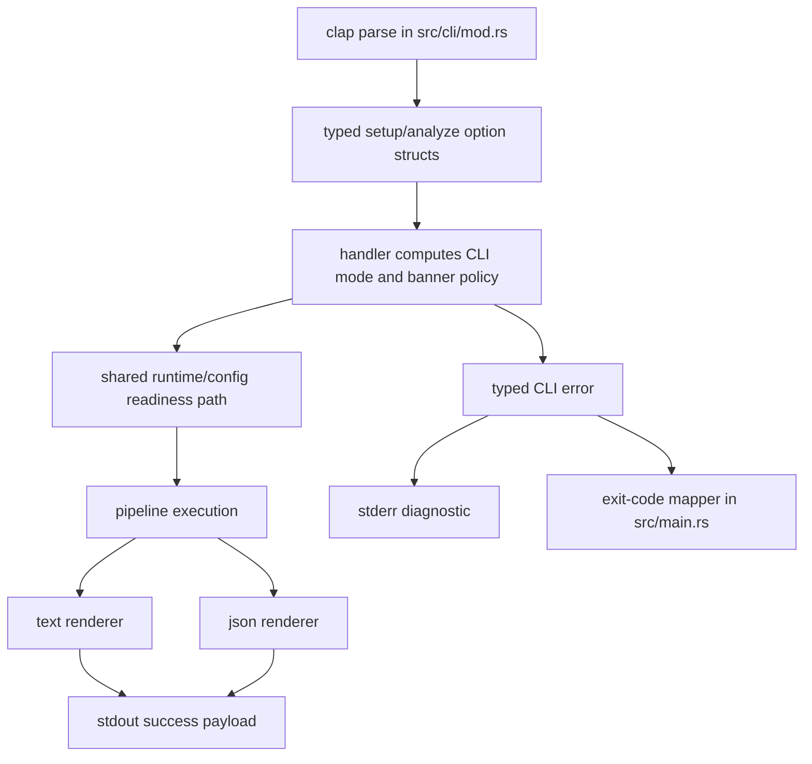
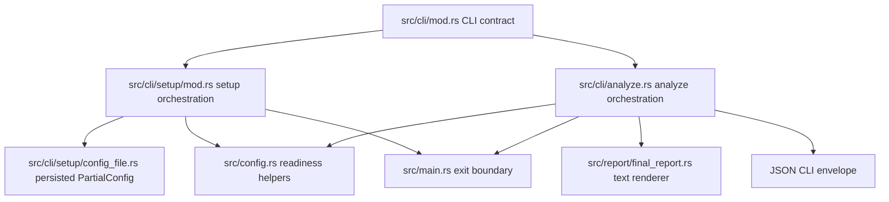

# feat: Add CLI readiness improvements for setup, output, exit codes, and TTY behavior

## Overview

Extend the existing CLI surface so `scorpio` works cleanly for both humans and automation without adding new subcommands. The approved shape is:

- add non-interactive flags to the existing `scorpio setup`
- add `scorpio analyze --output text|json`
- add `scorpio analyze --no-banner`
- suppress the banner automatically when stdout is not a TTY
- route success payloads to stdout and diagnostics to stderr
- replace the current generic exit-1 behavior with explicit exit-code buckets

The implementation should preserve today's interactive, human-friendly defaults while making the same commands reliable in scripts, CI, wrappers, and other machine consumers.

| Surface | Human default | Machine-oriented behavior |
|---|---|---|
| `setup` | interactive prompts via `inquire` | flags allow non-interactive config writes on the same command |
| `analyze` output | text report + banner on TTY | `--output json`, no banner on non-TTY, `--no-banner` override |
| diagnostics | mixed today | success on stdout, errors/diagnostics on stderr |
| exit status | generic `1` | stratified buckets by failure class |

## Problem Frame

The repository already has a functional CLI, but it is still optimized primarily for direct terminal use. The remaining readiness gaps are now concentrated in four places:

1. `scorpio setup` requires prompts, which blocks automation and environment bootstrapping.
2. `scorpio analyze` only emits human-readable text, which blocks stable machine consumption.
3. `main` currently collapses all runtime failures to exit code `1`, which makes automation unable to distinguish usage, configuration, and runtime failures.
4. Banner and terminal-oriented formatting are not explicitly coordinated with TTY state, which creates avoidable noise in piped output.

These are cross-cutting CLI contract issues rather than new product behavior. The approved direction is to extend the existing `setup` and `analyze` commands, reuse current readiness/config helpers, keep `main.rs` thin, and avoid introducing parallel command surfaces that would fragment the UX.

## Requirements Trace

- R1. `scorpio setup` remains interactive by default for humans.
- R2. `scorpio setup` gains machine-mode flags on the existing command rather than a new subcommand.
- R3. `scorpio analyze` gains `--output text|json` on the existing command.
- R4. `scorpio analyze` gains `--no-banner`.
- R5. Banner output is automatically suppressed when stdout is not a TTY.
- R6. Success payloads are written to stdout and diagnostics/errors to stderr.
- R7. CLI exit handling is stratified into explicit buckets instead of the current generic exit `1`.
- R8. Existing readiness/config helpers are reused instead of duplicating validation logic.
- R9. `main.rs` remains a thin dispatcher and exit boundary.
- R10. The plan covers all four approved features together as one coordinated CLI-readiness change.

## Scope Boundaries

- In scope: CLI argument shape, setup orchestration modes, analyze result rendering, output stream discipline, exit-code mapping, and targeted test/doc updates.
- In scope: extending existing modules under `src/cli/`, `src/report/`, `src/main.rs`, and `src/observability.rs` only as needed for the approved CLI contract.
- Out of scope: adding new CLI subcommands, changing the analysis pipeline itself, changing the report's analytical content, or adding rollout/feature-flag infrastructure.
- Out of scope: changing the config schema beyond what is required to support non-interactive `setup` inputs.
- Out of scope: changing tracing/log semantics beyond any minimal TTY-aware presentation decisions needed to avoid CLI contract conflicts.
- Explicit non-goal: do not remove the current human-readable text report mode.
- Explicit non-goal: do not introduce separate `analyze-json`, `setup-noninteractive`, or other parallel command entrypoints.

## Context & Research

### Relevant Code and Patterns

- `src/cli/mod.rs` already owns the clap surface and inline parser tests for `Analyze` and `Setup`.
- `src/cli/analyze.rs` currently owns the full analyze execution path, prints the ASCII banner directly, prints the final human-readable report directly, and also prints several errors directly to stderr before returning `Err`.
- `src/cli/setup/mod.rs` already centralizes setup orchestration, cancellation handling, malformed-config recovery, and final save behavior.
- `src/cli/setup/steps.rs` already separates interactive prompt steps from pure helper logic in several places. This is the best seam for introducing non-interactive setup application/validation without trying to fake prompt input.
- `src/cli/setup/config_file.rs` already provides `PartialConfig`, user-config path resolution, and atomic save/load behavior. This should remain the persistence boundary for setup.
- `src/config.rs` already provides `Config::load()`, `Config::load_effective_runtime(...)`, and `Config::is_analysis_ready()`. Those helpers should remain the source of truth for runtime readiness checks.
- `src/main.rs` is currently thin and should stay thin; it is the natural place to convert typed CLI failures into process exit codes.
- `src/report/final_report.rs` currently renders the terminal-oriented final report as a `String`. It is the main existing reporting seam for text mode.
- `src/observability.rs` already chooses pretty vs JSON tracing from environment. The new CLI behavior should avoid coupling user-facing payload format to tracing format.
- `src/state/trading_state.rs` and related state types already derive `Serialize`/`Deserialize`, which means JSON output can likely be built from existing runtime state shapes rather than inventing an entirely separate serialization model for every nested concept.

### Institutional Learnings

- `docs/solutions/best-practices/config-test-isolation-inline-toml-2026-04-11.md` applies directly to new config/setup tests: use inline TOML and `tempfile::TempDir`, do not couple tests to any production config file.
- No existing solution doc covers CLI output contracts, exit-code stratification, or TTY-aware presentation in this repo. If implementation reveals a reusable pattern, it should be captured after the work lands.

### External References

- Rust standard library `std::io::IsTerminal` is the preferred TTY-detection primitive to use instead of adding a new dependency for terminal detection.
- Clap supports `ValueEnum` cleanly for flag-constrained CLI modes such as `--output text|json`.
- JSON output should remain a stable CLI contract and therefore should be treated as an exported surface, not just an internal convenience format.

## Key Technical Decisions

- **Keep one command surface per workflow.**
  Rationale: the approved direction is to extend existing commands. This preserves discoverability, keeps help output coherent, and avoids duplicated implementation paths.

- **Introduce typed CLI option/result surfaces instead of threading raw booleans/strings through `main`.**
  Rationale: this keeps `main.rs` thin while giving `cli::analyze` and `cli::setup` a durable contract for output mode, banner policy, and exit classification.

- **Model exit codes centrally from typed CLI error categories.**
  Rationale: exit-code stratification is a process boundary concern. `main.rs` should own final `process::exit(...)`, but subordinate modules should return structured categories rather than ad hoc numeric codes.

- **Define four explicit CLI exit buckets plus success/cancel.**
  Rationale: machine consumers need stable failure classes even if exact numeric values are finalized during implementation. The plan-defined buckets are:
  - success: completed command
  - cancelled: user-aborted interactive setup that still counts as a non-error exit
  - usage: argument/contract failure before command execution
  - config: missing, invalid, or not-ready runtime/setup configuration
  - runtime: pipeline execution, dependency initialization, or unexpected command failure
  Final numeric assignments are deferred to implementation, but these buckets are the required contract.

- **Move toward single-point user-visible error emission per failure.**
  Rationale: current `eprintln!` calls inside handlers plus `main`-level error printing risk duplicated diagnostics. The implementation should define which layer formats user-facing errors and make all others return structured context only.

- **Treat text and JSON as two renderers over the same completed analysis result.**
  Rationale: the pipeline should run once and yield one successful state/result object. Rendering should then branch late into text vs JSON. This minimizes drift between modes.

- **Use a dedicated JSON response envelope rather than dumping `TradingState` wholesale.**
  Rationale: `TradingState` is serializable, but it is an internal working-state type with a larger and less intentional surface area than a CLI contract should expose. A smaller response envelope can still reuse existing nested types where they are already stable and serializable.

- **Banner policy should be explicit and layered.**
  Rationale: the CLI needs deterministic precedence across human defaults, `--no-banner`, and non-TTY suppression. The policy should be computed once from options plus terminal state, then applied consistently.

- **Non-interactive setup should reuse existing step validation/persistence seams rather than bypassing them.**
  Rationale: `setup` already owns malformed-config recovery, partial-config persistence, and readiness probing. Machine mode should feed validated values into the same orchestration path, not create a separate config writer.

## Resolved / Deferred Questions

### Resolved During Planning

- **Should these changes add new subcommands?** No. The approved shape is to extend `setup` and `analyze`.
- **Should interactive defaults be preserved?** Yes. Human-first defaults remain; machine mode is opt-in via flags or non-TTY behavior.
- **Should banner suppression be opt-in only?** No. `--no-banner` exists, and automatic suppression also applies when stdout is not a TTY.
- **Should success and diagnostics share stdout?** No. Success payloads go to stdout; diagnostics/errors go to stderr.
- **Should readiness logic be reimplemented in CLI code?** No. Existing config/runtime readiness helpers should be reused.

### Deferred to Implementation

- **Exact flag set for non-interactive `setup`.** The plan intentionally leaves room for final flag naming and whether every configurable field gets its own flag versus a smaller approved subset, but the implementation must keep everything on the existing `setup` command.
- **Exact numeric exit-code mapping.** The plan defines required buckets and boundaries, but the final numbers should be chosen once the CLI error enum is laid out so clap/help semantics and custom runtime exits do not conflict.
- **Exact JSON envelope fields.** The plan fixes the shape category and stability expectations, but final field names should be decided alongside the renderer so they align with existing state/report semantics.
- **Whether to expose partial setup validation failures as aggregated diagnostics or first-error only.** This can be finalized once the non-interactive setup application path is implemented.

## High-Level Technical Design

> *This illustrates the intended approach and is directional guidance for review, not implementation specification. The implementing agent should treat it as context, not code to reproduce.*

### Analyze mode / banner decision matrix

| `--output` | stdout is TTY | `--no-banner` | Success payload | Banner |
|---|---:|---:|---|---|
| `text` | yes | no | text final report | shown |
| `text` | yes | yes | text final report | suppressed |
| `text` | no | no/yes | text final report | suppressed |
| `json` | yes/no | no/yes | JSON envelope | suppressed |

### Suggested dependency flow for the CLI contract



## Implementation Units

- [ ] **Unit 1: Extend the clap surface for setup/analyze machine-readiness modes**

**Goal:** Add the approved command-line surface for non-interactive setup, analyze output mode selection, and banner control while keeping the existing subcommands intact.

**Requirements:** R1, R2, R3, R4, R9, R10

**Dependencies:** None

**Files:**
- Modify: `src/cli/mod.rs`
- Test: `src/cli/mod.rs`

**Approach:**
- Extend `Commands::Analyze` to carry typed options for output mode and banner suppression instead of only the symbol.
- Extend `Commands::Setup` to carry typed optional machine-mode inputs/flags on the existing subcommand.
- Prefer `clap::ValueEnum` (or equivalent typed parsing) for output mode rather than free-form strings.
- Keep parser-level responsibility limited to argument shape and basic conflicts; deeper validation belongs in setup/analyze handlers.
- Add parser-level mutual-exclusion rules where needed so obviously contradictory setup invocations fail before runtime.

**Patterns to follow:**
- Existing clap derive style and parser tests in `src/cli/mod.rs`.
- Keep public CLI surface declaration in `src/cli/mod.rs`, but avoid placing handler logic there.

**Test scenarios:**
- Happy path: `scorpio analyze AAPL` parses with text output default and banner enabled-by-policy.
- Happy path: `scorpio analyze AAPL --output json` parses to the JSON mode.
- Happy path: `scorpio analyze AAPL --no-banner` parses successfully.
- Happy path: `scorpio setup` still parses with no flags and preserves interactive default behavior.
- Happy path: representative non-interactive `setup` invocation with required flags parses successfully.
- Error path: invalid `--output` value is rejected by clap with a parse failure.
- Error path: contradictory or incomplete machine-mode setup flag combinations are rejected at parse time when they can be expressed as clap conflicts/requirements.

**Verification:**
- The clap surface expresses the approved contract without adding new subcommands.
- Parser tests pin the new flag grammar and defaults.

- [ ] **Unit 2: Add a typed CLI outcome/error boundary and exit-code mapping**

**Goal:** Replace ad hoc `Result<()>` + generic exit `1` handling with a small typed boundary that distinguishes success payloads from categorized failures.

**Requirements:** R6, R7, R8, R9

**Dependencies:** Unit 1

**Files:**
- Modify: `src/main.rs`
- Modify: `src/cli/analyze.rs`
- Modify: `src/cli/setup/mod.rs`
- Test: `src/cli/analyze.rs`
- Test: `src/cli/setup/mod.rs`
- Test: `src/cli/mod.rs`

**Approach:**
- Introduce a typed CLI-facing error/category model for at least these buckets:
  - success / completed
  - cancelled / non-error user abort
  - usage / argument contract failure
  - configuration / readiness failure
  - runtime dependency or pipeline execution failure
- Keep final numeric exit mapping in `main.rs`, but make handlers return typed errors or typed outcomes that already encode the bucket.
- Eliminate stderr duplication by choosing one formatting boundary for user-visible diagnostics. The preferred shape is: handlers return structured errors, `main` prints once and exits once.
- Preserve existing successful cancellation semantics for interactive setup.
- Ensure clap-native help/version exits remain untouched and do not get remapped by custom logic.

**Patterns to follow:**
- Keep `main.rs` as a dispatcher plus process boundary only.
- Reuse existing readiness helpers in `src/config.rs` rather than introducing new readiness categories by string matching.

**Test scenarios:**
- Happy path: successful analyze/setup handler returns a success outcome with no stderr diagnostic emission from lower layers.
- Happy path: interactive setup cancellation remains a success exit bucket.
- Error path: missing/incomplete runtime config maps to the configuration/readiness bucket, not the generic runtime bucket.
- Error path: pipeline execution failure maps to the runtime bucket.
- Error path: parse/usage failures remain governed by clap behavior rather than custom remapping.
- Integration: representative handler error is formatted once for the user instead of being duplicated by both handler and `main`.

**Verification:**
- Exit handling is centralized and explicit.
- The chosen buckets cover all current known CLI failure modes without stringly typed branching.

- [ ] **Unit 3: Support non-interactive setup on the existing `setup` command**

**Goal:** Allow `scorpio setup` to apply config values from flags and save without prompts when machine-mode inputs are provided, while preserving today's interactive wizard as the default path.

**Requirements:** R1, R2, R6, R8

**Dependencies:** Unit 1, Unit 2

**Files:**
- Modify: `src/cli/setup/mod.rs`
- Modify: `src/cli/setup/steps.rs`
- Modify: `src/cli/setup/config_file.rs`
- Test: `src/cli/setup/mod.rs`
- Test: `src/cli/setup/steps.rs`
- Test: `src/cli/setup/config_file.rs`

**Approach:**
- Split `setup` orchestration into two explicit paths inside the same module:
  - interactive path: current prompt-driven flow remains the default
  - machine path: construct/update `PartialConfig` from flags, run the same validation/readiness/save seams, and avoid prompt usage entirely
- Keep malformed-config recovery and atomic save behavior in the existing setup module/file boundary.
- Reuse pure helper functions in `steps.rs` wherever possible so machine mode does not duplicate per-field application semantics.
- Decide and document the minimal machine-mode contract for health checking:
  - either machine mode runs the same health check automatically when enough data is present
  - or machine mode exposes an explicit flag to skip/probe it deterministically
  The implementation must keep the behavior non-interactive and script-safe.
- Ensure machine-mode validation failures become stderr diagnostics plus the configuration/usage exit bucket rather than falling into prompt cancellation paths.

**Technical design:** *(directional guidance only)*

```text
setup run
  -> load/recover existing PartialConfig
  -> if no machine flags present: interactive wizard path
  -> else: apply flagged values onto PartialConfig
  -> validate machine-mode completeness/consistency
  -> optional readiness probe per chosen contract
  -> save via existing config_file boundary
```

**Patterns to follow:**
- Existing setup orchestration and cancellation handling in `src/cli/setup/mod.rs`.
- Existing `PartialConfig` persistence boundary in `src/cli/setup/config_file.rs`.
- Existing pure helper style in `src/cli/setup/steps.rs`.

**Test scenarios:**
- Happy path: `setup` with machine-mode flags writes the expected config values without invoking prompt code.
- Happy path: rerunning machine mode updates only specified fields and preserves unspecified existing values when that is the chosen contract.
- Happy path: plain `setup` with no machine flags still follows the interactive path.
- Edge case: machine mode over an existing config preserves atomic write behavior and does not corrupt unrelated persisted fields.
- Error path: incomplete machine-mode input fails with a clear stderr diagnostic and no save.
- Error path: malformed existing config still follows the repo's recovery policy instead of silently overwriting bad input.
- Error path: machine-mode readiness probe failure follows the documented non-interactive behavior and exit bucket.
- Integration: machine-mode setup produces a config that `Config::load_effective_runtime(...)` / `is_analysis_ready()` can consume without special-casing.

**Verification:**
- One `setup` command supports both interactive and non-interactive use without duplicated persistence logic.
- Scripted setup paths are deterministic and non-interactive.

- [ ] **Unit 4: Refactor analyze into a renderable success result with text and JSON outputs**

**Goal:** Decouple pipeline execution from terminal rendering so analyze can emit either text or a stable machine-readable JSON envelope to stdout.

**Requirements:** R3, R5, R6, R8

**Dependencies:** Unit 1, Unit 2

**Files:**
- Modify: `src/cli/analyze.rs`
- Modify: `src/report/final_report.rs`
- Modify: `src/report/mod.rs`
- Test: `src/cli/analyze.rs`
- Test: `src/report/final_report.rs`

**Approach:**
- Separate analyze into three concerns:
  - runtime/pipeline execution
  - success result assembly
  - renderer selection (`text` vs `json`)
- Define a dedicated CLI JSON envelope for successful analysis output. The envelope should be intentionally smaller and more stable than dumping all of `TradingState`, but it may embed existing serializable domain/state types where appropriate.
- Keep text rendering backed by the existing report module so current human-readable output remains the default.
- Ensure JSON mode never emits banner text or other human-oriented decorations to stdout.
- Keep diagnostics out of stdout in both modes.
- Prefer rendering after a completed successful state is available so text and JSON reflect the same analysis run.

**Patterns to follow:**
- Existing `format_final_report(&TradingState) -> String` seam for text mode.
- Existing serializable state types under `src/state/` as candidates for reuse inside the JSON envelope.

**Test scenarios:**
- Happy path: text mode returns the existing final report content on stdout.
- Happy path: JSON mode returns valid JSON with the documented top-level fields and no banner text contamination.
- Happy path: JSON output includes the core final recommendation/outcome fields needed by automation.
- Edge case: text and JSON modes are both derived from the same successful analysis result shape rather than re-running the pipeline.
- Error path: analyze failure in JSON mode still sends diagnostics to stderr and does not emit partial JSON to stdout.
- Integration: the final report renderer remains unchanged in meaning for human text mode after the analyze refactor.

**Verification:**
- Analyze success rendering is mode-driven and stdout-clean.
- JSON mode is intentional enough to serve as a stable CLI contract.

- [ ] **Unit 5: Add banner/TTY policy and stream discipline for analyze output**

**Goal:** Make banner rendering and user-facing output deterministic across TTY and non-TTY contexts, including explicit `--no-banner` support.

**Requirements:** R4, R5, R6

**Dependencies:** Unit 1, Unit 2, Unit 4

**Files:**
- Modify: `src/cli/analyze.rs`
- Modify: `src/main.rs`
- Modify: `src/observability.rs`
- Test: `src/cli/analyze.rs`

**Approach:**
- Compute banner policy once from output mode, explicit flag, and `stdout` terminal detection.
- Use `std::io::IsTerminal` for TTY detection to avoid new dependencies.
- Enforce these rules:
  - `--no-banner` always suppresses the banner
  - non-TTY stdout suppresses the banner automatically
  - JSON mode suppresses the banner automatically
  - text mode on TTY keeps the current banner by default
- Ensure success payload printing and diagnostic printing are clearly separated by stream.
- Review `observability` only for any minimal changes needed to avoid surprising terminal noise; do not conflate tracing format with analyze payload mode.

**Patterns to follow:**
- Existing banner generation in `src/cli/analyze.rs`.
- Keep observability initialization environment-driven unless a small compatibility adjustment is clearly required.

**Test scenarios:**
- Happy path: text mode on TTY with no `--no-banner` shows the banner.
- Happy path: text mode on TTY with `--no-banner` suppresses the banner.
- Happy path: text mode on non-TTY suppresses the banner automatically.
- Happy path: JSON mode suppresses the banner regardless of TTY state.
- Error path: analyze diagnostics continue to go to stderr regardless of TTY state or output mode.
- Integration: banner policy does not alter the actual success payload content beyond decoration suppression.

**Verification:**
- Banner behavior is predictable from the documented policy.
- Piped or redirected analyze output is clean and machine-safe.

- [ ] **Unit 6: Document the exported CLI contract and add end-to-end CLI-focused coverage**

**Goal:** Capture the new operational contract for users and future maintainers, and add tests that exercise the change at the command-behavior level rather than only at helper level.

**Requirements:** R2, R3, R4, R5, R6, R7, R10

**Dependencies:** Units 1-5

**Files:**
- Modify: `README.md`
- Modify: `src/cli/mod.rs`
- Modify: `src/cli/analyze.rs`
- Modify: `src/cli/setup/mod.rs`
- Create: `tests/cli_contract.rs`
- Test: `src/cli/mod.rs`
- Test: `src/cli/analyze.rs`
- Test: `src/cli/setup/mod.rs`
- Test: `tests/cli_contract.rs`

**Approach:**
- Update docs to describe:
  - non-interactive setup availability on the existing command
  - `analyze --output text|json`
  - `--no-banner`
  - stdout/stderr contract
  - exit-code buckets and intended meaning
- Add at least one integration-style test seam if needed to prove cross-layer behavior that unit tests alone cannot establish, especially stdout/stderr separation and exit-code mapping.
- Keep documentation focused on durable contract, not internal implementation details.

**Patterns to follow:**
- Existing README CLI usage sections.
- Repo testing guidance from `AGENTS.md`, including feature-bearing coverage and isolation of config tests.

**Test scenarios:**
- Happy path: docs examples align with the actual clap surface.
- Integration: a representative successful text-mode analyze path writes only the success payload to stdout and exits with the success code.
- Integration: a representative successful JSON-mode analyze path writes valid JSON to stdout and nothing banner-like ahead of it.
- Integration: a representative configuration-readiness failure writes diagnostics to stderr and exits in the configuration bucket.
- Integration: a representative runtime failure exits in the runtime bucket.
- Integration: interactive setup cancellation preserves the success/cancel semantics documented for the command.

**Verification:**
- User-facing docs describe the new CLI contract accurately.
- At least one test layer proves the combined stdout/stderr/exit behavior end to end.

## System-Wide Impact



- **Interaction graph:** This change touches the top-level CLI contract, setup orchestration, analyze orchestration, report rendering, config readiness, and process exit behavior.
- **Error propagation:** Handlers should stop printing ad hoc diagnostics internally and instead return structured CLI errors so `main.rs` can own final stderr formatting and exit mapping.
- **State lifecycle risks:** JSON rendering should not expose unstable internal working-state details accidentally; introducing a dedicated envelope reduces that risk.
- **API surface parity:** The CLI help text, README examples, stdout/stderr behavior, and exit semantics must all agree because they are all part of the exported interface now.
- **Integration coverage:** Unit tests alone are unlikely to prove stdout/stderr separation and exit mapping; at least one integration-style seam will probably be required.
- **Unchanged invariants:** The analysis pipeline itself, underlying readiness rules, interactive setup default, and human-readable final report content should remain materially unchanged.

## Risks & Dependencies

| Risk | Mitigation |
|------|------------|
| JSON mode accidentally exposes unstable internal fields by serializing `TradingState` wholesale | Use a dedicated CLI response envelope and only embed intentional nested types |
| Exit-code stratification conflicts with clap-native exits or duplicates stderr messages | Keep custom mapping only for post-parse handler failures and centralize final printing in `main.rs` |
| Non-interactive `setup` drifts from interactive behavior | Reuse existing `PartialConfig`, validation, readiness, and save seams instead of separate codepaths |
| Banner/TTY logic becomes inconsistent across output modes | Compute one explicit banner policy from options + terminal state and test the matrix directly |
| Cross-cutting refactor makes analyze harder to reason about | Keep execution, rendering, and exit mapping separated into minimal typed boundaries rather than large helpers |

## Documentation / Operational Notes

- Update the README CLI usage examples to include machine-mode setup and JSON analyze usage.
- Treat JSON output and exit-code meanings as stable operational interfaces once shipped.
- Keep examples explicit about stdout vs stderr expectations so shell users and wrapper authors can rely on them.
- If implementation introduces a notable reusable pattern for CLI contract testing in Rust, capture it in `docs/solutions/` after the work lands.

## Sources & References

- Related code: `src/main.rs`
- Related code: `src/cli/mod.rs`
- Related code: `src/cli/analyze.rs`
- Related code: `src/cli/setup/mod.rs`
- Related code: `src/cli/setup/steps.rs`
- Related code: `src/cli/setup/config_file.rs`
- Related code: `src/config.rs`
- Related code: `src/observability.rs`
- Related code: `src/report/final_report.rs`
- Institutional reference: `docs/solutions/best-practices/config-test-isolation-inline-toml-2026-04-11.md`
