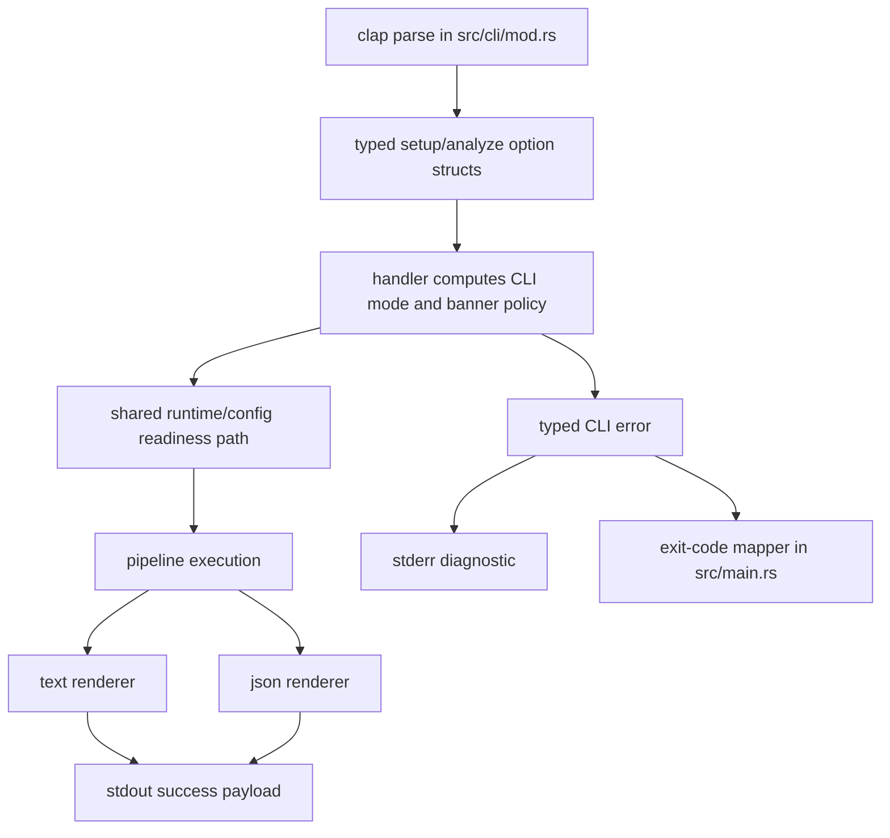
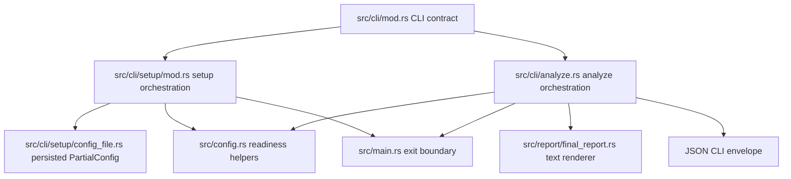

# feat: Add CLI readiness improvements for setup, output, exit codes, and TTY behavior

## Overview

Extend the existing CLI surface so `scorpio` works cleanly for both humans and a scheduled-CI automation consumer without adding new subcommands. The approved shape is:

- add non-interactive flags to the existing `scorpio setup` for **non-secret routing fields only** (no credential flags — secrets stay on the existing `SCORPIO_*_API_KEY` env-var path)
- add `scorpio analyze --output text|json` where JSON output ships as **experimental v1** with an explicit `schema_version` field
- add `scorpio analyze --no-banner`
- suppress the banner automatically when stdout is not a TTY
- route success payloads to stdout and diagnostics to stderr
- replace the current generic exit-1 behavior with a pinned numeric exit-code mapping (see Unit 2)

The implementation should preserve today's interactive, human-friendly defaults while making the same commands reliable in scripts, CI, wrappers, and other machine consumers.

| Surface          | Human default                     | Machine-oriented behavior                                                                                                                              |
|------------------|-----------------------------------|--------------------------------------------------------------------------------------------------------------------------------------------------------|
| `setup`          | interactive prompts via `inquire` | flags allow non-interactive writes of **non-secret routing fields** on the same command; secrets stay on the existing `SCORPIO_*_API_KEY` env-var path |
| `analyze` output | text report + banner on TTY       | `--output json` (experimental v1), no banner on non-TTY, `--no-banner` override                                                                        |
| diagnostics      | mixed today                       | success on stdout, errors/diagnostics on stderr                                                                                                        |
| exit status      | generic `1`                       | pinned numeric codes by failure class (see Unit 2)                                                                                                     |

## Problem Frame

### Concrete consumer

The immediate consumer is a **scheduled CI job** (GitHub Actions or cron) that runs `scorpio analyze <SYMBOL>` across a watchlist on a periodic cadence (e.g., nightly), writes JSON results to artifact storage, and pipes output to downstream tooling (`jq`, analytics, alerting). This consumer drives the four requirements below:

- CI must supply credentials via environment variables and a pre-provisioned config file — not by pasting into interactive prompts.
- CI must parse analyze output mechanically — today's human text report is not a machine contract.
- CI retry/alert logic needs to distinguish transient network failures (retry) from bad credentials (alert) from missing config (fail fast) — today all map to exit `1`.
- CI logs must not be polluted by banner decorations meant for terminal users.

### Readiness gaps

The repository already has a functional CLI, but it is still optimized primarily for direct terminal use. The remaining readiness gaps mapped to that consumer:

1. `scorpio setup` requires prompts, which blocks CI bootstrapping when a config file needs to be written from non-secret routing fields. (Note: API keys are already CI-safe via `SCORPIO_*_API_KEY` env vars and are **not** exposed as CLI flags — see Unit 3.)
2. `scorpio analyze` only emits human-readable text, which blocks stable machine consumption in the CI artifact pipeline.
3. `main` currently collapses all runtime failures to exit code `1`, which makes CI unable to distinguish usage, configuration, and runtime failures for retry/alert routing.
4. Banner and terminal-oriented formatting are not explicitly coordinated with TTY state, which creates avoidable noise in piped CI logs.

These are cross-cutting CLI contract issues rather than new product behavior. The approved direction is to extend the existing `setup` and `analyze` commands, reuse current readiness/config helpers, keep `main.rs` thin, and avoid introducing parallel command surfaces that would fragment the UX.

## Requirements Trace

- R1. `scorpio setup` remains interactive by default for humans.
- R2. `scorpio setup` gains machine-mode flags for **non-secret routing fields** on the existing command rather than a new subcommand. Credentials remain on the existing `SCORPIO_*_API_KEY` env-var path.
- R3. `scorpio analyze` gains `--output text|json` on the existing command, where JSON output is **experimental v1** with an explicit `schema_version` field.
- R4. `scorpio analyze` gains `--no-banner`.
- R5. Banner output is automatically suppressed when stdout is not a TTY; ANSI color output in text mode is coordinated with TTY state.
- R6. Success payloads are written to stdout and diagnostics/errors to stderr.
- R7. CLI exit handling uses the pinned numeric exit-code mapping in Key Technical Decisions (0, 2, 3, 4, 5, 6, 130), instead of the current generic exit `1`.
- R8. Existing readiness/config helpers and existing `TradingError` variants are reused instead of duplicating validation logic or introducing a new error type.
- R9. `main.rs` remains a thin dispatcher and exit boundary.
- R10. The plan covers all four approved features together as one coordinated CLI-readiness change.

## Scope Boundaries

- In scope: CLI argument shape, setup orchestration modes, analyze result rendering, output stream discipline, exit-code mapping, and targeted test/doc updates.
- In scope: extending existing modules under `src/cli/`, `src/report/`, `src/main.rs`, and `src/observability.rs` only as needed for the approved CLI contract.
- Out of scope: adding new CLI subcommands, changing the analysis pipeline itself, changing the report's analytical content, or adding rollout/feature-flag infrastructure.
- Out of scope: changing the config schema beyond what is required to support non-interactive `setup` inputs.
- Out of scope: changing tracing/log semantics beyond any minimal TTY-aware presentation decisions needed to avoid CLI contract conflicts.
- Explicit non-goal: do not remove the current human-readable text report mode.
- Explicit non-goal: do not introduce separate `analyze-json`, `setup-noninteractive`, or other parallel command entrypoints.

## Context & Research

### Relevant Code and Patterns

- `src/cli/mod.rs` already owns the clap surface and inline parser tests for `Analyze` and `Setup`.
- `src/cli/analyze.rs` currently owns the full analyze execution path, prints the ASCII banner unconditionally (no TTY check), prints the final human-readable report directly, and also prints several errors directly to stderr before returning `Err`. Unit 5 must refactor banner printing to respect TTY state and the `--no-banner` flag.
- `src/cli/setup/mod.rs` already centralizes setup orchestration, cancellation handling, malformed-config recovery, and final save behavior.
- `src/cli/setup/steps.rs` already separates interactive prompt steps from pure helper logic in several places. This is the best seam for introducing non-interactive setup application/validation without trying to fake prompt input.
- `src/cli/setup/config_file.rs` already provides `PartialConfig`, user-config path resolution, and atomic save/load behavior. This should remain the persistence boundary for setup.
- `src/config.rs` already provides `Config::load()`, `Config::load_effective_runtime(...)`, and `Config::is_analysis_ready()`. Those helpers should remain the source of truth for runtime readiness checks.
- `src/main.rs` is currently thin and should stay thin; it is the natural place to convert typed CLI failures into process exit codes.
- `src/report/final_report.rs` currently renders the terminal-oriented final report as a `String`. It is the main existing reporting seam for text mode.
- `src/observability.rs` already chooses pretty vs JSON tracing from environment. The new CLI behavior should avoid coupling user-facing payload format to tracing format.
- `src/state/trading_state.rs` and related state types already derive `Serialize`/`Deserialize`, which means JSON output can likely be built from existing runtime state shapes rather than inventing an entirely separate serialization model for every nested concept.

### Institutional Learnings

- `docs/solutions/best-practices/config-test-isolation-inline-toml-2026-04-11.md` applies directly to new config/setup tests: use inline TOML and `tempfile::TempDir`, do not couple tests to any production config file.
- No existing solution doc covers CLI output contracts, exit-code stratification, or TTY-aware presentation in this repo. If implementation reveals a reusable pattern, it should be captured after the work lands.

### External References

- Rust standard library `std::io::IsTerminal` is the preferred TTY-detection primitive to use instead of adding a new dependency for terminal detection.
- Clap supports `ValueEnum` cleanly for flag-constrained CLI modes such as `--output text|json`.
- JSON output should remain a stable CLI contract and therefore should be treated as an exported surface, not just an internal convenience format.

## Key Technical Decisions

- **Keep one command surface per workflow.**
  Rationale: the approved direction is to extend existing commands. This preserves discoverability, keeps help output coherent, and avoids duplicated implementation paths.

- **Typed CLI option surfaces (not result surfaces) via clap derive.**
  Rationale: `Commands::Analyze` and `Commands::Setup` carry typed option fields (`output: OutputMode`, `no_banner: bool`, `non_interactive: bool`, `provider_routing: Option<String>`, etc.) instead of bare booleans or free-form strings. **Handlers continue to return `anyhow::Result<()>`** — no typed CLI error type is introduced. Exit classification is handled by a classifier in `main.rs` that runs on the final error (see Unit 2).

- **Centralize exit-code mapping in `main.rs` via a classifier over existing error types.**
  Rationale: exit-code stratification is a process boundary concern. `main.rs` owns final `process::exit(...)` and the classifier. Handlers are not refactored to produce a new error type; the classifier inspects the existing `anyhow::Error` / `TradingError` chain at the boundary. See Unit 2 for the downcast and string-matching strategy required by today's error-erasure patterns.

- **Pinned exit-code mapping (minimal taxonomy, preserves existing `TradingError` distinctions).**
  Rationale: the CI consumer needs retry/alert routing that distinguishes transient from permanent failures and auth from missing config. The existing `TradingError` enum already separates these cases; the mapping preserves that information instead of collapsing it. Exit-code assignments are **part of the contract now**, not deferred:

  | Code | Bucket | Trigger |
  |---:|---|---|
  | `0` | success | command completed normally |
  | `0` | cancelled | interactive setup aborted by the user (preserves today's behavior) |
  | `2` | usage | argument/contract failure before command execution (clap-native exits preserved) |
  | `3` | config | missing or invalid config; `Config::is_analysis_ready()` returns false |
  | `4` | config-auth | provider rejected credentials at runtime (authentication failure, distinct from missing config) |
  | `5` | runtime-transient | `TradingError::NetworkTimeout`, `TradingError::RateLimitExceeded` — retryable |
  | `6` | runtime | pipeline execution, dependency initialization, or unexpected command failure — not blindly retryable |
  | `130` | interrupt | SIGINT (Ctrl-C) during analyze — standard Unix convention; partial output on stdout/stderr is expected and unclean |

  Code `4` (config-auth) vs `3` (config) is distinguished by whether a credential was present but rejected, not by configuration shape. CI should retry on `5`, alert on `4`, fail-fast on `3`.

- **Cancelled setup stays at exit `0`.**
  Rationale: the existing behavior returns `Ok(())` from cancelled setup, which scripts may already depend on. Changing this to a non-zero code is a gratuitous break. The tradeoff (scripts can't distinguish "completed" from "cancelled") is accepted; scripts that need this distinction can check the existence of `~/.scorpio-analyst/config.toml` after the call.

- **Move toward single-point user-visible error emission per failure.**
  Rationale: current `eprintln!` calls inside handlers plus `main`-level error printing risk duplicated diagnostics. The implementation should define which layer formats user-facing errors and make all others return structured context only.

- **Treat text and JSON as two renderers over the same completed analysis result.**
  Rationale: the pipeline should run once and yield one successful state/result object. Rendering should then branch late into text vs JSON. This minimizes drift between modes.

- **JSON envelope shipped as experimental v1 with explicit version field.**
  Rationale: today there is exactly one consumer (the scheduled CI job described in Problem Frame). Committing to a stable contract before the analytical content stabilizes creates backward-compat debt for a surface nobody else uses yet. The chosen tier is **experimental**:
  - Top-level envelope includes `"schema_version": 1` and `"stability": "experimental"`.
  - Breaking changes may bump `schema_version` without notice until stability is declared.
  - Consumers are expected to read `stability` and decide whether to depend on the envelope at all.

  Rationale (cont.): the envelope is a dedicated type rather than a wholesale `TradingState` dump. `TradingState` has a larger and less intentional surface area than a CLI contract should expose, and it embeds `Arc<RwLock<Option<T>>>` fields that complicate serialization. The envelope embeds existing stable types (`ExecutionStatus`, `TradeProposal`) by reference where they are already serializable, and excludes:
  - raw LLM completion text (prompt echoes, hallucinated PII risk)
  - internal execution metadata not part of the analysis result (retry counts, per-agent latencies)
  - any field whose `Serialize` impl is considered internal (fields gated with `#[serde(skip)]` or requiring a custom `Serialize` should not leak into the envelope without deliberate inclusion)

  Minimum required top-level fields: `schema_version` (integer), `stability` (string), `symbol` (string), `status` (enum: `approved` | `rejected`), `recommendation` (embedded `TradeProposal` summary or `null` when status is `rejected`), `risk_assessment` (short structured summary), `warnings` (array of objects, shape `{"analyst": "<id>", "reason": "<short>"}`; see partial-success handling below), `generated_at` (ISO-8601 timestamp).

  Required invariant: `status == "approved"` ⇔ `recommendation != null`. Consumers may rely on either field; the envelope serializer enforces the invariant (tested in Unit 4).

  Stability graduation: the `stability` field is advisory metadata only — it does not gate code behavior. It graduates to `"stable"` when (a) a second consumer justifies stabilization, or (b) the schema has been unchanged for at least one quarter, whichever comes first. Once stable, `schema_version` bumps follow additive-only rules; a breaking change after stabilization requires a major-version bump on the CLI itself.

- **Partial-success JSON behavior.**
  Rationale: CLAUDE.md documents graceful degradation — 1 analyst failure continues with partial data. The envelope must represent this without ambiguity:
  - When the pipeline completes with all analysts: `warnings` is an empty array; exit `0`.
  - When the pipeline completes with 1 analyst failed: analyst field is `null`, `warnings` contains `{"analyst": "<id>", "reason": "<short>"}`; exit `0`.
  - When the pipeline aborts (2+ analyst failures per existing rule, or any later-phase failure): no JSON envelope is written to stdout; diagnostics go to stderr; exit in the appropriate error code per Unit 2.

  CI consumers parsing the envelope always see a valid JSON object on stdout or see nothing on stdout. Partial JSON is never emitted.

- **Banner policy should be explicit and layered.**
  Rationale: the CLI needs deterministic precedence across human defaults, `--no-banner`, and non-TTY suppression. The policy should be computed once from options plus terminal state, then applied consistently.

- **Non-interactive setup should reuse existing step validation/persistence seams rather than bypassing them.**
  Rationale: `setup` already owns malformed-config recovery, partial-config persistence, and readiness probing. Machine mode should feed validated values into the same orchestration path, not create a separate config writer.

## Resolved / Deferred Questions

### Resolved During Planning

- **Should these changes add new subcommands?** No. The approved shape is to extend `setup` and `analyze`.
- **Should interactive defaults be preserved?** Yes. Human-first defaults remain; machine mode is opt-in via flags or non-TTY behavior.
- **Should banner suppression be opt-in only?** No. `--no-banner` exists, and automatic suppression also applies when stdout is not a TTY. ANSI color output is also suppressed in non-TTY and JSON modes.
- **Should success and diagnostics share stdout?** No. Success payloads go to stdout; diagnostics/errors go to stderr.
- **Should readiness logic be reimplemented in CLI code?** No. Existing config/runtime readiness helpers should be reused.
- **How should secrets reach non-interactive setup?** Via the existing `SCORPIO_*_API_KEY` env-var path. No credential values are accepted as CLI flags. This avoids leaking secrets through `argv`, `ps`, shell history, and CI log capture.
- **Scope of non-interactive setup flags?** Routing and policy fields only (e.g., `--provider-routing`, `--max-debate-rounds`, `--analyst-timeout-secs`, `--non-interactive`, `--health-check`). The `PartialConfig` surface exposed as flags is the minimum needed to bootstrap a CI config file alongside env-var secrets.
- **Machine-mode health-check default?** Skip by default. `--health-check` is an explicit opt-in. This makes CI bootstrapping fast and deterministic; readiness is re-verified at analyze time or with an explicit probe.
- **Exit-code numeric mapping?** Pinned in the Key Technical Decisions table: `0`, `2`, `3`, `4`, `5`, `6`, `130`. Part of the contract now, not deferred.
- **JSON envelope stability tier?** Experimental v1. Top-level `schema_version: 1` and `stability: "experimental"` fields are required from day one. Breaking changes may bump `schema_version` until stability is declared.
- **JSON envelope required fields?** `schema_version`, `stability`, `symbol`, `status`, `recommendation`, `risk_assessment`, `warnings`, `generated_at` — see Unit 4.
- **JSON envelope partial-success behavior?** Complete envelope with `warnings` array; never partial JSON. Pipeline abort emits nothing on stdout. See Key Technical Decisions.

### Deferred to Implementation

- **Whether to expose partial setup validation failures as aggregated diagnostics or first-error only.** This can be finalized once the non-interactive setup application path is implemented; either choice is script-safe as long as it is deterministic.
- **Follow-on cleanup of duplicate stderr emission in existing handlers.** Unit 2 centralizes classification at `main.rs` but leaves the existing `eprintln!` calls in handlers in place to keep blast radius small. A separate follow-up change can consolidate those once the exit-code contract is proven.
- **Whether `src/observability.rs` actually requires any modification.** Unit 5 retains a review pass but no concrete change is mandated; the file is removed from "Modify" if review shows no action is needed.

## High-Level Technical Design

> *This illustrates the intended approach and is directional guidance for review, not implementation specification. The implementing agent should treat it as context, not code to reproduce.*

### Analyze mode / banner decision matrix

Banner is emitted on **stderr** (never stdout); this column indicates whether it is shown at all.

| `--output` | stdout is TTY | `--no-banner` | Stdout (success payload) | Stderr banner  | ANSI in stdout |
|------------|--------------:|--------------:|--------------------------|----------------|----------------|
| `text`     |           yes |            no | text final report        | shown (stderr) | enabled        |
| `text`     |           yes |           yes | text final report        | suppressed     | enabled        |
| `text`     |            no |           any | text final report        | suppressed     | stripped       |
| `json`     |           any |           any | JSON envelope            | suppressed     | N/A (JSON)     |

Tracing output on stderr is orthogonal to this matrix and is controlled by `SCORPIO_LOG_FORMAT` in `src/observability.rs`.

### Suggested dependency flow for the CLI contract



## Implementation Units

- [ ] **Unit 1: Extend the clap surface for setup/analyze machine-readiness modes**

**Goal:** Add the approved command-line surface for non-interactive setup, analyze output mode selection, and banner control while keeping the existing subcommands intact.

**Requirements:** R1, R2, R3, R4, R9, R10

**Dependencies:** None

**Files:**
- Modify: `src/cli/mod.rs`
- Test: `src/cli/mod.rs`

**Approach:**
- Extend `Commands::Analyze` to carry typed options for output mode and banner suppression instead of only the symbol.
- Extend `Commands::Setup` to carry typed optional machine-mode flags for **non-secret routing fields only** (e.g., `--provider-routing quick=copilot,deep=anthropic`, `--max-debate-rounds N`, `--analyst-timeout-secs N`, `--non-interactive` to skip the wizard prompts, and `--health-check` to opt into the readiness probe). **No API-key flags are added.** Secrets continue to flow through the existing `SCORPIO_*_API_KEY` env-var path and `~/.scorpio-analyst/config.toml` so values never appear in `argv`, `ps` output, or shell history.
- Prefer `clap::ValueEnum` (or equivalent typed parsing) for output mode rather than free-form strings.
- Keep parser-level responsibility limited to argument shape and basic conflicts; deeper validation belongs in setup/analyze handlers.
- Add parser-level mutual-exclusion rules where needed so obviously contradictory setup invocations fail before runtime.

**Patterns to follow:**
- Existing clap derive style and parser tests in `src/cli/mod.rs`.
- Keep public CLI surface declaration in `src/cli/mod.rs`, but avoid placing handler logic there.

**Test scenarios:**
- Happy path: `scorpio analyze AAPL` parses with text output default and banner enabled-by-policy.
- Happy path: `scorpio analyze AAPL --output json` parses to the JSON mode.
- Happy path: `scorpio analyze AAPL --no-banner` parses successfully.
- Happy path: `scorpio setup` still parses with no flags and preserves interactive default behavior.
- Happy path: representative non-interactive `setup` invocation with required flags parses successfully.
- Error path: invalid `--output` value is rejected by clap with a parse failure.
- Error path: contradictory or incomplete machine-mode setup flag combinations are rejected at parse time when they can be expressed as clap conflicts/requirements.

**Verification:**
- The clap surface expresses the approved contract without adding new subcommands.
- Parser tests pin the new flag grammar and defaults.

- [ ] **Unit 2: Add two `TradingError` variants + exit-code classifier in `main.rs`**

**Goal:** Replace generic exit `1` with the pinned exit-code mapping from Key Technical Decisions. The classifier lives in `main.rs` and downcasts `anyhow::Error` to `TradingError` variants. To make the classifier work cleanly, add two new typed variants — `TradingError::AuthRejected` and `TradingError::ConfigNotReady` — that carry the signals the classifier needs.

**Requirements:** R7, R8, R9

**Dependencies:** Unit 1

**Files:**
- Modify: `src/error.rs` (add two variants)
- Modify: `src/providers/factory/error.rs` (map 401/403 into `AuthRejected`)
- Modify: `src/data/*.rs` where HTTP status maps to an error (e.g., `src/data/fred.rs::FredRequestError::PermanentClient` for 401/403 → `AuthRejected`)
- Modify: `src/config.rs` or `src/cli/analyze.rs` readiness path (map missing/invalid config → `ConfigNotReady`)
- Modify: `src/cli/analyze.rs` (replace `anyhow::bail!("{e}")` on error paths that currently erase type with `return Err(TradingError::X(...).into())`, so downcast succeeds at `main.rs`)
- Modify: `src/main.rs` (add `exit_code_for`, redaction pass, and `process::exit` call)
- Test: `src/main.rs` unit tests for `exit_code_for`; `tests/cli_contract.rs` for end-to-end paths covered in Unit 6

**Approach:**
- Extend `TradingError` with:
  - `AuthRejected { provider: String, detail: String }` — produced when a provider returns 401/403 or equivalent "invalid credentials" payload
  - `ConfigNotReady { reason: String }` — produced when `Config::is_analysis_ready()` fails or when `Config::load()` cannot find/parse the file
- Update the provider error mapper in `src/providers/factory/error.rs` so that rig / reqwest auth-status errors convert into `TradingError::AuthRejected` instead of the opaque `TradingError::Rig(String)`. Pattern-match on HTTP status where available; fall back to classifying `ProviderError(String)` by inspecting substrings (`"401"`, `"403"`, `"invalid api key"`, `"unauthorized"`) only when a status code isn't reachable.
- Update `FredRequestError::PermanentClient` (and equivalent paths in other data clients) to map 401/403 → `AuthRejected`, keeping 400 / 404 / other 4xx as `AnalystError`.
- Update `src/cli/analyze.rs` error paths that currently do `anyhow::bail!("...: {e}")` to instead return `Err(e.into())` (or `Err(TradingError::X(...).into())`) so that downcast survives. This is a small, targeted change — not a full handler refactor.
- Add `fn exit_code_for(err: &anyhow::Error) -> i32` in `main.rs` that:
  - downcasts to `TradingError::ConfigNotReady` → `3`
  - downcasts to `TradingError::AuthRejected` → `4`
  - downcasts to `TradingError::NetworkTimeout` / `TradingError::RateLimitExceeded` → `5`
  - downcasts to any other `TradingError` variant → `6`
  - falls back to walking the error chain via `err.chain()` for wrapped errors (addresses the `downcast_ref` only-outermost limitation)
  - everything else (non-`TradingError` anyhow) → `6`
- `main.rs` runs the redaction pass on the error chain, prints once via `eprintln!("{e:#}")`, then calls `process::exit(exit_code_for(&e))`.
- Clap-native help/version exits are untouched; custom logic only runs in the error branch of `Cli::parse()` + handler dispatch.
- Add a redaction pass inside `exit_code_for`'s caller: before printing, walk the error chain and redact any substring that matches a known credential pattern. The pattern list lives in a single module (e.g., `src/error.rs::REDACT_PATTERNS`) so it can be audited and extended when new providers are added. Initial patterns:
  - OpenAI: `sk-[A-Za-z0-9]{20,}`
  - Anthropic: `sk-ant-[A-Za-z0-9_-]{20,}`
  - Gemini: `AIza[A-Za-z0-9_-]{30,}`
  - OpenRouter: `sk-or-[A-Za-z0-9_-]{20,}`
  - Generic bearer: `(?i)bearer\s+[A-Za-z0-9._-]{20,}`
  - Generic authorization header: `(?i)authorization:\s*[^\s,]{20,}`

  Each pattern has a dedicated test case. This is a narrow, boundary-only guard; deep provider-client hygiene is deferred.

**Patterns to follow:**
- Keep `main.rs` as a dispatcher plus process boundary only.
- Reuse existing readiness helpers in `src/config.rs` rather than introducing new readiness categories by string matching.

**Test scenarios:**
- Happy path: successful analyze/setup handler returns `Ok(())`; `main.rs` exits `0`.
- Happy path: interactive setup cancellation returns `Ok(())` and exits `0` (preserves today's behavior).
- Unit: `exit_code_for` returns `3` for `TradingError::ConfigNotReady`.
- Unit: `exit_code_for` returns `4` for `TradingError::AuthRejected` (directly, and when wrapped in an `anyhow::Error` context).
- Unit: `exit_code_for` returns `5` for `TradingError::NetworkTimeout` and `TradingError::RateLimitExceeded`.
- Unit: `exit_code_for` returns `6` for any other `TradingError` variant (e.g., `AnalystError`, `GraphFlow`, `Storage`).
- Unit: `exit_code_for` walks `err.chain()` so a `TradingError::AuthRejected` wrapped behind `.context("while loading provider")` still returns `4`.
- Unit: provider error mapper produces `TradingError::AuthRejected` from a 401 response (for each supported provider that exposes status codes) and from a `ProviderError` string containing `"401"` / `"invalid api key"` / `"unauthorized"`.
- Unit: FRED `PermanentClient(401)` / `PermanentClient(403)` produce `AuthRejected`; `PermanentClient(400)` and `PermanentClient(404)` continue to produce `AnalystError`.
- Integration: clap parse failure exits via clap's own path (exit `2`), not through the classifier.
- Integration: an error chain that contains a credential-shaped substring (one test per redaction pattern) has that substring redacted in the stderr emission.

**Verification:**
- Exit handling is centralized in `main.rs`.
- CI retry/alert logic can distinguish transient (`5`), auth (`4`), and config (`3`) failures.
- Handler code is unchanged by this unit (reduces blast radius; full handler refactor is out of scope).

- [ ] **Unit 3: Support non-interactive setup on the existing `setup` command**

**Goal:** Allow `scorpio setup` to apply config values from flags and save without prompts when machine-mode inputs are provided, while preserving today's interactive wizard as the default path.

**Requirements:** R1, R2, R6, R8

**Dependencies:** Unit 1, Unit 2

**Files:**
- Modify: `src/cli/setup/mod.rs`
- Modify: `src/cli/setup/steps.rs`
- Modify: `src/cli/setup/config_file.rs`
- Test: `src/cli/setup/mod.rs`
- Test: `src/cli/setup/steps.rs`
- Test: `src/cli/setup/config_file.rs`

**Approach:**
- Split `setup` orchestration into two explicit paths inside the same module:
  - interactive path: current prompt-driven flow remains the default
  - machine path: construct/update `PartialConfig` from **non-secret routing flags** (see Unit 1), run the same validation/readiness/save seams, and avoid prompt usage entirely
- **Secrets are out of scope for machine-mode flags.** API keys for every provider continue to use the existing `SCORPIO_*_API_KEY` env-var path (already proven by the `run_env_only_config_does_not_fail_with_config_not_found` test). This avoids credential exposure via `argv`, `ps`, shell history, and CI log capture.
- Keep malformed-config recovery and atomic save behavior in the existing setup module/file boundary.
- Machine mode only writes routing/policy fields into `PartialConfig`. Existing env-var precedence rules (env > user file > defaults) continue to govern secret resolution at `Config::load_effective_runtime` time.
- Reuse pure helper functions in `steps.rs` wherever possible so machine mode does not duplicate per-field application semantics. Note: `step3_llm_provider_keys` and `step4_provider_routing` currently interleave prompts with validation — machine mode will need new apply-from-flags helpers that accept a pre-validated map of routing values, not a reuse of the prompt loops.
- Health-check behavior in machine mode: **default is skip** (no network call, no LLM cost). An explicit `--health-check` flag opts into the existing readiness probe. This makes CI bootstrapping fast and deterministic; readiness can be verified separately at analyze time or with an explicit probe.
- Ensure machine-mode validation failures become stderr diagnostics plus the configuration exit code (see Unit 2) rather than falling into prompt cancellation paths.

**Technical design:** *(directional guidance only)*

```text
setup run
  -> load/recover existing PartialConfig
  -> if no machine flags present: interactive wizard path
  -> else: apply flagged values onto PartialConfig
  -> validate machine-mode completeness/consistency
  -> optional readiness probe per chosen contract
  -> save via existing config_file boundary
```

**Patterns to follow:**
- Existing setup orchestration and cancellation handling in `src/cli/setup/mod.rs`.
- Existing `PartialConfig` persistence boundary in `src/cli/setup/config_file.rs`.
- Existing pure helper style in `src/cli/setup/steps.rs`.

**Test scenarios:**
- Happy path: `setup --non-interactive --provider-routing quick=copilot,deep=anthropic` writes the expected routing values without invoking any prompt code.
- Happy path: rerunning machine mode with a subset of routing flags updates only specified fields and preserves unspecified existing values.
- Happy path: plain `setup` with no machine flags still follows the interactive path.
- Happy path: machine-mode setup does not expose any API-key flag on the CLI surface; secrets must come from the existing env-var path, which continues to work.
- Edge case: machine mode over an existing config preserves atomic write behavior and does not corrupt unrelated persisted fields.
- Edge case: machine-mode save writes the config file with `0o600` permissions even when the destination did not previously exist. The temp file must have its permissions set to `0o600` *before* the atomic rename, so the file is never momentarily world-readable.
- Edge case: overwriting an existing config file that had incorrect permissions (e.g., `0o644` from a prior tool invocation) still results in a `0o600` file after save, because the temp file always carries the correct mode before rename (atomic rename replaces the inode; pre-existing permissions are not inherited).
- Error path: incomplete machine-mode input (e.g., invalid provider id in routing) fails with a clear stderr diagnostic and no save.
- Error path: malformed existing config still follows the repo's recovery policy instead of silently overwriting bad input.
- Error path: `--health-check` flag with missing credentials fails deterministically and exits in the configuration bucket.
- Integration: machine-mode setup produces a config that `Config::load_effective_runtime(...)` / `is_analysis_ready()` can consume without special-casing when the corresponding `SCORPIO_*_API_KEY` env vars are present.

**Verification:**
- One `setup` command supports both interactive and non-interactive use without duplicated persistence logic.
- Scripted setup paths are deterministic and non-interactive.

- [ ] **Unit 4: Refactor analyze into a renderable success result with text and JSON outputs**

**Goal:** Decouple pipeline execution from terminal rendering so analyze can emit either text or a stable machine-readable JSON envelope to stdout.

**Requirements:** R3, R5, R6, R8

**Dependencies:** Unit 1, Unit 2

**Files:**
- Modify: `src/cli/analyze.rs`
- Modify: `src/report/final_report.rs`
- Modify: `src/report/mod.rs`
- Test: `src/cli/analyze.rs`
- Test: `src/report/final_report.rs`

**Approach:**
- Separate analyze into three concerns:
  - runtime/pipeline execution
  - success result assembly
  - renderer selection (`text` vs `json`)
- Define the JSON envelope type with the fields pinned in Key Technical Decisions (`schema_version`, `stability`, `symbol`, `status`, `recommendation`, `risk_assessment`, `warnings`, `generated_at`). Embed existing stable types (`ExecutionStatus`, `TradeProposal`) by reference. Explicitly exclude raw LLM completion text and internal execution metadata.
- The envelope type lives in `src/report/` (new file, e.g., `src/report/json_envelope.rs`) so text and JSON renderers are peers under the report module.
- Keep text rendering backed by the existing `format_final_report` seam so current human-readable output remains the default.
- Ensure JSON mode never emits banner text or other human-oriented decorations to stdout.
- Keep diagnostics out of stdout in both modes.
- Prefer rendering after a completed successful state is available so text and JSON reflect the same analysis run.
- Partial-success: when the pipeline completes with degraded analysts, populate the `warnings` array with `{"analyst": <id>, "reason": <short>}` entries. When the pipeline aborts, emit nothing on stdout (see Unit 2 for exit-code mapping).

**Patterns to follow:**
- Existing `format_final_report(&TradingState) -> String` seam for text mode.
- Existing serializable state types under `src/state/` as candidates for reuse inside the JSON envelope.

**Test scenarios:**
- Happy path: text mode returns the existing final report content on stdout.
- Happy path: JSON mode returns valid JSON with the pinned top-level fields (`schema_version: 1`, `stability: "experimental"`, `symbol`, `status`, `recommendation`, `risk_assessment`, `warnings`, `generated_at`) and no banner contamination.
- Happy path: JSON output includes the core final recommendation/outcome fields needed by CI automation.
- Happy path: a successful run with all analysts healthy produces `warnings: []` and exit `0`.
- Edge case: text and JSON modes are both derived from the same successful analysis result shape rather than re-running the pipeline.
- Edge case (partial success): a run with 1 analyst failed produces a valid JSON envelope with `warnings` containing one entry, analyst field null, exit `0`.
- Error path: pipeline abort (2+ analyst failures or later-phase failure) in JSON mode emits nothing on stdout and sends diagnostics to stderr. Exit code is determined by Unit 2.
- Error path: JSON output never contains raw LLM completion text or internal execution metadata fields, even when those fields are present on the underlying `TradingState`.
- Integration: the final report renderer remains unchanged in meaning for human text mode after the analyze refactor.

**Verification:**
- Analyze success rendering is mode-driven and stdout-clean.
- JSON mode is intentional enough to serve as a stable CLI contract.

- [ ] **Unit 5: Add banner/TTY policy and stream discipline for analyze output**

**Goal:** Make banner rendering and user-facing output deterministic across TTY and non-TTY contexts, including explicit `--no-banner` support.

**Requirements:** R4, R5, R6

**Dependencies:** Unit 1, Unit 2, Unit 4

**Files:**
- Modify: `src/cli/analyze.rs`
- Modify: `src/main.rs`
- Review (modify only if necessary): `src/observability.rs`
- Test: `src/cli/analyze.rs`

**Approach:**
- Compute banner policy once from output mode, explicit flag, and `stdout` terminal detection.
- Use `std::io::IsTerminal` for TTY detection to avoid new dependencies.
- Enforce these rules:
  - `--no-banner` always suppresses the banner
  - non-TTY stdout suppresses the banner automatically
  - JSON mode suppresses the banner automatically
  - text mode on TTY keeps the current banner by default
- **Banner goes to stderr, not stdout.** Per Unix convention, decorative/informational output belongs on stderr so that stdout remains parseable regardless of mode. The current `println!` call in `src/cli/analyze.rs` changes to `eprintln!`. This is independent of `--no-banner` and TTY detection; together they form defense in depth (banner on stderr by default, suppressed entirely when non-TTY or `--no-banner` or JSON mode).
- Ensure success payload printing (stdout) and diagnostic printing (stderr) are clearly separated by stream. `setup/mod.rs` status messages (`"Config saved to ..."`, `"Setup cancelled."`) also move to `eprintln!` — they are operator-facing acknowledgments, not machine-consumable output.
- Coordinate ANSI color output with TTY state. The text renderer in `src/report/final_report.rs` uses the `colored` crate (e.g. `.green().bold()`, `.red().bold()`) which emits ANSI escape codes into the returned `String`. When stdout is not a TTY, or when `--output json` is in effect, call `colored::control::set_override(false)` so piped text output is free of terminal control sequences. The `colored` crate also respects the `NO_COLOR` environment variable; document that honoring `NO_COLOR` is a by-product of the chosen override API.
- **TTY asymmetry note.** Banner policy and ANSI policy are computed from `stdout` TTY state only. `stderr` TTY state is independent and governs tracing output, which continues to be controlled by `SCORPIO_LOG_FORMAT` in `src/observability.rs`. A CI consumer running `scorpio analyze AAPL --output json 2>/dev/null` discards tracing intentionally; a consumer running `scorpio analyze AAPL > artifact.json` still sees tracing on stderr, which is the desired behavior.
- **Ctrl-C (SIGINT) during analyze.** No new signal handler is added. The process terminates uncleanly per the standard Unix convention: exit `130`, partial output on stdout/stderr is expected and unclean, and any in-progress SQLite snapshot may be truncated. This is explicitly documented as the contract; clean shutdown is out of scope for this unit.
- **Observability scope.** Re-verify that `src/observability.rs` does not emit tracing lines ahead of `Cli::parse()`. If it does, defer relocation to a separate change; otherwise no modification is needed and the file is removed from the implementation set for this unit. Do not conflate tracing format with analyze payload mode.

**Patterns to follow:**
- Existing banner generation in `src/cli/analyze.rs`.
- Keep observability initialization environment-driven unless a small compatibility adjustment is clearly required.

**Test scenarios:**
- Happy path: text mode on TTY with no `--no-banner` shows the banner on stderr (not stdout).
- Happy path: text mode on TTY with `--no-banner` suppresses the banner entirely.
- Happy path: text mode on non-TTY suppresses the banner automatically and strips ANSI codes from the report.
- Happy path: JSON mode suppresses the banner regardless of TTY state and strips ANSI codes.
- Happy path: `NO_COLOR=1 scorpio analyze AAPL` produces ANSI-free text output regardless of TTY state.
- Error path: analyze diagnostics continue to go to stderr regardless of TTY state or output mode.
- Integration: banner policy does not alter the actual success payload content on stdout; only stderr decoration is affected.
- Integration: `scorpio analyze AAPL > artifact.json` yields a file containing no ANSI sequences and no banner.

**Verification:**
- Banner behavior is predictable from the documented policy.
- Piped or redirected analyze output is clean and machine-safe.

- [ ] **Unit 6: Document the exported CLI contract and add end-to-end CLI-focused coverage**

**Goal:** Capture the new operational contract for users and future maintainers, and add tests that exercise the change at the command-behavior level rather than only at helper level.

**Requirements:** R2, R3, R4, R5, R6, R7, R10

**Dependencies:** Units 1-5

**Files:**
- Modify: `README.md`
- Modify: `src/cli/mod.rs`
- Modify: `src/cli/analyze.rs`
- Modify: `src/cli/setup/mod.rs`
- Create: `tests/cli_contract.rs`
- Test: `src/cli/mod.rs`
- Test: `src/cli/analyze.rs`
- Test: `src/cli/setup/mod.rs`
- Test: `tests/cli_contract.rs`

**Approach:**
- Update docs to describe:
  - non-interactive routing-only flags on the existing `setup` command, with an explicit note that secrets come from `SCORPIO_*_API_KEY` env vars
  - `analyze --output text|json` with JSON's experimental-v1 stability stance
  - `--no-banner` and the TTY/ANSI policy summary
  - stdout/stderr contract (banner and status messages on stderr; success payload on stdout)
  - pinned numeric exit codes (0, 2, 3, 4, 5, 6, 130) and CI retry/alert guidance
- **Split test strategy for exit codes.**
  - **Classifier unit tests** live in `src/main.rs` (or a small helper module) and exercise `exit_code_for` directly against crafted `anyhow::Error` values wrapping each `TradingError` variant and each redaction pattern. These tests prove the classifier logic for codes `3`, `4`, `5`, and `6` without spawning the binary or requiring live credentials. They are defined in Unit 2 but run as part of the normal `cargo test` suite.
  - **Thin integration tests** live in `tests/cli_contract.rs` and exercise only the behaviors that *must* go through the built binary: clap parse failure (exit `2`), missing config (exit `3`), cancelled interactive setup (exit `0`), stdout/stderr stream separation, ANSI-free piped output, and `--help` / `--version` passthrough. These tests do not hit the network.
  - **Composite live-credential test** — the end-to-end "setup → analyze JSON" scenario for R10 requires real provider keys and is gated by an env var (e.g., `SCORPIO_LIVE_TESTS=1`). It is not run in the default CI workflow; documentation points operators at the flag.
- Add `assert_cmd = "2"` + `predicates = "3"` to `[dev-dependencies]` in `Cargo.toml` for the thin integration layer. These crates are the idiomatic way to spawn the built binary as a child process and inspect stdout/stderr/exit in Rust.
- Keep documentation focused on durable contract, not internal implementation details.

**Patterns to follow:**
- Existing README CLI usage sections.
- Repo testing guidance from `AGENTS.md`, including feature-bearing coverage and isolation of config tests.

**Test scenarios:**

*Thin integration (no network, `cargo test` default):*
- Happy path: docs examples align with the actual clap surface.
- Integration: clap parse failure for an invalid `--output` value exits `2`.
- Integration: missing config (`HOME` pointed at a temp dir with no `~/.scorpio-analyst/config.toml` and no `SCORPIO_*_API_KEY` env vars) produces a stderr diagnostic and exits `3`.
- Integration: interactive setup cancellation preserves the exit-`0` semantics.
- Integration: `--help` and `--version` exit through clap (exit `0`) and do not trigger the classifier.
- Integration: `scorpio analyze <SYMBOL> > artifact.json` produces stdout without any ANSI sequences or banner text (tested by piping to a file and asserting on content; does not require the pipeline to complete).
- Integration: stderr always receives the banner (in TTY text mode) and never carries the success payload.

*Classifier unit tests (Unit 2, listed here for traceability):*
- Exit codes `3`, `4`, `5`, `6` are covered by direct tests of `exit_code_for` against crafted `TradingError` values, not by end-to-end spawning.

*Composite live-credential test (gated by `SCORPIO_LIVE_TESTS=1`, not on default CI):*
- **Composite workflow (satisfies R10):** non-interactive `setup --non-interactive --provider-routing ...` with `SCORPIO_*_API_KEY` env vars, followed by `analyze <SYMBOL> --output json`, produces a valid JSON envelope on stdout with the pinned top-level fields populated and exits `0`.

**Verification:**
- User-facing docs describe the new CLI contract accurately.
- At least one test layer proves the combined stdout/stderr/exit behavior end to end.

## System-Wide Impact



- **Interaction graph:** This change touches the top-level CLI contract, setup orchestration, analyze orchestration, report rendering, config readiness, and process exit behavior.
- **Error propagation:** Handlers should stop printing ad hoc diagnostics internally and instead return structured CLI errors so `main.rs` can own final stderr formatting and exit mapping.
- **State lifecycle risks:** JSON rendering should not expose unstable internal working-state details accidentally; introducing a dedicated envelope reduces that risk.
- **API surface parity:** The CLI help text, README examples, stdout/stderr behavior, and exit semantics must all agree because they are all part of the exported interface now.
- **Integration coverage:** Unit tests alone are unlikely to prove stdout/stderr separation and exit mapping; at least one integration-style seam will probably be required.
- **Unchanged invariants:** The analysis pipeline itself, underlying readiness rules, interactive setup default, and human-readable final report content should remain materially unchanged.

## Risks & Dependencies

| Risk                                                                                            | Mitigation                                                                                                                                                                                                                |
|-------------------------------------------------------------------------------------------------|---------------------------------------------------------------------------------------------------------------------------------------------------------------------------------------------------------------------------|
| JSON mode accidentally exposes unstable internal fields by serializing `TradingState` wholesale | Use a dedicated CLI response envelope with pinned fields; explicitly exclude raw LLM completion text and internal execution metadata; ship as `stability: "experimental"` until a second consumer justifies stabilization |
| Exit-code stratification conflicts with clap-native exits or duplicates stderr messages         | Pinned codes avoid clap's `2` for usage; classifier runs only in the error branch of `main.rs`; handlers are not refactored in Unit 2 so existing `eprintln!` calls stay and remain compatible                            |
| Credential exposure through CLI flags                                                           | No credential flags are added; secrets flow exclusively via existing `SCORPIO_*_API_KEY` env vars                                                                                                                         |
| JSON envelope stability commitment becomes a backward-compat debt                               | Explicit `schema_version` + `stability: "experimental"` from day one; breaking changes permitted until stability is declared                                                                                              |
| Non-interactive `setup` drifts from interactive behavior                                        | Reuse existing `PartialConfig`, validation, readiness, and save seams instead of separate codepaths                                                                                                                       |
| Banner/TTY/ANSI logic becomes inconsistent across output modes                                  | Compute one explicit policy from options + terminal state; test the matrix directly; banner emission moves to stderr so piped stdout is clean by construction                                                             |
| Ctrl-C during analyze leaves inconsistent state (partial SQLite snapshot, etc.)                 | Accepted and documented: exit `130`, partial state is possible; clean shutdown is deferred to a separate change                                                                                                           |
| Cross-cutting refactor makes analyze harder to reason about                                     | Execution, rendering, and exit mapping stay in minimal typed boundaries; Unit 2 is scoped down to a mapper in `main.rs` so the error-propagation refactor is avoided                                                      |

## Documentation / Operational Notes

- Update the README CLI usage examples to include:
  - machine-mode routing-only setup with env-var secrets (`SCORPIO__=... SCORPIO_OPENAI_API_KEY=... scorpio setup --non-interactive --provider-routing ...`)
  - JSON analyze usage with `--output json`, including a note on the experimental stability tier and that consumers must check `schema_version` and `stability` fields before depending on the output
  - exit-code table and CI retry/alert guidance:
    - **exit `3`** (config) — fail fast; human fix required
    - **exit `4`** (auth) — alert; credential rotation or provisioning error
    - **exit `5`** (transient) — retry with a **cap of 3 attempts**, then escalate to alert. The cap matters because some providers return HTTP 429 for both rate limits *and* revoked keys; unbounded retry would loop forever on a permanently bad credential
    - **exit `6`** (runtime) — alert; likely a pipeline bug or external dependency outage
    - **exit `130`** (interrupt) — expected when SIGINT is sent; output may be partial
- Exit-code numeric meanings are operational interfaces and must match the Key Technical Decisions table exactly.
- JSON output is an **experimental** operational interface: consumers are expected to check `schema_version` and `stability` fields before relying on it.
- Keep examples explicit about stdout vs stderr expectations so shell users and wrapper authors can rely on them.
- If implementation introduces a notable reusable pattern for CLI contract testing in Rust (e.g., `assert_cmd` harness structure), capture it in `docs/solutions/` after the work lands.

## Sources & References

- Related code: `src/main.rs`
- Related code: `src/cli/mod.rs`
- Related code: `src/cli/analyze.rs`
- Related code: `src/cli/setup/mod.rs`
- Related code: `src/cli/setup/steps.rs`
- Related code: `src/cli/setup/config_file.rs`
- Related code: `src/config.rs`
- Related code: `src/observability.rs`
- Related code: `src/report/final_report.rs`
- Institutional reference: `docs/solutions/best-practices/config-test-isolation-inline-toml-2026-04-11.md`
