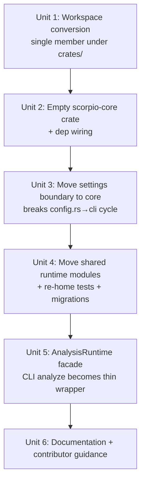
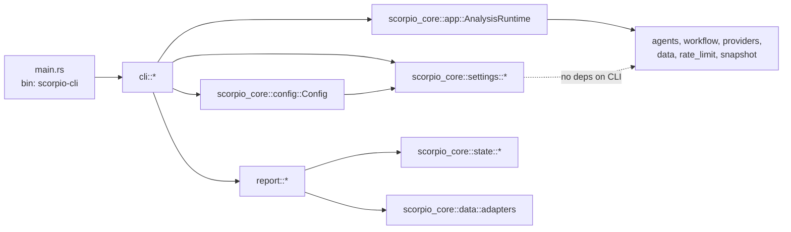

# refactor: Core and CLI Crate Split

## Overview

Convert the `scorpio-analyst` repository from a single-package layout into a Cargo workspace with two active product/runtime crates:

- `scorpio-core` — new library crate owning reusable trading/runtime logic (agents, workflow, providers, data clients, state, indicators, analysis packs, errors, observability, rate limiting, config, settings boundary, and an async application facade).
- `scorpio-cli` — CLI-only binary crate (clap/inquire command surface, setup wizard, update notices, terminal banner, and terminal report formatting). Depends on `scorpio-core`.

The split is behavior-preserving at the installed `scorpio` command level: no user-visible changes to CLI commands, config semantics, or pipeline behavior. The refactor lands through compile-green stages so each unit can be reviewed and CI-validated independently.

## Problem Frame

`Cargo.toml` currently defines a single package, and `src/lib.rs` exposes `pub mod cli` alongside `pub mod agents`, `pub mod state`, `pub mod workflow`, etc. Shared runtime code already reaches into CLI-owned modules: `src/config.rs` imports `crate::cli::setup::config_file::{PartialConfig, user_config_path, load_user_config_at}`. That reversed dependency works for today's single-surface CLI, but blocks future internal consumers (backtest, TUI) from depending on shared logic without first unpicking CLI ownership.

The requirements doc (`docs/brainstorms/2026-04-17-core-cli-crate-split-requirements.md`) locks in the shape: a two-crate first slice that establishes the stable core API (application-centered facade, settings boundary, typed analysis result) and leaves the CLI as a consumer of that core. Further crates (backtest, TUI) are future work and do not land here.

## Requirements Trace

All Rn tags below map directly to the origin document. See origin for full text.

- R1, R2 — Workspace with exactly two active crates (core + CLI).
- R3, R4 — Core owns reusable trading/runtime; CLI owns delivery concerns; CLI depends on core (not reverse).
- R5 — Core boundary is shaped as a **shared extraction seam for future internal consumers** (not a frozen contract). The plan explicitly accepts that the facade's return type and error type may narrow as a second consumer lands; R5's intent is "do not pre-commit to a CLI-shaped boundary," not "freeze the API surface." See Key Technical Decisions for the trade-offs.
- R6 — Shared runtime modules no longer depend on CLI-owned modules after the split.
- R7, R8 — Behavior-preserving; installed binary name and invocation unchanged.
- R9 — Root-level build/run/lint/test workflows remain supported.
- R10 — Incremental compile-green stages, not a one-shot restructure.
- R11 — Existing in-repo consumers reach shared functionality through core (not CLI wrappers).
- R12 — No opportunistic cleanup or broad API redesign beyond the intentional CLI rename to `scorpio-cli`.
- R13 — No new backtest/TUI crates this slice.
- R14 — Ownership ambiguity removed.
- R15 — Project documentation updated.
- R16, R17 — Application-centered core facade, minimal and close to current assembly path.
- R18, R19 — Core-owned settings boundary for non-interactive path/parse/save/runtime-assembly; interactive prompts and malformed-config recovery stay CLI.
- R20, R21 — One reusable async analysis contract returning typed state; terminal rendering outside it.
- R22, R23 — Low-level internals and terminal presentation not part of the stable shared surface.
- R24 — Reduce broad re-export patterns only as needed for the new seam.

## Scope Boundaries

- No new `scorpio-backtest` or `scorpio-tui` crates. Empty `src/backtest/` placeholder continues to ship as a core-internal module.
- No new user-facing CLI commands or stubs.
- No crates.io publishing concerns — `publish = false` on both crates.
- No changes to trading logic, agent prompts, pipeline semantics, config file schema, or env-var names.
- No opportunistic renames of `PartialConfig`, `Config`, `TradingState`, or similar types. The file *containing* `PartialConfig` may move and be renamed, but the type names stay.
- No reduction of `pub` surface on core modules beyond what the cross-crate seam strictly requires.
- No migration to `[workspace.dependencies]` dep centralization in this slice (optional future cleanup).

## Context & Research

### Relevant Code and Patterns

- **Reversed dependency today** — `src/config.rs:371,374,384,394,589` import `crate::cli::setup::config_file::{PartialConfig, user_config_path, load_user_config_at}`. This is the single structural dependency cycle that the split removes.
- **CLI → core calls in steps** — `src/cli/setup/steps.rs:227,387,395,415-440,637,665,698` reach into `crate::config`, `crate::providers`, `crate::rate_limit` to run the health check. These become `scorpio_core::...` imports after Unit 4.
- **Analysis entrypoint today** — `src/cli/analyze.rs:43-168` loads `Config`, validates the symbol, spawns a nested tokio runtime, builds providers/rate-limiters/clients, constructs `TradingPipeline`, calls `run_analysis_cycle`, then prints `crate::report::format_final_report(&state)`. The body up to `run_analysis_cycle` is what moves behind the core facade in Unit 5.
- **sqlx migrations loader** — `sqlx::migrate!()` in `src/workflow/snapshot*.rs` resolves `migrations/` relative to `CARGO_MANIFEST_DIR` of the caller's crate. Since the caller moves to core, `migrations/` must move alongside it (Unit 4).
- **Binary artifact naming** — Unit 1 updates the release pipeline (`.github/workflows/release.yml:101,107,114,119`) to build `target/${{ matrix.target }}/release/scorpio-cli`, strip it, copy it to `release-stage/scorpio`, and archive it as `scorpio-<triple>.tar.gz`. Install scripts (`install.sh`, `install.ps1`) continue to expect that archive name and place the binary at `~/.local/bin/scorpio`.
- **Test imports across `tests/`** — Every integration test imports `use scorpio_cli::{state, error, workflow, providers, data, ...}`. Once those modules move to core (Unit 4), imports switch to `scorpio_core::...`. Affected files: `tests/foundation_edge_cases.rs`, `tests/state_roundtrip.rs`, `tests/workflow_pipeline_e2e.rs`, `tests/workflow_pipeline_structure.rs`, `tests/workflow_observability_tasks.rs`, `tests/workflow_pipeline_accounting.rs`, `tests/workflow_observability_pipeline.rs`, and all files in `tests/support/`.
- **Release contract test** — `tests/install_release_contract.rs` uses `PathBuf::from(env!("CARGO_MANIFEST_DIR"))` then reads `.github/workflows/release.yml` relative to that. After moving under a crate, this test must walk up to the repo root (e.g. via `env!("CARGO_MANIFEST_DIR")` + `../../.github/...`) or use an explicit `REPO_ROOT` helper.

### Institutional Learnings

- `docs/solutions/logic-errors/cli-runtime-config-parity-and-setup-health-check-2026-04-15.md` — Setup health check must use the same `Config::load_effective_runtime` path as `analyze` to stay in parity. Preserve this after Unit 3 (settings move): the setup wizard still calls the same core function, just imported from `scorpio_core` instead of a local path.
- `docs/solutions/best-practices/config-test-isolation-inline-toml-2026-04-11.md` — `ENV_LOCK` and inline TOML fixtures in `config.rs` tests must be preserved verbatim when the file moves (Unit 4), since those patterns prevent flakes on env-mutating tests.
- `docs/solutions/logic-errors/thesis-memory-deserialization-crash-on-stale-snapshot-2026-04-13.md` — `TradingState` `#[serde(default)]` and `THESIS_MEMORY_SCHEMA_VERSION` invariants are schema-level, not structural. The split does not touch them, but reviewers must verify they remain intact when `state/` moves to core.

### External References

External research was skipped: the patterns involved (Cargo workspaces, `[[bin]] name` override to decouple binary artifact from package name, `#[workspace.package]` metadata inheritance, facade modules) are well-established Rust conventions and the local codebase provides strong direct grounding. If Unit 1 uncovers surprising workspace-CI friction, revisit at that point.

## Key Technical Decisions

- **Rename the CLI package to `scorpio-cli`; introduce new `scorpio-core` library crate.** Rationale: the workspace member, package name, Cargo package selector, and import crate should align on one CLI identity. Unit 1 carries the required release-workflow path updates while keeping the installed `scorpio` command and archive shape unchanged. See Alternative Approaches for the discarded legacy-name option.
- **Workspace layout under `crates/`.** Root `Cargo.toml` becomes a workspace manifest. Members: `crates/scorpio-core`, `crates/scorpio-cli`. The CLI workspace member lives under `crates/scorpio-cli/` while keeping `package.name = "scorpio-cli"` for artifact continuity. This is a hard requirement for the slice, not optional convention cleanup. The plan accepts the extra path churn in Unit 1 so the first workspace conversion already lands in the repo layout future crates (`crates/scorpio-backtest`, `crates/scorpio-tui`) would follow.
- **Mandatory `[workspace.package] version = "..."` in Unit 1.** The release workflow (`.github/workflows/release.yml:24-42`) validates the release tag by greping `^version` from the root `Cargo.toml`. After workspace conversion the root has no top-level `version` unless `[workspace.package]` provides one. Unit 1 must set `[workspace.package] version = "0.2.5"` (today's value) so the grep still finds a line like `version = "0.2.5"` at the root. Both crates consume it via `version.workspace = true`. Not optional — skipping this breaks the next release.
- **Core facade: one async method on a prepared runtime struct.** `scorpio_core::app::AnalysisRuntime::new(cfg).await` assembles providers/clients/snapshot store; `AnalysisRuntime::run(symbol).await -> anyhow::Result<TradingState>` executes one cycle. Matches R16/R17 (application-centered, close to current assembly path) and R20/R21 (single async contract returning typed state). A free function would also satisfy R17, but a struct gives future callers one-setup/many-runs without re-assembling the pipeline, and costs nothing extra today. **Note on "minimal" vs. returning `TradingState`:** R17 asks for a minimal facade close to today's assembly; returning the full `TradingState` is not minimal in the sense of "narrow DTO," but it matches the current call site's information needs exactly. A narrower `AnalysisResult` wrapper is deliberately deferred until a second consumer proves what it should omit; this slice accepts the wider return type as a known, revisit-later trade-off.
- **Tokio runtime construction stays in the CLI crate, not the facade.** `cli::analyze::run` continues to build the current-thread runtime and `block_on` the facade; `AnalysisRuntime::new` / `AnalysisRuntime::run` are plain `async fn` / `async` methods that expect to be called from an existing executor. Rationale: R12 (minimal change vs. today's `#[tokio::main]` + `spawn_blocking` shape in `main.rs`). Future async-first consumers will already be inside a runtime and do not need a core-owned executor.
- **Settings boundary module name: `scorpio_core::settings`.** Owns `PartialConfig`, `UserConfigFileError`, `user_config_path`, `load_user_config_at`, `save_user_config_at`, `load_user_config`, `save_user_config`. Matches R18 phrasing. Keeps type names identical to today (R12).
- **Report/ stays in the CLI crate.** Per R23, terminal-specific formatting is excluded from the stable core API. `src/report/` is referenced only by `cli/analyze.rs`; it depends on core types (`state`, `data::adapters`) which matches CLI → core direction. It never needs to enter core.
- **Observability and backtest stay in core.** `src/observability.rs` is a generic `init_tracing` helper; every future surface will want it. `src/backtest/` is a one-line placeholder that already represents core-internal territory; R13 keeps it a module, not a crate.
- **Migrations move with core.** `migrations/` directory moves to `crates/scorpio-core/migrations/` since `sqlx::migrate!()` resolves paths relative to the caller's `CARGO_MANIFEST_DIR`.
- **Tests re-home to the crate they exercise.** Core-focused tests (pipeline, state, workflow, config, foundation) move to `crates/scorpio-core/tests/`. CLI-focused tests (CLI parsing, analyze harness, release contract) move to `crates/scorpio-cli/tests/`. Test imports switch from `scorpio_cli::` to `scorpio_core::` for core types.
- **`test-helpers` feature lives on `scorpio-core`, with a forwarder on the CLI.** The feature's primary home is `crates/scorpio-core/Cargo.toml` (`test-helpers = []`), because every existing `#[cfg(feature = "test-helpers")]` gate in `src/` lives in code that moves to core (`src/workflow/**`, `src/providers/factory/client.rs`). The CLI crate also declares `test-helpers = ["scorpio-core/test-helpers"]` as a forwarder so `cargo test -p scorpio-cli --all-features` still builds cleanly. CI invocation becomes `cargo nextest run --workspace --all-features --locked --no-fail-fast`.
- **Root `.cargo/config.toml` alias to preserve `cargo run -- analyze`.** If `cargo run` at the root becomes ambiguous across members, add `[alias] run-cli = "run -p scorpio-cli --"` and document it. In practice only the CLI crate has a `[[bin]]`, so `cargo run -- analyze AAPL` should continue to work without an alias — verify in Unit 1.
- **`.github/workflows/tests.yml` gains `--workspace` and `.cargo/**` path coverage.** Unit 1 must edit the workflow's clippy step to `cargo clippy --workspace --all-targets -- -D warnings` and the nextest step to `cargo nextest run --workspace --all-features --locked --no-fail-fast`. The workflow path filters must include both `crates/**` and `.cargo/**`, because Unit 1 may add `.cargo/config.toml` to preserve root workflows. A virtual workspace manifest makes `--all-features` without a target ambiguous, so `--workspace` is required, not optional.
- **No `pub use` aggregation at the core crate root.** Each core module stays behind its explicit path (`scorpio_core::state::TradingState`, `scorpio_core::workflow::TradingPipeline`, etc.). R24 favors minimal re-exports. A tiny exception: `scorpio_core::app::AnalysisRuntime` may be re-exported at the crate root so the facade is discoverable without forcing callers to know the `app` submodule.
- **`scorpio-core` is both implementation home and shared surface.** In this slice, `scorpio-core` is not merely an internal relocation target; it is the shared crate consumed by `scorpio-cli` first and by future internal surfaces later. `app`, `settings`, and explicitly documented shared types are the preferred entry points for new consumers. The broader public module tree remains available only where the compile-green split, the current CLI, and existing tests still need direct access during this refactor; it is not the default integration guidance for new surfaces. This does not make `scorpio-core` a published semver-stable crate: it remains `publish = false`, and the supported surface may still narrow once additional consumers clarify what should stay public.
- **Facade error contract stays `anyhow` with preserved context strings.** `AnalysisRuntime::new` and `AnalysisRuntime::run` keep an `anyhow::Result` surface, but every failure site moved out of `cli::analyze::run` carries forward its existing `context(...)` string verbatim inside core. The CLI continues to own runtime-construction and presentation-specific wording; core owns the moved assembly/run-stage context.
- **Facade validation lives in core, with optional CLI fast-fail retained.** `AnalysisRuntime::run` validates the symbol with the existing `data::symbol::validate_symbol` helper so every consumer gets the same contract. `cli::analyze::run` may keep its current early validation call before building the runtime to preserve today's fail-fast UX, but the facade repeats the check defensively.
- **Facade test seam is test-only.** Unit 5 adds a `#[cfg(any(test, feature = "test-helpers"))]` constructor/helper that wraps a prebuilt `TradingPipeline` for hermetic `AnalysisRuntime` tests. Production callers only use `AnalysisRuntime::new` and `AnalysisRuntime::run`.
- **No changes to config file on-disk schema, env-var names, or migration files.** Purely structural. R7 / Scope Boundaries.

## Open Questions

### Resolved During Planning

- **What is the minimal first boundary cut?** Core = shared runtime/domain (agents, analysis_packs, backtest, config, constants, data, error, indicators, observability, providers, rate_limit, state, workflow) + the non-interactive settings file I/O lifted from `cli/setup/config_file.rs` + a new `app::AnalysisRuntime` facade. CLI = `main.rs` + `cli/` + `report/`. Resolves R3, R4, R6, R11.
- **What compile-green step sequence keeps the repo green?** Six staged units: (1) workspace conversion of the existing single crate, (2) empty core crate wiring, (3) settings boundary move, (4) bulk shared-module move, (5) facade introduction, (6) documentation. Each stage must pass `cargo fmt -- --check`, `cargo clippy --workspace --all-targets -- -D warnings`, and `cargo nextest run --workspace --all-features --locked` before merge. Resolves R7–R11.
- **Binary name preservation strategy.** Rename the CLI crate package to `scorpio-cli` and update the release workflow to build `target/<triple>/release/scorpio-cli`, while keeping the staged/archive output contract (`scorpio` inside `scorpio-<triple>.tar.gz`) unchanged. Resolves R8.
- **Core facade shape.** `AnalysisRuntime::new(cfg).await -> anyhow::Result<Self>` + `AnalysisRuntime::run(&self, symbol: &str) -> anyhow::Result<TradingState>`. Returns typed state; terminal rendering stays in CLI. Resolves R16, R17, R20, R21, R24.
- **Minimal shared settings seam.** Move only `PartialConfig`, `UserConfigFileError`, `user_config_path`, `load_user_config_at`, `save_user_config_at`, `load_user_config`, `save_user_config` to core. Keep `handle_cancellation`, `is_prompt_cancellation`, `backup_path_for`, `prompt_to_recover_malformed_config`, `load_or_recover_user_config_at`, and the wizard orchestrator (`setup::run`) + every `steps::*` function in CLI. Resolves R18, R19.
- **Which result type does the facade return?** `TradingState`. It already carries everything the current report renderer needs (`final_execution_status`, evidence, provenance, valuation, token usage). Introducing a new `AnalysisResult` wrapper would be premature API curation (R17). Resolves R20, R21, R23.
- **Repo-root workflow preservation.** `cargo build`, `cargo run -- analyze AAPL`, `cargo nextest run --workspace --all-features`, `cargo clippy --workspace --all-targets -- -D warnings`, `cargo fmt -- --check` all continue to work from the repo root after Unit 1. If `cargo run -- analyze AAPL` requires `-p scorpio-cli` disambiguation (it shouldn't, since only the CLI crate has a bin), add a `[alias]` entry to `.cargo/config.toml`. Resolves R9.
- **Is the `crates/` layout optional or required?** Required. This slice standardizes on `crates/` even though keeping `scorpio-cli` at the repo root would be mechanically possible. The extra move churn is accepted deliberately so the initial workspace conversion lands in the final repo layout rather than forcing a second repo-wide move later.
- **Is `scorpio-core` an internal implementation crate or a supported reuse surface?** Both. It owns the shared implementation and is the supported crate boundary for internal consumers, with `scorpio-cli` as the first consumer in this slice. `app` and `settings` are the preferred consumer-facing entry points; broader module visibility remains available where the cross-crate split still needs it.
- **How does Unit 5 stay hermetic under test?** `AnalysisRuntime` gets a `#[cfg(any(test, feature = "test-helpers"))]` constructor/helper that accepts a prebuilt `TradingPipeline`. The `app_runtime` integration test uses that seam instead of trying to stub provider/model assembly through `AnalysisRuntime::new`.
- **How does Unit 5 preserve existing error wording?** The facade keeps the `anyhow::Result` contract, and each failure site moved from `cli::analyze::run` into `AnalysisRuntime::{new,run}` preserves the current context string verbatim. The CLI keeps only runtime-builder and presentation-layer wording that still lives there.
- **Where does symbol validation live after the facade lands?** In both places for this slice: `cli::analyze::run` may keep its early fail-fast validation for unchanged UX, and `AnalysisRuntime::run` repeats the same `validate_symbol` check defensively so non-CLI consumers get the same contract.

### Deferred to Implementation

- Exact method signatures for `AnalysisRuntime` internals and its `#[cfg(any(test, feature = "test-helpers"))]` helper — surfaced during Unit 5 implementation. The external contract is fixed to `anyhow::Result<TradingState>` with preserved context strings at moved failure sites.
- Whether to centralize shared dep versions via `[workspace.dependencies]` — attempt in Unit 1 only if trivially clean; otherwise defer to post-slice cleanup per R12.
- Whether `scorpio_core` re-exports anything at its crate root beyond the facade — start with no re-exports except `AnalysisRuntime`; add individual re-exports only when a CLI or test call site becomes painfully verbose. R24.
- Whether `tests/install_release_contract.rs` adopts a `repo_root()` walker or hard-coded `../../` — decide during Unit 1 based on which keeps the test most resistant to deeper nesting later.
- Whether to add a workspace-level `README.md` pointer to each crate — defer to Unit 6 as part of the documentation pass.

## High-Level Technical Design

> *This illustrates the intended approach and is directional guidance for review, not implementation specification. The implementing agent should treat it as context, not code to reproduce.*

**Target workspace layout:**

```
scorpio-cli/                         # repo root (workspace manifest only)
├── Cargo.toml                       # [workspace] members = ["crates/*"]
├── Cargo.lock                       # shared lockfile
├── .github/workflows/               # tests.yml updated in Unit 1; release.yml unchanged
├── install.sh, install.ps1          # unchanged
├── config.toml                      # inert deprecated stub, unchanged
├── docs/, examples/, openspec/      # unchanged
├── packaging/                       # unchanged
├── README.md, PRD.md, LICENSE       # unchanged content; README wording re: crate layout updated (Unit 6)
├── AGENTS.md, CLAUDE.md             # updated (Unit 6)
│
└── crates/
    ├── scorpio-core/
    │   ├── Cargo.toml               # package.name = "scorpio-core", publish = false
    │   ├── migrations/              # moved from repo-root migrations/
    │   └── src/
    │       ├── lib.rs               # pub mod state; pub mod workflow; ... pub mod app; pub mod settings;
    │       ├── agents/              # moved intact
    │       ├── analysis_packs/      # moved intact
    │       ├── app/                 # NEW — AnalysisRuntime facade (Unit 5)
    │       │   └── mod.rs
    │       ├── backtest/            # moved intact (skeleton stays)
    │       ├── config.rs            # moved; imports scorpio_core::settings (intra-crate after Unit 4)
    │       ├── constants.rs         # moved
    │       ├── data/                # moved
    │       ├── error.rs             # moved
    │       ├── indicators/          # moved
    │       ├── observability.rs     # moved
    │       ├── providers/           # moved
    │       ├── rate_limit.rs        # moved
    │       ├── settings.rs          # NEW home for PartialConfig + file I/O (Unit 3)
    │       ├── state/               # moved
    │       └── workflow/            # moved (incl. sqlx::migrate! callers)
    │
    └── scorpio-cli/
        ├── Cargo.toml               # package.name = "scorpio-cli", [dependencies] scorpio-core = { path = "../scorpio-core" }
        └── src/
            ├── main.rs              # moved; imports scorpio_core::... and crate::cli::...
            ├── cli/
            │   ├── mod.rs           # clap Cli/Commands
            │   ├── analyze.rs       # thin wrapper calling AnalysisRuntime::run(symbol) (Unit 5)
            │   ├── update.rs        # release check + self-upgrade (unchanged)
            │   └── setup/
            │       ├── mod.rs       # interactive wizard orchestrator + recovery UX
            │       └── steps.rs     # interactive step fns
            └── report/              # moved here (no-op move; was already CLI-adjacent)
                ├── mod.rs
                ├── coverage.rs
                ├── final_report.rs
                ├── provenance.rs
                └── valuation.rs
```

**Unit dependency graph:**



**Dependency direction (post-split, target state):**



No arrow ever points from a core module to a CLI module after Unit 3 lands.

## Implementation Units

- [ ] **Unit 1: Convert repository to a Cargo workspace with a single CLI member under `crates/scorpio-cli`**

**Goal:** Turn the repo root into a workspace manifest and move all current source, tests, and migrations under `crates/scorpio-cli/` while keeping the binary name, release pipeline, and root-level developer commands working.

**Requirements:** R1, R7, R8, R9, R10.

**Dependencies:** None.

**Files:**
- Modify: `Cargo.toml` (root — becomes `[workspace]` manifest; **must** include `[workspace.package] version = "0.2.5"` — see Approach for why this is mandatory, not optional)
- Create: `crates/scorpio-cli/Cargo.toml` (move existing package definition here; consume shared metadata via `version.workspace = true`, `edition.workspace = true`, `license.workspace = true`, `repository.workspace = true`, `description.workspace = true`)
- Move: `src/**` → `crates/scorpio-cli/src/**`
- Move: `tests/**` → `crates/scorpio-cli/tests/**`
- Move: `migrations/**` → `crates/scorpio-cli/migrations/**`
- Modify: `crates/scorpio-cli/tests/install_release_contract.rs` — adjust `repo_root()` to walk up from `CARGO_MANIFEST_DIR` to the repo root (e.g. `env!("CARGO_MANIFEST_DIR")` + `../../`) so it still finds `.github/workflows/release.yml`
- Modify: `.github/workflows/tests.yml` — (a) add `--workspace` to both `cargo clippy --all-targets` and `cargo nextest run` so the virtual-manifest root compiles the whole workspace; (b) update the `push.paths` and `pull_request.paths` filters to replace `src/**` and `tests/**` with `crates/**`, and also include `.cargo/**` because Unit 1 may add `.cargo/config.toml` (keep `Cargo.toml`, `Cargo.lock`, and the workflow file). Without the path-filter update, PRs that only touch code under `crates/` or `.cargo/` will silently skip CI.
- Verify-only: `.github/workflows/release.yml` still grep-resolves `^version = "..."` at the root `Cargo.toml` via `[workspace.package]`; no edit required once that inheritance is wired
- Modify (if needed): Create `.cargo/config.toml` at repo root with `[alias]` entries only if plain `cargo run -- analyze AAPL`, `cargo build`, `cargo test`/`cargo nextest` stop working from the root

**Approach:**
- Rename the CLI package to `scorpio-cli` and update the release workflow so the build output path becomes `target/<triple>/release/scorpio-cli` while the staged/archive contract stays unchanged. Unit 1 owns those release-workflow edits.
- Use `git mv` for every file move so `git log --follow` still reveals history.
- The root `Cargo.toml` keeps `Cargo.lock` at the root and declares `members = ["crates/*"]` with `resolver = "2"`.
- **Mandatory:** set `[workspace.package] version = "0.2.5"` (today's crate version) plus `edition = "2024"`, `license = "MIT"`, `repository`, `description`. Both crates consume these via `version.workspace = true`, `edition.workspace = true`, etc. This is non-negotiable because `.github/workflows/release.yml:24-42` validates the release tag by greping `^version` at the root `Cargo.toml`; without the `[workspace.package] version` line the next release will fail. Verify locally by running `grep -m1 '^version' Cargo.toml | cut -d '"' -f2` and confirming the tag version is returned. Note that crate-level `Cargo.toml` files will contain `version.workspace = true`, not a literal version string; the release workflow always greps the root `Cargo.toml`, so the literal version line lives under `[workspace.package]`.
- After the move, `crates/scorpio-cli/tests/install_release_contract.rs` points at `.github/workflows/release.yml` via a repo-root resolver rather than the crate's own manifest dir.
- `.github/workflows/tests.yml` must add `--workspace` to both the clippy and nextest steps, and its path filters must include `.cargo/**` if Unit 1 introduces `.cargo/config.toml`. A virtual workspace manifest makes `cargo nextest run --all-features` with no `-p` argument error out, so the flag is required, not an optional mitigation.
- Verify CI commands from the repo root: `cargo fmt -- --check`, `cargo clippy --workspace --all-targets -- -D warnings`, `cargo nextest run --workspace --all-features --locked --no-fail-fast`, `cargo build --release`.

**Execution note:** Mechanical move. Keep this unit purely structural — zero logical edits beyond the path adjustment in `install_release_contract.rs` and any Cargo-alias file required to keep root commands working.

**Patterns to follow:**
- Standard `[workspace]` manifest idiom used widely in the Rust ecosystem (cargo itself, rustup, rust-analyzer).
- Existing `#[cfg(feature = "test-helpers")]` gating in `tests/` files — moves untouched.

**Test scenarios:**
- Integration — After the move, `cargo build --workspace` produces `target/<triple>/release/scorpio-cli` (or `target/release/scorpio-cli`) with the artifact path the updated release workflow expects.
- Integration — `cargo nextest run --workspace --all-features --locked` runs every existing test with identical pass/fail outcomes.
- Integration — `cargo run -- analyze AAPL` (or the configured alias) launches the CLI with no behavioral change.
- Edge case — `crates/scorpio-cli/tests/install_release_contract.rs` still finds `.github/workflows/release.yml` after moving under a crate (fails loudly if path resolution regresses).
- Edge case — `sqlx::migrate!()` inside `workflow/snapshot*.rs` still finds the migrations directory at `crates/scorpio-cli/migrations/` via its crate's `CARGO_MANIFEST_DIR`.
- Edge case — `grep -m1 '^version' Cargo.toml | cut -d '"' -f2` at the repo root returns `0.2.5` (or whatever the current version is), matching the exact shell invocation used by `.github/workflows/release.yml:24-42`. Add this as an assertion inside `install_release_contract.rs` or a new companion test so CI catches any future regression that drops the workspace-level version line.
- Edge case — if Unit 1 adds `.cargo/config.toml`, a PR touching only `.cargo/config.toml` still matches `.github/workflows/tests.yml` path filters and runs CI.
- Happy path — `cargo fmt -- --check` and `cargo clippy --workspace --all-targets -- -D warnings` pass from the repo root.

**Verification:**
- Root-level `cargo fmt`, `cargo clippy`, and `cargo nextest` commands all succeed.
- `.github/workflows/tests.yml` path filters cover `crates/**` and `.cargo/**` when the repo adds `.cargo/config.toml` in Unit 1.
- `git log --follow crates/scorpio-cli/src/lib.rs` still shows pre-move history.
- The release pipeline, when dry-run built locally for the host triple, still produces `target/<triple>/release/scorpio-cli`.

---

- [ ] **Unit 2: Introduce empty `scorpio-core` crate and wire it as a dependency of `scorpio-cli`**

**Goal:** Add a second workspace member `crates/scorpio-core` with an empty library surface, and declare `scorpio-core = { path = "../scorpio-core" }` in `scorpio-cli`'s Cargo.toml so Units 3–5 can move modules into it one slice at a time.

**Requirements:** R1, R2, R10.

**Dependencies:** Unit 1.

**Files:**
- Create: `crates/scorpio-core/Cargo.toml` (package `scorpio-core`, `publish = false`, minimal dependencies — add only what the first moved module needs; start empty)
- Create: `crates/scorpio-core/src/lib.rs` (empty `//! scorpio-core` header; optional doc comment)
- Modify: `crates/scorpio-cli/Cargo.toml` (add `scorpio-core = { path = "../scorpio-core" }` to `[dependencies]`)
- Modify: root `Cargo.toml` (append `crates/scorpio-core` to `members`)

**Approach:**
- `scorpio-core` starts empty so Unit 2 is trivially compile-green.
- Declare `publish = false` to prevent accidental crates.io release.
- Do not add any `[dependencies]` to `scorpio-core` yet; Units 3 and 4 introduce them incrementally as modules migrate.
- Keep `edition`, `license`, `repository` consistent with the CLI crate (share via `[workspace.package]` if set up in Unit 1).

**Patterns to follow:**
- Existing `crates/scorpio-cli/Cargo.toml` for metadata/features conventions.

**Test scenarios:**
- Integration — `cargo build --workspace` succeeds with both crates in the workspace.
- Integration — `cargo doc --workspace --no-deps` emits a doc page for `scorpio-core` (empty, but present), confirming the crate is recognized.
- Test expectation: no new unit tests required — this unit is pure scaffolding. Flagged intentionally per plan-review rubric: this is not a feature-bearing unit, so the "no tests" annotation is valid.

**Verification:**
- `cargo tree -p scorpio-cli | grep scorpio-core` shows the path dependency is wired.
- `cargo clippy --workspace --all-targets -- -D warnings` and `cargo fmt -- --check` pass.

---

- [ ] **Unit 3: Move the non-interactive settings boundary from `cli::setup::config_file` into `scorpio_core::settings`**

**Goal:** Relocate the shared, non-interactive user-config surface — `PartialConfig`, `UserConfigFileError`, `user_config_path`, `load_user_config_at`, `save_user_config_at`, and the `load_user_config`/`save_user_config` conveniences — into `crates/scorpio-core/src/settings.rs`. This removes the inverted dependency `src/config.rs → crate::cli::setup::config_file` that currently violates R6. Interactive setup UX (prompt helpers, malformed-config recovery, wizard orchestrator, step functions) stays in CLI.

**Requirements:** R6, R10, R11, R18, R19.

**Dependencies:** Unit 2.

**Files:**
- Create: `crates/scorpio-core/src/settings.rs` (houses `PartialConfig`, `UserConfigFileError`, `user_config_path`, `load_user_config_at`, `save_user_config_at`, `load_user_config`, `save_user_config`, plus the existing unit tests for these APIs)
- Modify: `crates/scorpio-core/src/lib.rs` (add `pub mod settings;`)
- Modify: `crates/scorpio-core/Cargo.toml` (add `anyhow`, `serde`, `tempfile`, `thiserror`, `toml` as `[dependencies]`; keep the dep set minimal to this unit)
- Modify: `crates/scorpio-cli/src/cli/setup/config_file.rs` — delete the moved symbols; if the file is now empty, delete it and drop the `pub mod config_file;` entry from `cli/setup/mod.rs`.
- Modify: `crates/scorpio-cli/src/cli/setup/mod.rs` — switch imports from `config_file::{...}` to `scorpio_core::settings::{...}`; `handle_cancellation`, `backup_path_for`, `prompt_to_recover_malformed_config`, `load_or_recover_user_config_at`, and `run()` all stay here.
- Modify: `crates/scorpio-cli/src/cli/setup/steps.rs` — switch `use crate::cli::setup::config_file::PartialConfig` to `use scorpio_core::settings::PartialConfig`.
- Modify: `crates/scorpio-cli/src/config.rs` — **this is a required edit in Unit 3**, even though `config.rs` itself does not physically move until Unit 4. Switch every `crate::cli::setup::config_file::{...}` path to `scorpio_core::settings::{...}`. Production-code call sites: `Config::load` (line 371), `Config::load` fallback (line 374), `Config::load_from_user_path` (line 384), `Config::load_effective_runtime` signature (line 394), and `partial_to_nested_toml_non_secrets` (line 589). Test-block call sites inside `#[cfg(test)] mod tests`: lines 1202, 1245, 1274, 1309, 1331. The enumeration is not exhaustive — after editing, the authoritative check is `grep -rn "crate::cli::setup" crates/scorpio-cli/src/config.rs` returning no hits.
- Modify: `crates/scorpio-cli/src/cli/analyze.rs` — its test helpers currently import `crate::cli::setup::config_file::{PartialConfig, save_user_config_at}`. Switch to `scorpio_core::settings::{PartialConfig, save_user_config_at}`.
- Test: move the existing `#[cfg(test)] mod tests` block from the old `cli/setup/config_file.rs` into `crates/scorpio-core/src/settings.rs`. Tests that depended on `ENV_LOCK` and `HOME` mutation come with it verbatim.

**Approach:**
- The move is pure symbol relocation; no rename, no signature change, no behavior change.
- After this unit, `grep -rn "crate::cli::setup" crates/scorpio-cli/src/config.rs` returns nothing. `config.rs` is still in the CLI crate during Unit 3 — its own file move to core happens in Unit 4.
- **Bump `save_user_config_at` from `pub(crate)` to `pub`.** Required so `config.rs`'s tests and the setup wizard can call it across crate boundaries. Minimum-necessary cross-crate seam change per R24.
- **Bump `UserConfigFileError` from `pub(crate)` to `pub`.** Required because `cli/setup/mod.rs::load_or_recover_user_config_at` downcasts `anyhow::Error` to `&UserConfigFileError` to branch on `Parse` vs. `Read` variants; the CLI retains this downcast and needs the type visible across the new crate boundary. Do *not* refactor the recovery path to string-matching anyhow messages — that would lose the structural signal and goes beyond scope per R12.
- No other visibility changes. `backup_path_for`, `prompt_to_recover_malformed_config`, `load_or_recover_user_config_at`, `is_prompt_cancellation`, and all CLI-only symbols remain `pub(crate)` or private in their current home.

**Execution note:** Start with a failing test in `crates/scorpio-core/tests/settings_roundtrip.rs` (a pared-down roundtrip assertion for `PartialConfig`) before moving the code. The existing tests in the source file then move with the code, but the roundtrip test validates the cross-crate seam end-to-end.

**Patterns to follow:**
- Existing `#[derive(Debug, Error)]` `UserConfigFileError` shape — do not redesign.
- Existing hand-rolled `impl Debug for PartialConfig` that redacts secrets — moves verbatim.
- Existing `ENV_LOCK` pattern for HOME-mutating tests — moves verbatim.

**Test scenarios:**
- Happy path — `scorpio_core::settings::save_user_config_at(&partial, &path)` followed by `load_user_config_at(&path)` round-trips identical `PartialConfig` values.
- Happy path — `partial_to_nested_toml_non_secrets(&partial)` (in `config.rs`) consumes `scorpio_core::settings::PartialConfig` without compilation error.
- Edge case — `save_user_config` errors when `HOME` is unset or relative (preserves the existing fail-closed guarantee; the assertions copy over from the current test file).
- Edge case — `load_user_config_at(path)` returns `PartialConfig::default()` when the file is missing or empty.
- Error path — `load_user_config_at(malformed_file)` returns a `UserConfigFileError::Parse`-bearing `anyhow::Error` that the CLI `load_or_recover_user_config_at` can still downcast and recover from.
- Integration — The setup wizard (`cli::setup::run`) still loads, prompts through, and saves a user config; `scorpio setup` end-to-end behavior is unchanged.
- Integration — `Config::load_from_user_path(path)` in `config.rs` consumes a file produced by `scorpio_core::settings::save_user_config_at`.

**Verification:**
- `cargo clippy --workspace --all-targets -- -D warnings` passes.
- `grep -rn "crate::cli::setup::config_file" crates/` returns no hits.
- The existing config-related tests in `crates/scorpio-cli/src/config.rs::tests` (e.g. `load_from_user_path_populates_llm_routing_from_partial_config`) all pass with updated imports.

---

- [ ] **Unit 4: Move shared runtime modules into `scorpio-core`**

**Goal:** Relocate every non-CLI, non-report module into `scorpio-core`: `agents`, `analysis_packs`, `backtest`, `config.rs`, `constants.rs`, `data`, `error.rs`, `indicators`, `observability.rs`, `providers`, `rate_limit.rs`, `state`, `workflow`, plus the `migrations/` directory. Update every `crate::` path to either stay local (intra-core) or become `scorpio_core::` (from the CLI crate). Re-home tests to whichever crate now owns the subject.

**Requirements:** R3, R4, R5, R6, R10, R11, R14, R22.

**Dependencies:** Unit 3.

**Files:**
- Move: `crates/scorpio-cli/src/agents/**` → `crates/scorpio-core/src/agents/**`
- Move: `crates/scorpio-cli/src/analysis_packs/**` → `crates/scorpio-core/src/analysis_packs/**`
- Move: `crates/scorpio-cli/src/backtest/**` → `crates/scorpio-core/src/backtest/**`
- Move: `crates/scorpio-cli/src/config.rs` → `crates/scorpio-core/src/config.rs`
- Move: `crates/scorpio-cli/src/constants.rs` → `crates/scorpio-core/src/constants.rs`
- Move: `crates/scorpio-cli/src/data/**` → `crates/scorpio-core/src/data/**`
- Move: `crates/scorpio-cli/src/error.rs` → `crates/scorpio-core/src/error.rs`
- Move: `crates/scorpio-cli/src/indicators/**` → `crates/scorpio-core/src/indicators/**`
- Move: `crates/scorpio-cli/src/observability.rs` → `crates/scorpio-core/src/observability.rs`
- Move: `crates/scorpio-cli/src/providers/**` → `crates/scorpio-core/src/providers/**`
- Move: `crates/scorpio-cli/src/rate_limit.rs` → `crates/scorpio-core/src/rate_limit.rs`
- Move: `crates/scorpio-cli/src/state/**` → `crates/scorpio-core/src/state/**`
- Move: `crates/scorpio-cli/src/workflow/**` → `crates/scorpio-core/src/workflow/**`
- Move: `crates/scorpio-cli/migrations/**` → `crates/scorpio-core/migrations/**`
- Modify: `crates/scorpio-core/src/lib.rs` — add `pub mod` declarations for every moved module, preserving the `#![allow(clippy::absurd_extreme_comparisons)]` top-of-lib attribute.
- Modify: `crates/scorpio-core/Cargo.toml` — migrate the runtime `[dependencies]` block (rig-core, schemars, serde, serde_json, toml, thiserror, anyhow, tokio, tracing, tracing-subscriber, governor, config, dotenvy, secrecy, uuid, chrono, reqwest, finnhub, yfinance-rs, kand, num-traits, graph-flow, async-trait, sqlx, nonzero_ext, futures). Move the `test-helpers` feature and any `[dev-dependencies]` that the moved tests require (proptest, mockall, pretty_assertions, paft-money, rust_decimal).
- Modify: `crates/scorpio-cli/Cargo.toml` — prune dependencies that are no longer used by CLI-only code. Retain clap, inquire, colored, comfy-table, figlet-rs, tempfile, chrono (for Local::now in analyze), anyhow, tracing, tokio, serde, self_update, semver, sha2, hex, flate2, tar, zip, reqwest if still referenced. Declare a CLI-side `test-helpers = ["scorpio-core/test-helpers"]` forwarder so `cargo test -p scorpio-cli --all-features` still enables the gated core helpers. The release dev-dep items (flate2, tar, zip) stay on whichever crate hosts `tests/install_release_contract.rs` — by default the CLI crate.
- Modify: every file in `crates/scorpio-cli/src/main.rs`, `src/cli/**`, `src/report/**` — replace `use crate::{agents, config, data, ...}` with `use scorpio_core::{agents, config, data, ...}` where applicable. `main.rs` imports `scorpio_core::observability::init_tracing`.
- Move: tests that exercise core types from `crates/scorpio-cli/tests/` to `crates/scorpio-core/tests/`:
  - `foundation_edge_cases.rs`
  - `state_roundtrip.rs`
  - `workflow_pipeline_e2e.rs`
  - `workflow_pipeline_structure.rs`
  - `workflow_observability_tasks.rs`
  - `workflow_observability_pipeline.rs`
  - `workflow_pipeline_accounting.rs`
  - `tests/support/**` (all)
- Keep in `crates/scorpio-cli/tests/`:
  - `install_release_contract.rs` (release artifact contract — CLI-adjacent)
- Modify: every `use scorpio_cli::{state, error, workflow, data, providers, ...}` in moved tests → `use scorpio_core::{...}`. Likewise for `tests/support/*.rs`.

**Approach:**
- Move modules one group at a time within the unit, compiling between groups (e.g. first move `constants`, `error`, `observability`, `rate_limit`; then `state`; then `providers`; then `data`; then `indicators`; then `analysis_packs`; then `workflow`, `agents`, `backtest`, `config.rs`). This keeps the intermediate diffs reviewable. The single commit on the PR can squash these sub-stages if preferred — the point is each sub-stage compiles locally.
- `config.rs` is the natural last move because it imports from `providers`, `rate_limit`, `data`, `analysis_packs` — move those first.
- `sqlx::migrate!()` resolves relative to the caller's `CARGO_MANIFEST_DIR`; it now resolves to `crates/scorpio-core/migrations/` after the directory move.
- `test-helpers` feature migrates to `scorpio-core`. CI invocation becomes `cargo nextest run --workspace --all-features --locked --no-fail-fast` which enables features on all workspace members.
- **Visibility bumps required for cross-crate CLI consumers.** After the move, two symbols currently `pub(crate)` become cross-crate calls from the CLI and must be bumped to `pub`:
  - `scorpio_core::data::symbol::validate_symbol` (called from `cli/analyze.rs` and reused by `app::AnalysisRuntime` in Unit 5)
  - `scorpio_core::providers::factory::sanitize_error_summary` (called from `cli/setup/steps.rs:234`; both the function declaration in `providers/factory/error.rs` and the `pub(crate) use` re-export in `providers/factory/mod.rs` must become `pub` / `pub use`)
  Before the unit starts, audit any remaining `pub(crate)` items under `data/`, `providers/`, `rate_limit`, `state`, `workflow`, `config`, `analysis_packs`, and `error` against the CLI import list (`grep -rn '^use crate::' src/cli/ src/main.rs src/report/`) to catch additional bumps this enumeration may miss. The rule is: bump only what the CLI seam strictly requires; leave everything else at its current visibility per R24.
- **Intra-crate path rewrites for `config.rs` after its move.** In Unit 3, `config.rs` imports were switched to `scorpio_core::settings::*` (cross-crate). Now that `config.rs` physically moves into core alongside `settings.rs`, those imports should become intra-crate `crate::settings::*`. Same for any other module this unit moves that Unit 3 already pointed at `scorpio_core::...`.
- **Watch for CARGO_MANIFEST_DIR users in relocated tests.** `tests/workflow_pipeline_structure.rs:153` uses `env!("CARGO_MANIFEST_DIR")` and joins `tests/support/`. Moving the test to `crates/scorpio-core/tests/` resolves the path correctly because the support files move alongside, but surface this as a sub-stage verification so future refactors do not break it silently.
- Do not introduce `pub use` aggregation at the core crate root beyond what compile errors demand.
- Treat the broader public module tree as a migration aid for this slice, not the default integration story for new consumers. Unit 6 should document `scorpio_core::app`, `scorpio_core::settings`, and explicitly shared types as the preferred entry points, while existing direct module imports are tolerated only where the split still needs them.
- Preserve `#![allow(clippy::absurd_extreme_comparisons)]` from `crates/scorpio-cli/src/lib.rs`: move it to `crates/scorpio-core/src/lib.rs`. The CLI lib becomes a minimal `lib.rs` exporting only `pub mod cli; pub mod report;` (plus any CLI-internal modules needed by integration tests). Add a top-of-file `//!` comment clarifying that `scorpio-cli` is a binary crate and these `pub mod` declarations exist to support integration tests within the same crate, not as a public library surface for external consumers.

**Execution note:** Large mechanical move; bias toward many small compile-check cycles. After each sub-stage run `cargo check --workspace` and halt on first red.

**Patterns to follow:**
- Each module already has a well-scoped `mod.rs` — move whole directories intact.
- Existing module-local test blocks (`#[cfg(test)] mod tests`) move with the file.

**Test scenarios:**
- Integration — Full test suite `cargo nextest run --workspace --all-features --locked` passes identically to pre-move (same pass/fail set).
- Integration — `cargo run -p scorpio-cli -- setup` + `cargo run -p scorpio-cli -- analyze AAPL` behave identically to before (same prompts, same report format, same exit codes for invalid symbols / missing config).
- Integration — `scorpio upgrade` (via `cargo run -p scorpio-cli -- upgrade` in a mock mode) still executes the full self-update path without relying on CLI-only globals.
- Edge case — `sqlx::migrate!()` in `workflow/snapshot*.rs` successfully applies `0001_create_phase_snapshots.sql` and `0002_add_symbol_and_schema_version.sql` against an in-memory SQLite DB when called from a test in `crates/scorpio-core/tests/`.
- Edge case — `#[cfg(feature = "test-helpers")]`-gated integration tests run under `--all-features` without regression; the feature is now defined on `scorpio-core` and CI invocation includes `--workspace`.
- Edge case — `use scorpio_cli::state::TradingState` in any remaining CLI test compiles (via re-export) OR has been rewritten to `scorpio_core::state::TradingState`. Grep `scorpio_cli::(state|workflow|providers|data|error|config|rate_limit|agents|indicators|analysis_packs|observability|backtest)` in tests to verify the migration.
- Error path — CI catches any stale `crate::` import that should have become `scorpio_core::` (the compiler error is sufficient; no new test needed).
- Integration — `tests/install_release_contract.rs` still passes from its CLI-crate location.

**Verification:**
- `grep -rn "^use crate::" crates/scorpio-cli/src/cli/ crates/scorpio-cli/src/report/ | grep -v "crate::cli\|crate::report\|crate::main"` returns no lines whose right-hand side would live in core (every such line must now use `scorpio_core::`).
- `grep -rn "^use crate::" crates/scorpio-core/src/ | grep "crate::cli"` returns nothing — no reverse dependency.
- `cargo nextest run --workspace --all-features --locked --no-fail-fast` passes.
- `cargo clippy --workspace --all-targets -- -D warnings` passes.
- A manual `cargo run -p scorpio-cli -- analyze AAPL` smoke with minimal config and `SCORPIO__LLM__MAX_DEBATE_ROUNDS=1` still produces the existing banner, proceeds through the pipeline, and prints the same report shape.

---

- [ ] **Unit 5: Introduce `scorpio_core::app::AnalysisRuntime` facade and refactor `cli::analyze::run` to use it**

**Goal:** Collapse the runtime assembly that today lives inline in `cli::analyze::run` — building provider rate limiters, quick/deep completion models, Finnhub/FRED/YFinance clients, `SnapshotStore`, and `TradingPipeline` — behind a single async facade in `scorpio-core`. After this unit, `cli::analyze::run` is a thin wrapper that loads config, validates the symbol, spawns a tokio runtime, calls `AnalysisRuntime::new(cfg).await?.run(&symbol).await?`, and formats the report.

**Requirements:** R5, R16, R17, R20, R21, R24.

**Dependencies:** Unit 4.

**Files:**
- Create: `crates/scorpio-core/src/app/mod.rs` — houses `AnalysisRuntime`
- Modify: `crates/scorpio-core/src/lib.rs` — add `pub mod app;` and (optionally) `pub use app::AnalysisRuntime;`
- Modify: `crates/scorpio-cli/src/cli/analyze.rs` — replace the inline assembly with an `AnalysisRuntime` call; `print_banner()` stays in CLI; the CLI may keep its current early `validate_symbol` fast-fail before building the runtime, but `AnalysisRuntime::run` also validates defensively for non-CLI consumers
- Test: `crates/scorpio-core/tests/app_runtime.rs` (new integration test exercising the facade against stubbed-task pipeline via the existing `test-helpers` feature)
- Test: `crates/scorpio-cli/src/cli/analyze.rs::tests` — update the existing tests to exercise the thin wrapper (missing-config guard, symbol validation, env-only config) against the new facade seam

**Approach:**
- The facade struct holds the assembled pipeline plus anything needed to run more than once without re-assembly:
  - `Config` (owned; for consumers that want to inspect it later)
  - `TradingPipeline` (owned)
- Production callers only use `AnalysisRuntime::new` and `AnalysisRuntime::run`. Add a `#[cfg(any(test, feature = "test-helpers"))]` constructor/helper that accepts a prebuilt `TradingPipeline` so facade tests can stay hermetic without stubbing provider/model assembly through `new`.
- `AnalysisRuntime::new(cfg: Config) -> impl Future<Output = anyhow::Result<Self>>`:
  - Runs `preflight_copilot_if_configured` (async)
  - Builds `SnapshotStore::from_config(&cfg)` (async)
  - Builds `ProviderRateLimiters::from_config(&cfg.providers)`
  - Builds `FinnhubClient`, `FredClient`, `YFinanceClient`
  - Builds `create_completion_model(ModelTier::QuickThinking|DeepThinking, ...)`
  - Constructs `TradingPipeline::new(cfg, finnhub, fred, yfinance, snapshot_store, quick_handle, deep_handle)`
  - Returns `Self`
- `AnalysisRuntime::run(&self, symbol: &str) -> impl Future<Output = anyhow::Result<TradingState>>`:
  - Calls `crate::data::symbol::validate_symbol(symbol)` first so non-CLI consumers get the same input contract as the CLI
  - Computes `target_date` (keep this in CLI or move here — current plan: move here so consumers don't have to duplicate it)
  - Constructs `TradingState::new(symbol, &target_date)`
  - Calls `self.pipeline.run_analysis_cycle(initial_state).await`
  - Checks `state.final_execution_status.is_some()` — returns typed error if not
  - Returns `state`
- `cli::analyze::run` shrinks to approximately:
  1. `load_analysis_config()?`
  2. `validate_symbol(&symbol)?` (optional but recommended to preserve today's fail-fast UX before runtime construction)
  3. Build tokio current-thread runtime (CLI-owned concern — main.rs already has one, but analyze was historically spawned via `spawn_blocking` so it carries its own)
  4. `runtime.block_on(async move { let rt = AnalysisRuntime::new(cfg).await?; let state = rt.run(&symbol).await?; println!("{}", crate::report::format_final_report(&state)); Ok(()) })`
  5. Print `format_final_report` (still CLI-owned)
- Error contract: `AnalysisRuntime::{new,run}` keep `anyhow::Result`, and every failure site moved out of `cli::analyze::run` preserves its existing `context(...)` string verbatim inside core. CLI-only errors such as `failed to initialize async runtime` remain in CLI. This keeps user-visible stderr wording stable without introducing a new facade error enum in this slice.
- The facade does not do any `println!`/`eprintln!`; all user output remains in CLI (R23).
- **Decision — tokio runtime stays in the CLI.** `tokio::runtime::Builder::new_current_thread()` construction lives in `cli::analyze::run` exactly as today; the facade is plain `async fn`/`async` methods that expect the caller to already be inside a runtime. This preserves today's `#[tokio::main]` + `spawn_blocking` shape in `main.rs` and matches R12. Do not migrate the runtime builder into the facade in this slice even if it appears cleaner locally.

**Execution note:** Implement test-first: start with `crates/scorpio-core/tests/app_runtime.rs` built around the test-only `AnalysisRuntime` helper and existing `workflow::test_support` utilities so the facade contract is proven under hermetic stubbed-task conditions before wiring the production `new` path.

**Technical design:** *(directional only — the implementing agent should treat this as a sketch of shape, not a binding signature)*

```rust
// crates/scorpio-core/src/app/mod.rs — directional, not final
pub struct AnalysisRuntime {
    pipeline: crate::workflow::TradingPipeline,
}

impl AnalysisRuntime {
    pub async fn new(cfg: crate::config::Config) -> anyhow::Result<Self> { /* assembles pipeline */ }

    #[cfg(any(test, feature = "test-helpers"))]
    pub fn from_pipeline_for_test(pipeline: crate::workflow::TradingPipeline) -> Self { /* wraps prebuilt pipeline */ }

    pub async fn run(&self, symbol: &str) -> anyhow::Result<crate::state::TradingState> {
        /* validate_symbol, target_date, TradingState::new, run_analysis_cycle, final-status check */
    }
}
```

**Patterns to follow:**
- The current assembly order in `cli/analyze::run` (preflight → snapshot store → rate limiters → completion models → clients → pipeline) — preserve sequencing so first-run behavior is identical.
- Existing `#[cfg(feature = "test-helpers")]`-gated stubs in `workflow::test_support` — reuse for the new integration test.
- Existing `anyhow::Context` strings in `cli/analyze::run` — move them verbatim with the corresponding failure sites so stderr wording does not drift.

**Test scenarios:**
- Happy path — `AnalysisRuntime::from_pipeline_for_test(...)` with a stubbed pipeline runs `"AAPL"` and returns a `TradingState` with `final_execution_status = Some(...)`.
- Happy path — `cli::analyze::run("AAPL")` against the same test config still prints the existing report shape to stdout (verify via captured output or by asserting the `format_final_report(&state)` call site).
- Error path — `AnalysisRuntime::new(cfg)` returns a wrapped error when Copilot preflight fails, preserving the current `"failed to preflight configured Copilot provider"` context string at the moved failure site.
- Error path — `AnalysisRuntime::run(symbol)` returns an error when the pipeline completes without a final execution status; CLI layer translates this into the existing stderr phrasing.
- Error path — `AnalysisRuntime::run("BAD;")` returns the same invalid-symbol failure that the CLI currently gets from `validate_symbol`, even when called outside `cli::analyze::run`.
- Edge case — calling `AnalysisRuntime::run` twice in sequence on the same runtime succeeds (no hidden single-run state), even though the CLI never does this today. This protects the facade's future-consumer promise (R20).
- Integration — CLI `cli::analyze::run` missing-config guard, symbol validation (empty / semicolons / lowercase-ok) continue to pass the existing tests in `cli/analyze::tests`, with only import paths updated.

**Verification:**
- `cargo nextest run --workspace --all-features --locked` passes, including the new `app_runtime` integration test.
- `grep -rn "TradingPipeline::new\|SnapshotStore::from_config" crates/scorpio-cli/src/` returns only comments or test fixtures — the CLI no longer assembles the pipeline itself.
- A manual smoke run (`cargo run -p scorpio-cli -- analyze AAPL` with minimal config) prints the same banner, runs the pipeline, and emits the same report as before Unit 5.

---

- [ ] **Unit 6: Update contributor documentation to match the workspace layout**

**Goal:** Refresh every document that tells contributors the repo is a single crate, points at `src/cli/` within `lib.rs`, or mentions modules whose paths have changed. Ensure the docs describe the new boundary clearly enough that contributors know whether new code belongs in core or CLI without re-deriving the split.

**Requirements:** R14, R15.

**Dependencies:** Unit 5.

**Files:**
- Modify: `AGENTS.md` — update "Single crate, no workspace" framing; replace `src/**` paths with `crates/scorpio-core/src/**` or `crates/scorpio-cli/src/**` as appropriate; update the "Adding things" table so each row lands in the right crate; update test invocations to `cargo nextest run --workspace --all-features`.
- Modify: `CLAUDE.md` — update the Source Layout tree to reflect the two-crate structure; update the "Common Development Tasks" table with correct crate paths; update "Running & Debugging" to show `cargo run -p scorpio-cli -- analyze AAPL` (or whichever invocation Unit 1 confirmed works) and any new alias.
- Modify: `README.md` — light pass to mention the workspace structure only where it helps a newcomer; the user-facing install path (`~/.local/bin/scorpio`, `scorpio analyze AAPL`) stays unchanged.
- Modify: `PRD.md` — the architecture diagram/text that describes module layout. If PRD.md currently describes "a single crate", update to reflect the new boundary model (core + CLI, future backtest/TUI). Keep the spec framing aligned with R5/R13.
- Modify: `.github/instructions/rust.instructions.md` — if it currently refers to `src/**` patterns or the single-crate assumption, update to point at the relevant crate.

**Approach:**
- Do not rewrite architecture narratives wholesale — update only the passages that conflict with the new layout. Per R12, docs should reflect reality, not expand scope.
- Preserve every user-facing command recipe — `scorpio setup`, `scorpio analyze AAPL`, `cargo run -- analyze ...`, etc. — except where a workspace disambiguation alias is required.
- The "Common Development Tasks" table rows must route contributors to `crates/scorpio-core/src/...` for core work and `crates/scorpio-cli/src/...` for CLI work. Rows like "New agent", "New data source", "New indicator", "New LLM provider", "New analysis pack" go to core. "New CLI subcommand" goes to CLI. "New wizard config key" spans both: `scorpio_core::settings::PartialConfig` for the field; `cli/setup/steps.rs` + `scorpio_core::config` for injection.

**Patterns to follow:**
- Existing table format and tone in `AGENTS.md` and `CLAUDE.md`.
- Existing file-path conventions (backticks around paths; repo-relative).

**Test scenarios:**
- Verify-only — A contributor reading AGENTS.md can answer "where does a new analyst agent live?" with `crates/scorpio-core/src/agents/analyst/` without running `grep`.
- Verify-only — `CLAUDE.md`'s source layout diagram matches the actual `crates/` tree produced by `find crates -type d -maxdepth 3`.
- Verify-only — Every `src/` path mentioned in `AGENTS.md` or `CLAUDE.md` resolves to a real file under `crates/scorpio-core/src/` or `crates/scorpio-cli/src/`.
- Test expectation: none — documentation updates carry no behavior change. This is not a feature-bearing unit.

**Verification:**
- A fresh `grep -rn "single crate\|No workspace\|src/lib.rs" AGENTS.md CLAUDE.md README.md PRD.md` returns no stale references.
- Every "Adding things" table row points at a path that actually exists on disk after this unit lands.
- Colleagues who read only the updated `AGENTS.md` can correctly answer "is `report/` in core or CLI?" (CLI) and "where does `PartialConfig` live?" (`scorpio_core::settings`).

---

## System-Wide Impact

- **Interaction graph:** The only reversed dependency today (`src/config.rs → crate::cli::setup::config_file::*`) is eliminated in Unit 3. After Unit 4, no module in `scorpio-core` imports anything from `scorpio_cli`. `main.rs` and `cli/**` imports from `scorpio_core::*` are the only cross-crate edges. Enforced by compiler.
- **Error propagation:** Preserved. `AnalysisRuntime` returns the same `anyhow::Result<...>` surface the CLI already propagates; current stderr wording in `cli/analyze::run` stays in the CLI where it belongs.
- **Shared boundary discipline:** New internal consumers should prefer `scorpio_core::app`, `scorpio_core::settings`, and explicitly documented shared types. Broader direct module imports remain temporarily available to keep the extraction compile-green and the migrated tests intact, not as the recommended long-term integration path.
- **State lifecycle risks:** `TradingState` continues to serialize through `phase_snapshots.trading_state_json`. Moving `state/` to core does not change the JSON shape or `THESIS_MEMORY_SCHEMA_VERSION`. Reviewers must verify `#[serde(default)]` attributes survive the move exactly.
- **API surface parity:** The CLI surface (`scorpio analyze <SYMBOL>`, `scorpio setup`, `scorpio upgrade`, `--no-update-check`, `SCORPIO_NO_UPDATE_CHECK`) is unchanged. Config env vars (`SCORPIO__*`, `SCORPIO_*_API_KEY`) unchanged. `~/.scorpio-cli/config.toml` schema unchanged.
- **Integration coverage:** Existing integration tests (`tests/workflow_pipeline_e2e.rs`, `workflow_pipeline_structure.rs`, `state_roundtrip.rs`, `foundation_edge_cases.rs`, plus `tests/support/**`) relocate to `crates/scorpio-core/tests/` and continue to cover stubbed-pipeline roundtrips. A new `crates/scorpio-core/tests/app_runtime.rs` asserts the new facade seam end-to-end.
- **Unchanged invariants:**
  - Binary artifact path: `target/<triple>/release/scorpio-cli` → staged as `scorpio` → archived as `scorpio-<triple>.{tar.gz,zip}`. Install scripts + release workflow are updated in Unit 1 to preserve the staged/archive contract.
  - `CARGO_PKG_VERSION` embedded into `main.rs` still reads the CLI crate version; update-check/self-upgrade behavior is identical.
  - Config loading precedence: env vars > user file > compiled defaults. Order and wording unchanged.
  - sqlx migration files (`0001_create_phase_snapshots.sql`, `0002_add_symbol_and_schema_version.sql`) are byte-identical; only their directory path moves.
  - `TradingState` JSON schema and `THESIS_MEMORY_SCHEMA_VERSION` constant unchanged.
  - `#![allow(clippy::absurd_extreme_comparisons)]` lint-allow preserved at `crates/scorpio-core/src/lib.rs`.
- **CI configuration:** Unit 1 updates `.github/workflows/tests.yml` to add `--workspace` to both the clippy and nextest steps and to retarget path filters from `src/**` and `tests/**` to `crates/**`, while also including `.cargo/**` if the repo adds `.cargo/config.toml` to preserve root commands (keep `Cargo.toml`, `Cargo.lock`, and the workflow file itself). `release.yml` remains unchanged.

## Alternative Approaches Considered

- **Keep the legacy CLI package name.** Rejected. Once the workspace member directory, package name, Cargo selector, and import crate can all align on `scorpio-cli`, preserving the old name only adds translation overhead in implementation and docs.
- **Keep `scorpio-cli` at the repo root and add only `scorpio-core` under `crates/`.** Mechanically viable and it would reduce Unit 1 path churn. Rejected because this slice explicitly requires a uniform `crates/` workspace layout; deferring that normalization would only split the churn into two repo-wide moves instead of one.
- **Single-step "big bang" restructure.** Rejected: R10 requires incremental compile-green stages. A single PR touching every file would be review-hostile and hard to bisect if CI regresses.
- **Expose the full current module tree via `pub use` at the core crate root for drop-in source compatibility.** Rejected per R24 — broad re-exports defeat the purpose of shaping a stable shared API. Only `AnalysisRuntime` is considered for re-export, and only if it clearly improves call-site ergonomics.
- **Return a brand-new `AnalysisResult` wrapper type from the facade instead of `TradingState`.** Rejected for this slice per R17 — premature API curation. The existing `TradingState` already carries everything the report renderer needs. Introduce a wrapper only when a real second consumer demonstrates it.
- **Move `observability.rs` and `backtest/` to CLI.** Rejected. `init_tracing` is generic and will be wanted by every future surface; backtest is explicitly a future core-internal area per R13.

## Success Metrics

- `cargo fmt -- --check`, `cargo clippy --workspace --all-targets -- -D warnings`, `cargo nextest run --workspace --all-features --locked --no-fail-fast` all pass from the repo root after every unit.
- `grep -rn "^use crate::cli\|^use scorpio_cli::cli" crates/scorpio-core/src/ crates/scorpio-core/tests/` returns no hits.
- `grep -rn "^use crate::" crates/scorpio-cli/src/` returns only `crate::cli`, `crate::report`, and `crate::` self-references — no shared-logic imports sneak through `crate::`.
- A dry-run of the release workflow against the host triple produces `scorpio-<triple>.tar.gz` with the same contents as before the split (a `scorpio` binary at the archive root).
- Contributor survey (ad hoc): a new teammate reading `AGENTS.md` can correctly place a hypothetical new agent, indicator, provider, or wizard step into the right crate without re-reading the source.

## Risk Analysis & Mitigation

| Risk                                                                                                                                                         | Likelihood | Impact | Mitigation                                                                                                                                                                                                                          |
|--------------------------------------------------------------------------------------------------------------------------------------------------------------|------------|--------|-------------------------------------------------------------------------------------------------------------------------------------------------------------------------------------------------------------------------------------|
| Release pipeline regression if binary output path changes                                                                                                    | Low        | High   | Rename the CLI package to `scorpio-cli` and update `.github/workflows/release.yml` in Unit 1; verify `target/<triple>/release/scorpio-cli` exists after the change via local dry-run build.                                       |
| Release workflow tag-version check fails because root `Cargo.toml` has no `^version` line after workspace conversion (`.github/workflows/release.yml:24-42`) | Medium     | High   | Unit 1 sets `[workspace.package] version = "0.2.5"` at the root; both crates inherit via `version.workspace = true`. Unit 1's test scenarios add an assertion replaying the exact grep invocation so CI catches future regressions. |
| CI `cargo nextest --all-features` errors out on virtual workspace manifest without `-p`/`--workspace`                                                        | Medium     | High   | Unit 1 edits `.github/workflows/tests.yml` to add `--workspace` to both the clippy and nextest steps. Non-optional.                                                                                                                 |
| Unit 1 adds `.cargo/config.toml`, but CI path filters do not watch `.cargo/**`, so root workflow changes skip CI                                                | Low        | Medium | Include `.cargo/**` in `.github/workflows/tests.yml` path filters alongside `crates/**`, `Cargo.toml`, `Cargo.lock`, and the workflow file.                                                                                         |
| `test-helpers` feature available from core but not forwarded by CLI, so `cargo test -p scorpio-cli --all-features` fails to activate gated core code         | Low        | Low    | CLI crate declares `test-helpers = ["scorpio-core/test-helpers"]` forwarder in Unit 4.                                                                                                                                              |
| `UserConfigFileError` or `save_user_config_at` left as `pub(crate)` after settings move, breaking CLI recovery path or cross-crate test access               | Low        | Medium | Unit 3 explicitly bumps both to `pub`; Approach section commits to the decision (no "either/or" left to the implementer).                                                                                                           |
| `sqlx::migrate!()` fails at runtime because `migrations/` is no longer under the calling crate's manifest dir                                                | Medium     | High   | Move `migrations/` with `workflow/` in Unit 4; guard with an integration test that exercises `SnapshotStore::from_config` in the new crate.                                                                                         |
| CI command drift (`--all-features` semantics change in a workspace)                                                                                          | Medium     | Medium | Add `--workspace` to the CI `cargo nextest` invocation in Unit 1; verify `test-helpers` features are enabled for every crate that declares the feature.                                                                             |
| `scorpio upgrade` self-update flow regresses because `CARGO_PKG_VERSION` now reads a different package                                                       | Low        | Medium | CLI crate keeps the name `scorpio-cli`; `env!("CARGO_PKG_VERSION")` in `main.rs` resolves to the CLI crate's version. Verify with a smoke `scorpio --version` in Unit 5.                                                            |
| Test imports stay `use scorpio_cli::...` and silently pass due to re-exports, masking cross-crate discipline                                                 | Medium     | Low    | No `pub use` bulk re-exports at the core root (R24). Tests that reference core types must explicitly import from `scorpio_core::...` — the compiler enforces.                                                                       |
| AGENTS.md / CLAUDE.md drift from reality between Units 1–5                                                                                                   | High       | Low    | Accept temporary drift; Unit 6 does the documentation pass in a dedicated commit. Interim work is gated by compilation, not by docs.                                                                                                |
| Intermediate units leave the repo compile-green but with confusing hybrid state (e.g. `config.rs` in CLI importing from `scorpio_core::settings`)            | Low        | Low    | Acceptable by design per R10; document the Unit 3 → Unit 4 sequencing in the PR description so reviewers expect it.                                                                                                                 |
| A module on the core side still has a latent dependency on a CLI-only crate (e.g. `inquire`)                                                                 | Low        | Medium | `crates/scorpio-core/Cargo.toml` is the allowlist: only runtime/data/LLM crates go in. Reject any PR that adds `inquire`, `figlet-rs`, `comfy-table`, `colored`, `self_update`, `semver`, `sha2` to `scorpio-core`.                 |

## Documentation Plan

- Unit 6 is the dedicated docs update, but each preceding unit should:
  - Update inline `//!` module docs at the new location if the old module header referenced the old path.
  - Not backfill sweeping new docs — R12 forbids opportunistic cleanup.
- `AGENTS.md` and `CLAUDE.md` are the primary sources of truth for contributor routing. Both get refreshed in Unit 6.
- The origin brainstorm (`docs/brainstorms/2026-04-17-core-cli-crate-split-requirements.md`) is linked from the plan frontmatter; no change to the brainstorm itself.
- After the slice lands, future plans that propose new crates (backtest, TUI) should link back to this plan as prior art for the workspace convention.

## Operational / Rollout Notes

- No feature flag; the split is behavior-preserving and ships as a single branch of compile-green commits.
- No user-visible version bump is required by the split itself. If a version bump is desired to mark the architectural milestone, bump both crates in lockstep via `[workspace.package] version = "0.3.0"`.
- No database migrations, no env-var changes, no config file schema changes — zero impact on existing user installations.
- The first release after the slice lands should include a release-notes line noting the internal crate split for contributors; end users see no change.

## Sources & References

- **Origin document:** [docs/brainstorms/2026-04-17-core-cli-crate-split-requirements.md](../brainstorms/2026-04-17-core-cli-crate-split-requirements.md)
- Related code:
  - `src/lib.rs` — current `pub mod cli` export
  - `src/config.rs:371-394,589` — the reversed `cli` dependency
  - `src/cli/analyze.rs:43-168` — pipeline assembly that moves behind the facade in Unit 5
  - `src/cli/setup/config_file.rs` — the settings surface that moves to core in Unit 3
  - `src/cli/setup/mod.rs:121-178` — wizard orchestrator that stays in CLI
  - `.github/workflows/release.yml:101-130` — binary-name constraint driving the rename-avoidance decision
  - `src/workflow/snapshot*.rs` — `sqlx::migrate!()` site governing the `migrations/` move
- Institutional learnings:
  - [docs/solutions/logic-errors/cli-runtime-config-parity-and-setup-health-check-2026-04-15.md](../solutions/logic-errors/cli-runtime-config-parity-and-setup-health-check-2026-04-15.md)
  - [docs/solutions/best-practices/config-test-isolation-inline-toml-2026-04-11.md](../solutions/best-practices/config-test-isolation-inline-toml-2026-04-11.md)
  - [docs/solutions/logic-errors/thesis-memory-deserialization-crash-on-stale-snapshot-2026-04-13.md](../solutions/logic-errors/thesis-memory-deserialization-crash-on-stale-snapshot-2026-04-13.md)
- Project docs affected in Unit 6: `AGENTS.md`, `CLAUDE.md`, `README.md`, `PRD.md`, `.github/instructions/rust.instructions.md`.
