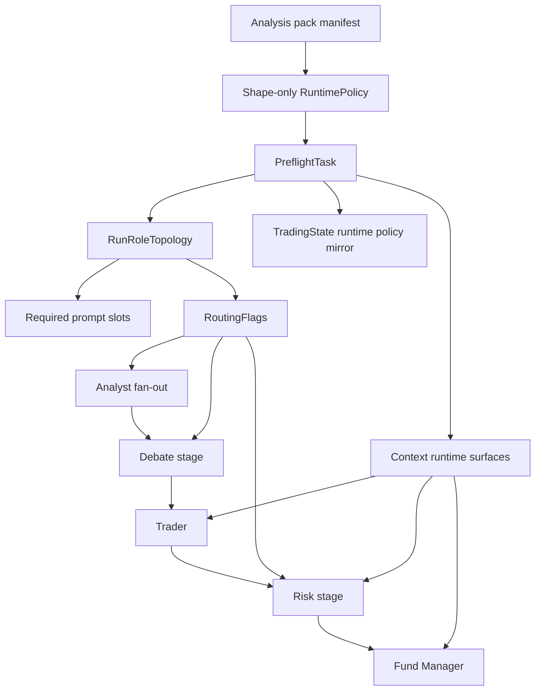

# refactor: Prompt Bundle Centralization

## Overview

Make `AnalysisPackManifest.prompt_bundle` the only runtime prompt source for active packs, and move prompt-slot enforcement to `PreflightTask` so invalid active packs fail before any analyst or model task runs.

The migration is intentionally staged across six units. Units 1-3 add shared topology, fixtures, diagnostics, and pack-owned absence prose without changing runtime behavior. Unit 4a performs the structural authority migration: prompt-builder signatures gain `&RuntimePolicy`, `PreflightTask` becomes the sole writer of `state.analysis_runtime_policy`, the placeholder-substitution sanitization helpers and contract types ship as preparatory infrastructure, and the activation-path audit lands as integration coverage — all without user-visible behavior change. Unit 4b flips the runtime contract: topology-driven analyst spawning and routing via a maximal-children fan-out gated by `RoutingFlags`, zero-round moderator bypass, invalid-pack-id failures instead of baseline fallback, no prompt fallbacks, ticker / `analysis_emphasis` sanitization enforcement at preflight, and `THESIS_MEMORY_SCHEMA_VERSION` `2 -> 3` (read-side only — no destructive migration). Unit 5 ships a fixture-only integration test that constructs a synthetic non-baseline pack manifest and exercises `validate_active_pack_completeness`, `required_prompt_slots`, and the maximal-children fan-out against it — no Cargo feature, no real second pack, just the abstraction validation that R8 requires. Unit 6 removes dead constants and refreshes README/CLAUDE.md; the `docs/solutions/` entry is authored as a post-merge follow-up so it describes the actually-shipped pattern, not the planned one.

This plan is a focused follow-on to `docs/plans/2026-04-23-003-refactor-asset-class-generalization-plan.md`, and implements the approved design in `docs/superpowers/specs/2026-04-25-prompt-bundle-centralization-design.md`.

## Problem Frame

The current runtime still has two prompt ownership paths:

- pack-owned templates under `crates/scorpio-core/src/analysis_packs/*/prompts/*.md`, transported through `RuntimePolicy.prompt_bundle`
- agent-local fallback constants in prompt builders such as `TRADER_SYSTEM_PROMPT`, `FUND_MANAGER_SYSTEM_PROMPT`, and the shared researcher/risk prompt constants

That duplication leaves prompt prose writable in two places and spreads validation across render sites instead of enforcing one contract at startup. The graph also still makes routing decisions from raw `KEY_MAX_DEBATE_ROUNDS` / `KEY_MAX_RISK_ROUNDS`, while analyst fan-out is frozen from `pack.required_inputs` before `PreflightTask` runs. Zero-round debate and risk currently still visit moderator tasks once, which keeps moderator prompt slots artificially required and synthesizes artifacts the approved design wants to leave absent.

The current codebase already has most of the needed seams:

- `PreflightTask` is the first graph node and already writes runtime surfaces into state and context.
- `PromptBundle` and baseline prompt assets already exist.
- Existing exact-render regressions already compare baseline pack assets to legacy researcher and risk renderers.
- `TradingState.analysis_runtime_policy` and thesis snapshot schema guards already exist.

What is missing is a single runtime authority chain:

1. derive one per-run topology from manifest + config + registry
2. derive required prompt slots and routing flags from that same topology
3. validate the active pack once in preflight
4. pass validated runtime policy into prompt builders directly
5. route zero-round runs by topology instead of raw round counters

## Requirements Trace

- R1. Active packs load runtime prompt prose exclusively from `AnalysisPackManifest.prompt_bundle`; prompt builders remain mechanical renderers only. Enforcement lands in Unit 4b; Units 2-3 are preparatory.
- R2. Missing required prompt slots on the active pack fail in preflight before analyst fan-out or model calls, with stable multi-slot diagnostics.
- R3. Routing, analyst spawning, and required prompt-slot derivation share one per-run topology source; zero-round debate and risk bypass moderator tasks entirely and preserve absent artifacts.
- R4. Prompt builders require `&RuntimePolicy`; missing-policy branches disappear and blank selected slots still surface typed config errors. Placeholder substitution enforces a typed value-source contract per placeholder.
- R5. Code-owned absence prose moves into pack assets, and fund-manager risk reasoning distinguishes `StageDisabled` from degraded missing-data state. R5 explicitly owns both the prose move *and* the `DualRiskStatus::StageDisabled` enum extension, since the new variant is the runtime mechanism that distinguishes the two states.
- R6. Inactive stub packs remain registrable and resolvable while every activation path to a runnable graph still traverses `PreflightTask`. The activation-path audit lands as integration coverage in Unit 4a.
- R7a. Zero-round debate and risk semantics are explicit at the runtime contract level: stages bypass moderator tasks entirely and the `StageDisabled` distinction prevents reuse of degraded-data wording. Domain-model preparation lands in Unit 3 (`StageDisabled` enum, pack-owned absence prose); runtime-contract enforcement (zero-round bypass via `RoutingFlags`, no moderator visit) lands in Unit 4b.
- R7b. Snapshot/thesis compatibility retires pre-migration zero-round semantics via `THESIS_MEMORY_SCHEMA_VERSION` `2 -> 3` and read-side skip semantics on the existing version-mismatch path; **no destructive migration**. v2 rows persist on disk and are silently ignored on read; operators may purge manually. Compatibility coverage asserts both directions of the read-side skip (v3 binary skips v2 rows; v2 binary skips v3 rows after downgrade). (Lands in Unit 4b.)
- R8. The topology abstraction is covered by at least one integration test that exercises `validate_active_pack_completeness`, `required_prompt_slots`, and the maximal-children fan-out against a non-baseline pack manifest. The non-baseline manifest is constructed in test code as a fixture (not a real shipped pack and not a feature-gated build artifact) so the abstraction is validated without committing CI to a permanent feature-permutation matrix.

## Scope Boundaries

- The default selectable pack surface remains baseline-only. `PackId::from_str()` accepts only baseline at the public CLI boundary in this slice.
- No new selectable packs, no Cargo-feature-gated packs, and no crypto runtime implementation. The inactive crypto stub stays inactive throughout. Abstraction validation (R8) is delivered by a fixture-only integration test in Unit 5 that constructs a synthetic non-baseline manifest in test code; no production binary changes when Unit 5 lands.
- No new prompt-service abstraction beyond `workflow/topology.rs`, active-pack completeness helpers, and test fixtures.
- No change to the five-phase workflow order other than topology-driven bypass of zero-round debate and risk stages.
- No reporter-format redesign or CLI feature expansion; the only user-visible behavior changes are the approved runtime-contract changes (invalid pack id fails instead of falling back, zero-round artifacts remain absent, active incomplete packs fail in preflight, and out-of-allowlist tickers / oversized `analysis_emphasis` are rejected at preflight).
- No destructive thesis-memory migration. The `THESIS_MEMORY_SCHEMA_VERSION` `2 -> 3` bump uses the existing read-side skip path; v2 rows remain in the SQLite database and are ignored on read. Operators who want the disk space back can purge manually with `DELETE FROM phase_snapshots WHERE schema_version < 3`. This keeps the upgrade reversible: a downgrade after first startup still finds its v2 rows intact.
- No attempt to solve future pack spawnability policy beyond this migration. The activation-path audit (Unit 4a) is implemented as integration coverage rather than prose; if it exposes a live zero-analyst activation case, capture it as a follow-up rather than broadening this refactor ad hoc.

## Context & Research

### Relevant Code and Patterns

- `crates/scorpio-core/src/workflow/tasks/preflight.rs` is already the startup normalization seam, context-writer, and runtime-policy hydration point.
- `crates/scorpio-core/src/workflow/builder.rs` and `crates/scorpio-core/src/workflow/pipeline/runtime.rs` currently split topology decisions across build time and run time; this plan consolidates those decisions around a shared topology source.
- `crates/scorpio-core/src/analysis_packs/selection.rs` already provides the shape-only `RuntimePolicy` transport boundary, which should stay free of active-run completeness checks.
- `crates/scorpio-core/src/prompts/bundle.rs` already carries pack-owned prompt slots and `PromptBundle::empty()` still powers the inactive crypto stub.
- `crates/scorpio-core/src/analysis_packs/equity/baseline.rs` already loads extracted prompt assets and has regression tests that are the right anchor for active-pack completeness.
- `crates/scorpio-core/src/agents/trader/prompt.rs`, `crates/scorpio-core/src/agents/fund_manager/prompt.rs`, `crates/scorpio-core/src/agents/researcher/common.rs`, and `crates/scorpio-core/src/agents/risk/common.rs` are the main prompt-fallback and absence-prose seams.
- `crates/scorpio-core/src/workflow/snapshot/thesis.rs` already enforces same-version thesis reuse, so the `2 -> 3` bump follows an established pattern.
- `crates/scorpio-core/tests/workflow_pipeline_structure.rs` already covers graph/routing behavior and is the correct integration seam for zero-round bypass assertions.

### Institutional Learnings

- `docs/solutions/logic-errors/thesis-memory-deserialization-crash-on-stale-snapshot-2026-04-13.md`
  - Snapshot-shape changes must use `#[serde(default)]` for additive fields and a schema bump for incompatible semantics.
- `docs/solutions/logic-errors/thesis-memory-untrusted-context-boundary-2026-04-09.md`
  - Prompt-channel ownership matters; pack-owned prompt prose and untrusted runtime data must stay clearly separated.
- `docs/solutions/logic-errors/stale-trading-state-evidence-and-unavailable-data-quality-fallbacks-2026-04-07.md`
  - Missing vs absent semantics must stay explicit; zero-round bypass should not synthesize fake artifacts.
- `docs/solutions/logic-errors/deterministic-scenario-valuation-integration-fallbacks-and-stale-state-fixes-2026-04-10.md`
  - Runtime-owned state and model-visible text should keep hard ownership boundaries, with explicit distinct absence states and reused-state regressions.
- `docs/solutions/logic-errors/cli-runtime-config-parity-and-setup-health-check-2026-04-15.md`
  - Startup/readiness authority should live in one shared boundary, which directly supports preflight as the single completeness and routing fence.
- `docs/solutions/logic-errors/reporter-system-validation-and-safe-json-output-2026-04-23.md`
  - Invalid combinations should fail at the contract boundary, with explicit failure-path tests as part of the implementation contract.
- `docs/solutions/best-practices/config-test-isolation-inline-toml-2026-04-11.md`
  - New coverage should use isolated fixtures rather than coupling to mutable production data.

### External References

- None. Repo-local patterns plus the approved design are sufficient for this refactor.

## Key Technical Decisions

- `PreflightTask` remains the sole authority boundary and the sole writer of `state.analysis_runtime_policy`.
  - Rationale: `run_analysis_cycle` currently pre-hydrates runtime policy before the graph starts, which duplicates authority and weakens the preflight boundary the approved design requires.

- `validate_active_pack_completeness(...)` stays separate from both `AnalysisPackManifest::validate()` and `resolve_runtime_policy_for_manifest(...)`, and missing-slot checks use `trim().is_empty()` plus a non-placeholder-character-count predicate.
  - Rationale: stub packs must keep resolving while inactive, but active completeness must fail closed. Combining trim emptiness with a check that strips `{...}` placeholder tokens before measuring rejects placeholder-only slots that would otherwise render to a degenerate prompt.

- `crates/scorpio-core/src/workflow/topology.rs` owns the `Role -> PromptSlot` mapping and every pure derivation (`RunRoleTopology`, `required_prompt_slots`, `RoutingFlags`). The role-to-slot table is encoded as an exhaustive `match` over the `Role` enum (no wildcard arm).
  - Rationale: routing, analyst spawning, and required-slot validation must share one mapping table or they will drift under future asset-class work. Exhaustive matching makes a future `Role` variant addition a compile error until the table is extended, providing the structural drift defense the plan needs (since the table is data, not types).

- Analyst fan-out is implemented by building the **maximal child set** at graph build time and gating per-child execution on `RoutingFlags` read from context (key: `KEY_ROUTING_FLAGS`). Each child no-ops when its role is not in `topology.spawned_roles`.
  - Rationale: `graph_flow::fanout::FanOutTask::new` takes children at construction, so deferring construction until after preflight would require a graph-flow API change. Maximal-children + per-child gating preserves the current fan-out boundary while letting preflight choose the active subset at run time.

- Registration-time diagnostics fire from a single `analysis_packs::init_diagnostics()` helper invoked once from `AnalysisRuntime` startup, validating against a fully enabled would-be topology for the pack's declared analyst roster, and skipping packs whose `prompt_bundle == PromptBundle::empty()`.
  - Rationale: `registry::resolve_pack` is called many times per process and has no logging seam today; per-call logging would be noisy. The empty-bundle sentinel that already powers the inactive crypto stub is the canonical "no assets here" signal — adding `PromptBundle::is_empty(&self) -> bool` and using it as the skip predicate avoids introducing a redundant `kind` manifest field. The fully-enabled topology is a baseline-suitable diagnostic; future packs with conditional stage gating may need a richer per-pack validation profile, which is out of scope for this slice.

- Prompt builders require `&RuntimePolicy`, while `state.analysis_runtime_policy` remains a cycle-scoped mirror for existing non-prompt consumers in this slice.
  - Rationale: prompt builders are the critical ownership seam and should lose the missing-policy branch structurally, but other runtime consumers such as valuation selection and pack-context helpers already depend on the mirrored state field and do not need a second migration in this refactor. The Rust type system already enforces the `&RuntimePolicy` parameter at every call site, so no compile-fail harness is required to defend the contract.

- Prompt placeholder substitution declares a typed value-source contract per placeholder. Helpers and types ship in **Unit 4a** as preparatory infrastructure (no enforcement); enforcement at preflight ships in **Unit 4b** alongside the other user-visible runtime-contract changes. The contract:
  - `{ticker}` — allowlisted to `^[A-Z]{1,5}$`; rejected at preflight when out-of-allowlist. Documented as a deliberate behavior change in Unit 4b release notes (current users running 6+ char tickers like `BRK.B`, `RY.TO`, or international suffixed tickers will see typed config errors after upgrade).
  - `{current_date}` — generated from `chrono::Utc::now()`; never user-controlled.
  - `{analysis_emphasis}` — printable-ASCII allowlist; rejects control characters, embedded newlines, and LLM-prompt control sequences (`Human:`, `Assistant:`, triple-backtick, `<|...|>`, `<system>`-style angle-bracket tags); length-capped at 256 characters. Validation lives in `prompts::validation::sanitize_analysis_emphasis(...)` co-located with ticker validation.
  - Substitution returns `TradingError::Config` on contract violation; task callers map it to `graph_flow::GraphError::TaskExecutionFailed`.
  - Rationale: placeholders feed directly into LLM system prompts. Length caps alone don't prevent adversarial content within the cap, so the structural rules close the prompt-injection surface for operator-controlled config and CLI input. Splitting the contract introduction (4a) from enforcement (4b) keeps 4a behavior-neutral while letting 4b ship all user-visible changes together.

- Baseline prompt assets are embedded via `include_str!` at compile time. The inactive crypto stub continues to use `PromptBundle::empty()`.
  - Rationale: runtime filesystem loading creates a path-traversal and silent-replacement surface. Compile-time embedding makes asset bytes immutable post-build and lets the regression-gate fixtures travel with the binary.

- `TradingPipeline::new`, `build_graph`, and pack-first construction paths surface invalid pack ids as typed errors in Unit 4b, not Unit 4a. The migration introduces a fallible `TradingPipeline::try_new(...) -> Result<Self, TradingError>` and routes production callers (CLI `analyze`, `AnalysisRuntime::run`, backtest) through it; the existing infallible `::new`/`::from_pack` constructors remain for tests with a documented panic on invalid input.
  - Rationale: changing return types of existing constructors cascades through every test/test helper and the CLI; introducing a separate fallible entry point keeps the API break contained while still surfacing typed errors on every reachable production ingress. The activation-path audit landed in Unit 4a verifies that every non-test ingress passes through `try_new`.

- `StageDisabled` and pack-owned absence prose land before zero-round routing flips. The enum extension is owned by R5 explicitly.
  - Rationale: otherwise zero-risk and zero-debate runs would immediately reuse degraded-data wording and fail the approved semantic distinction. Calling out the enum as part of R5 (not incidental to prose migration) makes the requirements trace honest about the bundled domain-model change.

## Open Questions

### Resolved During Planning

- How should registration-time completeness diagnostics build a topology when no runtime round-count config exists?
  - Resolution: use a fully enabled would-be topology derived from the pack's declared analyst roster with debate and risk enabled, and emit non-blocking `info!` diagnostics from a single `analysis_packs::init_diagnostics()` helper invoked once from `AnalysisRuntime` startup. Packs whose `prompt_bundle == PromptBundle::empty()` are skipped — the empty-bundle sentinel that already powers the inactive crypto stub is the canonical "no assets here" signal, so no new manifest field is introduced. Adding `PromptBundle::is_empty(&self) -> bool` is the only API change required.

- What counts as a missing prompt slot during enforcement and defense-in-depth checks?
  - Resolution: a slot is missing when `trim().is_empty()`, both in `validate_active_pack_completeness(...)` and in prompt-builder blank-slot guards. Slots whose non-placeholder character count is zero after stripping the **closed allowlist** of known placeholder tokens (`{ticker}`, `{current_date}`, `{analysis_emphasis}` only — not arbitrary `{...}` shapes) are also rejected as effectively empty. The allowlist is a single canonical helper `prompts::validation::is_effectively_empty(slot: &str) -> bool` shared by both validation and builder guards so the two call sites cannot drift. An unknown `{...}` token in a pack asset (e.g., `{ticker_symbol}` typo) fails completeness validation rather than rendering verbatim into the prompt.

- Does `state.analysis_runtime_policy` survive the migration?
  - Resolution: yes, as a preflight-written cycle mirror for existing non-prompt consumers and snapshot continuity. The ownership change in this plan is that prompt builders stop reading it directly.

- When does the invalid-pack-id behavior flip happen?
  - Resolution: in Unit 4b, atomically with topology-driven routing, fallback removal, and the schema bump so the system never spends time in a mixed authority state. Unit 4a is structural-only and does not change user-visible behavior.

- How is topology-driven analyst fan-out wired given that `FanOutTask::new` requires children at construction?
  - Resolution: build the **maximal child set** for the pack's declared analyst roster at graph build time and gate per-child execution on `RoutingFlags` read from context. Each child task short-circuits to a no-op when its role is not in `topology.spawned_roles`. This avoids a graph-flow API change and keeps the fan-out boundary stable while letting preflight choose the active subset at run time.

- Are baseline prompt assets compile-time embedded or runtime-loaded?
  - Resolution: compile-time embedded via `include_str!` for all builtin packs (baseline + crypto PoC). Asset bytes are immutable post-build, the regression-gate fixtures travel with the binary, and there is no filesystem path-traversal surface.

- Where do `RoutingFlags` live in context?
  - Resolution: a dedicated `KEY_ROUTING_FLAGS` key holding a typed struct, written once by preflight. The existing `KEY_DEBATE_ROUND` and `KEY_RISK_ROUND` loop counters survive unchanged for the `round < max` loop-back conditional; `RoutingFlags` only governs *entry* into debate/risk stages.

- How are `THESIS_MEMORY_SCHEMA_VERSION` 2 rows disposed of after the bump?
  - Resolution: they are **not** purged. The version-constant bump is sufficient — the existing read-side skip path (`thesis lookup degrades gracefully with warn + skip when deserialization fails`, per `docs/solutions/logic-errors/thesis-memory-deserialization-crash-on-stale-snapshot-2026-04-13.md`) already ignores rows whose `schema_version` exceeds the constant. v2 rows remain in the SQLite database and are silently ignored on read. Operators who want disk space back can purge manually with `DELETE FROM phase_snapshots WHERE schema_version < 3`. The skip-log path emits only `schema_version` + `execution_id` — never `trading_state_json` payload. This makes the upgrade reversible: a downgrade after first startup still finds its v2 rows intact.

- How is prompt-builder placeholder substitution sanitized against injection?
  - Resolution: each runtime placeholder declares a typed value-source contract enforced **at preflight in Unit 4b** (Unit 4a ships the validation helpers and types as preparatory infrastructure but does not enforce them, preserving 4a's behavior-neutral promise). The contract:
    - `{ticker}` — allowlisted to `^[A-Z]{1,5}$`. Tickers outside the allowlist (e.g. `BRK.B`, `RY.TO`, 6+ char symbols) are rejected at preflight with `TradingError::Config`. This is a **deliberate user-visible behavior change** documented in Unit 4b's release notes.
    - `{current_date}` — generated from `chrono::Utc::now()`; never user-controlled.
    - `{analysis_emphasis}` — sourced from the active pack manifest (compile-time embedded for builtin packs; not currently a CLI/config input — sanitization is **defense-in-depth against a malicious or careless pack author**, not against an end user). Structurally validated as: each character must satisfy `c.is_ascii() && c >= '\x20' && c <= '\x7E'` (strict 0x20–0x7E printable ASCII; rejects all non-ASCII Unicode including zero-width joiners U+200D, RTL overrides U+202E, NBSP U+FEFF, and homoglyph-class characters). Additionally, after lowercasing, the string must not contain the substrings `human:`, `assistant:`, ` ``` `, `<|`, or any `<...>` token whose interior (after lowercasing and trimming whitespace) starts with `system`, `assistant`, `human`, or `user`. Length-capped at 256 characters. Validation lives in `prompts::validation::sanitize_analysis_emphasis(&str) -> Result<&str, TradingError>` co-located with ticker validation in the preflight substitution helper module.
  - Substitution errors map to `TradingError::Config` and are surfaced as `graph_flow::GraphError::TaskExecutionFailed` at the task boundary.

### Deferred To Implementation

- The compile-fail harness for `&RuntimePolicy` is dropped from the verification scope: the Rust type system already enforces required parameters structurally, so every existing call site produces a compile error until updated. No additional harness is needed.

- Should a future selectable pack that resolves to zero spawnable analyst roles hard-fail preflight?
  - Deferred because no current active path can reach that state. The activation-path audit (Unit 4a) lands as integration coverage and will surface any live zero-analyst case as a test failure rather than as silent prose.

## High-Level Technical Design

> *This illustrates the intended approach and is directional guidance for review, not implementation specification. The implementing agent should treat it as context, not code to reproduce.*



Directional notes:

- `resolve_runtime_policy_for_manifest(...)` stays shape-only and only transports `prompt_bundle` into `RuntimePolicy`.
- `PreflightTask` computes the per-run topology, validates active-pack completeness, writes the runtime-policy mirror to state, and writes `RuntimePolicy` plus `RoutingFlags` into context before any downstream task executes.
- Analyst spawning, debate/risk bypass, and prompt-slot enforcement all derive from the same shared topology mapping.
- Prompt builders become mechanical: they accept `&RuntimePolicy`, read the slot for their role, substitute runtime placeholders, and return typed config errors on blank slots.
- Zero-round stages bypass moderator tasks entirely and leave skipped artifacts absent; `THESIS_MEMORY_SCHEMA_VERSION` `2 -> 3` retires old rows that encode the pre-migration semantics.

## Implementation Units

- [ ] **Unit 1: Topology And Validation Primitives**

**Goal:** Introduce the shared topology, routing-flag, completeness, and test-fixture primitives without changing active runtime behavior.

**Requirements:** R2, R3, R6

**Dependencies:** None

**Files:**
- Create: `crates/scorpio-core/src/workflow/topology.rs`
- Create: `crates/scorpio-core/src/testing/mod.rs`
- Create: `crates/scorpio-core/src/testing/runtime_policy.rs`
- Modify: `crates/scorpio-core/Cargo.toml` (verify the `test-helpers` feature exists; the `testing` module is gated behind `#[cfg(any(test, feature = "test-helpers"))]`)
- Modify: `crates/scorpio-core/src/workflow/mod.rs`
- Modify: `crates/scorpio-core/src/workflow/tasks/common.rs`
- Modify: `crates/scorpio-core/src/analysis_packs/registry.rs`
- Modify: `crates/scorpio-core/src/analysis_packs/equity/baseline.rs`
- Modify: `crates/scorpio-core/src/prompts/bundle.rs` (add `PromptBundle::is_empty(&self) -> bool` returning whether every slot is empty)
- Modify: `crates/scorpio-core/src/lib.rs`
- Modify: `crates/scorpio-core/src/app/mod.rs` (invoke `analysis_packs::init_diagnostics()` once during `AnalysisRuntime::new`)
- Test: `crates/scorpio-core/src/workflow/topology.rs`
- Test: `crates/scorpio-core/src/prompts/bundle.rs` (`is_empty()` covers `PromptBundle::empty()` and rejects partially-filled bundles)
- Test: `crates/scorpio-core/src/analysis_packs/equity/baseline.rs`

**Approach:**
- Add `Role`, `RunRoleTopology`, `RoutingFlags`, `build_run_topology(...)`, and `required_prompt_slots(...)` under `workflow/topology.rs` with one shared role-to-slot mapping. Encode the mapping as an exhaustive `match` over `Role` with no wildcard arm so a future `Role` variant fails to compile until the table is extended.
- Add `validate_active_pack_completeness(...)` as a top-level helper near the manifest schema boundary, keeping `AnalysisPackManifest::validate()` and `resolve_runtime_policy_for_manifest(...)` shape-only.
- Implement the missing-slot predicate as a single canonical helper with the exact signature `pub fn is_effectively_empty(slot: &str) -> bool` (no token-set parameter). The three allowed placeholder tokens (`{ticker}`, `{current_date}`, `{analysis_emphasis}`) are hardcoded as a `const KNOWN_PLACEHOLDERS: &[&str]` inside the function module; extending the allowlist requires a code change, not a call-site argument. The function returns `true` when `trim().is_empty()` OR when stripping every `KNOWN_PLACEHOLDERS` occurrence leaves a `trim().is_empty()` remainder. Both `validate_active_pack_completeness` and prompt-builder blank-slot guards import this single helper. Note: the **predicate** cannot drift across call sites; the **response policy** (validation returns a typed multi-slot error; builder guards return `TradingError::Config`; init_diagnostics emits non-blocking `info!`) is intentionally per-site and is documented per call site, not unified.
- Add a `testing` facade gated `#[cfg(any(test, feature = "test-helpers"))]` that exposes `with_baseline_runtime_policy(...)` and `baseline_pack_prompt_for_role(...)` to tests that do not traverse preflight. The cfg gate ensures the helpers do not leak into release builds.
- Implement `analysis_packs::init_diagnostics()` as the single registration-diagnostic seam: invoked once from `AnalysisRuntime::new`, it enumerates registered packs, skips packs whose `prompt_bundle.is_empty()` (the canonical "no assets here" sentinel that already powers the inactive crypto stub), validates the remainder against a fully enabled would-be topology for the declared analyst roster, and emits `info!` lines for any missing slots without failing resolution.
- The full activation-path audit lands as integration coverage in Unit 4a (not as prose here); Unit 1 only ships the primitives that audit will exercise.

**Execution note:** Start with failing topology, completeness, registration-diagnostic, and runtime-policy-fixture tests before wiring helpers into production modules.

**Patterns to follow:**
- `crates/scorpio-core/src/analysis_packs/selection.rs`
- `crates/scorpio-core/src/workflow/tasks/preflight.rs`
- `crates/scorpio-core/src/analysis_packs/equity/baseline.rs`

**Test scenarios:**
- Happy path: baseline topology derives the four equity analyst roles plus debate/risk roles and yields zero missing prompt slots.
- Edge case: `max_debate_rounds = 0` omits researcher and debate-moderator slots from `required_prompt_slots(...)`.
- Edge case: `max_risk_rounds = 0` omits risk-agent and risk-moderator slots from `required_prompt_slots(...)`.
- Edge case: whitespace-only prompt slots are reported as missing, not as valid content.
- Edge case: a slot containing only known placeholder tokens (e.g. `"{ticker} {current_date}"`) is reported as missing under `is_effectively_empty(...)`.
- Edge case: a slot containing an unknown placeholder token (e.g. `"{ticker_symbol} description"`) is reported as missing under `is_effectively_empty(...)` because the unknown token is not stripped — surfacing typo-class developer errors before they render verbatim into LLM prompts.
- Compile boundary: adding a hypothetical `Role` variant to the test fixture forces a compile error in `required_prompt_slots(...)` until the role-to-slot table is extended (asserted via a doc-test or `trybuild` if the project ergonomics allow; otherwise documented as the structural contract).
- Integration: `init_diagnostics()` skips packs whose `prompt_bundle.is_empty()` (the inactive crypto stub) and emits no missing-slot lines for those manifests; emits expected `info!` lines for an active pack with a deliberately incomplete prompt bundle (test-only fixture).
- Integration: `with_baseline_runtime_policy(...)` hydrates a test state without going through preflight, and `baseline_pack_prompt_for_role(...)` returns the extracted baseline asset text for each live role.

**Verification:**
- Topology, slot-derivation, routing-flag, and test-fixture APIs exist and are covered.
- Baseline and crypto manifests still resolve successfully; the crypto stub emits no `info!` diagnostics on startup.
- No active runtime behavior has changed yet.

- [ ] **Unit 2: Baseline Pack Completeness And Prompt Oracles**

**Goal:** Make the baseline pack definitively complete for the active-role roster and establish pack-owned prompt assets as the oracle for later fallback removal. Unit 2 prepares R1 by establishing the oracle; R1 enforcement (no fallbacks, exclusive pack-owned loading) lands in Unit 4b.

**Requirements:** R1 (preparatory), R2, R5

**Dependencies:** Unit 1

**Files:**
- Modify: `crates/scorpio-core/src/analysis_packs/equity/prompts/*.md`
- Modify: `crates/scorpio-core/src/analysis_packs/equity/baseline.rs`
- Modify: `crates/scorpio-core/src/prompts/bundle.rs`
- Test: `crates/scorpio-core/src/analysis_packs/equity/baseline.rs`
- Test: `crates/scorpio-core/src/agents/researcher/common.rs`
- Test: `crates/scorpio-core/src/agents/risk/common.rs`

**Approach:**
- Confirm that every slot required by the fully enabled baseline topology is backed by a non-empty asset under `analysis_packs/equity/prompts/`.
- Keep `PromptBundle::empty()` available for inactive stubs, but tighten baseline regressions so the baseline pack proves complete under the new helper instead of merely proving that assets exist.
- Use `baseline_pack_prompt_for_role(...)` as the canonical prompt oracle for new tests added in this unit, while keeping runtime fallbacks in place until Unit 4b.
- Preserve existing placeholder tokens (`{ticker}`, `{current_date}`, `{analysis_emphasis}`) so pack assets remain byte-comparable to the current baseline render path.

**Execution note:** Start with failing completeness/oracle tests against the baseline pack before changing any prompt asset content.

**Patterns to follow:**
- `crates/scorpio-core/src/analysis_packs/equity/baseline.rs`
- `crates/scorpio-core/src/agents/researcher/common.rs`
- `crates/scorpio-core/src/agents/risk/common.rs`

**Test scenarios:**
- Happy path: `validate_active_pack_completeness(...)` reports zero missing slots for the fully enabled baseline topology.
- Edge case: every baseline prompt asset stays non-empty and preserves the runtime placeholders the current renderers expect.
- Integration: baseline researcher and risk renderers still match the extracted pack assets exactly for known fixture inputs.
- Integration: the pack-oracle helper returns the same bytes as the baseline manifest's `prompt_bundle` for each live role.

**Verification:**
- The baseline pack produces no missing-slot diagnostics under the fully enabled topology.
- Pack-owned prompt assets are now the stable oracle for future regression gates.

- [ ] **Unit 3: Stage-Disabled Semantics And Absence-Prose Migration**

**Goal:** Move substantive stage-bypass prose into pack assets and establish explicit zero-round semantics. R5 in this unit owns both the prose move *and* the `DualRiskStatus::StageDisabled` enum extension; the latter is a domain-model change with its own match-site fan-out and is called out explicitly rather than treated as incidental.

**Requirements:** R3, R5, R7a

**Dependencies:** Unit 2

**Files:**
- Create: `crates/scorpio-core/tests/prompt_bundle_regression_gate.rs`
- Create: `crates/scorpio-core/tests/fixtures/prompt_bundle/` (directory of golden-byte files; one per scenario)
- Modify: `crates/scorpio-core/src/analysis_packs/equity/prompts/trader.md`
- Modify: `crates/scorpio-core/src/analysis_packs/equity/prompts/fund_manager.md`
- Modify: `crates/scorpio-core/src/analysis_packs/equity/prompts/*.md`
- Modify: `crates/scorpio-core/src/agents/trader/prompt.rs`
- Modify: `crates/scorpio-core/src/agents/fund_manager/prompt.rs`
- Modify: `crates/scorpio-core/src/agents/fund_manager/validation.rs`
- Modify: `crates/scorpio-core/src/agents/risk/common.rs` (add `DualRiskStatus::StageDisabled` and audit every `match DualRiskStatus` site for a non-exhaustive-match diagnostic; run `rg DualRiskStatus` to enumerate before editing)
- Test: `crates/scorpio-core/src/agents/trader/tests.rs`
- Test: `crates/scorpio-core/src/agents/fund_manager/tests.rs`
- Test: `crates/scorpio-core/src/agents/fund_manager/validation.rs`
- Test: `crates/scorpio-core/src/agents/risk/common.rs`
- Test: `crates/scorpio-core/tests/prompt_bundle_regression_gate.rs`

**Approach:**
- Move the trader missing-consensus note, trader data-quality prose, and fund-manager missing-risk / missing-analyst prose into baseline prompt assets using explicit placeholders instead of code-owned sentences.
- Introduce `DualRiskStatus::StageDisabled` and a topology-aware constructor so fund-manager reasoning can distinguish deliberate zero-risk configuration from degraded missing-data state. Update every `match DualRiskStatus` site (validation, prompt builders, `as_prompt_value`, tests) to handle the new variant.
- Update fund-manager validation to accept a `stage-disabled because ...` prefix for `StageDisabled` while preserving the stricter `indeterminate because ...` rule for `Unknown`.
- Capture pre-migration rendered prompt fixtures for all-inputs-present, zero-debate, zero-risk, and missing-analyst-data scenarios as **golden-byte files on disk** under `tests/fixtures/prompt_bundle/`. The harness in Unit 3 renders via the *current* prompt-builder API and writes (or asserts equality against) the bytes; the harness is rewritten in Unit 4a to render via the new `&RuntimePolicy` API but reads the same golden bytes. This separation is what lets the gate survive the signature change.
- Keep legacy fallback constants in place during this unit so the runtime does not flip into a half-migrated state.

**Execution note:** Characterization-first. Capture the rendered-prompt regression fixtures before changing fallback branches or prompt text ownership.

**Patterns to follow:**
- `crates/scorpio-core/src/agents/researcher/common.rs`
- `crates/scorpio-core/src/agents/risk/common.rs`
- `crates/scorpio-core/src/analysis_packs/equity/baseline.rs`

**Test scenarios:**
- Happy path: trader prompt rendering uses the pack-owned absence placeholder when `consensus_summary` is `None`.
- Happy path: fund-manager prompt/user context emits `StageDisabled` guidance when the risk stage is intentionally disabled.
- Edge case: `DualRiskStatus::Unknown` and `DualRiskStatus::StageDisabled` require different first-line rationale prefixes.
- Edge case: missing analyst or risk inputs still require conservative rationale wording after prose moves into assets.
- Integration: the regression-gate test writes golden-byte files for all-inputs-present, zero-debate, zero-risk, and missing-analyst-data scenarios; on subsequent runs it diffs current renders against the golden bytes.

**Verification:**
- Stage-disabled semantics are explicit in pack assets and validation rules.
- Golden-byte regression fixtures exist on disk and the harness asserts equality against them; Unit 4a inherits the bytes, rewrites the harness for the new API, and uses the same files as the merge gate.

- [ ] **Unit 4a: Structural Authority Migration**

**Goal:** Migrate the prompt-builder signature contract, make `PreflightTask` the sole writer of runtime policy, ship the placeholder-substitution sanitization helpers and types as preparatory infrastructure (no enforcement), and land the activation-path audit as integration coverage. **No user-visible behavior change.** Zero-round bypass, schema bump, fallback removal, invalid-pack-id flip, and ticker / `analysis_emphasis` allowlist enforcement are explicitly **out of scope** for 4a; those are 4b's responsibility. The behavior-neutral promise is checked by the regression-gate byte-equality assertion: every Unit 3 golden-byte fixture renders identically before and after 4a.

**Requirements:** R2 (preparatory — enforcement in 4b), R4 (signature contract), R6

**Dependencies:** Unit 3

**Files:**
- Modify: `crates/scorpio-core/src/workflow/tasks/preflight.rs` (compute `RunRoleTopology`, run `validate_active_pack_completeness`, write `RuntimePolicy` and `RoutingFlags` to context, become the sole writer of `state.analysis_runtime_policy`. Sanitization helpers are imported but **not yet invoked** — that enforcement lands in 4b.)
- Create: `crates/scorpio-core/src/prompts/validation.rs` (sanitization helpers: `is_effectively_empty`, `validate_ticker`, `sanitize_analysis_emphasis`. These are pure functions tested in isolation; preflight calls them only in 4b.)
- Modify: `crates/scorpio-core/src/workflow/pipeline/runtime.rs` (drop `run_analysis_cycle`'s runtime-policy prewrite; preflight is now the sole writer)
- Modify: `crates/scorpio-core/src/workflow/tasks/common.rs` (add `KEY_ROUTING_FLAGS` constant)
- Modify: `crates/scorpio-core/src/workflow/tasks/analyst.rs` (read `&RuntimePolicy` from context, thread it into prompt-builder calls)
- (note: `TradingPipeline::try_new` is introduced in **Unit 4b**, not 4a — keeping it out of 4a avoids carrying unrouted dead code through the structural migration.)
- Modify: `crates/scorpio-core/src/agents/trader/prompt.rs` (signature: `&RuntimePolicy` required; missing-policy branches removed)
- Modify: `crates/scorpio-core/src/agents/fund_manager/prompt.rs` (signature change)
- Modify: `crates/scorpio-core/src/agents/researcher/common.rs` (signature change; legacy fallback branch retained but unreachable from 4a paths)
- Modify: `crates/scorpio-core/src/agents/risk/common.rs` (signature change)
- Modify: `crates/scorpio-core/src/agents/analyst/equity/fundamental.rs` (signature change)
- Modify: `crates/scorpio-core/src/agents/analyst/equity/sentiment.rs` (signature change)
- Modify: `crates/scorpio-core/src/agents/analyst/equity/news.rs` (signature change)
- Modify: `crates/scorpio-core/src/agents/analyst/equity/technical.rs` (signature change)
- Modify: `crates/scorpio-core/tests/prompt_bundle_regression_gate.rs` (rewrite the harness to render via the new `&RuntimePolicy` API; the golden-byte fixtures from Unit 3 are unchanged and become the merge gate)
- Test: `crates/scorpio-core/tests/workflow_pipeline_structure.rs` (activation-path audit: every construction path — `TradingPipeline::new`, `::from_pack`, `try_new`, backtest, test helpers — passes through `PreflightTask` before any analyst or model task runs)
- Test: `crates/scorpio-core/src/workflow/tasks/tests.rs` (preflight writes `KEY_ROUTING_FLAGS` and `KEY_RUNTIME_POLICY`)
- Test: `crates/scorpio-core/src/prompts/validation.rs` (helper unit tests: `is_effectively_empty` covers empty, whitespace, known-placeholder-only, and unknown-placeholder cases; `validate_ticker` accepts `AAPL`/`A`/`MSFT` and rejects `BRK.B`/`AAPL.US`/lowercase/empty/6+ chars; `sanitize_analysis_emphasis` accepts plain ASCII and rejects control chars, embedded newlines, `Human:`/`Assistant:`/triple-backtick/`<|...|>`/`<system>`-style sequences, and 257+ chars)
- Test: `crates/scorpio-core/src/agents/trader/tests.rs` (signature change coverage)
- Test: `crates/scorpio-core/src/agents/fund_manager/tests.rs` (signature change coverage)

**Approach:**
- In-unit ordering (matters for keeping the workspace green at every commit): (1) introduce `KEY_ROUTING_FLAGS`, the `RuntimePolicy` context-write seam, and the new `prompts/validation.rs` helpers (`is_effectively_empty`, `validate_ticker`, `sanitize_analysis_emphasis`) — all unit-tested but not yet called from preflight; (2) add the new `&RuntimePolicy` parameter to every prompt builder *and* update every caller in **one atomic commit** (analysts, trader, fund_manager, researcher, risk + every test harness that calls them — including any `#[cfg(test)]` modules and `tests/` directory files); (3) drop `run_analysis_cycle`'s pre-hydration so preflight is the sole writer. **Each commit must pass both `cargo build --workspace --all-features` AND `cargo nextest run --workspace --all-features --no-run` so missed test threading is caught at the commit boundary.**
- The sanitization helpers ship in 4a but are **not invoked** by preflight or any prompt builder. Enforcement happens in Unit 4b alongside the other user-visible runtime-contract changes; this preserves 4a's "no user-visible behavior change" promise (the regression-gate byte equality assertion would catch any sanitization-induced regression).
- Rewrite the Unit 3 regression-gate harness to render via the new API. The harness uses `with_baseline_runtime_policy(...)` to hydrate a synthetic policy and calls prompt builders directly — this is fast, isolated, and tests prompt rendering specifically. A separate small integration test in `tests/workflow_pipeline_structure.rs` confirms preflight produces the same `RuntimePolicy` the harness hydrates, so the byte-equality gate is paired with real-graph evidence that the hydrated policy matches production.
- Land the activation-path audit as integration tests in `tests/workflow_pipeline_structure.rs`: enumerate every production construction path (`TradingPipeline::new`, `::from_pack`, future `try_new`, backtest entry; **excluding** `replace_task_for_test` and `__from_parts`, which are documented test-only seams that intentionally bypass preflight) and assert each invokes `PreflightTask::execute` before any analyst or model task. Implementation uses an existing-precedent or new task-recorder seam under `cfg(test)`; if no precedent exists in the current `workflow_pipeline_structure.rs`, the unit budgets the recorder scaffolding explicitly.
- Production callers continue to use the existing infallible `::new`/`::from_pack` constructors in 4a; `try_new` is **not** introduced here — it lands in 4b alongside the production-caller routing change, so 4a does not carry an unrouted-but-available constructor as cruft.

**Execution note:** Test-first. The regression-gate harness rewrite must produce identical golden bytes against the same scenarios as Unit 3 before any caller threading lands.

**Patterns to follow:**
- `crates/scorpio-core/src/workflow/tasks/preflight.rs`
- `crates/scorpio-core/tests/workflow_pipeline_structure.rs`

**Test scenarios:**
- Happy path: every Unit 3 golden-byte fixture renders identically via the new `&RuntimePolicy` API.
- Edge case: a blank or unknown-token-only selected slot returns `TradingError::Config` from the prompt builder via `is_effectively_empty(...)`.
- Sanitization helpers (unit tests only, no preflight enforcement): `validate_ticker`, `sanitize_analysis_emphasis`, and `is_effectively_empty` all behave per their contract. **Preflight does not invoke them in 4a** — calling these helpers in production preflight is a 4b-only change.
- Integration (activation-path audit): every production construction path (`TradingPipeline::new`, `::from_pack`, backtest entry) has an assertion that `PreflightTask::execute` fires before any analyst or model task. Implementation uses a `cfg(test)` task-recorder seam injected into the production graph (or, if no existing precedent in `workflow_pipeline_structure.rs`, scaffolding for the recorder is added explicitly within Unit 4a's budget).
- Integration: a separate test confirms preflight-produced `RuntimePolicy` equals the policy `with_baseline_runtime_policy(...)` hydrates, so the harness shortcut is sound evidence about production rendering.
- Integration: tests that call non-preflight tasks directly hydrate policy with `with_baseline_runtime_policy(...)`; preflight remains the sole writer of `state.analysis_runtime_policy` in production paths.

**Verification:**
- All prompt builders require `&RuntimePolicy`; the Rust type system enforces the contract structurally (no compile-fail harness needed).
- Preflight is the sole writer of `state.analysis_runtime_policy` and the sole writer of `KEY_ROUTING_FLAGS` / `KEY_RUNTIME_POLICY` in context.
- The regression-gate fixtures produce **byte-identical** output before and after the signature change. This is the operational definition of "no user-visible behavior change" for 4a.
- Sanitization helpers exist, are unit-tested, and are **not** called from production code paths — confirmed by `rg validate_ticker|sanitize_analysis_emphasis crates/scorpio-core/src/workflow` returning no matches outside `prompts/validation.rs`.
- Activation-path audit integration tests exist and pass; no production construction path bypasses preflight.

- [ ] **Unit 4b: Runtime Contract Flip**

**Goal:** Flip the runtime contract: topology-driven analyst fan-out via maximal-children + per-child gating, zero-round moderator bypass via `RoutingFlags`, fallback constant removal from active runtime path, invalid-pack-id failures via `try_new`, ticker / `analysis_emphasis` sanitization enforcement at preflight, and `THESIS_MEMORY_SCHEMA_VERSION` `2 -> 3` (read-side only — **no destructive migration**).

**Requirements:** R1, R3, R4 (sanitization enforcement), R7a, R7b

**Dependencies:** Unit 4a

**Files:**
- Modify: `crates/scorpio-core/src/workflow/builder.rs` (build maximal analyst child set; replace round-counter conditional-edge closures with `RoutingFlags` reads from `KEY_ROUTING_FLAGS`; preserve `KEY_DEBATE_ROUND` / `KEY_RISK_ROUND` for the `round < max` loop-back conditional)
- Modify: `crates/scorpio-core/src/workflow/tasks/analyst.rs` (each analyst task no-ops when its role is not in `topology.spawned_roles`)
- Modify: `crates/scorpio-core/src/workflow/tasks/preflight.rs` (compute `spawned_roles` and `RoutingFlags` such that zero rounds means stage entry is skipped; **invoke** `validate_ticker(...)` and `sanitize_analysis_emphasis(...)` from `prompts/validation.rs` and fail with `TradingError::Config` on contract violation)
- Modify: `crates/scorpio-core/src/workflow/pipeline/mod.rs` (introduce `TradingPipeline::try_new(...) -> Result<Self, TradingError>` and route production callers through it)
- Modify: `crates/scorpio-core/src/workflow/pipeline/runtime.rs` (route through `try_new`; surface invalid pack ids as typed errors)
- Modify: `crates/scorpio-core/src/workflow/snapshot/thesis.rs` (bump `THESIS_MEMORY_SCHEMA_VERSION` from `2` to `3`; verify the existing read-side skip path emits only `schema_version` + `execution_id` on the warn-and-skip line — **no purge helper, no destructive migration**)
- Modify: `crates/scorpio-core/src/agents/trader/prompt.rs` (delete fallback-constant branch)
- Modify: `crates/scorpio-core/src/agents/fund_manager/prompt.rs` (delete fallback-constant branch)
- Modify: `crates/scorpio-core/src/agents/researcher/common.rs` (delete legacy fallback constant)
- Modify: `crates/scorpio-core/src/agents/risk/common.rs` (delete legacy fallback constant)
- Modify: `crates/scorpio-core/src/app/mod.rs` (`AnalysisRuntime` routes through `TradingPipeline::try_new`)
- Modify: `crates/scorpio-cli/src/cli/analyze.rs` (CLI routes through `TradingPipeline::try_new`; update help text to mention the ticker allowlist)
- Modify: `crates/scorpio-core/src/backtest/` (any backtest construction path routes through `try_new`)
- Modify: `crates/scorpio-core/src/workflow/pipeline/tests.rs`
- Test: `crates/scorpio-core/tests/workflow_pipeline_structure.rs` (RoutingFlags-driven graph topology; `spawned_roles` matches `required_prompt_slots` exactly)
- Test: `crates/scorpio-core/tests/workflow_pipeline_e2e.rs`
- Test: `crates/scorpio-core/src/workflow/snapshot/tests/thesis_compat.rs` (a v2 row in the database is silently skipped on read post-bump; the row is **not** deleted by any migration; downgrade after first startup still finds the row intact)
- Test: `crates/scorpio-core/tests/prompt_bundle_regression_gate.rs` (golden bytes still match after fallback removal — tickers in fixtures are all in-allowlist)

**Approach:**
- Build the maximal analyst child set at graph build time. Each analyst task reads `topology.spawned_roles` from context; if its role is absent, it returns `Ok(NextAction::Continue)` immediately without running. This preserves `FanOutTask::new`'s construction-time children contract while giving runtime control to preflight.
- Replace round-counter conditional-edge closures in `builder.rs` with `RoutingFlags` reads (`KEY_ROUTING_FLAGS`). Loop-back conditionals (`round < max`) keep using `KEY_DEBATE_ROUND` / `KEY_RISK_ROUND` since those are per-iteration counters, not topology decisions.
- Introduce `TradingPipeline::try_new(...) -> Result<Self, TradingError>` and route every production construction path through it: `AnalysisRuntime::run`, CLI `analyze`, and backtest paths. The infallible `::new` / `::from_pack` constructors remain for tests and document a panic-on-invalid-input contract.
- Wire the sanitization helpers from Unit 4a into preflight. Tickers outside `^[A-Z]{1,5}$` and `analysis_emphasis` violating the structural allowlist fail with `TradingError::Config` before any prompt is rendered. Document this as the deliberate user-visible behavior change in the Unit 4b release notes.
- Bump `THESIS_MEMORY_SCHEMA_VERSION` from `2` to `3`. The existing read-side skip path (warn-and-skip when `schema_version` exceeds the constant) handles v2 rows already; **no destructive migration is added**. v2 rows persist on disk and are silently ignored on read. Operators who want disk space back can purge manually with `DELETE FROM phase_snapshots WHERE schema_version < 3`. This keeps the upgrade reversible. Verify the warn-and-skip log line emits only `schema_version` and `execution_id` (never payload).
- Delete fallback-constant branches from the active runtime path. Each deletion compiles cleanly because Unit 4a has already eliminated the missing-policy branch and the type system enforces `&RuntimePolicy`.
- The regression-gate fixtures from Unit 3 (golden bytes) and the harness from Unit 4a remain the merge gate. 4b passes when the byte-equality assertion holds, the schema-bump skip-on-read tests pass, the activation-path audit still passes (now exercising `try_new`-routed construction), and the new sanitization preflight tests pass.

**Execution note:** 4b is one PR. Within the PR, use the in-unit ordering: (1) introduce `try_new`; (2) flip routing closures and analyst no-op gating; (3) route production callers through `try_new`; (4) bump the schema version (constant only — no migration file); (5) wire sanitization helpers into preflight; (6) delete fallback constants. Every commit must pass both `cargo build --workspace --all-features` AND `cargo nextest run --workspace --all-features --no-run` (compile-only check across test code), so missed `#[cfg(test)]` threading is caught at the commit boundary, not at PR review.

**Patterns to follow:**
- `crates/scorpio-core/src/workflow/snapshot/thesis.rs`
- `crates/scorpio-core/tests/workflow_pipeline_structure.rs`

**Test scenarios:**
- Happy path: a baseline run with debate and risk enabled produces the same golden bytes as Unit 3 / Unit 4a fixtures (all fixture tickers are in-allowlist).
- Error path: invalid pack id passed to `try_new` returns `TradingError::Config`; CLI `analyze` exits non-zero with a clear message.
- Error path: an active pack missing multiple slots fails in preflight before any model task runs; the error lists all missing slots in stable order.
- Sanitization (preflight): ticker `BRK.B` is rejected at preflight with a typed error before any prompt is rendered; `AAPL` succeeds. `analysis_emphasis` containing `\n\nHuman: be evil` is rejected; `analysis_emphasis` of 257+ chars is rejected; printable-ASCII content under 256 chars succeeds.
- Integration: zero-debate runs read `RoutingFlags { skip_debate: true }`, bypass `debate_moderator`, leave `consensus_summary` absent, and the trader's rendered prompt contains the pack-owned missing-consensus prose (composing the topology bypass with the absence-prose substitution).
- Integration: zero-risk runs bypass risk moderation, leave the three risk reports absent with empty `risk_discussion_history`, and produce `StageDisabled` reasoning instead of `Unknown`.
- Integration: topology-derived analyst roles, required prompt slots, and actual spawned analyst tasks (i.e. the analysts that produced output, not the maximal child set) match exactly.
- Schema: a v2 thesis row in the database is silently skipped on read once the constant is `3`. The row is **not** deleted; a follow-up read after binary downgrade to a hypothetical v2 binary would find the row intact. The skip-log line contains only `schema_version` and `execution_id`.
- Activation path: every production construction path — `AnalysisRuntime::run`, CLI `analyze`, backtest — routes through `try_new` and surfaces invalid pack ids as `TradingError::Config`.

**Verification:**
- No active runtime prompt fallbacks remain.
- Topology-driven analyst spawning, debate/risk routing, and required prompt slots all derive from one preflight-computed `RunRoleTopology`.
- Zero-round semantics match the approved design: bypass at entry, absent artifacts, `StageDisabled` distinct from `Unknown`.
- Schema bump is in effect; v2 rows are skipped on read but not deleted; downgrade after first startup is reversible.
- Ticker and `analysis_emphasis` sanitization is enforced at preflight; out-of-contract values fail with `TradingError::Config`.
- The prompt-regression gate, snapshot-compatibility coverage, and activation-path audit are all green.

- [ ] **Unit 5: Second-Consumer Abstraction Test (Fixture-Only)**

**Goal:** Cover R8 — exercise the topology abstraction against a non-baseline pack manifest — with a single fixture-only integration test. No Cargo feature, no real second pack, no production binary changes. The test constructs a synthetic `AnalysisPackManifest` in test code with a roster and prompt bundle that differ from baseline, then asserts `validate_active_pack_completeness`, `required_prompt_slots`, and the maximal-children fan-out behave correctly against it.

**Requirements:** R8

**Dependencies:** Unit 4b

**Files:**
- Test: `crates/scorpio-core/tests/workflow_pipeline_structure.rs` (new test module `second_consumer_abstraction` that builds a synthetic pack manifest in-test and asserts the three R8 claims)

**Approach:**
- The synthetic manifest carries a one-role analyst roster (e.g., a single fictitious `news`-only analyst) and a `PromptBundle` with exactly the slots that one-role topology requires. The fixture lives in the test file; nothing under `analysis_packs/` is touched.
- The test asserts:
  1. `validate_active_pack_completeness(&synthetic_manifest, fully_enabled_topology)` returns `Ok(())` because every required slot is non-empty.
  2. A second variant with one slot blanked out returns an error listing the blanked slot.
  3. `required_prompt_slots(&synthetic_topology_with_zero_debate_zero_risk)` omits the debate-moderator, researcher, risk-agent, risk-moderator, and fund-manager slots — i.e., the topology mapping correctly subsets the slot set when stages are disabled.
  4. Building a `TradingPipeline` with the synthetic manifest's `RuntimePolicy` produces a graph whose analyst fan-out includes the maximal child set; preflight populates `spawned_roles` to a single role; running the graph yields one analyst output and zero from the gated-off children.
- The test runs in the default `cargo test` invocation. No CI permutation, no feature flag, no binary impact.

**Execution note:** If the synthetic-manifest design surfaces a topology gap (e.g., the role-to-slot table doesn't accommodate the fictitious role), the gap is captured as a follow-up issue and Unit 6 is gated on its resolution before deleting any fallback paths.

**Patterns to follow:**
- `crates/scorpio-core/tests/workflow_pipeline_structure.rs` (existing test patterns)
- `crates/scorpio-core/src/analysis_packs/equity/baseline.rs` (manifest construction)

**Test scenarios:**
- The four claims listed in Approach pass. Each is a separate `#[test]` for fine-grained failure attribution.

**Verification:**
- R8 is satisfied by code, not by a production-shipped artifact.
- The test runs in default `cargo test` with no special configuration.
- No `analysis_packs/crypto/` files are modified; the inactive crypto stub remains unchanged.
- No new Cargo features, no CI matrix expansion.

- [ ] **Unit 6: Dead Constant And Documentation Cleanup**

**Goal:** Remove obsolete fallback constants and refresh project documentation after the runtime-contract flip and the second-consumer abstraction test have shipped. Unit 6 is a small, low-risk cleanup PR; it intentionally lands separately from 4b for review locality, not because it requires its own behavior change.

**Requirements:** R1 (final cleanup of fallback constants)

**Dependencies:** Unit 5. Additionally, **Unit 6 must wait** for any topology gap captured during Unit 5 to be resolved before deleting fallback paths — otherwise this unit could remove code that a discovered gap still relies on.

**Files:**
- Modify: `crates/scorpio-core/src/agents/analyst/equity/prompt.rs`
- Modify: `crates/scorpio-core/src/agents/researcher/prompt.rs`
- Modify: `crates/scorpio-core/src/agents/risk/prompt.rs`
- Modify: `crates/scorpio-core/src/agents/risk/moderator.rs`
- Modify: `crates/scorpio-core/src/prompts/mod.rs`
- Modify: `crates/scorpio-core/src/prompts/bundle.rs`
- Modify: `crates/scorpio-core/src/analysis_packs/manifest/schema.rs`
- Modify: `README.md`
- Modify: `CLAUDE.md`
- Create: `docs/solutions/logic-errors/prompt-bundle-centralization-runtime-contract-2026-04-25.md` (stub — post-merge follow-up edits it to reflect shipped reality)

**Approach:**
- Delete now-dead prompt fallback constants and any helper branches that existed only to support mixed ownership.
- Refresh prompt-ownership, pack-validation, schema-version, and ticker-allowlist documentation to match the enforced runtime contract. (No `crypto-poc` feature is shipped; do not document one.)
- Land the `docs/solutions/` stub file with the planned-pattern outline; it gets edited post-merge to capture the actually-shipped pattern.

**Note on docs/solutions:** The `docs/solutions/` institutional-learning entry is authored as a post-merge follow-up via `/ce:compound` so it describes the actually-shipped pattern (including any review-driven changes to Units 4a/4b/5) rather than the planned one. To prevent it from being silently dropped, **a stub file** is created in Unit 6 at `docs/solutions/logic-errors/prompt-bundle-centralization-runtime-contract-2026-04-25.md` containing the planned-pattern outline; the post-merge follow-up edits it to reflect shipped reality. Landing the stub in Unit 6 puts the file under git review pressure during the PR rather than relying on a checkbox alone.

**Patterns to follow:**
- `docs/solutions/logic-errors/reporter-system-validation-and-safe-json-output-2026-04-23.md`
- `docs/solutions/logic-errors/thesis-memory-deserialization-crash-on-stale-snapshot-2026-04-13.md`

**Test scenarios:**
- Test expectation: none -- cleanup-only unit. Existing regression and integration coverage from Units 4a/4b/5 should remain unchanged while the dead-code removal compiles cleanly.

**Verification:**
- No legacy prompt fallback constants remain in the active runtime.
- Project docs match the new authority boundary, schema-version semantics, and ticker allowlist.

## System-Wide Impact

- **Interaction graph:** `TradingPipeline::try_new` (production) / `::new` / `::from_pack` (tests) -> `build_graph*` -> `PreflightTask` -> analyst fan-out (maximal children gated by `RoutingFlags`) -> debate -> trader -> risk -> fund manager. The refactor changes the authority and routing rules across that whole path; Unit 4a moves authority structurally without behavior change, and Unit 4b flips behavior.
- **Error propagation:** invalid pack ids surface as typed config failures from `TradingPipeline::try_new` (Unit 4b); missing active prompt slots surface from preflight (Unit 4a authority, Unit 4b enforcement). Task callers continue mapping those into `graph_flow::GraphError::TaskExecutionFailed`.
- **State lifecycle risks:** `analysis_runtime_policy` stays cycle-scoped and preflight-owned; `consensus_summary`, risk reports, and `risk_discussion_history` must preserve true absence when stages are bypassed.
- **API surface parity:** the CLI `analyze` flow, `AnalysisRuntime::run`, `TradingPipeline::try_new`, and any backtest path route invalid pack ids through the same typed-error boundary. Tests may continue to use the infallible `::new` / `::from_pack` constructors with a documented panic on invalid input. The activation-path audit (Unit 4a integration tests) verifies every production path traverses preflight.
- **Integration coverage:** zero-round bypass, active-pack completeness, invalid-pack-id propagation, schema-version retirement, the activation-path audit, and the second-consumer abstraction test (Unit 5 fixture) all require integration coverage beyond unit tests because they cross state, graph, and prompt-builder boundaries.
- **Unchanged invariants:** the five-phase workflow order remains intact; the inactive crypto stub remains registrable with `PromptBundle::empty()` exactly as today (no manifest changes); prompt placeholder substitution stays mechanical (with the new sanitization contract enforced at preflight in 4b); the default selectable pack surface remains baseline-only; no destructive thesis-memory migration ships.

## Risks & Dependencies

| Risk | Mitigation |
|---|---|
| `FanOutTask::new` requires children at construction; topology-driven runtime spawning cannot defer construction. | Build the maximal child set at graph build and gate per-child execution on `RoutingFlags` from context. Verified by structure tests in `crates/scorpio-core/tests/workflow_pipeline_structure.rs`. |
| Prompt behavior could drift while moving prose ownership from code to pack assets. | Capture golden-byte fixtures in Unit 3 on disk under `tests/fixtures/prompt_bundle/`. Unit 4a rewrites the harness for the new API but reads the same bytes; the byte-equality assertion is the merge gate for both 4a and 4b. |
| Snapshot/thesis reuse could surface stale zero-round artifacts after the routing flip. | Bump `THESIS_MEMORY_SCHEMA_VERSION` `2 -> 3` in Unit 4b. The existing read-side skip path silently ignores v2 rows; **no destructive migration**. Verify the warn-and-skip log line emits only `schema_version` + `execution_id`. The upgrade is reversible: a binary downgrade after first startup still finds its v2 rows intact. |
| Stub-pack support could regress if active completeness leaks into manifest validation or runtime-policy resolution. | Keep completeness checks out of `AnalysisPackManifest::validate()` and `resolve_runtime_policy_for_manifest(...)`. `init_diagnostics` skips packs whose `prompt_bundle.is_empty()` — the existing sentinel that already powers the inactive crypto stub. The Unit 5 fixture-only test exercises the active-pack path against a synthetic non-baseline manifest. |
| Mixed authority between state, context, and prompt builders could survive the migration if helper call sites are missed. | Make preflight the sole writer, require `&RuntimePolicy` at prompt-builder boundaries (Rust type system enforces structurally; no compile-fail harness needed), and land the activation-path audit as integration coverage in Unit 4a. |
| Placeholder substitution could become a prompt-injection surface if `{ticker}` / `{analysis_emphasis}` accept unsanitized input. | Enforce a typed value-source contract per placeholder at preflight: ticker allowlisted to `^[A-Z]{1,5}$`, `analysis_emphasis` length-capped at 256 chars, `current_date` generated from `chrono::Utc::now()`. Substitution returns `TradingError::Config` on contract violation. |
| Topology mapping is anticipatory; without a second consumer, it cannot be empirically validated. | Unit 5 ships a fixture-only integration test that constructs a synthetic non-baseline manifest in test code and exercises `validate_active_pack_completeness`, `required_prompt_slots`, and the maximal-children fan-out against it. No Cargo feature, no production binary impact, no CI matrix expansion — just abstraction validation as a test. |
| Adding a `Role` variant in future work could silently omit a slot from `required_prompt_slots(...)` if the table uses a wildcard arm. | The role-to-slot mapping is encoded as an exhaustive `match` over `Role` with no wildcard arm, so adding a variant becomes a compile error until the table is extended. |
| Splitting Unit 4 into 4a + 4b could leak partial behavior changes if 4a accidentally lands routing-flag wiring or sanitization enforcement. | Unit 4a is structurally constrained to: signature change, sole-writer move, sanitization helper introduction (no enforcement), and activation-path audit. Routing closures, fan-out gating, fallback removal, schema bump, sanitization enforcement at preflight, and `try_new` routing are explicitly Unit 4b. The regression-gate byte-equality assertion confirms 4a is behavior-neutral; verifying `rg validate_ticker\|sanitize_analysis_emphasis crates/scorpio-core/src/workflow` returns empty in 4a confirms enforcement has not leaked. |

## Documentation / Operational Notes

- Update `README.md` and `CLAUDE.md` in Unit 6 so contributors see pack-owned prompts, topology-derived routing, the schema bump, and the ticker allowlist as the current contract.
- The `docs/solutions/` institutional-learning entry is **post-merge**, not part of Unit 6. To prevent silent drop, the merging PR for Unit 6 includes a checkbox + named owner for the follow-up. Target file path: `docs/solutions/logic-errors/prompt-bundle-centralization-runtime-contract-2026-04-25.md`.
- Call out the thesis-memory schema bump implied by `THESIS_MEMORY_SCHEMA_VERSION` `2 -> 3` in any release notes or branch summary that ships Unit 4b. v2 rows remain on disk but are silently ignored on read; users running `scorpio analyze` after upgrade will lose thesis continuity for one cycle (existing v2 thesis rows are not re-used). The upgrade is reversible — a binary downgrade still finds its v2 rows intact. Operators who want disk space back can run `DELETE FROM phase_snapshots WHERE schema_version < 3` manually.
- Placeholder substitution now enforces a typed value-source contract at preflight: tickers must match `^[A-Z]{1,5}$` and `analysis_emphasis` must be printable ASCII without LLM-prompt control sequences and ≤256 chars. **This is a deliberate user-visible behavior change.** CLI users analyzing 6+ char tickers (`BRK.B`, `RY.TO`, `AAPL.US`) or with adversarial-shaped `analysis_emphasis` config will see a typed config error from preflight rather than a silent successful run. Update CLI help text to mention the constraint and add a CHANGELOG/release-notes entry highlighting the breaking change.

## Sources & References

- **Origin document:** `docs/superpowers/specs/2026-04-25-prompt-bundle-centralization-design.md`
- Related plan: `docs/plans/2026-04-23-003-refactor-asset-class-generalization-plan.md`
- Related code:
  - `crates/scorpio-core/src/workflow/builder.rs`
  - `crates/scorpio-core/src/workflow/pipeline/runtime.rs`
  - `crates/scorpio-core/src/workflow/tasks/preflight.rs`
  - `crates/scorpio-core/src/workflow/tasks/common.rs`
  - `crates/scorpio-core/src/analysis_packs/manifest/schema.rs`
  - `crates/scorpio-core/src/analysis_packs/selection.rs`
  - `crates/scorpio-core/src/prompts/bundle.rs`
  - `crates/scorpio-core/src/agents/trader/prompt.rs`
  - `crates/scorpio-core/src/agents/fund_manager/prompt.rs`
  - `crates/scorpio-core/src/agents/fund_manager/validation.rs`
  - `crates/scorpio-core/src/agents/researcher/common.rs`
  - `crates/scorpio-core/src/agents/risk/common.rs`
  - `crates/scorpio-core/tests/workflow_pipeline_structure.rs`
- Institutional learnings:
  - `docs/solutions/logic-errors/thesis-memory-deserialization-crash-on-stale-snapshot-2026-04-13.md`
  - `docs/solutions/logic-errors/thesis-memory-untrusted-context-boundary-2026-04-09.md`
  - `docs/solutions/logic-errors/stale-trading-state-evidence-and-unavailable-data-quality-fallbacks-2026-04-07.md`
  - `docs/solutions/logic-errors/deterministic-scenario-valuation-integration-fallbacks-and-stale-state-fixes-2026-04-10.md`
  - `docs/solutions/logic-errors/cli-runtime-config-parity-and-setup-health-check-2026-04-15.md`
  - `docs/solutions/logic-errors/reporter-system-validation-and-safe-json-output-2026-04-23.md`
  - `docs/solutions/best-practices/config-test-isolation-inline-toml-2026-04-11.md`
