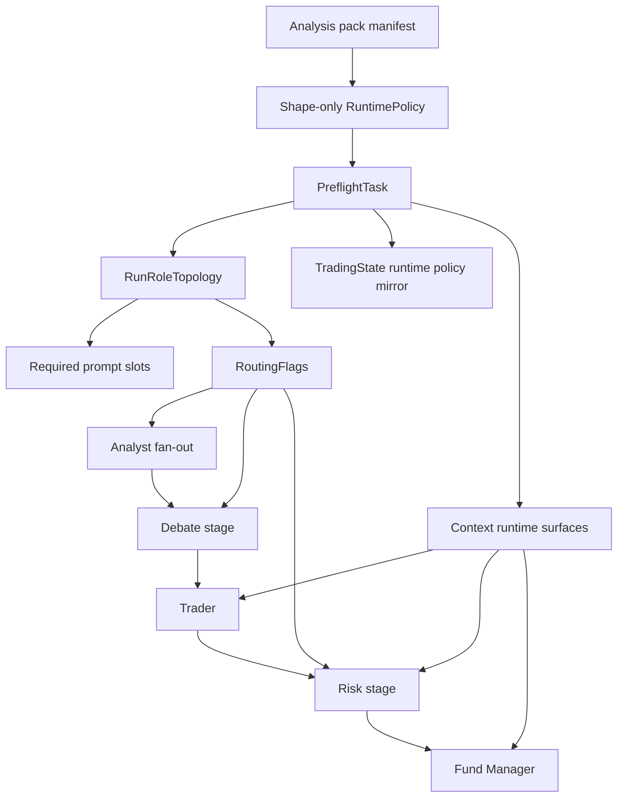

# refactor: Prompt Bundle Centralization

## Overview

Make `AnalysisPackManifest.prompt_bundle` the only runtime prompt source for active packs, and move prompt-slot enforcement to `PreflightTask` so invalid active packs fail before any analyst or model task runs.

The migration is intentionally staged. Units 1-3 add shared topology, fixtures, diagnostics, and pack-owned absence prose without changing runtime behavior. Unit 4 flips the runtime contract atomically: no prompt fallbacks, topology-driven analyst spawning and routing, zero-round moderator bypass, invalid-pack-id failures instead of baseline fallback, and `THESIS_MEMORY_SCHEMA_VERSION` `2 -> 3`. Unit 5 removes dead constants and refreshes documentation once the atomic migration is proven.

This plan is a focused follow-on to `docs/plans/2026-04-23-003-refactor-asset-class-generalization-plan.md`, and implements the approved design in `docs/superpowers/specs/2026-04-25-prompt-bundle-centralization-design.md`.

## Problem Frame

The current runtime still has two prompt ownership paths:

- pack-owned templates under `crates/scorpio-core/src/analysis_packs/*/prompts/*.md`, transported through `RuntimePolicy.prompt_bundle`
- agent-local fallback constants in prompt builders such as `TRADER_SYSTEM_PROMPT`, `FUND_MANAGER_SYSTEM_PROMPT`, and the shared researcher/risk prompt constants

That duplication leaves prompt prose writable in two places and spreads validation across render sites instead of enforcing one contract at startup. The graph also still makes routing decisions from raw `KEY_MAX_DEBATE_ROUNDS` / `KEY_MAX_RISK_ROUNDS`, while analyst fan-out is frozen from `pack.required_inputs` before `PreflightTask` runs. Zero-round debate and risk currently still visit moderator tasks once, which keeps moderator prompt slots artificially required and synthesizes artifacts the approved design wants to leave absent.

The current codebase already has most of the needed seams:

- `PreflightTask` is the first graph node and already writes runtime surfaces into state and context.
- `PromptBundle` and baseline prompt assets already exist.
- Existing exact-render regressions already compare baseline pack assets to legacy researcher and risk renderers.
- `TradingState.analysis_runtime_policy` and thesis snapshot schema guards already exist.

What is missing is a single runtime authority chain:

1. derive one per-run topology from manifest + config + registry
2. derive required prompt slots and routing flags from that same topology
3. validate the active pack once in preflight
4. pass validated runtime policy into prompt builders directly
5. route zero-round runs by topology instead of raw round counters

## Requirements Trace

- R1. Active packs load runtime prompt prose exclusively from `AnalysisPackManifest.prompt_bundle`; prompt builders remain mechanical renderers only.
- R2. Missing required prompt slots on the active pack fail in preflight before analyst fan-out or model calls, with stable multi-slot diagnostics.
- R3. Routing, analyst spawning, and required prompt-slot derivation share one per-run topology source; zero-round debate and risk bypass moderator tasks entirely and preserve absent artifacts.
- R4. Prompt builders require `&RuntimePolicy`; missing-policy branches disappear and blank selected slots still surface typed config errors.
- R5. Code-owned absence prose moves into pack assets, and fund-manager risk reasoning distinguishes `StageDisabled` from degraded missing-data state.
- R6. Inactive stub packs remain registrable and resolvable while every activation path to a runnable graph still traverses `PreflightTask`.
- R7. Snapshot/thesis compatibility explicitly retires pre-migration zero-round semantics via `THESIS_MEMORY_SCHEMA_VERSION` `2 -> 3` and compatibility coverage.

## Scope Boundaries

- No new selectable packs or crypto runtime implementation. `PackId::from_str()` remains baseline-only in this slice.
- No new prompt-service abstraction beyond `workflow/topology.rs`, active-pack completeness helpers, and test fixtures.
- No change to the five-phase workflow order other than topology-driven bypass of zero-round debate and risk stages.
- No reporter-format redesign or CLI feature expansion; the only user-visible behavior changes are the approved runtime-contract changes (invalid pack id fails instead of falling back, zero-round artifacts remain absent, active incomplete packs fail in preflight).
- No attempt to solve future pack spawnability policy beyond this migration. If the activation-path audit exposes a live zero-analyst activation case, capture it explicitly rather than broadening this refactor ad hoc.

## Context & Research

### Relevant Code and Patterns

- `crates/scorpio-core/src/workflow/tasks/preflight.rs` is already the startup normalization seam, context-writer, and runtime-policy hydration point.
- `crates/scorpio-core/src/workflow/builder.rs` and `crates/scorpio-core/src/workflow/pipeline/runtime.rs` currently split topology decisions across build time and run time; this plan consolidates those decisions around a shared topology source.
- `crates/scorpio-core/src/analysis_packs/selection.rs` already provides the shape-only `RuntimePolicy` transport boundary, which should stay free of active-run completeness checks.
- `crates/scorpio-core/src/prompts/bundle.rs` already carries pack-owned prompt slots and `PromptBundle::empty()` still powers the inactive crypto stub.
- `crates/scorpio-core/src/analysis_packs/equity/baseline.rs` already loads extracted prompt assets and has regression tests that are the right anchor for active-pack completeness.
- `crates/scorpio-core/src/agents/trader/prompt.rs`, `crates/scorpio-core/src/agents/fund_manager/prompt.rs`, `crates/scorpio-core/src/agents/researcher/common.rs`, and `crates/scorpio-core/src/agents/risk/common.rs` are the main prompt-fallback and absence-prose seams.
- `crates/scorpio-core/src/workflow/snapshot/thesis.rs` already enforces same-version thesis reuse, so the `2 -> 3` bump follows an established pattern.
- `crates/scorpio-core/tests/workflow_pipeline_structure.rs` already covers graph/routing behavior and is the correct integration seam for zero-round bypass assertions.

### Institutional Learnings

- `docs/solutions/logic-errors/thesis-memory-deserialization-crash-on-stale-snapshot-2026-04-13.md`
  - Snapshot-shape changes must use `#[serde(default)]` for additive fields and a schema bump for incompatible semantics.
- `docs/solutions/logic-errors/thesis-memory-untrusted-context-boundary-2026-04-09.md`
  - Prompt-channel ownership matters; pack-owned prompt prose and untrusted runtime data must stay clearly separated.
- `docs/solutions/logic-errors/stale-trading-state-evidence-and-unavailable-data-quality-fallbacks-2026-04-07.md`
  - Missing vs absent semantics must stay explicit; zero-round bypass should not synthesize fake artifacts.
- `docs/solutions/logic-errors/deterministic-scenario-valuation-integration-fallbacks-and-stale-state-fixes-2026-04-10.md`
  - Runtime-owned state and model-visible text should keep hard ownership boundaries, with explicit distinct absence states and reused-state regressions.
- `docs/solutions/logic-errors/cli-runtime-config-parity-and-setup-health-check-2026-04-15.md`
  - Startup/readiness authority should live in one shared boundary, which directly supports preflight as the single completeness and routing fence.
- `docs/solutions/logic-errors/reporter-system-validation-and-safe-json-output-2026-04-23.md`
  - Invalid combinations should fail at the contract boundary, with explicit failure-path tests as part of the implementation contract.
- `docs/solutions/best-practices/config-test-isolation-inline-toml-2026-04-11.md`
  - New coverage should use isolated fixtures rather than coupling to mutable production data.

### External References

- None. Repo-local patterns plus the approved design are sufficient for this refactor.

## Key Technical Decisions

- `PreflightTask` remains the sole authority boundary and the sole writer of `state.analysis_runtime_policy`.
  - Rationale: `run_analysis_cycle` currently pre-hydrates runtime policy before the graph starts, which duplicates authority and weakens the preflight boundary the approved design requires.

- `validate_active_pack_completeness(...)` stays separate from both `AnalysisPackManifest::validate()` and `resolve_runtime_policy_for_manifest(...)`, and missing-slot checks use `trim().is_empty()`.
  - Rationale: stub packs must keep resolving while inactive, but active completeness must fail closed; trimmed emptiness avoids whitespace-only slots silently passing.

- `crates/scorpio-core/src/workflow/topology.rs` owns the `Role -> PromptSlot` mapping and every pure derivation (`RunRoleTopology`, `required_prompt_slots`, `RoutingFlags`).
  - Rationale: routing, analyst spawning, and required-slot validation must share one mapping table or they will drift under future asset-class work.

- Registration-time diagnostics validate against a fully enabled would-be topology for the pack's declared analyst roster.
  - Rationale: registration has no per-run round-count config, so the only useful non-blocking signal is "what would this pack need if every optional stage were enabled?" That keeps diagnostics stable without making registration runtime-dependent.

- Prompt builders require `&RuntimePolicy`, while `state.analysis_runtime_policy` remains a cycle-scoped mirror for existing non-prompt consumers in this slice.
  - Rationale: prompt builders are the critical ownership seam and should lose the missing-policy branch structurally, but other runtime consumers such as valuation selection and pack-context helpers already depend on the mirrored state field and do not need a second migration in this refactor.

- `TradingPipeline::new`, `build_graph`, and pack-first construction paths must surface invalid pack ids as typed errors during the atomic migration instead of silently falling back to baseline.
  - Rationale: the current fallback bypasses the approved failure boundary and would let an invalid active pack run against unrelated prompt assets.

- `StageDisabled` and pack-owned absence prose land before zero-round routing flips.
  - Rationale: otherwise zero-risk and zero-debate runs would immediately reuse degraded-data wording and fail the approved semantic distinction.

- Analyst fan-out must become topology-driven at runtime, not pack-manifest-driven at graph-build time.
  - Rationale: today the graph freezes analyst tasks from `pack.required_inputs` before preflight runs; the approved design requires fan-out, required prompt slots, and debate/risk routing to read the same per-run source.

## Open Questions

### Resolved During Planning

- How should registration-time completeness diagnostics build a topology when no runtime round-count config exists?
  - Resolution: use a fully enabled would-be topology derived from the pack's declared analyst roster with debate and risk enabled, and emit only non-blocking `info!` diagnostics from registration.

- What counts as a missing prompt slot during enforcement and defense-in-depth checks?
  - Resolution: a slot is missing when `trim().is_empty()`, both in `validate_active_pack_completeness(...)` and in prompt-builder blank-slot guards.

- Does `state.analysis_runtime_policy` survive the migration?
  - Resolution: yes, as a preflight-written cycle mirror for existing non-prompt consumers and snapshot continuity. The ownership change in this plan is that prompt builders stop reading it directly.

- When does the invalid-pack-id behavior flip happen?
  - Resolution: in Unit 4, atomically with preflight enforcement and fallback removal so the system never spends time in a mixed authority state.

### Deferred To Implementation

- Which compile-fail harness should enforce the `&RuntimePolicy` signature contract (`trybuild` or an equivalent repo-friendly pattern)?
  - Deferred because the choice depends on the lightest-weight fit with the current Rust test setup, not on product behavior.

- Should a future selectable pack that resolves to zero spawnable analyst roles hard-fail preflight?
  - Deferred because no current active path can reach that state. The activation-path audit in Unit 1 should document the present behavior and raise a follow-up if a live path appears.

## High-Level Technical Design

> *This illustrates the intended approach and is directional guidance for review, not implementation specification. The implementing agent should treat it as context, not code to reproduce.*

Directional notes:

- `resolve_runtime_policy_for_manifest(...)` stays shape-only and only transports `prompt_bundle` into `RuntimePolicy`.
- `PreflightTask` computes the per-run topology, validates active-pack completeness, writes the runtime-policy mirror to state, and writes `RuntimePolicy` plus `RoutingFlags` into context before any downstream task executes.
- Analyst spawning, debate/risk bypass, and prompt-slot enforcement all derive from the same shared topology mapping.
- Prompt builders become mechanical: they accept `&RuntimePolicy`, read the slot for their role, substitute runtime placeholders, and return typed config errors on blank slots.
- Zero-round stages bypass moderator tasks entirely and leave skipped artifacts absent; `THESIS_MEMORY_SCHEMA_VERSION` `2 -> 3` retires old rows that encode the pre-migration semantics.

## Implementation Units

- [ ] **Unit 1: Topology And Validation Primitives**

**Goal:** Introduce the shared topology, routing-flag, completeness, and test-fixture primitives without changing active runtime behavior.

**Requirements:** R2, R3, R6

**Dependencies:** None

**Files:**
- Create: `crates/scorpio-core/src/workflow/topology.rs`
- Create: `crates/scorpio-core/src/testing/mod.rs`
- Create: `crates/scorpio-core/src/testing/runtime_policy.rs`
- Modify: `crates/scorpio-core/src/workflow/mod.rs`
- Modify: `crates/scorpio-core/src/workflow/tasks/common.rs`
- Modify: `crates/scorpio-core/src/analysis_packs/manifest/schema.rs`
- Modify: `crates/scorpio-core/src/analysis_packs/registry.rs`
- Modify: `crates/scorpio-core/src/analysis_packs/equity/baseline.rs`
- Modify: `crates/scorpio-core/src/analysis_packs/crypto/digital_asset.rs`
- Modify: `crates/scorpio-core/src/lib.rs`
- Test: `crates/scorpio-core/src/workflow/topology.rs`
- Test: `crates/scorpio-core/src/analysis_packs/manifest/schema.rs`
- Test: `crates/scorpio-core/src/analysis_packs/equity/baseline.rs`

**Approach:**
- Add `Role`, `RunRoleTopology`, `RoutingFlags`, `build_run_topology(...)`, and `required_prompt_slots(...)` under `workflow/topology.rs` with one shared role-to-slot mapping.
- Add `validate_active_pack_completeness(...)` as a top-level helper near the manifest schema boundary, keeping `AnalysisPackManifest::validate()` and `resolve_runtime_policy_for_manifest(...)` shape-only.
- Treat whitespace-only slots as missing both for active validation and for future defense-in-depth builder checks.
- Add a gated `testing` facade that exposes `with_baseline_runtime_policy(...)` and `baseline_pack_prompt_for_role(...)` to tests that do not traverse preflight.
- Add registration-time `info!` diagnostics for incomplete packs using a fully enabled would-be topology, but do not fail resolution or graph construction yet.
- Start the activation-path audit here by enumerating every path from pack id/string to a runnable graph and documenting the current preflight boundary assumptions in the plan-following implementation PR.

**Execution note:** Start with failing topology, completeness, registration-diagnostic, and runtime-policy-fixture tests before wiring helpers into production modules.

**Patterns to follow:**
- `crates/scorpio-core/src/analysis_packs/selection.rs`
- `crates/scorpio-core/src/workflow/tasks/preflight.rs`
- `crates/scorpio-core/src/analysis_packs/equity/baseline.rs`

**Test scenarios:**
- Happy path: baseline topology derives the four equity analyst roles plus debate/risk roles and yields zero missing prompt slots.
- Edge case: `max_debate_rounds = 0` omits researcher and debate-moderator slots from `required_prompt_slots(...)`.
- Edge case: `max_risk_rounds = 0` omits risk-agent and risk-moderator slots from `required_prompt_slots(...)`.
- Edge case: whitespace-only prompt slots are reported as missing, not as valid content.
- Integration: registry registration logs missing-slot diagnostics for the inactive crypto stub without failing `validate()` or `resolve_runtime_policy_for_manifest(...)`.
- Integration: `with_baseline_runtime_policy(...)` hydrates a test state without going through preflight, and `baseline_pack_prompt_for_role(...)` returns the extracted baseline asset text for each live role.

**Verification:**
- Topology, slot-derivation, routing-flag, and test-fixture APIs exist and are covered.
- Baseline and crypto manifests still resolve successfully, with diagnostics only for the inactive stub.
- No active runtime behavior has changed yet.

- [ ] **Unit 2: Baseline Pack Completeness And Prompt Oracles**

**Goal:** Make the baseline pack definitively complete for the active-role roster and establish pack-owned prompt assets as the oracle for later fallback removal.

**Requirements:** R1, R2, R5

**Dependencies:** Unit 1

**Files:**
- Modify: `crates/scorpio-core/src/analysis_packs/equity/prompts/*.md`
- Modify: `crates/scorpio-core/src/analysis_packs/equity/baseline.rs`
- Modify: `crates/scorpio-core/src/prompts/bundle.rs`
- Test: `crates/scorpio-core/src/analysis_packs/equity/baseline.rs`
- Test: `crates/scorpio-core/src/agents/researcher/common.rs`
- Test: `crates/scorpio-core/src/agents/risk/common.rs`

**Approach:**
- Confirm that every slot required by the fully enabled baseline topology is backed by a non-empty asset under `analysis_packs/equity/prompts/`.
- Keep `PromptBundle::empty()` available for inactive stubs, but tighten baseline regressions so the baseline pack proves complete under the new helper instead of merely proving that assets exist.
- Use `baseline_pack_prompt_for_role(...)` as the canonical prompt oracle for new tests added in this unit, while keeping runtime fallbacks in place until Unit 4.
- Preserve existing placeholder tokens (`{ticker}`, `{current_date}`, `{analysis_emphasis}`) so pack assets remain byte-comparable to the current baseline render path.

**Execution note:** Start with failing completeness/oracle tests against the baseline pack before changing any prompt asset content.

**Patterns to follow:**
- `crates/scorpio-core/src/analysis_packs/equity/baseline.rs`
- `crates/scorpio-core/src/agents/researcher/common.rs`
- `crates/scorpio-core/src/agents/risk/common.rs`

**Test scenarios:**
- Happy path: `validate_active_pack_completeness(...)` reports zero missing slots for the fully enabled baseline topology.
- Edge case: every baseline prompt asset stays non-empty and preserves the runtime placeholders the current renderers expect.
- Integration: baseline researcher and risk renderers still match the extracted pack assets exactly for known fixture inputs.
- Integration: the pack-oracle helper returns the same bytes as the baseline manifest's `prompt_bundle` for each live role.

**Verification:**
- The baseline pack produces no missing-slot diagnostics under the fully enabled topology.
- Pack-owned prompt assets are now the stable oracle for future regression gates.

- [ ] **Unit 3: Stage-Disabled Semantics And Absence-Prose Migration**

**Goal:** Move substantive stage-bypass prose into pack assets and establish explicit zero-round semantics before removing runtime fallback logic.

**Requirements:** R3, R5, R7

**Dependencies:** Unit 2

**Files:**
- Create: `crates/scorpio-core/tests/prompt_bundle_regression_gate.rs`
- Modify: `crates/scorpio-core/src/analysis_packs/equity/prompts/trader.md`
- Modify: `crates/scorpio-core/src/analysis_packs/equity/prompts/fund_manager.md`
- Modify: `crates/scorpio-core/src/analysis_packs/equity/prompts/*.md`
- Modify: `crates/scorpio-core/src/agents/trader/prompt.rs`
- Modify: `crates/scorpio-core/src/agents/fund_manager/prompt.rs`
- Modify: `crates/scorpio-core/src/agents/fund_manager/validation.rs`
- Modify: `crates/scorpio-core/src/agents/risk/common.rs`
- Test: `crates/scorpio-core/src/agents/trader/tests.rs`
- Test: `crates/scorpio-core/src/agents/fund_manager/tests.rs`
- Test: `crates/scorpio-core/src/agents/fund_manager/validation.rs`
- Test: `crates/scorpio-core/src/agents/risk/common.rs`
- Test: `crates/scorpio-core/tests/prompt_bundle_regression_gate.rs`

**Approach:**
- Move the trader missing-consensus note, trader data-quality prose, and fund-manager missing-risk / missing-analyst prose into baseline prompt assets using explicit placeholders instead of code-owned sentences.
- Introduce `DualRiskStatus::StageDisabled` and a topology-aware constructor so fund-manager reasoning can distinguish deliberate zero-risk configuration from degraded missing-data state.
- Update fund-manager validation to accept a `stage-disabled because ...` prefix for `StageDisabled` while preserving the stricter `indeterminate because ...` rule for `Unknown`.
- Capture pre-migration rendered prompt fixtures for all-inputs-present, zero-debate, zero-risk, and missing-analyst-data scenarios. These fixtures become the merge gate for Unit 4.
- Keep legacy fallback constants in place during this unit so the runtime does not flip into a half-migrated state.

**Execution note:** Characterization-first. Capture the rendered-prompt regression fixtures before changing fallback branches or prompt text ownership.

**Patterns to follow:**
- `crates/scorpio-core/src/agents/researcher/common.rs`
- `crates/scorpio-core/src/agents/risk/common.rs`
- `crates/scorpio-core/src/analysis_packs/equity/baseline.rs`

**Test scenarios:**
- Happy path: trader prompt rendering uses the pack-owned absence placeholder when `consensus_summary` is `None`.
- Happy path: fund-manager prompt/user context emits `StageDisabled` guidance when the risk stage is intentionally disabled.
- Edge case: `DualRiskStatus::Unknown` and `DualRiskStatus::StageDisabled` require different first-line rationale prefixes.
- Edge case: missing analyst or risk inputs still require conservative rationale wording after prose moves into assets.
- Integration: the regression-gate test captures and verifies rendered baseline prompts across all-inputs-present, zero-debate, zero-risk, and missing-analyst-data scenarios.

**Verification:**
- Stage-disabled semantics are explicit in pack assets and validation rules.
- A reusable regression gate exists before runtime fallback removal.

- [ ] **Unit 4: Atomic Enforcement And Routing Flip**

**Goal:** Flip runtime authority to pack-owned prompts only, enforce active-pack completeness in preflight, drive analyst spawning and routing from topology, and retire incompatible thesis snapshots in one coherent behavior change.

**Requirements:** R1, R2, R3, R4, R5, R6, R7

**Dependencies:** Unit 3

**Files:**
- Modify: `crates/scorpio-core/src/workflow/pipeline/mod.rs`
- Modify: `crates/scorpio-core/src/workflow/pipeline/runtime.rs`
- Modify: `crates/scorpio-core/src/workflow/builder.rs`
- Modify: `crates/scorpio-core/src/workflow/tasks/preflight.rs`
- Modify: `crates/scorpio-core/src/workflow/tasks/common.rs`
- Modify: `crates/scorpio-core/src/workflow/tasks/analyst.rs`
- Modify: `crates/scorpio-core/src/workflow/snapshot/thesis.rs`
- Modify: `crates/scorpio-core/src/agents/trader/prompt.rs`
- Modify: `crates/scorpio-core/src/agents/fund_manager/prompt.rs`
- Modify: `crates/scorpio-core/src/agents/researcher/common.rs`
- Modify: `crates/scorpio-core/src/agents/risk/common.rs`
- Modify: `crates/scorpio-core/src/agents/analyst/equity/fundamental.rs`
- Modify: `crates/scorpio-core/src/agents/analyst/equity/sentiment.rs`
- Modify: `crates/scorpio-core/src/agents/analyst/equity/news.rs`
- Modify: `crates/scorpio-core/src/agents/analyst/equity/technical.rs`
- Modify: `crates/scorpio-core/src/workflow/pipeline/tests.rs`
- Test: `crates/scorpio-core/tests/workflow_pipeline_structure.rs`
- Test: `crates/scorpio-core/tests/workflow_pipeline_e2e.rs`
- Test: `crates/scorpio-core/src/workflow/tasks/tests.rs`
- Test: `crates/scorpio-core/src/agents/trader/tests.rs`
- Test: `crates/scorpio-core/src/agents/fund_manager/tests.rs`
- Test: `crates/scorpio-core/src/agents/researcher/common.rs`
- Test: `crates/scorpio-core/src/agents/risk/common.rs`
- Test: `crates/scorpio-core/src/workflow/snapshot/tests/thesis_compat.rs`
- Test: `crates/scorpio-core/tests/prompt_bundle_regression_gate.rs`

**Approach:**
- Change `TradingPipeline::new`, `build_graph`, and pack-first construction to return typed pack-resolution errors instead of silently coercing to `PackId::Baseline`.
- Remove `run_analysis_cycle`'s runtime-policy prewrite. `PreflightTask` becomes the sole writer of `analysis_runtime_policy`, computes `RunRoleTopology`, validates active-pack completeness, writes `RuntimePolicy` to state/context, and writes `RoutingFlags` to context.
- Replace pack-manifest-driven analyst fan-out with a topology-aware fan-out seam so spawned analyst tasks, required prompt slots, and debate/risk routing all read the same role set.
- Change prompt-builder signatures to require `&RuntimePolicy`; caller tasks read policy from context once, pass it down, and map `TradingError::Config` to `GraphError::TaskExecutionFailed`.
- Remove all prompt fallback branches from the active runtime path and fail loudly on blank selected slots.
- Replace raw round-count routing closures with `RoutingFlags` checks so zero-round debate and risk bypass moderator tasks entirely and leave skipped artifacts absent.
- Bump `THESIS_MEMORY_SCHEMA_VERSION` from `2` to `3` and extend snapshot compatibility coverage so pre-migration zero-round semantics are retired instead of reused.
- Treat the prompt-regression fixtures captured in Unit 3 as the merge gate: this unit is not complete until the pre- and post-migration render paths match modulo declared substitutions.

**Execution note:** Test-first with characterization coverage. Do not land partial behavior flips from this unit separately.

**Patterns to follow:**
- `crates/scorpio-core/src/workflow/tasks/preflight.rs`
- `crates/scorpio-core/src/workflow/snapshot/thesis.rs`
- `crates/scorpio-core/tests/workflow_pipeline_structure.rs`

**Test scenarios:**
- Happy path: a baseline run with debate and risk enabled still produces the same rendered prompts as the Unit 3 regression fixtures.
- Error path: invalid pack ids fail during pipeline construction/startup with typed config errors and no baseline fallback.
- Error path: an active pack missing multiple or whitespace-only slots fails in preflight before any model task runs, and the error lists all missing slots in stable order.
- Integration: zero-debate runs bypass `debate_moderator`, leave `consensus_summary` absent, and still produce valid trader and fund-manager outputs.
- Integration: zero-risk runs bypass risk moderation, leave the three risk reports absent with empty `risk_discussion_history`, and produce `StageDisabled` reasoning instead of `Unknown`.
- Integration: topology-derived analyst roles, required prompt slots, and actual spawned analyst tasks match exactly.
- Integration: tests that call non-preflight tasks directly hydrate policy with `with_baseline_runtime_policy(...)`, while blank selected slots still return typed config errors.
- Schema: thesis rows written with schema version `2` are skipped once active version `3` is in effect.
- Compile boundary: prompt-builder call sites cannot omit the required `&RuntimePolicy` parameter, enforced by a compile-fail harness or equivalent compile-time coverage.

**Verification:**
- No active runtime prompt fallbacks remain.
- Preflight is the sole enforcement and routing-origin boundary.
- Zero-round semantics match the approved design.
- The prompt-regression gate and snapshot-compatibility coverage are green.

- [ ] **Unit 5: Dead Constant And Documentation Cleanup**

**Goal:** Remove obsolete fallback constants and refresh project documentation after the atomic migration is proven.

**Requirements:** R1, R6, R7

**Dependencies:** Unit 4

**Files:**
- Modify: `crates/scorpio-core/src/agents/analyst/equity/prompt.rs`
- Modify: `crates/scorpio-core/src/agents/researcher/prompt.rs`
- Modify: `crates/scorpio-core/src/agents/risk/prompt.rs`
- Modify: `crates/scorpio-core/src/agents/risk/moderator.rs`
- Modify: `crates/scorpio-core/src/prompts/mod.rs`
- Modify: `crates/scorpio-core/src/prompts/bundle.rs`
- Modify: `crates/scorpio-core/src/analysis_packs/manifest/schema.rs`
- Modify: `README.md`
- Modify: `CLAUDE.md`
- Create: `docs/solutions/logic-errors/prompt-bundle-centralization-runtime-contract-2026-04-25.md`

**Approach:**
- Delete now-dead prompt fallback constants and any helper branches that existed only to support mixed ownership.
- Refresh prompt-ownership, pack-validation, and snapshot-version documentation to match the enforced runtime contract.
- Add a `docs/solutions/` entry capturing the failure modes, schema bump rationale, and regression-gate approach so future asset-class work inherits the pattern instead of re-learning it.

**Patterns to follow:**
- `docs/solutions/logic-errors/reporter-system-validation-and-safe-json-output-2026-04-23.md`
- `docs/solutions/logic-errors/thesis-memory-deserialization-crash-on-stale-snapshot-2026-04-13.md`

**Test scenarios:**
- Test expectation: none -- cleanup-only unit. Existing regression and integration coverage from Unit 4 should remain unchanged while the dead-code removal compiles cleanly.

**Verification:**
- No legacy prompt fallback constants remain in the active runtime.
- Project docs and institutional learnings match the new authority boundary.

## System-Wide Impact

- **Interaction graph:** `TradingPipeline::new` / `TradingPipeline::from_pack` -> `build_graph*` -> `PreflightTask` -> analyst fan-out -> debate -> trader -> risk -> fund manager. This refactor changes the authority and routing rules across that whole path.
- **Error propagation:** invalid pack ids and missing active prompt slots must surface as typed config failures instead of baseline fallbacks or late prompt-builder defaults; task callers keep mapping those errors into `graph_flow::GraphError::TaskExecutionFailed` at the task boundary.
- **State lifecycle risks:** `analysis_runtime_policy` stays cycle-scoped and preflight-owned; `consensus_summary`, risk reports, and `risk_discussion_history` must preserve true absence when stages are bypassed.
- **API surface parity:** the CLI `analyze` flow, `AnalysisRuntime::run`, `TradingPipeline::new`, `TradingPipeline::from_pack`, and any test/backtest path that constructs runnable graphs must all preserve the same preflight boundary.
- **Integration coverage:** zero-round bypass, active-pack completeness, invalid-pack-id propagation, and snapshot-version retirement all require integration coverage beyond unit tests because they cross state, graph, and prompt-builder boundaries.
- **Unchanged invariants:** the five-phase workflow order remains intact; inactive crypto stub registration remains valid; prompt placeholder substitution stays mechanical; user-facing pack selection remains baseline-only in this slice.

## Risks & Dependencies

| Risk | Mitigation |
|------|------------|
| Graph-flow fan-out is currently built before preflight, so topology-driven analyst spawning may require a new runtime fan-out seam rather than a simple closure change. | Land topology primitives first, then treat topology-aware fan-out as part of the atomic Unit 4 behavior flip with structure tests in `crates/scorpio-core/tests/workflow_pipeline_structure.rs`. |
| Prompt behavior could drift while moving prose ownership from code to pack assets. | Capture characterization fixtures in Unit 3 and require the regression gate to pass before Unit 4 can land. |
| Snapshot/thesis reuse could surface stale zero-round artifacts after the routing flip. | Bump `THESIS_MEMORY_SCHEMA_VERSION` `2 -> 3`, keep `#[serde(default)]` discipline, and extend thesis-compat tests before merging Unit 4. |
| Stub-pack support could regress if active completeness leaks into manifest validation or runtime-policy resolution. | Keep completeness checks out of `AnalysisPackManifest::validate()` and `resolve_runtime_policy_for_manifest(...)`, and keep explicit stub-pack resolution/diagnostic tests. |
| Mixed authority between state, context, and prompt builders could survive the migration if helper call sites are missed. | Make preflight the sole writer, require `&RuntimePolicy` at prompt-builder boundaries, and use activation-path plus compile-boundary coverage to catch missed call sites. |

## Documentation / Operational Notes

- Update `README.md` and `CLAUDE.md` after the migration lands so contributors see pack-owned prompts, topology-derived routing, and the schema bump as the current contract.
- Record the migration in `docs/solutions/` after Unit 4/5 complete, including why the regression gate exists and why active-pack completeness belongs in preflight instead of manifest validation.
- Call out the thesis-memory reset implied by `THESIS_MEMORY_SCHEMA_VERSION` `2 -> 3` in any release notes or branch summary that ships Unit 4.

## Sources & References

- **Origin document:** `docs/superpowers/specs/2026-04-25-prompt-bundle-centralization-design.md`
- Related plan: `docs/plans/2026-04-23-003-refactor-asset-class-generalization-plan.md`
- Related code:
  - `crates/scorpio-core/src/workflow/builder.rs`
  - `crates/scorpio-core/src/workflow/pipeline/runtime.rs`
  - `crates/scorpio-core/src/workflow/tasks/preflight.rs`
  - `crates/scorpio-core/src/workflow/tasks/common.rs`
  - `crates/scorpio-core/src/analysis_packs/manifest/schema.rs`
  - `crates/scorpio-core/src/analysis_packs/selection.rs`
  - `crates/scorpio-core/src/prompts/bundle.rs`
  - `crates/scorpio-core/src/agents/trader/prompt.rs`
  - `crates/scorpio-core/src/agents/fund_manager/prompt.rs`
  - `crates/scorpio-core/src/agents/fund_manager/validation.rs`
  - `crates/scorpio-core/src/agents/researcher/common.rs`
  - `crates/scorpio-core/src/agents/risk/common.rs`
  - `crates/scorpio-core/tests/workflow_pipeline_structure.rs`
- Institutional learnings:
  - `docs/solutions/logic-errors/thesis-memory-deserialization-crash-on-stale-snapshot-2026-04-13.md`
  - `docs/solutions/logic-errors/thesis-memory-untrusted-context-boundary-2026-04-09.md`
  - `docs/solutions/logic-errors/stale-trading-state-evidence-and-unavailable-data-quality-fallbacks-2026-04-07.md`
  - `docs/solutions/logic-errors/deterministic-scenario-valuation-integration-fallbacks-and-stale-state-fixes-2026-04-10.md`
  - `docs/solutions/logic-errors/cli-runtime-config-parity-and-setup-health-check-2026-04-15.md`
  - `docs/solutions/logic-errors/reporter-system-validation-and-safe-json-output-2026-04-23.md`
  - `docs/solutions/best-practices/config-test-isolation-inline-toml-2026-04-11.md`
