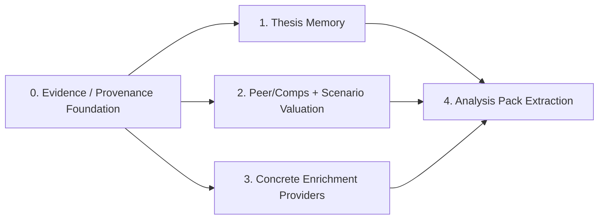

# Financial-Services-Plugins Architecture Roadmap Summary

This document summarizes the active architecture roadmap inspired by `https://github.com/anthropics/financial-services-plugins` and grounded in the current `scorpio-analyst` codebase.

It is intentionally a big-picture briefing document, not an implementation plan. Use it to understand how the completed Stage 1 work and the active follow-on plans fit together under the current provider constraints.

## Purpose

- summarize the architectural progression from Stage 1 through analysis-pack extraction
- clarify dependencies between the plans
- call out the global invariants that should remain true across all 5 plans
- reduce the risk of implementing later milestones in the wrong order or with the wrong abstraction boundaries

## Current Provider Constraints

The active roadmap assumes the project currently has access to:

- free-tier Finnhub
- yfinance
- FRED

Those providers are sufficient for:

- thesis memory
- macro and technical context
- news/event enrichment
- bounded deterministic valuation for supported corporate-equity inputs
- explicit "not assessed" valuation fallback for unsupported asset shapes such as ETFs

They are not sufficient for the richer roadmap ambitions implied by the original documents, including:

- transcript enrichment
- guaranteed consensus-estimates enrichment
- peer/comps datasets and sector medians
- historical valuation bands
- `P/S`, `PEG`, `EV/EBITDA`, and DCF-style valuation inputs
- ETF-native valuation inputs

Those capabilities now live in an optional deferred follow-on plan: `docs/plans/2026-04-07-005-optional-premium-data-follow-ons-plan.md`.

Important clarification: the current setup can still analyze ETFs. The limitation is not ETF analysis end-to-end; the limitation is that ETFs often do not support the same deterministic valuation path as single-stock runs, so the honest outcome may be explicit valuation fallback rather than a corporate-equity valuation result.

## Current Baseline

`scorpio-analyst` is a Rust-native, single-crate, five-phase trading system built around:

- typed `TradingState`
- `graph-flow` orchestration
- provider/model abstraction through the existing runtime factory layer
- deterministic state passing through `TradingState` and workflow context instead of chat buffers

The runtime remains:

`Preflight -> Analyst -> Research Debate -> Trader -> Risk Debate -> Fund Manager`

`PreflightTask` is a startup normalization step ahead of the existing five business phases, not a sixth business phase.

## Why This Roadmap Exists

The architecture direction influenced by `financial-services-plugins` is not to rewrite the trading system into a plugin marketplace. It is to borrow the strongest underlying patterns:

- explicit evidence discipline
- provenance-aware reporting
- provider-agnostic enrichment seams
- deterministic financial transformations in Rust
- modular analysis profiles built on stable typed contracts

The 5 plans move the repo from a stronger typed foundation toward reusable, pack-driven analysis policy in a staged way.

## Roadmap At A Glance

| Plan                                            | Status    | Main outcome                                                                                                       | Depends on           | What it unlocks                     |
|-------------------------------------------------|-----------|--------------------------------------------------------------------------------------------------------------------|----------------------|-------------------------------------|
| 1. Evidence / provenance foundation             | Completed | `PreflightTask`, typed evidence/provenance/coverage state, prompt/report seams, enrichment placeholders            | None                 | all later milestones                |
| 2. Thesis memory                                | Planned   | snapshot-backed prior-thesis reuse and prompt injection                                                            | Plan 1               | historical continuity across runs   |
| 3. Peer/comps and scenario valuation            | Planned   | bounded deterministic valuation for supported input shapes plus explicit `NotAssessed` fallbacks                   | Plan 1               | auditable valuation where supported |
| 4. Concrete earnings/event enrichment providers | Planned   | event/news enrichment first; optional estimates if provider support is verified; transcripts deferred              | Plan 1               | concrete enrichment-backed evidence |
| 5. Analysis pack extraction                     | Planned   | declarative analysis-profile layer above config/evidence/prompt/report policy, including provider-limited behavior | Plans 1-4 stabilized | configurable analysis profiles      |

## Dependency View

## Plan 1: Evidence / Provenance Foundation

Source plan: `docs/superpowers/plans/2026-04-05-evidence-provenance-foundation.md`

Completed outcomes:

- `PreflightTask` before analyst fan-out
- canonical symbol resolution through preflight
- `ProviderCapabilities`
- typed evidence/provenance/coverage/reporting state
- shared prompt helpers for evidence/data-quality context
- report sections for coverage and provenance
- enrichment cache placeholders for transcript / consensus-estimates / event feed

What it intentionally deferred:

- thesis memory
- peer/comps and scenario valuation
- concrete enrichment providers
- analysis pack extraction

How it improves the system:

- every downstream agent now reads typed, provenance-tagged evidence instead of free-text strings, eliminating ambiguity about whether data is real or hallucinated
- the report gains a built-in audit trail: coverage gaps and data-quality degradations are surfaced explicitly rather than silently absorbed into prompt context

## Plan 2: Thesis Memory

Plan file: `docs/plans/2026-04-07-002-feat-thesis-memory-plan.md`

Primary goal:

- load the most recent compatible prior thesis from snapshots
- inject it into downstream prompt context
- persist current-run thesis into the final snapshot

Key repo surfaces:

- `src/state/thesis.rs`
- `src/workflow/snapshot.rs`
- `src/workflow/tasks/preflight.rs`
- downstream prompt builders

Why it comes next:

- it reuses the Stage 1 snapshot and prompt seams directly
- it adds cross-run continuity before later derived valuation work
- it is largely independent of premium vs free data-provider constraints

How it improves the system:

- the trader and researcher agents can anchor new recommendations against the prior-run thesis, catching thesis drift early and preventing the system from reversing a well-reasoned position without explicit cause
- repeated analysis on the same ticker becomes cumulative rather than amnesiac, reducing redundant LLM work and improving recommendation stability over time

## Plan 3: Peer/Comps And Scenario Valuation

Plan file: `docs/plans/2026-04-07-003-feat-peer-comps-scenario-valuation-plan.md`

Primary goal:

- move valuation structure into typed deterministic Rust logic
- feed scenario-aware valuation into the trader proposal and final report

Key repo surfaces:

- `src/state/derived.rs`
- `src/state/proposal.rs`
- `src/workflow/tasks/analyst.rs`
- `src/agents/trader/mod.rs`
- `src/agents/fund_manager/prompt.rs`
- report rendering

Why it follows thesis memory:

- structured valuation becomes more useful once the system can retain prior thesis context

How it improves the system:

- replaces ad-hoc LLM prose estimates with deterministic Rust math where supported by current typed inputs, and emits explicit `NotAssessed` outcomes where valuation is not supported honestly
- makes approve/reject decisions more traceable for supported corporate-equity cases without forcing fake precision for ETFs or provider-limited runs

## Plan 4: Concrete Earnings / Event Enrichment Providers

Plan file: `docs/plans/2026-04-07-004-feat-concrete-enrichment-providers-plan.md`

Primary goal:

- replace `null` enrichment placeholders with real event payloads and, if verified on current providers, consensus-estimates payloads
- preserve fail-open optional-enrichment behavior
- make concrete enrichment visible to prompts and reports

Key repo surfaces:

- `src/data/adapters/`
- `src/data/finnhub.rs`
- `src/workflow/tasks/preflight.rs`
- prompt/report consumers

Why it comes before packs:

- analysis packs should configure stable enrichment concepts, not placeholder-only seams

How it improves the system:

- gives analyst and trader agents real event payloads first, and possibly consensus estimates if provider support is verified, instead of null placeholders
- fail-open adapter contracts ensure that missing or slow external data degrades gracefully rather than aborting the run, keeping the system production-safe even when enrichment sources are partially unavailable

## Plan 5: Analysis Pack Extraction

Plan file: `docs/plans/2026-04-07-005-feat-analysis-pack-extraction-plan.md`

Primary goal:

- extract stable analysis behavior into declarative packs
- keep graph/provider execution unchanged
- make analysis selection a policy problem, not a code-edit problem

Key repo surfaces:

- `src/config.rs`
- `src/workflow/tasks/preflight.rs`
- `src/workflow/context_bridge.rs`
- shared prompt/report policy layers

Why it is last:

- packs should be built on stabilized seams from the earlier plans, not on still-moving abstractions

How it improves the system:

- operators can swap the analytical posture — including provider-limited fallback behavior and asset-shape-aware valuation policy — through a config change instead of a code edit
- extracting policy into declarative packs makes provider and asset-shape limitations explicit and auditable instead of hiding them inside prompt wording

## Ordering Rationale

The current ordering (thesis → valuation → enrichment → packs) prioritizes typed infrastructure before real data flow. An alternative ordering would move Plan 4 (enrichment) before Plan 3 (valuation) so deterministic valuation has real data to operate on instead of absent/heuristic inputs. The current ordering was chosen because:

- Plan 3's typed valuation contract can be proven correct with partial/absent data via fail-open semantics
- Plan 4's enrichment providers are more vendor-dependent and may take longer to stabilize
- Moving enrichment first would delay the typed valuation seam that Plan 5 (packs) needs to configure

This ordering is a deliberate tradeoff, not an oversight. If enrichment vendor choices resolve faster than expected, the implementing agent may consider reordering Plans 3 and 4 as long as the final seams for Plan 5 remain stable.

## Current Implementation Track

Under the current provider constraints, the practical implementation sequence is:

1. Plan 2: thesis memory
2. Plan 3: bounded valuation with explicit `NotAssessed` outcomes
3. Plan 4: event/news enrichment first, optional estimates only if provider verification succeeds
4. Plan 5: packs that encode provider-limited and asset-shape-aware behavior

The premium-data follow-ons are intentionally excluded from this active sequence.

## Global Architectural Invariants

These should remain true across all 5 plans:

- keep the five-phase business workflow intact
- `PreflightTask` is the startup normalization point
- typed state is the system boundary
- deterministic financial transformations belong in Rust
- provider-agnostic contracts come before provider-specific integrations
- optional enrichment remains fail-open
- orchestration corruption and storage/runtime corruption remain fail-closed
- snapshot store is the first persistence boundary for cross-run memory
- analysis packs are the final roadmap extraction step, not an early implementation shortcut
- contracts introduced by Plans 2-4 (thesis, valuation, enrichment) must be stable before Plan 5 (packs) extracts them into policy; pack vocabulary should describe settled abstractions, not still-moving targets

## Common Misreads To Avoid

- Stage 1 seams do not mean concrete enrichment providers already exist
- thesis memory does not imply a new dedicated memory database in the first slice
- valuation is not meant to stay prompt-only after Plan 3, but the active slice is intentionally narrower than the original premium-data vision
- analysis packs are not a plugin runtime or a graph-topology feature
- missing derived data should not be silently serialized as “empty but valid” if the real meaning is “not available”

## Source Map

- Completed Stage 1 plan: `docs/superpowers/plans/2026-04-05-evidence-provenance-foundation.md`
- Architecture spec: `docs/superpowers/specs/2026-04-05-financial-services-plugins-inspired-architecture-design.md`
- Thesis memory plan: `docs/plans/2026-04-07-002-feat-thesis-memory-plan.md`
- Peer/comps and scenario valuation plan: `docs/plans/2026-04-07-003-feat-peer-comps-scenario-valuation-plan.md`
- Concrete enrichment providers plan: `docs/plans/2026-04-07-004-feat-concrete-enrichment-providers-plan.md`
- Analysis pack extraction plan: `docs/plans/2026-04-07-005-feat-analysis-pack-extraction-plan.md`
- Optional premium-data follow-ons plan: `docs/plans/2026-04-07-006-optional-premium-data-follow-ons-plan.md`
- Relevant solution note: `docs/solutions/logic-errors/stale-trading-state-evidence-and-unavailable-data-quality-fallbacks-2026-04-07.md`
