# Financial-Services-Plugins Architecture Roadmap Summary

This document summarizes the 5-plan architecture roadmap inspired by `https://github.com/anthropics/financial-services-plugins` and grounded in the current `scorpio-analyst` codebase.

It is intentionally a big-picture briefing document, not an implementation plan. Use it to understand how the completed Stage 1 work and the 4 follow-on plans fit together.

## Purpose

- summarize the architectural progression from Stage 1 through analysis-pack extraction
- clarify dependencies between the plans
- call out the global invariants that should remain true across all 5 plans
- reduce the risk of implementing later milestones in the wrong order or with the wrong abstraction boundaries

## Current Baseline

`scorpio-analyst` is a Rust-native, single-crate, five-phase trading system built around:

- typed `TradingState`
- `graph-flow` orchestration
- provider/model abstraction through the existing runtime factory layer
- deterministic state passing through `TradingState` and workflow context instead of chat buffers

The runtime remains:

`Preflight -> Analyst -> Research Debate -> Trader -> Risk Debate -> Fund Manager`

`PreflightTask` is a startup normalization step ahead of the existing five business phases, not a sixth business phase.

## Why This Roadmap Exists

The architecture direction influenced by `financial-services-plugins` is not to rewrite the trading system into a plugin marketplace. It is to borrow the strongest underlying patterns:

- explicit evidence discipline
- provenance-aware reporting
- provider-agnostic enrichment seams
- deterministic financial transformations in Rust
- modular analysis profiles built on stable typed contracts

The 5 plans move the repo from a stronger typed foundation toward reusable, pack-driven analysis policy in a staged way.

## Roadmap At A Glance

| Plan                                            | Status    | Main outcome                                                                                            | Depends on                                  | What it unlocks                     |
|-------------------------------------------------|-----------|---------------------------------------------------------------------------------------------------------|---------------------------------------------|-------------------------------------|
| 1. Evidence / provenance foundation             | Completed | `PreflightTask`, typed evidence/provenance/coverage state, prompt/report seams, enrichment placeholders | None                                        | all later milestones                |
| 2. Thesis memory                                | Planned   | snapshot-backed prior-thesis reuse and prompt injection                                                 | Plan 1                                      | historical continuity across runs   |
| 3. Peer/comps and scenario valuation            | Planned   | deterministic typed valuation state and scenario-aware proposal/reporting                               | Plan 1; Plan 2 recommended but not required | structured valuation reasoning      |
| 4. Concrete earnings/event enrichment providers | Planned   | real transcript/consensus-estimates/event payloads behind adapter contracts                             | Plan 1                                      | concrete enrichment-backed evidence |
| 5. Analysis pack extraction                     | Planned   | declarative analysis-profile layer above config/evidence/prompt/report policy                           | Plans 1-4 stabilized                        | configurable analysis profiles      |

## Dependency View

```mermaid
flowchart LR
    P1[1. Evidence / Provenance Foundation]
    P2[2. Thesis Memory]
    P3[3. Peer/Comps + Scenario Valuation]
    P4[4. Concrete Enrichment Providers]
    P5[5. Analysis Pack Extraction]

    P1 --> P2
    P1 --> P3
    P1 --> P4
    P3 --> P5
    P4 --> P5
```

## Plan 1: Evidence / Provenance Foundation

Source plan: `docs/superpowers/plans/2026-04-05-evidence-provenance-foundation.md`

Completed outcomes:

- `PreflightTask` before analyst fan-out
- canonical symbol resolution through preflight
- `ProviderCapabilities`
- typed evidence/provenance/coverage/reporting state
- shared prompt helpers for evidence/data-quality context
- report sections for coverage and provenance
- enrichment cache placeholders for transcript / consensus-estimates / event feed

What it intentionally deferred:

- thesis memory
- peer/comps and scenario valuation
- concrete enrichment providers
- analysis pack extraction

## Plan 2: Thesis Memory

Plan file: `docs/plans/2026-04-07-001-feat-thesis-memory-plan.md`

Primary goal:

- load the most recent compatible prior thesis from snapshots
- inject it into downstream prompt context
- persist current-run thesis into the final snapshot

Key repo surfaces:

- `src/state/thesis.rs`
- `src/workflow/snapshot.rs`
- `src/workflow/tasks/preflight.rs`
- downstream prompt builders

Why it comes next:

- it reuses the Stage 1 snapshot and prompt seams directly
- it adds cross-run continuity before later derived valuation work

## Plan 3: Peer/Comps And Scenario Valuation

Plan file: `docs/plans/2026-04-07-002-feat-peer-comps-scenario-valuation-plan.md`

Primary goal:

- move valuation structure into typed deterministic Rust logic
- feed scenario-aware valuation into the trader proposal and final report

Key repo surfaces:

- `src/state/derived.rs`
- `src/state/proposal.rs`
- `src/workflow/tasks/analyst.rs`
- `src/agents/trader/mod.rs`
- `src/agents/fund_manager/prompt.rs`
- report rendering

Why it follows thesis memory:

- structured valuation becomes more useful once the system can retain prior thesis context

## Plan 4: Concrete Earnings / Event Enrichment Providers

Plan file: `docs/plans/2026-04-07-003-feat-concrete-enrichment-providers-plan.md`

Primary goal:

- replace `null` enrichment placeholders with real transcript / consensus-estimates / event payloads
- preserve fail-open optional-enrichment behavior
- make concrete enrichment visible to prompts and reports

Key repo surfaces:

- `src/data/adapters/`
- `src/data/finnhub.rs`
- `src/workflow/tasks/preflight.rs`
- prompt/report consumers

Why it comes before packs:

- analysis packs should configure stable enrichment concepts, not placeholder-only seams

## Plan 5: Analysis Pack Extraction

Plan file: `docs/plans/2026-04-07-004-feat-analysis-pack-extraction-plan.md`

Primary goal:

- extract stable analysis behavior into declarative packs
- keep graph/provider execution unchanged
- make analysis selection a policy problem, not a code-edit problem

Key repo surfaces:

- `src/config.rs`
- `src/workflow/tasks/preflight.rs`
- `src/workflow/context_bridge.rs`
- shared prompt/report policy layers

Why it is last:

- packs should be built on stabilized seams from the earlier plans, not on still-moving abstractions

## Global Architectural Invariants

These should remain true across all 5 plans:

- keep the five-phase business workflow intact
- `PreflightTask` is the startup normalization point
- typed state is the system boundary
- deterministic financial transformations belong in Rust
- provider-agnostic contracts come before provider-specific integrations
- optional enrichment remains fail-open
- orchestration corruption and storage/runtime corruption remain fail-closed
- snapshot store is the first persistence boundary for cross-run memory
- analysis packs are the final roadmap extraction step, not an early implementation shortcut

## Common Misreads To Avoid

- Stage 1 seams do not mean concrete enrichment providers already exist
- thesis memory does not imply a new dedicated memory database in the first slice
- valuation is not meant to stay prompt-only after Plan 3
- analysis packs are not a plugin runtime or a graph-topology feature
- missing derived data should not be silently serialized as “empty but valid” if the real meaning is “not available”

## Source Map

- Completed Stage 1 plan: `docs/superpowers/plans/2026-04-05-evidence-provenance-foundation.md`
- Architecture spec: `docs/superpowers/specs/2026-04-05-financial-services-plugins-inspired-architecture-design.md`
- Thesis memory plan: `docs/plans/2026-04-07-001-feat-thesis-memory-plan.md`
- Peer/comps and scenario valuation plan: `docs/plans/2026-04-07-002-feat-peer-comps-scenario-valuation-plan.md`
- Concrete enrichment providers plan: `docs/plans/2026-04-07-003-feat-concrete-enrichment-providers-plan.md`
- Analysis pack extraction plan: `docs/plans/2026-04-07-004-feat-analysis-pack-extraction-plan.md`
- Relevant solution note: `docs/solutions/logic-errors/stale-trading-state-evidence-and-unavailable-data-quality-fallbacks-2026-04-07.md`
